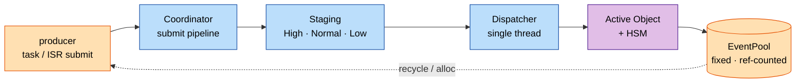
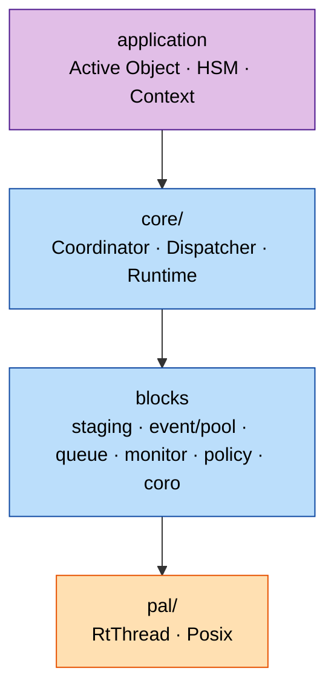

[中文](README_zh.md) | **English**

# coact

[](https://github.com/DeguiLiu/coact/actions/workflows/ci.yml)
[](https://opensource.org/licenses/MIT)

coact (**Co**operative **Act**ive-object framework) is a header-first **C++17**
event framework for **single-core MCUs** running RT-Thread: producers submit from
task or ISR context, one dispatcher thread delivers to **Active Objects (AO)**
backed by **Hierarchical State Machines (HSM)**. Events replace threads; one
dispatcher thread runs them; transition tables are static.

## Why coact

- **C++17 only, no code generator.** Transitions are ordinary `constexpr` tables
  in your translation unit; no modelling tool sits in the build.
- **Single core is the design point.** `SingleCoreCriticalRing` plus an injected
  `CriticalSection` (irq mask on RT-Thread) keeps the ISR path lock-free and
  libatomic-free; host SMP is a test reference, not the product target.
- **Fixed capacity, zero hot-path allocation.** A fixed-size `EventPool` recycled
  by ref-count lets one event fan out safely (`-fno-exceptions -fno-rtti`).
- **RT-Thread is the primary target, not a port.** The Linux host builds from the
  same headers through a small PAL swap.
- **Deterministic wakeups.** The dispatcher wakes only when idle and a drain-check
  closes the missed-wakeup window; `try_submit_from_isr` never blocks.
- **Back-pressure, not silent drops.** A breaker degrades under overload; the
  low-priority partition ages out instead of starving.
- **Coroutines included** (`coact/coro/`): stackful coroutines, `CoroSem`, and
  stack guard/watermark diagnostics.

## Topology and layering





## Quick start (host)

```sh
cmake -B build -S . -DCMAKE_BUILD_TYPE=RelWithDebInfo && cmake --build build -j && ctest --test-dir build
```

```cpp
#include "coact/runtime.hpp"
#include "coact/pal_posix.hpp"
coact::pal::Posix pal;
coact::Runtime<coact::DefaultConfig, coact::pal::Posix> rt(pal);
rt.bind(&my_ao);          // my_ao : coact::Ao<Ctx, Hsm, Traits>
rt.initialize();
rt.start();
```

On RT-Thread include the same headers, select `coact/pal_rtthread.hpp` and compile
`src/core/pal_rtthread.cpp` into the BSP — the PAL uses caller-provided static
resources and never allocates.

## Modules

`event` `pool` `queue` `hsm` `ao` `staging` `monitor` `policy` `coro` `pal`, with
`coordinator` / `dispatcher` / `runtime` as the assembly
([`docs/interface_contract.md`](docs/interface_contract.md)).

## Testing

Host targets pass under `ctest` and are TSan-clean on the pool/dispatcher paths;
CI adds ASan/UBSan and a Windows MSVC job. Brought up on RT-Thread 5.2.1 /
qemu-vexpress-a9 (single core).

## License

MIT — see [`LICENSE`](LICENSE).
