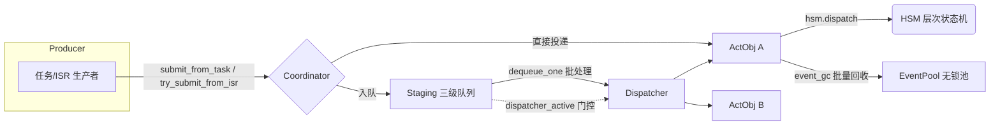

# coact — 嵌入式主动对象事件框架

coact（**Co**operative **Act**ive-object framework）是一个面向资源受限 MCU 的 C++17 事件驱动框架，基于 **主动对象（Active Object）+ 层次状态机（HSM）** 模型，为实时系统提供确定性的异步事件调度。

核心设计取自 QP/Quantum-like 参考实现与作者自研的 newosp 库，在 **32-bit 单核（RT-Thread 5.2.x / Cortex-M）** 与 **多核（Linux host）** 双平台上保持一致的无锁语义。

## 特性

- **无锁事件池**：`EventPool` 用 32-bit 原子 + 索引式 Treiber free-list，`[15:0]=索引 / [31:16]=ABA tag`。32-bit CAS 在 x86 与 ARM Cortex-M 上均为原生指令，**不依赖 libatomic**，单核 100 MHz 下经注入的 `CriticalSection`（irq mask）以 O(1) 保护 ISR 抢占。
- **批量回收**：`ReclaimBatcher` 将 Dispatcher 逐事件释放的多个 free-head CAS 折叠为一次 splice，减少多生产者 + 单回收线程场景下的 free-head 争用。
- **三级无锁队列**：High / Normal / Low 分区隔离 + 限压保护（Breaker），批处理减少唤醒抖动。
- **QP 式引用计数**：池事件经 `event_ref_inc` / `event_gc` 管理生命周期，静态事件（`pool_id==0`）永不被回收。
- **嵌入式安全**：无堆分配 / 无递归 / 无 goto，固定宽度整型，`-fno-exceptions -fno-rtti`，MISRA C++ 对齐（恒配 `{ }`、常量前置、`switch` 必带 `default`）。

## 架构



- **Coordinator**：策略评估、Breaker 限压、直接投递 / 入队分流。
- **Dispatcher**：单线程 `run()` 循环，批量取、批量派发、批量回收。
- **Ao**：一个主动对象 = 执行租约（lease）+ 状态机 + 优先级，`dispatch()` 内部持有执行权（S6 约定）。锁层级 **L1 Singleton → L2 Context → L3 Device**，禁止反向获取。

## 模块

| 模块 | 头文件 | 职责 |
|---|---|---|
| event | `event.hpp` / `pool.hpp` | 事件定义、池注册表、引用计数、无锁池 |
| hsm | `hsm.hpp` | 层次状态机（父状态事件继承、LCA 迁移） |
| queue | `queue.hpp` | MPSC 有界队列、单核 CriticalSection 环形队列 |
| ao | `ao.hpp` | 主动对象、执行租约、优先级、AoRegistry |
| staging | `staging.hpp` | 三级分区队列、批处理、Low 老化 |
| monitor | `monitor.hpp` | Breaker 限压、水位、RTC 超时监控 |
| policy | `policy.hpp` | 速率限制 / 策略评估钩子 |
| core | `coordinator.hpp` `dispatcher.hpp` `runtime.hpp` | 集成装配与运行循环 |
| pal | `pal_*.hpp` | 平台抽象（POSIX / RT-Thread） |

## 快速开始

**构建（Linux host）**

```sh
cmake -B build -S . -DCMAKE_BUILD_TYPE=RelWithDebInfo
cmake --build build -j
ctest --test-dir build          # 运行全部单测
```

**最小装配（两行绑定一个主动对象）**

```cpp
#include "coact/runtime.hpp"
#include "coact/pal_posix.hpp"

coact::pal::Posix pal;
coact::Runtime<coact::DefaultConfig, coact::pal::Posix> rt(pal);
rt.bind(&my_ao);     // my_ao : coact::Ao<...>
rt.initialize();
rt.start();
```

更完整的用法见 `examples/hsm_protocol_demo.cpp`（层次协议状态机）与 `examples/node_manager_demo.cpp`（多节点心跳管理的多个主动对象）。

## 平台支持

| 平台 | 同步原语 | 内存序 |
|---|---|---|
| RT-Thread 5.2.x 单核 | 注入 `CriticalSection`（`rt_hw_interrupt_disable/enable`）+ 32-bit CAS | relaxed 为主，单核降级 |
| Linux 多核 | 原生 32-bit CAS | acquire/release 尾部 |

单核目标通过 `pal_rtthread.hpp` 注入 irq-mask 临界区；多核直接用 CAS，无 libatomic 锁回退。

## 测试与健壮性

- 15 个测试目标，覆盖事件池并发、队列 MPSC 争用、HSM 迁移、Breaker 限压、Coordinator 直接/入队分流、整体装配生命周期。
- **TSan**（ASLR-off）通过：多生产者池 alloc/reclaim、Dispatcher 批量回收路径 0 数据竞争。
- `-Wconversion -Wshadow` 下核心头文件零告警；`.ai/` 提供 `check.sh` / `lint.sh` / `format.sh` / `tidy.sh` / `run-tsan.sh`。
- 性能基准：`src/core/bench_hotpath.cpp`（SIGPROF 采样 + 折叠火焰图），`--mode staged|direct`。

## 许可

MIT License，见 `LICENSE`。

---

有关更深入的设计决策（池无锁化 / cache-line 隔离 / 批量回收的实测依据）见 [docs/hotpath_profiling_zh.md](docs/hotpath_profiling_zh.md)。
