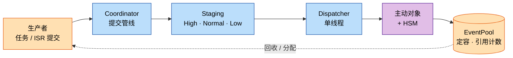
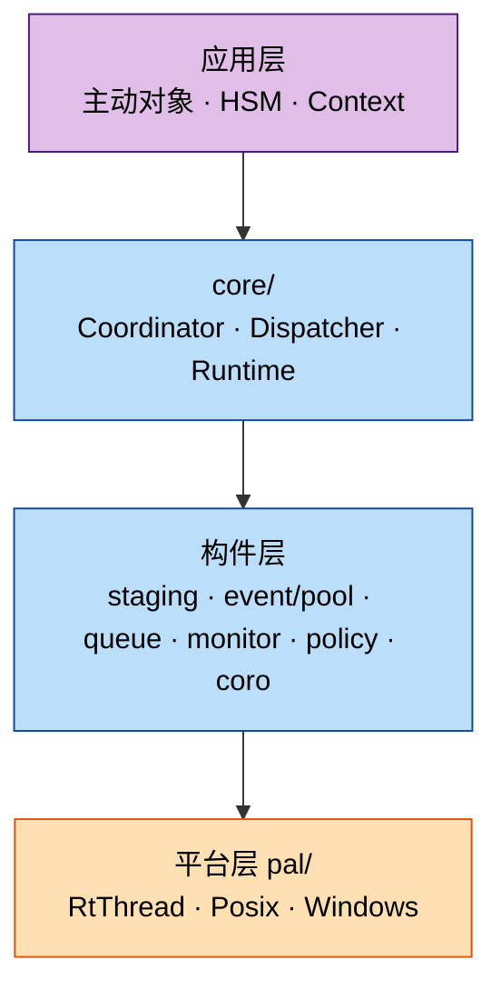

**中文** | [English](README.md)

# coact

[](https://github.com/DeguiLiu/coact/actions/workflows/ci.yml)
[](https://opensource.org/licenses/MIT)

coact（**Co**operative **Act**ive-object framework）是一个面向 **RT-Thread 单核
MCU** 的 header-first **C++17** 事件框架：生产者从任务或 ISR 上下文提交事件，由单
一线程派发给**主动对象（AO）**，AO 行为由**层次状态机（HSM）**描述。事件代替线程；
单一线程派发；转移表是静态的。

## 为什么选 coact

- **只用 C++17，不需要代码生成器。** 转移就是你翻译单元里的普通 `constexpr`
  表，构建过程里没有建模工具这一环。
- **单核是设计前提。** `SingleCoreCriticalRing` 配合注入的 `CriticalSection`
  （RT-Thread 上即关中断），使 ISR 路径既不加锁也不依赖 libatomic；host 上的
  SMP 只是测试参考，不是产品目标。
- **容量定死，热路径零分配。** 定容 `EventPool` 以引用计数回收，同一事件可安全
  扇出给多个 AO（`-fno-exceptions -fno-rtti`）。
- **RT-Thread 是首选目标，而不是"移植之一"。** Linux / Windows host 用同一套头文件，
  仅切换 PAL。
- **关键事件预约**（仅本分支）：`kHighCriticalReserve` 为 High 分区保留单元，使
  关键事件在普通流量打满时仍能进入，并配一条 `ReservedNormal` 通道。
- **唤醒确定性。** 仅在 Dispatcher 空闲时才 signal，drain 复查封闭 missed-wakeup
  窗口；`submit_from_task` 可让生产者直接派发（S6 快路径），
  `try_submit_from_isr` 永不阻塞。
- **背压而非静默丢弃。** 过载时熔断器降级；低优先级分区老化出队而非饿死。
- **自带协程**（`coact/coro/`）：栈式协程、`CoroSem`、栈守卫与水位诊断。

## 拓扑图与层次图





## 快速开始（host）

```sh
cmake -B build -S . -DCMAKE_BUILD_TYPE=RelWithDebInfo && cmake --build build -j && ctest --test-dir build
```

```cpp
#include "coact/runtime.hpp"
#include "coact/pal_posix.hpp"
coact::pal::Posix pal;
coact::Runtime<coact::DefaultConfig, coact::pal::Posix> rt(pal);
rt.bind(&my_ao);          // my_ao : coact::Ao<Ctx, Hsm, Traits>
rt.initialize();
rt.start();
```

在 RT-Thread 上包含同一组头文件，选 `coact/pal_rtthread.hpp`，把
`src/core/pal_rtthread.cpp` 编进 BSP——该 PAL 使用调用方提供的静态资源，自身不做
任何分配。

## 模块

`event` `pool` `queue` `hsm` `ao` `staging` `monitor` `policy` `coro` `pal`，由
`coordinator` / `dispatcher` / `runtime` 装配
（[`docs/interface_contract.md`](docs/interface_contract.md)）。

## 测试

host 目标在 `ctest` 下全部通过，池 / Dispatcher 路径 TSan 无竞争；CI 另跑
ASan/UBSan 与 Windows MSVC job。已在 RT-Thread 5.2.1 / qemu-vexpress-a9（单核）
上完成启动验证。

## 许可

MIT，见 [`LICENSE`](LICENSE)。
