# Design: coact ISP Pipeline 示例架构方案

> 本文是 `examples/isp_pipeline_demo.cpp`（约 4900 行单一综合示例）的**架构视角**设计文档。示例以 coact 主动对象框架对 RS500 红外视频系统做"消息发生级"架构模拟（定位：由 RS500 业务场景驱动的架构模型与故障注入演示，非业务复刻）：IRSC 传感器产帧、低/高增益双链并行、HL 融合、enhance/TPD 双路、PIC/TEMP 视频打包、WRAPE 封帧、USB Bulk DMA 出流与 MIPI 输出，并在同一进程内系统性规避 RS500 复盘文档中的九类一致性异常。
>
> 姊妹文档 `design_consistency_avoidance_zh.md` 以**异常视角**展开（每类异常的故障机理与测试证据），本文以**架构视角**展开（系统如何分层、每个构件为何存在、异常如何被结构吸收）；两文互相引用，不重复论证。所有代码标识符均经 grep 核实；行号会随后续小改漂移，故以函数名与大致区域标注。

---

## 1. 总览：一个文件，三个平面

结论先行：示例的全部结构可以收敛为一句话——**业务状态全部住在 14 个主动对象（AO）里，由 Dispatcher 单线程串行化；硬件的异步行为全部由 7 个非 AO pthread worker 模拟，worker 与 AO 的唯一耦合是事件平面；跨模块共享的事实收拢到三块各有失效协议的只读快照域**。资源竞争、消息链路、状态同步、数据同步、异步通知五个工程维度各有一个明确的结构答案，不依赖编码纪律。

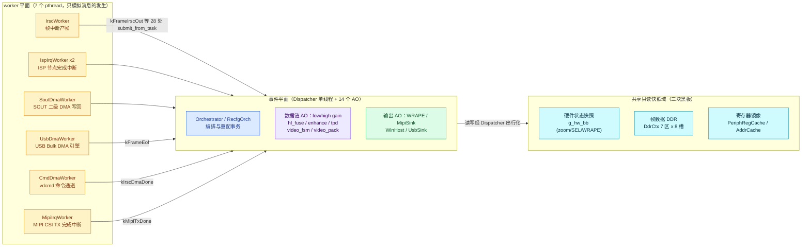

*图 1：三平面总览。黄色 worker 只产生事件（模拟中断回调与 DMA 完成的异步往返），蓝色/紫色/绿色 AO 持有全部业务状态，青色三块共享域各有独立的写者与失效协议。*

图 1 走读：`WPLANE` 泳道的六个 worker 类型（`IspIrqWorker` 有 enhance/tpd 两个实例，合计 7 线程）经 `submit_from_task` 把完成事件投回事件平面——这是它们与 AO 的全部耦合，没有共享可变状态跨越边界。`EPLANE` 泳道的三组 AO 全部挂在同一个 `coact::Runtime` 上，Dispatcher 单线程派发保证任何两个 RTC 步骤不会交错。`DPLANE` 泳道的三块共享域不是经典黑板（多生产者轮询），而是**单写者只读快照域**，第 5 章展开其写者/读者/失效协议与反黑板边界。

帧的完整旅程（数据面一帧的走读）：IrscWorker 按帧节拍发 `kFrameIrscOut`（双投）→ low/high 增益链 AO 各自在 RTC 步骤里把 DN 像素写入 DDR 的 DN 区（确定性合成，两链写入相同字节——幂等）→ 各自策略变换后写入低/高增益出区，发 `kLowGainDone`/`kHighGainDone` → `HlFuseAo` 配对同帧号双 done，40% 低增益 + 60% 高增益融合写入 fused 区，一次写双路扇出 `kHlFused`（flags 区分 PIC/TEMP）→ enhance/tpd AO 各自变换（gamma 拉伸 / Y16 温度码），经 ISP 节点完成中断窗口（Active→IrqPending→Active）放行 → `VideoPackAo` 重打包 + SOUT 写回窗口（乘积态 park/release）→ PIC 路交 `WrapeAo` 封帧、TEMP 路交 `MipiSinkAo` 进 TX 窗口 → WRAPE 递交 UsbDmaWorker 按 16KB 事务搬运，EOF 回到 `WinHostAo`；MIPI TX 完成回 sink 记帧。每一跳的像素都在 DDR 里、事件里只有描述符、终点的 sink 逐字节复算整条变换链（DN 种子→增益→融合→增强/TPD）。

### 1.1 五个维度的结构答案

| 维度 | RS500 的问题形态 | 示例的结构答案 | 落点 |
|---|---|---|---|
| 资源竞争 | DDR 环、寄存器组、DMA 通道被多模块直接驱动，靠锁与纪律 | 每类资源一个拥有者；Dispatcher 串行化使 AO 数据面访问免锁 | `DdrCtx` 单一属主；`g_zoom`/`g_wrape` 唯一写者 |
| 消息链路 | 各模块回调嵌套，时序隐含在调用栈里 | 30 个类型化信号（`enum class Sig`）单一词汇表；像素不过事件通道，载荷只带 DDR 槽位描述符 | `Sig`、`Payload::ddr_slot/ddr_id` |
| 状态同步 | 下游"下次读时顺便发现"配置已变 | 状态变更只经显式事件广播（`kSessionState`），子 FSM 用 guard 读门控字 | `SessionEventComposite`、`irsc_session_open` |
| 数据同步 | 布局重算后旧地址记录错误命中 | 版本护栏查即作废 + 槽位帧戳 overrun 守卫 | `layout_version`、`FrameStamp` |
| 异步通知 | 中断回调直接改共享状态 | 完成中断退化为"事件 + 模拟时延"，回调落在 AO 自己的 RTC 步骤里 | `WorkerBase` execute 钩子族 |

### 1.2 与姊妹文档的分工及验证策略

`design_consistency_avoidance_zh.md` 证明的是"九类异常被规避且被断言锁定"；本文回答的是"什么样的分层让规避成为结构属性而非补丁"。第 6 章给出每类异常到架构构件的映射索引，故障机理与测试证据一律引用该文。架构判据只有一条：**每一层结构都对应至少一条可失败的自检断言**（数据面字节保真、通道计数互证、会话终态、各黑板的失效协议），断言以进程退出码为门禁——结构答案与文档宣称的分界线即在于此。最终形态的验证元数据：52 条 `check()` 断言全 PASS、5 连跑稳定（~1.9 s、退出码 0）、全量 ctest 37/37（flash_proxy_demo 已注册）、全量构建零警告，验证矩阵详见姊妹文档 §6.1。

---

## 2. 主动对象层：14 个 AO 的划分与合并

结论先行：AO 划分遵循"**每类硬件域一个 AO、每个独立汇聚点一个 AO**"两条规则；结构相同但数据流并行的实体合并进同一 AO 的 HSM 乘积状态（`VideoFsmAo`、`VideoPackAo`），数据流真正并行且时延语义不同的实体保留独立 AO（low/high 双链）。

### 2.1 AO 清单与优先级

| AO | LogicalPrio | 角色 | 归属状态（HSM） | RS500 对应物 |
|---|---|---|---|---|
| `OrchestratorAo` | 63 | 收集 `kIrscReady`/`kIspReady`/`kVideoReady` 回执（High 分区） | Root/Active | `camera_app.c` + `stream_config` 服务 |
| `IrscDriverAo` | 62 | IRSC 4 步命令，经 vdcmd 异步通道往返 | Root/Active（含 reject 弧） | `sensor_input_lsv_source` + `drv_irsc` |
| `RecfgOrchAo` | 61 | 运行态 X1→X2 原子重配事务 | 8 态（Idle..Commit）+ 11 条转移弧（含 stale 吸收弧） | 原子重配设计 §4.5 事务模型 |
| `LowGainAo` | 60 | 低增益链节点 | Root/Active | `drv_isp` 低增益链 |
| `HighGainAo` | 59 | 高增益链节点 | Root/Active | `drv_isp` 高增益链 |
| `HlFuseAo` | 55 | 双链 fan-in，配对 frame_id 融合，扇出 PIC/TEMP | Root/Active | `drv_isp` 高低光融合 |
| `EnhanceAo` | 50 | PIC 路径：变换 + 节点完成中断窗口 | Active/IrqPending | `drv_isp_stream` enhance |
| `TempChainAo` | 49 | TEMP 路径：Y16 变换 + 中断窗口 | Active/IrqPending | `drv_isp_stream` TPD |
| `VideoFsmAo` | 47 | PIC+TEMP 流 FSM（合并 AO） | 3x3 乘积态 | `video_lsv_stream_manager` |
| `VideoPackAo` | 45 | PIC+TEMP 打包与 SOUT 写回（合并 AO） | 2x2 乘积态 | `video_com_*` + SOUT |
| `UsbSinkAo` | 40 | USB sink（T37 后 idle，保留断言位） | Root/Active | UVC 提交流程 |
| `MipiSinkAo` | 39 | MIPI 输出 + TX 完成中断窗口 | ACTIVE/TX_PENDING | MIPI CSI TX |
| `WrapeAo` | 38 | PIC 封帧裁决 + Bulk DMA 递交 | Root/Active | USB WRAPE（T37 7.6.5） |
| `WinHostAo` | 37 | Windows UVC 主机四点观察者（Low 分区） | Root/Active | T37 §6 板测观察 |

AO 全部经 `coact::Ao<Ctx, Hsm<Ctx>, Trait>` 模板构造：上下文结构体（状态）+ 编译期静态 HSM 表（行为）+ Trait（优先级与预算）。每个 Trait 声明 `logical_prio`、`priority_class`、`direct_eligible`、`isr_direct_safe` 与 `kRtcBudgetNs`（示例统一 1 ms，`VideoFsmTrait` 例外为 3 ms——init/deinit 链建模 RS500 驱动真实 ~1.5ms 的 us 级耗时，1 ms 预算曾让断路器误隔离该 AO 并丢弃 stop 命令，3 ms 对齐真实停机上界）。

TargetId 按绑定序 1-14 分配（框架 `TargetId` 是强类型 1 基恒等，`AoRegistry` 以固定数组 O(1) 查找，bind 校验优先级唯一）：1=Orchestrator、2=IRSC driver、3=low_gain、4=high_gain、5=hl_fuse、6=enhance、7=tpd_chain、8=video FSM（合并 PIC+TEMP）、9=video pack（合并 PIC+TEMP）、10=USB sink、11=MIPI sink、12=recfg、13=WRAPE、14=Windows host。`UsbSinkAo`（10）在 T37 场景把 PIC 数据面移交 `WrapeAo` 后保持 idle，但保留在注册表中作为数据面归属切换的显式证据与 sink 层断言位。

PriorityClass 已按上表接线实现：`OrchestratorAo` 用 `HighAoTrait`（High 分区）、`WinHostAo` 用 `LowAoTrait`（Low 分区）、其余 12 个 AO 用 `AoTrait`（Normal 分区），Trait 定义处的注释按 RTE `rte_register_service` 模型说明分区理由（控制回执不得在帧洪峰后老化、帧数据可容忍老化、纯遥测走低分区）。

### 2.2 合并决策：结构相同则合并，数据流并行则保留

**合并的两组**。`VideoFsmAo` 与 `VideoPackAo` 各自原先是一对结构完全相同的 AO（PIC 一路、TEMP 一路），合并把"流差异"从 AO 边界移进 HSM 状态：

- `VideoFsmAo`：coact HSM 只有一个活动叶子（无正交区域），两路独立 FSM 表达为状态的**乘积**——PIC 相位 x TEMP 相位，3x3 = 9 个显式状态（`kVfII`..`kVfGT`），事件 `kVideoCmd` 用 flags bit0 携带流身份，31 条弧（25 条合法 + 6 条 reject）构成封闭状态对集合。
- `VideoPackAo`：两路 SOUT 写回窗口同理表达为 2x2 = 4 个乘积态（`kPackBA`/`kPackPS`/`kPackTS`/`kPackBS`），单一 `SoutDmaWorker` 用 job 的 `cmd_arg` 打路径标记，`kSoutDone` 的 guard（`sout_is_pic`/`sout_is_temp`）区分两条完成通道，无串扰。

合并的收益是三重的：AO 数下降、注册表预算留出余量；两路命令无需跨 AO 自路由，事件天然进入同一个队列按序处理；**乘积态把"两路流当前各自处于什么阶段"变成一个显式可枚举的状态**，"两路同时停在写回窗口"（`kPackBS`）不再是不变量盲区。合并的代价是一张更大的转移表（VideoFsm 31 弧），由 `VF_ARC` 宏批量生成控制复杂度。每路可变数据保留在 ctx 的独立镜像里（`VideoPathMirror pic/temp`、pic/temp 双停靠环），AO 边界内仍是单写者。

**保留并行的双链**。`LowGainAo` 与 `HighGainAo` 不合并，理由是数据流语义而非代码结构：两链时延不同（`kLat.low_gain_us=400` vs `high_gain_us=600`）、变换策略不同（`LowGainPolicy` vs `HighGainPolicy`）、完成事件独立（`kLowGainDone`/`kHighGainDone`），真正的汇聚点在 `HlFuseAo` 的 fan-in——它等待两链**同一 frame_id** 的完成事件到齐才融合（`HlCtx::maybe_fuse`）。若把两链合并进一个 AO，帧的并行处理会被串行化，HL 融合的配对时序语义随之改变；这不是结构重复，而是并行业务。`EnhanceAo`/`TempChainAo` 同理保留：两者虽共享 `FusedNodeBase<Policy>` 骨架，但各自挂独立的 ISP 节点完成中断线（两个 `IspIrqWorker` 实例），是两个独立的中断源。

### 2.3 与 RS500 模块的完整映射

映射出处为示例文件头注释与 `~/RS500/docs/` 各文档（标题级引用）：

| RS500 实体 | 示例实体 | 出处文档 |
|---|---|---|
| `applications/camera_app.c` | `main()` + `kProductModes`/`kCaliModes` 模式表 + Phase 编排 | 《Preview Start (上电出图) 流程梳理》 |
| `applications/app.c` `auto_preview_start` | main() 的 Phase1/3/4 序列 | 同上 |
| `module/rte/rte_config.h` `preview_cmd` | `PreviewCmdInfo` + `select_cmd()` | 同上 |
| `module/camera/stream_config.c` | Phase1/3/4 数据装载管线（main() 内） | 同上 |
| `drv_irsc` 4 步命令 | `kIrscCmdSequence` 命令表 + `IrscDriverAo` | 《VDCMD预览启动命令配置流程》 |
| vdcmd `rt_device_control(DEV_IRSC_CTRL_*)` | `CmdDmaWorker` 异步往返 | 同上 |
| `drv_isp`/`hal_isp_top` 八节点（KBC/BPVHBC/RMVC/TNR/HBCDPC/DDBP/VBC） | `LowGainAo`/`HighGainAo`/`HlFuseAo` | 《RS500红外图像输入与ISP处理原理》 |
| `drv_isp_stream` enhance/TPD 双链 | `EnhanceAo`/`TempChainAo`（`FusedNodeBase`） | 同上 |
| isp 模块 ispSW 线程节点完成中断 | `IspIrqWorker` x2 | 同上 |
| `video_lsv_stream_manager`（init 前向/deinit 反向） | `VideoFsmAo`（乘积态） | 《RS500视频流处理与输出架构》 |
| `video_com_*` 打包 + SOUT | `VideoPackAo`（乘积态）+ `SoutDmaWorker` | 同上 |
| `isp_stream_dma` 3 帧环 / `stream_out_dma` | `DdrCtx` 7 区 + `kTripleBufSize=3` | 《RS500内存架构与图像缓冲布局》 |
| USB WRAPE 封帧（Bulk 出流） | `WrapeAo` + `UsbDmaWorker` | 《T37_UVC_X2提前封帧问题与规避方案》 |
| Windows UVC 主机 | `WinHostAo` 四点观察者 | 同上 |
| MIPI CSI TX | `MipiSinkAo` + `MipiIrqWorker` | 《嵌入式相机双输出原理_UVC与MIPI》 |
| 运行态重配事务 | `RecfgOrchAo` | 《嵌入式显示链路原子重配设计》《运行态重配的DDR与寄存器一致性》 |

数据链拓扑如下（与图 1 的事件平面细化）：

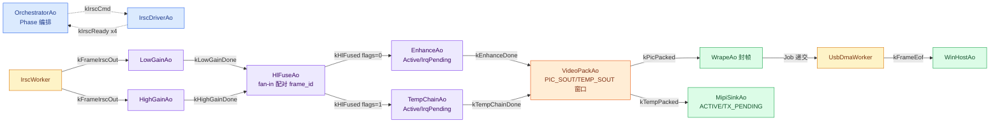

*图 2：数据链 AO 拓扑。虚线为控制面（命令/回执），实线为数据面推进信号；像素全程走 DDR，事件只携带槽位描述符。*

---

## 3. 非 AO worker 层：只模拟消息的发生

结论先行：worker 是"硬件行为平面"——它们存在的唯一目的是让异步时延（总线写入、节点中断、DMA 搬运、TX 完成）发生在 AO 之外的真实线程上，再把完成时刻作为事件投回。worker 不持有业务状态、不读不改任何 AO 上下文；**worker 与 AO 的唯一耦合是事件平面的 `submit_from_task`**。

### 3.1 WorkerBase CRTP 骨架

六个 worker 类型中四个继承 `WorkerBase<Derived, Job, Depth>`（约 850-975 行区域），骨架持有 mutex+cond 交接环、停机排空生命周期与 executed/rejected 计数；派生类只提供 `execute(job)` 钩子，经 `derived()` 静态下转型在编译期解析，零虚表。设计要点（源码注释逐条背书）：

| 机制 | 设计 | 动机 |
|---|---|---|
| 定容交接环（`count < kDepth` 判满） | `submit()` 在环满时返回 false，AO 计数丢弃或走自提交完成 | "硬件请求槽有限"的非阻塞契约：无等待、无阻塞，帧丢失是诚实的计数器，不是隐藏的停顿 |
| depth 按通道语义选择 | 帧侧通道浅（2-3，匹配硬件在飞深度），命令通道 4（4 步命令突发必须全部按序执行） | 帧丢得起、控制步骤丢不起——契约按数据类别分化 |
| submit 临界区极短 | 生产者（Dispatcher 线程）只在 worker 弹出瞬间竞争 | 临界区是几个 store，绝不包含硬件时延 |
| stop() 排空 | 先请求停机、唤醒、等 idle_cv 直到队列空再 join | 已接受的 job 保证产生完成事件（off-by-zero 停机契约）；`count == kDepth` 为满容量而非 `kDepth-1`（修过的容量 bug） |
| 对象生命周期 | job 经 placement-new 在槽位内开始生命周期，弹出经 `std::launder` 后拷出 | 与 `DdrCtx::write/read` 的 `FrameStamp` 同一套 C++17 对象模型纪律 |

`UsbDmaWorker` 是刻意的对照组：它不继承 `WorkerBase`，自带单槽 mutex+cond，忙则拒绝（`submit` 返回 false），**停机语义是"丢弃未完成 job"而非排空**——两种停机契约在同文件内并存且都被注释文档化，演示"契约必须显式选择"这一原则。

### 3.2 六类七实例 worker 职责与接线

| worker | 实例数 | 环深 | 模拟的硬件行为 | 完成事件 | 时延常量 |
|---|---|---|---|---|---|
| `IrscWorker` | 1 | —（自带节拍循环，非 WorkerBase） | 传感器帧中断：按 `period_us` 节拍产 DN 帧（纯事件生产者，DN 像素由增益链 AO 写入 DDR） | `kFrameIrscOut` x2（双链） | 帧周期 + `irsc_setup_us/2` |
| `CmdDmaWorker` | 1 | 4 | vdcmd `rt_device_control(DEV_IRSC_CTRL_*)` 异步寄存器写通道（4 步命令突发按序排队，控制步骤不可丢） | `kIrscDmaDone` | `kIrscCmdLatencyUs=500` |
| `IspIrqWorker` | 2 | 2 | ispSW 线程节点完成中断（enhance 与 TPD 各一条独立中断线，一帧在飞一帧缓冲） | `kIspNodeDone` | 50 us |
| `SoutDmaWorker` | 1 | 3 | stream_out_dma 二级 DMA 写回（SOUT→DDR，depth 3 镜像 RS500 的 x3 环：一个在飞两个缓冲，host 的 ms 级调度抖动不得丢 33ms 节拍的帧），job 携带路径标记 | `kSoutDone` | 60 us |
| `UsbDmaWorker` | 1 | —（自带单槽，非 WorkerBase） | WRAPE USB Bulk DMA 引擎：按 `kBulkXsfBytes=16384` 事务粒度搬运 | `kFrameEof` | 50 us/事务 |
| `MipiIrqWorker` | 1 | 2 | MIPI CSI TX 行缓冲传输完成中断 | `kMipiTxDone` | `kMipiTxLatencyUs=600` |

worker 与 AO 的接线表（装配期 `start()` 参数固化回执目标，之后只读）：

| worker 实例 | 回执 AO | 对端 AO 侧的递交点 |
|---|---|---|
| `cmd_dma` | IrscDriverAo (2) | `onIrscCmd` → `submit(arg)` |
| `isp_irq_enh` | EnhanceAo (6) | `FusedNodeBase::request_irq` |
| `isp_irq_tpd` | TempChainAo (7) | 同上（独立中断线，无共享路由） |
| `sout_dma` | VideoPackAo (9) | `VideoPackNode::on_input` → `submit(kPathId())` |
| `mipi_irq` | MipiSinkAo (11) | `onTempPacked` → `submit(frame_id)` |
| `usb_dma` | WinHostAo (14) | `onPicPackedWrape` → `submit(Job)` |
| `irsc`（非 WorkerBase） | low(3)/high(4) 双投 | ——（事件生产者，无递交面） |

### 3.3 "只模拟消息的发生"边界

worker 的 execute 钩子全部是同一形状：`usleep(时延)` + `alloc_typed` + `submit_from_task`。没有 SPI 事务、没有协议解析、没有寄存器值——**只有异步往返的形状**。以 `CmdDmaWorker` 为例：`IrscDriverAo` 的 `onIrscCmd` 不内联执行命令，而是把子命令递交异步通道后立即返回；寄存器写时延活在 worker 线程上，`onIrscDmaDone` 回到 AO 的 RTC 步骤里才组装回执。这正是真实驱动"绝不在 dispatcher 上下文里忙等总线"的形状。业务逻辑（哪一步算 ready、何时扇出下游）全部留在 AO 的转移表里，worker 对此一无所知。

**中断完成与帧提交的交错由 parking ring 吸收**。AO 递交异步通道后不阻塞等待：帧描述符（`IoMeta`）停入 AO 上下文里的深度 4 环形停靠区（`FusedNodeCtx::parked`/`VideoPackCtx` 的 pic/temp 双环/`SinkCtx::tx_parked`）；完成事件回来时按 `frame_id` 扫描停靠环，命中者经 `std::exchange` 一步取走（`std::exchange(*hit, IoMeta{})`）释放下游，不匹配者计入 stale 计数。这使"帧提交时刻"与"中断完成时刻"天然容许乱序交错——一帧在等中断时下一帧已可入环，无需任何锁。通道拒绝（环满）走**自提交完成**：AO 给自己投一个携带该 frame_id 的合成完成事件，经正常转移弧回家，丢弃被计数且不内联处理（与 4.4 节"转移动作不自提交"是同一契约的两个侧面）。

### 3.4 停机契约与排空顺序

停机顺序是装配的镜像（main() 末尾）：五个中断/DMA 通道先排空（它们的完成事件要喂给活着的 AO）→ USB 引擎排空最后一批 Bulk 事务（喂 `WinHostAo`）→ `rt.stop()` 停 Dispatcher → `g_log.stop()`。停机前有两道守卫：pending 计数排空循环（等每个 AO 队列清零且 video FSM 回 IDLE——固定 sleep 会在负载下与 Dispatcher 竞走，pending-based drain 才是正确契约）与 worker-drain 守卫（`tx_done_count`/`pic_sout_done`/`irq_done_count` 全部追平提交数，飞行中的 job 一个不丢）。

---

## 4. 层次 HSM 与组合编排

结论先行：跨 AO 的层次结构（主会话包含子 FSM）不用嵌套 HSM 引擎表达，而是用**会话状态广播 + 子 FSM guard** 的经典嵌入式手法：主会话推进时经组合模式扇出 `kSessionState`，每个子 AO 的弧 guard 读门控字决定合法性。联动发生在事件平面上（一次广播、N 个 guard），从不经共享可变状态。

### 4.0 层次全景：会话 → 段 → AO/子 FSM，worker 挂边

先把全部层次与事件边压进一张图——四层嵌套：主会话复合状态（外层框）→ 流水线段（组合树的段数组）→ AO 及其子 FSM → worker 以回边挂在各 AO 边上。全部 14 个 AO（蓝）、6 类 7 实例 worker（黄）、子 FSM 镜像（紫）一图看全：

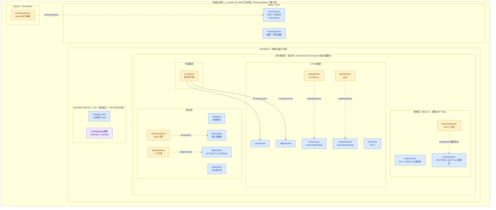

*图 3：层次嵌套全景。蓝色 AO（14 个）按会话相位与组合段分组归属；黄色 worker（6 类 7 实例）挂在所属 AO 边上，虚线回边即"完成中断"事件（信号名标注）；紫色是 AO 内部的子 FSM 镜像。实线为数据面推进（IrscWorker 的双投帧）。*

图 3 走读：最外层 `SYS` 框即主会话复合状态——AO 在哪个相位框里，就是它在那个会话阶段的归属：`OrchestratorAo`/`IrscDriverAo` 在 BOOT/INIT 完成命令链；数据链各段全部住在 `RUNNING` 内（流塑形窗口开放）；`RecfgOrchAo` 与其 `RecfgStage` 镜像嵌在 `RUNNING.RECFG_TXN` 内——事务窗口开启时，会话门控的当前实现仅覆盖 IRSC 命令通道（`irsc_session_open` guard：INIT/RUNNING 白名单，RECFG_TXN 期间拒绝 IRSC 命令）；video/pack/enhance/tpd 无冻结 guard——demo 时序上重配发生在稳态流之后，若需真正的流塑形冻结需扩展 guard 白名单（架构预留，未实现）。`SEGS` 框即 `SessionEventComposite` 的固定段数组（4.7 节），五个订阅 AO 分布在传感器/视频段中，门控经 guard 直读 atomic 相位字、扇出广播按需启用（4.7 节"门控优先走 atomic 直读"）。段内的 AO 排布即数据链序（低/高增益 → HL 融合 → enhance/tpd → video pack → 输出），与图 2 的拓扑一致，但此处强调**归属**而非数据流：每个 AO 属于哪个段、哪个段属于哪个会话相位。worker 全部以虚线回边（完成中断）挂在 AO 边上——`IspIrqWorker` 两个实例分别归 enhance/tpd（独立中断线），`SoutDmaWorker` 单实例以路径标记服务 VideoPackAo 双流；实线只有 IrscWorker 的两条（数据面推进的源头）。`CmdDmaWorker` 归 BOOT/INIT 相位框：它在 IRSC 命令链期间工作（4 步寄存器写往返），流启动后闲置。AO 间的数据面推进事件（`kLowGainDone`、`kHlFused`、`kPicPacked` 等）为控制画面密度未画，完整链路见图 2 与 5.4 节信号表。

### 4.1 主会话 HSM

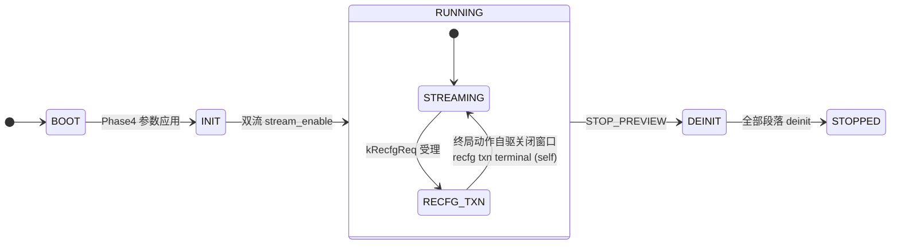

*图 4：主会话 HSM。RECFG_TXN 嵌套在 RUNNING 内——事务进行期间，会话门控的当前实现仅覆盖 IRSC 命令通道（`irsc_session_open` guard：INIT/RUNNING 白名单，RECFG_TXN 期间拒绝 IRSC 命令）；video/pack/enhance/tpd 无冻结 guard——demo 时序上重配发生在稳态流之后，若需真正的流塑形冻结需扩展 guard 白名单（架构预留，未实现）。窗口打开随 kRecfgReq 受理（主线程）；关闭由事务终局动作自驱（rcGoHome 汇流 REJECT/RECOVER/COMMIT 三路径，经 session_advance 原子归位，轨迹 `recfg txn terminal (self)`），见姊妹文档 §3.2。*

机制落点：

- `SessionState` 六值枚举（`kBoot`/`kInit`/`kRunning`/`kRecfgTxn`/`kDeinit`/`kStopped`），存于 `std::atomic<SessionState> g_session`（`static_assert(is_always_lock_free)`——主线程推进、Dispatcher 线程 guard 读，无撕裂）。
- **状态变更只经一个入口**：`session_advance(s, why)` 以 `std::exchange` 换入新相位、打印 `[session] A --(why)--> B` 轨迹并记结构化日志；子 guard 直读 atomic，`g_session_events.publish()` 扇出按需启用（4.7 节）。
- 子 AO 的 guard 例子：`irsc_session_open` 只在 INIT/RUNNING 放行 `kIrscCmd`；DEINIT 后由 IRSC 的 reject 弧（`onIrscCmdRejected`）观测到门控拒绝，端到端验证主→子门控。
- 一条时序纪律：会话推进必须从主线程提交——Dispatcher 上下文里提交会与唤醒锁竞走（lost-wakeup，压力跑约 15 次出现一次的真实交错）。

### 4.2 重配事务 HSM（子 FSM 的完整形态）

`RecfgOrchAo` 是层次 HSM 机制最完整的应用：8 态（`kRcIdle`..`kRcCommit`）+ 11 弧（7 条业务弧 + 4 条 stale `kRecfgStage` 吸收弧，全部 `inline const` 编译期表），镜像 `RecfgStage` 枚举近似对应 HSM 状态（`recfg_stage_name()` 可枚举打印），已知偏差：`kCommitted`/`kFailed` 是终局姿态、无 HSM 状态（终局直接回 Idle），`kRcPrecheck` 不可达（历史遗留）。终局弧按镜像姿态 guard：`at_reject_home`/`at_commit_home` 只放行当前事务自身的自驱事件，陈旧 `kRecfgStage`（前一笔事务遗留）落到吸收弧不打扰活事务——这正是压力跑暴露过的交错。终局自驱关窗：`rcGoHome` 中若 `g_session` 为 kRecfgTxn 则经 `session_advance(kRunning, "recfg txn terminal (self)")` exchange 关窗，三个 pass 各一次、无双关。

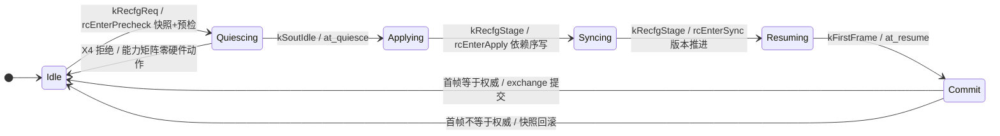

*图 5：重配事务 8 态 HSM。两个回 Idle 的终局弧（提交/回滚）都以首帧字节校验为裁决，软件权威最后落笔。*

### 4.3 guard 命名函数设计

所有 guard 是**命名自由函数**而非 lambda，签名统一 `bool(const Ctx&, const Event&)`，标注 `[[nodiscard]] ... noexcept`，**纯判断无副作用**。命名即文档：`irsc_session_open`、`at_quiesce`、`at_resume`、`pic_and_init`、`sout_is_pic`、`is_pic_path`——读转移表即可读懂弧的合法性条件。guard 失败后 HSM 继续扫描同信号的后续弧（first-match-wins），这提供了免费的 reject 弧机制：合法弧在前、Self 型 reject 弧殿后（`kVideoCmd` 在 IDLE 时 START 落到 `onVideoCmdRejected` 计数 + trace），非法事件从不被静默丢弃。

### 4.4 entry/exit/action 分层契约：硬件命令在 entry

这是从历史时序 bug 吸收的契约，源码注释明言：**硬件命令只在入口动作发出，绝不在转移动作里自提交完成 ack**——转移动作在状态切换**之前**运行，从转移动作自提交 idle ack 会与拓扑竞走（弧还没落到目标态，ack 事件已入队）。下发位置在 entry 是结构契约；当前实现中 SOUT_STOP/START 为内联自提交模拟（`rc_self_submit` 模拟帧边界 ack），未真正调用 SOUT worker——与 RS500 真实路径的差异已标注。

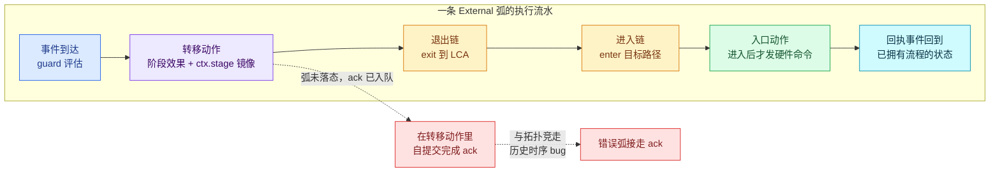

*图 6：entry/action 分层契约。硬件命令（SOUT_STOP/SOUT_START）只从入口动作发出，完成 ack 才会回到已经拥有流程的目标态。*

落点：`rcQuiescingEntry`（Quiescing 入口）是 `SOUT_STOP_FRAME` 的下发位置（结构契约），当前实现经 `rc_self_submit(ctx, Sig::kSoutIdle)` 内联模拟帧边界 ack，未调用 SOUT worker；`rcResumeEntry`（Resuming 入口）同理（`SOUT_START`，首帧驱动 `kFirstFrame`）。分工总结：**入口动作拥有"进入该状态后发出的硬件命令"；转移动作拥有"本弧的阶段效果与 ctx.stage 镜像推进"；终局一律经声明的转移回 Idle，绝不靠直接改状态**（`rcGoHome` 注释："every terminal outcome returns to Idle through a declared transition, never by mutation"）。

### 4.5 乘积状态：合并 AO 的 HSM 形态

第 2.2 节的两个合并 AO 在 HSM 层的形态：

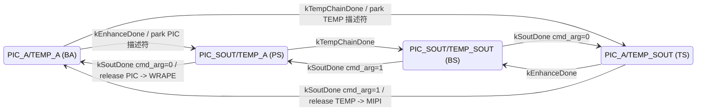

*图 7：VideoPackAo 的 2x2 乘积态。每个（状态, 事件）对都有显式弧——双流同时停在写回窗口（BS）也不存在静默丢弃窗口。*

`VideoFsmAo` 的 3x3 乘积态同构（PIC 相位 I/R/G x TEMP 相位 I/R/T，九个显式命名状态 `kVfII`..`kVfGT`），多一层 reject 弧设计：六条 Self 型 reject 弧（PIC/TEMP 各三条）专门兜住"START 一个仍处于 IDLE 的流"——guard 在合法弧上全部失败后落到 reject 弧，计数并打印 `HsmTrace::rejection`。乘积态的可枚举性在这里兑现为**可测试性**：拒绝路径不是异常分支，是表里数得出来的六行。

描述符的交接用 `std::exchange` 一步完成（`out->meta = std::exchange(*hit, IoMeta{})`，`hit` 是停靠环中按 frame_id 命中的槽位）——读旧写新在同一表达式里，不存在"先读后清"的竞态窗口。`EnhanceAo`/`TempChainAo` 的 Active/IrqPending 两态、`MipiSinkAo` 的 ACTIVE/TX_PENDING 两态是同一手法在单流上的最小形态：**状态转移本身就是异步拆分的文档**——AO 字面地处于"等待硬件"状态。停靠环（深度 4）使"下一帧到达时上一帧仍在等中断"合法共存，乘积态（pack 的 2x2）与停靠环（帧粒度交错容差）是互补的两层：前者表达流程位置，后者表达在飞数据。

### 4.6 状态迁移轨迹观测

`HsmTrace` 静态通道对每条 guarded/exiting 转移打印一行 `[ao] SRC --(sig)--> DST`，拒绝弧打印 `REJECTED (原因)`——相当于给全部 AO 接了逻辑分析仪。`kSigNames` 编译期枚举名表（value→label）保证 sig 可读；demo 启动即强制无缓冲 stdout，输出顺序即真实时序。配合 `coact::diag::LogRtThread` 双通道异步日志（生产者只调 `record_from_task`，格式化在写线程），观测本身不污染被测时序。

### 4.7 组合模式：SessionEventComposite 段树

跨 AO 的"树状通知"（主会话→各段 AO）用组合模式表达，但**树被压平为两级固定数组**：叶子是 `TargetId`，容器是 `SessionEventComposite`（`kMaxTargets=14` 的 `TargetId` 数组 + count），装配期 `add()` 填充一次，之后只读。

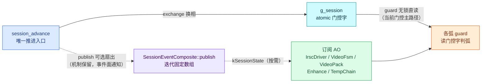

*图 8：组合模式扇出与 guard 直读。子 AO guard 读 atomic 门控字是零事件开销的主路径；组合扇出保留为需要事件面通知时的机制，每个观察者经自己的 AO 队列串行化。*

设计要点：

- **编译期固定**：无堆、无动态注册、无递归——`publish()` 是对固定数组的纯迭代。RS500 的递归 init/deinit 树（段→子段→节点）在此被显式声明为"恰好两级"，树形遍历退化为数组遍历，栈深恒定。
- **门控优先走 atomic 直读，扇出广播保留为机制文档**：子 AO 的 guard 直接读 `std::atomic<SessionState> g_session`（无撕裂、无需事件），`session_advance` 不再逐转移发布 `kSessionState`——每次推进入队 ~20 个无操作事件只会拉长停机排空；`SessionEventComposite`（`g_session_events`，5 个订阅 AO）保留在装配中作为组合模式的显式机制与事件面通知通道（当某 AO 需要"被通知"而非"自己读"时启用）。
- **init 前向 / deinit 反向**的传播语义不藏在组合结构里，而在编排序列里显式表达：boot 时 IRSC 4 步命令按 `kIrscCmdSequence` 前向执行、video FSM PIC→TEMP 前向 init（ISP 八节点的 init 完成由编排器直接合成 8 个 `kIspReady` ack 入自己的队列——`IspPipelineAO` 的级联形态存在于 `IspCtx`/`onIspCmd` 代码中但未实例化，避免注册表膨胀，见源码注释）；停机时反序——TEMP STOP → PIC STOP → TEMP DEINIT → PIC DEINIT，段内节点再反向 deinit（`on_deinit` 的倒序循环）。顺序即契约，全部是可数的事件序列。
- 扇出前有武装检查：`g_session_pool`/`g_session_rt` 在 main 装配前为空时 `publish()` 直接返回（平面未武装），杜绝半装配期广播。

boot 序列（main() 内编排段）是组合模式与会话门控的第一次协同，Phase 编排遵循 RS500 的 Phase1/3/4 结构，会话状态在关键节点推进、为子 AO 的 guard 打开/关闭命令窗口：

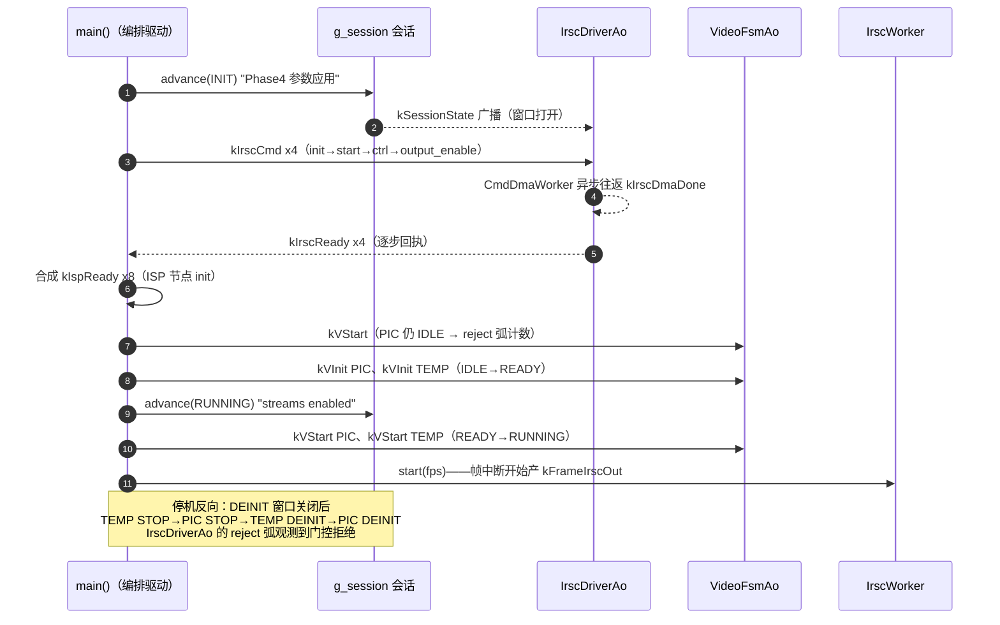

*图 9：boot 与停机的编排时序。会话推进从主线程发出（见 4.1 节时序纪律）；KBC_OUTPUT_ENABLE → IRSC_OUTPUT_ENABLE 的关键顺序（复盘踩坑文档的教训）由命令表的编译期顺序背书。*

---

## 5. 多黑板与消息优先级

结论先行：跨 AO 共享的数据收拢在三块**各自拥有独立写者集合与失效协议**的域里——硬件状态快照、帧数据 DDR、寄存器镜像；链路上全部跨模块交互收敛为 30 个类型化信号，按 AO 固定的 `PriorityClass` 分区派发，过载时 `EventQos::critical` 豁免事务证据类事件。

### 5.1 三块黑板对照表

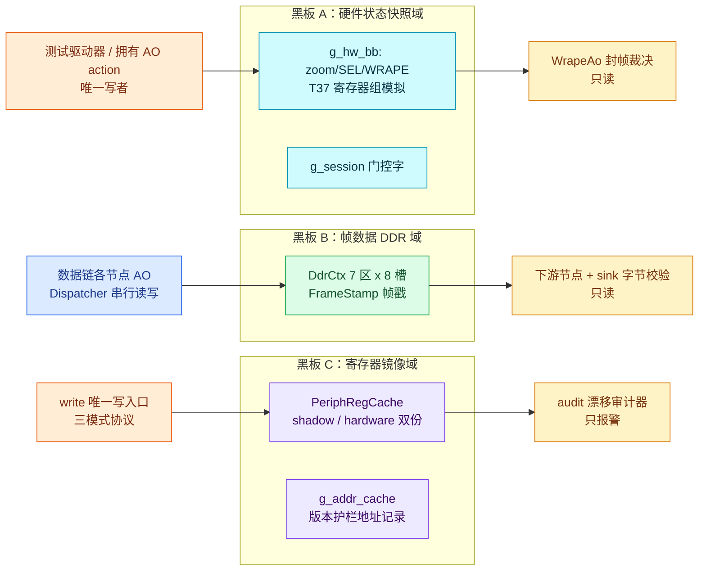

*图 10：三块黑板的写者/读者拓扑。每块都是单写者多读者，读者全部只读。*

| 维度 | A 硬件状态快照 | B 帧数据 DDR | C 寄存器镜像 |
|---|---|---|---|
| 内容 | `g_hw_bb`（`HwStateBlackboard`：`zoom`/`sel`/`wrape` 三寄存器组，T37 模拟；经命名 setter `hw_bb_set_zoom_step`/`hw_bb_set_wrape_framing` 写入）、`g_session` | `DdrCtx` 7 个 `DdrRegion`（DN/低增益/高增益/融合/TEMP/PIC 出/TEMP 出），每区 8 槽 x 三帧环 | `PeriphRegCache` 影子+硬件双数组；`g_addr_cache` 地址记录 |
| 写者 | main T37 场景经命名 setter 在 quiesce 屏障后一次性写（`sel.stream_vld_num` 仅静态初始化、永不改写）；guard 写 `g_session` | 各节点 AO 在 Dispatcher 线程写自己的出区（`DdrCtx::write`，串行免锁） | `write()` 唯一入口（写穿/旁路/cache_only 三模式）；`rcEnterSync` 推进 `layout_version` |
| 读者 | `WrapeAo::onPicPackedWrape` 封帧裁决（`sel` 派生帧长唯一权威、`zoom.step` 几何一致性检查、`wrape` 封帧配置）；guard 读 `g_session` | 下游节点 AO 读入区；sink/WRAPE 逐字节复算校验 | `audit()` 周期比对；`AddrCache::query` |
| 同步机制 | 免锁：写只发生在 t37_drain 屏障后（WRAPE 已消费完全部在途帧），读在 Dispatcher 线程——读写永不并发；若写进入并发窗口，正确做法是经 Dispatcher 事件化而非加共享锁 | 槽位帧戳 `FrameStamp`（placement-new 写入、launder 读出）+ 帧号守卫 | 三标志协议（`cache_only`/`cache_bypass`/`cache_dirty`）+ RAII `BypassGuard` 配对 resync + `sync()` 收敛点 |
| 失效条件 | X1<->X2 切换只改写 `zoom.step`；`sel.stream_vld_num` 是恒定下游契约、永不失效——Identity Zoom 让下游几何恒为 1280x1024，"配置滞后于数据"被转化为"配置不变"；`zoom_geometry_mismatch` 计数器是几何失配的检测点（全程为 0） | 槽位被新帧复用（`stamp->frame_id != frame_id`）→ 诚实 overrun 丢帧计数；`layout_version` 变更连带地址记录失效 | 影子≠硬件 → `audit()` 报警（只报不修）；版本不匹配的地址记录**查即作废**（就地清空，不存在错误命中路径） |

### 5.2 为什么分三块：竞态域隔离与 DDR 写读协议

三块的**写频与协议节奏**不同数量级：DDR 是吞吐域（30 fps 级持续写，失效判据是帧号）；寄存器镜像是协议域（模式切换级写，失效判据是版本与配对）；硬件快照是观测域（阶段切换级写，目标是恒定）。合并成一块"全局共享状态"意味着三类失效判据要共存于一个结构——这正是 RS500 九类异常的共同前件（同一事实两份记录、更新失同步）。分域后，每块的失效协议独立演化、独立成立。

DDR 域的写读协议值得单独展开，因为它是三块中唯一承载真实字节的：

- **确定性槽位**：帧 N 恒落槽 `N % kDdrSlots`（`dn_slot_of`），每区每帧至多写一次；in-flight 跨度（队列深度）在 30fps/每链 3ms 节奏下远小于 `kDdrSlots=8`，槽位只被 8 帧之后的帧复用——帧号守卫把更深的积压转化为诚实的 overrun 丢弃，与真实 DMA 环的语义一致。
- **写路径**（`DdrCtx::write`）：写前先查目标槽的旁路所有权标记 `SlotOwner`（`kFree`/`kWriterOwned`/`kReaderClaimed` 三态，存于槽外旁路数组，如同 RS500 描述符环的 ownership 位存于描述符 RAM 而非帧数据）；若槽被读者持有（`kReaderClaimed`）则**不覆写**——跳过本次轮转并递增 `ownership_skips` 计数（对应 FIFO_OVERFLOW 中断的诚实丢弃语义：写侧不阻塞不等待，DMA 不等人），帧号守卫让被跳过帧的读者得到诚实的 overrun。正常路径则 placement-new 写入 `FrameStamp{frame_id, region, seq}`（DMA 描述符式写入，无临时无拷贝），`std::exchange` 交出旧戳，槽位置 `kWriterOwned`，像素 memcpy 到戳后。
- **读路径**（`DdrCtx::read`）：经 `std::launder` 取回戳（C++17 对象模型：槽位内存里的对象生命周期由 placement-new 开始，launder 重建指针-对象关系），双校验（戳内 frame_id 与旁路 `slot_frame[]` 都要匹配）才返回 true；校验通过后**声明槽位**（置 `kReaderClaimed`），payload memcpy 完成后立即释放（置 `kFree`）——claim/release 夹住最窄窗口，是"CPU 取走 DMA 描述符所有权排空数据"的软件镜像。失败即 overrun，调用方计数丢帧或用退化种子（`fill_dn`）继续——降级路径显式，绝不静默读旧数据。
- **免锁理由**：所有读写发生在 Dispatcher 单线程的 AO action 里，唯一跨线程的 `write_idx`/统计计数被 `static_assert(is_always_lock_free)` 锁死无锁假设。

### 5.3 黑板与真实硬件的并发解决之道：四个武器的映射

黑板模拟的是**软硬件协调**本身。真实硬件解决读写并发靠四件武器——硬件原子性、所有权协议、中断同步点、总线仲裁——demo 把"硬件保证"降级为"协议保证"，逐项映射如下：

| 真实硬件机制 | demo 模拟物 | 强度 |
|---|---|---|
| **总线仲裁器串行化**：CPU 与多 DMA 主设备争 DDR 总线，仲裁器硬件串行化一切访问，软件看不到"同时写" | Dispatcher 单线程串行化所有 AO 的黑板读写（免锁论证的根基） | 等价 |
| **寄存器总线原子访问**：单寄存器（32 位对齐）读写不可分割，读者最多见旧值或新值，永不见半截值；多寄存器组的一致视图靠协议 | g_hw_bb 字段全部为 ≤32 位标量（与真寄存器同构），单字段天然原子；多字段一致视图靠"写只在 drain 屏障后"的时序契约——对应真实驱动"重配前先停流"（SOUT_STOP_FRAME）语义：**真实的解法不是让并发安全，而是消灭并发窗口**（重配事务冻结，U2 机制） | 等价 |
| **DMA descriptor ownership 位**：三帧循环 address0/1/2 的描述符带所有权位（own by DMA / own by CPU），谁拥有谁能动；违反即 FIFO_OVERFLOW / PASSIVE_DATA_LOSS 中断 | DdrCtx 槽位旁路所有权数组 `SlotOwner`（三态 `kFree`/`kWriterOwned`/`kReaderClaimed`，存于槽外如描述符 RAM）+ FrameStamp 帧戳 = **已协议化**：写前验主（`kReaderClaimed` 槽不覆写，跳过轮转并计 `ownership_skips`，对应 FIFO_OVERFLOW 的诚实丢弃——写侧不阻塞）；读侧 claim/release 夹住 payload 拷贝的窄窗口（"CPU 取走描述符排空数据"的镜像）；帧戳作第二道代际防线。`ownership_skips==0` 断言确认 demo 时序下单帧生命周期 < 环回绕周期，协议不触发即安全性的双向验证；即使未来读路径多线程化，协议保证依然成立 | 等价 |
| **中断作为同步点**：DMA 写完一帧 → 硬件置中断标志 → ISR → rx_indicate → 事件；读侧不轮询"好了没"，完成即同步点，生产消费速率天然解耦 | worker 完成事件回 AO（kIspNodeDone/kSoutDone/kFrameEof...），并遵守 RS500 约束"中断不自动改变 Stream FSM"（kMipiStreamErr 只计数不动状态机） | 同构 |

这张表回答"为什么黑板免锁是安全的"：不是因为它用了巧妙的锁，而是因为**硬件世界本来就不用锁**——硬件用仲裁器（→Dispatcher）、原子总线（→标量字段）、所有权位（→SlotOwner 旁路标记）、中断（→完成事件）解决问题。AO 黑板是这套硬件协调机制在纯软件世界的忠实投影；ownership 位的写侧互斥（第三行）也已投影到位（写前验主 + 读者 claim/release 窄窗口 + `ownership_skips` 计数），协议保证取代了原先的时序推演。

**为什么不用引用计数（RCU 式）**：写者需等最后读者放引用才能回收，但帧槽固定 8 个环形复用，DMA 不等人——RCU 需要无限槽或写者阻塞，两者都违背硬件时序。真实 RS500 的答案是**三帧轮转**（槽数 ≥ 读者数+写者数，空间换安全，SoutDmaWorker depth3 即其模拟）；软件侧等价物是版本号/代际校验（FrameStamp），以及寄存器镜像域的三标志事务协议（cache_only 冻结期读者读稳定影子、写者攒 dirty 集、sync 点原子切——"读写不并发"的协议化表达）。

### 5.4 与拥有者 AO 单写原则的互补及反黑板边界

示例的共享域纪律与 AO 纪律是一体两面：

- **黑板管只读快照**：消费者（WRAPE 裁决、sink 校验、audit）随时读，永不写；快照的变更全部由声明的写者经声明的事件传播告知。
- **可变状态归 AO**：一切业务可变量（parking ring 里等待中断的帧描述符、`VideoPathMirror`、`RecfgAoCtx` 的事务快照）住在 AO 上下文里，受 Dispatcher 串行化保护，其他执行流在结构上无法观察中间态。
- **反黑板边界**（源码注释原文背书）：`HwStateBlackboard`（`g_hw_bb`）注释明言 "WHY THIS IS NOT THE BLACKBOARD ANTI-PATTERN"——它模拟物理寄存器组，每字段组经唯一命名 setter 写、读在 Dispatcher 线程或 quiesce 屏障后、变更经事件传播；真正的黑板需要"至少两个独立生产者向一个结构贡献部分结果 + 消费者确实需要合并视图"（多传感器融合场景），本例两个条件都不成立，故拥有者 AO 纪律优先。这条边界防止"为了模式而模式"地把单写者状态误抽象成黑板。

### 5.5 事件词汇：30 个信号，四类语义

`enum class Sig` 是唯一的跨模块词汇表：

| 类别 | 信号 | 发出方 → 接收方 | 语义 |
|---|---|---|---|
| 数据面推进 | `kFrameIrscOut` | IrscWorker → low/high 双链 | DN 帧产出（像素在 DDR，事件只带槽位描述符） |
| | `kLowGainDone` / `kHighGainDone` | 增益链 → HlFuseAo | 链尾完成，融合前件之一 |
| | `kHlFused` | HlFuseAo → enhance/tpd | 融合完成，flags bit 区分 PIC/TEMP 扇出 |
| | `kEnhanceDone` / `kTempChainDone` | 链尾 → VideoPackAo | 中断窗口后的下游放行 |
| | `kPicPacked` / `kTempPacked` | VideoPackAo → WRAPE / MipiSink | SOUT 写回完成，帧就绪 |
| 控制面同步 | `kBoot` / `kInitPreview` / `kStopPreview` | 应用 → 编排 | 会话生命周期 |
| | `kPhaseEnter` | 编排 → 驱动 AO | Phase 进入标记 |
| | `kIrscCmd` / `kIspCmd` / `kVideoCmd` | 编排 → 驱动/视频 AO | 命令（子命令在 `cmd_arg`，流身份在 flags） |
| | `kIrscReady` / `kIspReady` / `kVideoReady` | 驱动/视频 → 编排 | 逐步回执 |
| | `kSessionState` | 组合广播 → 各订阅 AO（门控主路径为 guard 直读 atomic，见 4.7） | 会话相位门控 |
| 异步完成通知 | `kIrscDmaDone` | CmdDmaWorker → IrscDriverAo | vdcmd 寄存器写完成 |
| | `kIspNodeDone` | IspIrqWorker → enhance/tpd | ISP 节点完成中断 |
| | `kSoutDone` | SoutDmaWorker → VideoPackAo | SOUT 写回完成（`cmd_arg` 打路径标记） |
| | `kMipiTxDone` | MipiIrqWorker → MipiSinkAo | CSI TX 完成 |
| | `kFrameEof` | UsbDmaWorker → WinHostAo | 帧终局（完整或 ERR+EOF） |
| 重配事务 | `kRecfgReq` / `kRecfgDone` | 应用 ↔ RecfgOrchAo | 请求与终局 |
| | `kRecfgStage` | RecfgOrchAo → 自身 | 阶段自驱（每个自驱弧一个 RTC 步骤） |
| | `kSoutIdle` / `kFirstFrame` / `kFmtIdle` | 停稳块/首帧 → RecfgOrchAo | 停稳与提交证据 |

事件即数据面推进信号，也即控制面同步原语——两平面共享一套词汇，不存在"事件说改完了、数据还在跑旧配置"的缝隙。载荷 `Payload`（32 字节 control + `ddr_slot` + `ddr_id`）刻意最小化：像素不过事件通道，与 RS500 `video_isp_stream_rx_ind` 不经事件通道搬像素的纪律一致。

### 5.6 PriorityClass 分级与三分区派发

框架语义（`include/coact/config.hpp` 与 `staging.hpp`）：`PriorityClass` 是 AO 的固定属性，是分区选择的**唯一权威**（`EventQos` 不携带逐事件优先级）；staging 三分区容量 High 32 / Normal 64 / Low 128，批处理按 High→Normal→Low 取，唯一例外是 Low 事件老化超过 `kLowMaxWaitMs=100ms` 强制先服务。

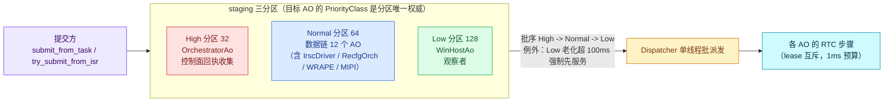

*图 11：三分区优先级派发。分级表如下。*

| 级别 | AO 集合 | 判据 |
|---|---|---|
| High | `OrchestratorAo` | 编排回执收集：`kIrscReady`/`kIspReady`/`kVideoReady` 等控制面 ack 不得在帧洪峰后老化（Trait 定义注释按 RTE `rte_register_service` 模型给出该理由） |
| Normal | `IrscDriverAo`/`RecfgOrchAo`/`LowGainAo`/`HighGainAo`/`HlFuseAo`/`EnhanceAo`/`TempChainAo`/`VideoFsmAo`/`VideoPackAo`/`WrapeAo`/`MipiSinkAo`/`UsbSinkAo` | 数据面主链与驱动/事务 AO，帧率级吞吐；命令往返事件量小且受 QoS critical 豁免保护（见 5.6） |
| Low | `WinHostAo` | 纯遥测观察者，可延迟、可老化，不影响出流 |

该分级已按 Trait 接线实现（`HighAoTrait`/`AoTrait`/`LowAoTrait`），非仅设计意图。分级的收益：观察者流量不与数据链竞争 Normal 分区；编排控制回执在高分区获得确定性的响应上界；三分区容量隔离使单类消费者的洪峰不会挤占其他分区。

### 5.7 EventQos critical 使用矩阵

框架语义（`coordinator.hpp` M6 过载守卫）：目标 AO 的断路器进入 `BrokenL2` 后，非 critical 事件被丢弃并计入 `DroppedOverload`，**critical 事件豁免**。示例的接线矩阵（源码逐点核实，提交点共 28 处 `submit_from_task`，其中 8 处 critical、20 处 non-critical）：

| 事件 | critical | 理由 |
|---|---|---|
| `kIrscCmd`（boot 4 步命令）/ `kIspReady` ack / `kVideoCmd`（init/start/stop/deinit）/ `kRecfgReq` | true | 控制面命令与回执：被 L2 隔离的目标丢弃非 critical 事件，boot/stop 命令绝不可丢（源码注释明言） |
| IRSC 4 步回执 `kIrscReady`、ISP/Video 节点 ack | true | 启动序列的完成哨兵 |
| `kRecfgStage` 自驱 | true | 事务阶段自驱，不可断链（`rc_self_submit` 路径） |
| `kSoutIdle` / `kFirstFrame` | true（经 `rcQuiescingEntry`/`rcResumeEntry` 自提交） | 重配事务的停稳与提交证据，丢失即事务悬挂 |
| `kSessionState` | —（直读 atomic，不经事件面，见 4.7） | 门控广播已收敛为 guard 无锁直读 |
| 数据面推进信号（`kFrameIrscOut`/`kHlFused`/`kEnhanceDone`/`kPicPacked` 等） | false | 过载丢帧是诚实的背压，不应豁免 |
| `kFrameEof`（T37 驱动帧）/ 观察者信号 | false | 可丢，WinHost 的 gaps 计数会如实反映 |

设计原则一句话：**事务的证据链事件豁免过载丢弃，数据面与观察面的事件接受诚实的过载背压**——与 worker 层"忙则拒绝、丢弃计数"的契约（3.1 节）语义同构。

### 5.8 与 RS500 RTE 模型的对应

| RS500 RTE 概念 | coact 对应 | 差异说明 |
|---|---|---|
| 独立服务优先级钳制（服务执行优先级不超过钳制值，防止低优调用者借服务抢占高优任务） | `LogicalPrio` 全局唯一（registry bind 校验重复优先级即拒绝），Dispatcher 单线程按优先级批处理 | coact 用"优先级唯一 + 单派发线程"从结构上消灭优先级反转路径，钳制不再需要运行期协商 |
| 共享服务单队列（多调用者共享一个服务队列，顺序执行） | Dispatcher 单线程 + 三分区 staging（AO 各自队列，分区统一调度） | 语义同构：服务 = AO，队列 = AO 队列；coact 增加的是分区容量隔离与 Low 老化，防止单一低优消费者拖垮共享派发 |

### 5.9 监控查询：MSH 风格的三层可观测设计

AO 模式的核心收益之一是**随时可查**：状态封装在 AO 内、Dispatcher 事件串行化保证快照一致性，查询路径天然无需加锁业务数据——对应 RT-Thread MSH 在任意时刻查询系统状态的运维模式。查询分三层，各层的数据来源与一致性保证不同：

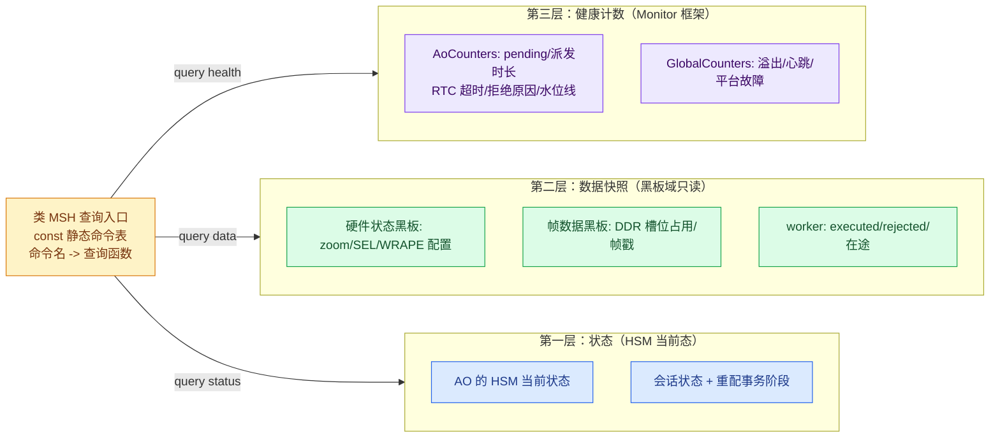

| 层 | 查询内容 | 数据来源 | 一致性保证 |
|---|---|---|---|
| **状态** | 各 AO 的 HSM 当前状态、会话状态（BOOT/INIT/RUNNING/RECFG_TXN/...）、重配事务阶段 | 各 AO 的状态镜像（atomic 或串行写） | Dispatcher 串行化：状态只在事件处理中变更，任意时刻读到的是某个一致的事件步终态 |
| **数据** | 黑板域快照（zoom step/SEL 有效计数/WRAPE 配置帧长）、DDR 槽位占用与帧戳、worker executed/rejected/在途计数 | 三块黑板（§5.1）+ worker 统计 | 黑板四要素契约（写者/读者/同步/失效）+ 单写者原则；worker 计数在锁内递增 |
| **健康** | 每 AO 的 pending、直派/派发时长累计、RTC 超时、拒绝原因分布、staging 分区水位线、池溢出 | `coact::Monitor` 框架（`rt.monitor().ao(id)` / `.global()`） | 固定计数器、热路径只写不格式化不阻塞（monitor.hpp 契约），可 SMP per-CPU 折叠 |

查询的关键设计约束：**查询永不打断主流程**——主流程运行中穿插查询（场景切换点或定期），查询函数只读计数器与快照、不做事件提交；命令入口用 const 静态函数表（命令名 → 查询函数），与规约"反工厂"条款一致。这使运行中的系统像 MSH 一样可随时审计："哪一层在什么状态、数据是否漂移、健康度如何"。

---

## 6. 设计模式与 C++17 落点总表 + 九类异常架构答案

结论先行：四个经典模式全部以**编译期静态**形态落地（CRTP 静态多态、const 策略函数表、constexpr 命令表、固定数组组合），零虚表、零堆、零运行期构建；C++17 特性的使用全部服务于"对象生命周期显式化"与"契约编译期化"。九类一致性异常按"不一致的两端"收束为三个机制，三个机制分别住在示例的不同层。

### 6.1 四模式落点（grep 核实）

| 模式 | 落点 | 形态 |
|---|---|---|
| CRTP | `WorkerBase<Derived, Job, Depth>`（`derived().execute(j)` 编译期钩子）；`VideoFsmNode<Derived>`（`Derived::mirror_of/label/kind_value/ack` 静态钩子）；`VideoPackNode<Derived>`（`Derived::kPathId/in_region/pack/park/...` 策略面） | 基类持有骨架（生命周期/交接/公共帧路径），派生类只差钩子；`static_cast<Derived*>` 编译期解析，无 vtable |
| 策略 | `LowGainPolicy`/`HighGainPolicy`（`GainNodeBase<Policy>` 骨架）、`EnhancePolicy`/`TempPolicy`（`FusedNodeBase<Policy>` 骨架）——无状态 struct + `static constexpr apply()`；`QuiescePolicy<HasIdleIrq>`（`if constexpr` 二选一实例化）；`StaleFraming`/`AlignedFraming`（封帧裁决策略） | std::allocator/std::hash 式编译期定制点；未选中路径连代码都不实例化 |
| 命令 | `IrscCmd`（自带 tag 与 `stamp()` 方法）+ `kIrscCmdSequence` 编译期命令表（init→start→ctrl→output_enable，顺序即契约）+ `kIrscDoneTable` 完成姿态表（哪一步置 ready） | 多步硬件初始化退化为表驱动 + 事件回执，编排器只数 ack；加一步 = 加一行 |
| 组合 | `SessionEventComposite`（固定 TargetId 数组，`kMaxTargets=14`） | 见 4.7 节；两级压平、禁递归、装配期固定；门控主路径为 guard 直读 atomic，扇出保留为事件面通知机制 |

### 6.2 C++17 特性清单

| 特性 | 处数 | 落点 |
|---|---|---|
| `if constexpr` | 4 | `QuiescePolicy` 停稳路径二选一；`GainNodeBase::process` 分支消除 |
| `std::exchange` | 14 | 提交边界（`active_geom = std::exchange(target_geom, ...)`）、版本推进、槽位戳交换、停靠描述符交接（三处 parking ring 取帧）、job 弹出——"读旧写新一步完成"是冻结窗口整体交换语义的实现载体 |
| placement new + `std::launder` | 3 区 / 4 | DDR 槽位 `FrameStamp`、`AddrCache::store`、`WorkerBase` job 槽：对象生命周期在槽位内存内开始，launder 合法化访问（[ptr.launder]） |
| `static_assert` | 27 | ABI/布局/无锁契约：`is_standard_layout`/`is_trivially_copyable`/`is_nothrow_move_constructible`/`atomic<T>::is_always_lock_free`；T37 证据值锁定（`kX1FrameBytes == 655360U` 等） |
| `[[nodiscard]]` | 59 | 全部有意义的返回（含全部 guard），返回值不可忽略 |
| `constexpr` 表 | — | 模式表 `kProductModes`/`kCaliModes`、命令表、HSM 状态/转移表（`COACT_HSM_STATES`/`COACT_HSM_TRANS` 宏 + `inline const` 数组）、`kSigNames` 枚举名表 |
| `std::array` 定容 | — | DDR 槽位、事件池存储、脏寄存器集——运行期零堆分配；`pool.used()==0` 零泄漏断言 |
| `explicit operator bool` | — | `AddrCache` 的语境转换（"是否有活记录"），防 cache 静默退化成整数 |
| 内联全局（`inline` 变量） | — | `g_session`/`g_zoom`/`g_addr_cache`/`g_log` 等头文件式单例，单一定义点，无初始化顺序问题 |

三点工程说明：

- **框架侧同款纪律**：示例的 `static_assert` 契约是框架 `config.hpp`/`pool.hpp` 风格的延续（`TargetId` 零开销断言、ABA 标签池头、`PendingCounter` 无锁断言）；示例在应用层把同一纪律用于业务结构（`FrameGeometry`、`VideoPackCtx`、`IoMeta`），使跨边界的每个结构都有编译期背书。
- **零虚表边界**：CRTP/策略/命令/组合四模式全部静态化后，示例里唯一的 vtable 在框架 `AoBase`（dispatch/priority 等类型擦除接口），业务代码零虚调用；构建级 `-fno-exceptions -fno-rtti` 进一步封死动态机制。
- **placement new + launder 的适用边界**：该纪律只用于"固定内存槽位里构造平凡对象"（DDR 戳、地址记录、job 槽、事件池载荷），全部对象 trivially copyable 且槽位对齐满足——不存在析构遗漏与类型混淆风险；非平凡对象（`PeriphRegCache` 等）照常成员式生存。

### 6.3 九类一致性异常的架构答案索引

每类异常给出复现机制与架构构件的对应；故障机理、测试输出与断言证据见 `design_consistency_avoidance_zh.md` 对应节（该文 §3.1-3.10）。

| 编号 | 异常 | 复现机制（示例内） | 吸收它的架构构件 | 互引 |
|---|---|---|---|---|
| U1 | 口径漂移 | `inject_stale_sout` 让 SOUT 按旧几何封帧而流已是 X2 | `FrameGeometry::bytes_per_frame()` 唯一公式 + `apply_magx()` 唯一倍率入口；全部层读同一 `target_geom` | §3.1 |
| U2 | 新旧交替 | Applying 阶段 SOUT 旧几何 / AI 新几何混杂截断 | `RecfgStage` 8 态枚举封闭状态空间 + 会话 `kRecfgTxn` 事务窗口门控（当前仅 IRSC 命令通道 guard，流塑形冻结为架构预留，见本文 4.1/4.2） | §3.2 |
| U3 | X2 提前封帧 | `g_wrape.stale_x1_framing` 置位，2621440B 帧在 655360B 处 ERR+EOF | Identity Zoom：`g_zoom` 恒 active，下游几何恒 1280x1024——时序问题转化为结构恒定（见本文 5.1 黑板 A 失效条件"不失效即设计"） | §3.3 |
| U4 | 参数回灌 | Scenario A 裸旁路写 0xBEEF 后全量下发冲掉调优值 | `PeriphRegCache::write()` 唯一写入口 + 三标志协议 + RAII `BypassGuard` 析构配对 resync（见本文 5.1 黑板 C） | §3.4 |
| U5 | 废弃地址 | v1 时代地址记录在布局重算后仍被查询 | `layout_version` 版本护栏：`AddrCache::query` 版本不匹配即 miss 且就地清空——查即作废，无错误命中路径 | §3.5 |
| U6 | 坐标失同步 | 镜像开启后检测框原样传递 | `transform()` 单一坐标变换权威（点/矩形共入口，矩形角点交换后重归一化） | §3.6 |
| U7 | 停稳机制分叉 | 同一 deinit 流程 SOUT 走 3 ioctl 事件、FMT888 走 26 ioctl 轮询 | `QuiescePolicy<HasIdleIrq>` 编译期统一门面，能力差异收进一个常量（见本文 6.1 策略） | §3.7 |
| U8 | 峰值破窗丢帧 | 250ms 时延尖峰击穿 3 缓冲 x 33ms 容忍窗 | DDR 环 `FrameStamp` 帧戳 overrun 守卫：静默覆写变诚实丢帧计数；修复是加深环（容量问题）而非提平均性能（见本文 5.2 DDR 写读协议） | §3.8 |
| U9 | 半停重启闪屏 | STOP 后不等 idle 直接 START，首帧携带旧几何 | HSM 停稳弧：`Quiescing→Applying` 只能由 `kSoutIdle` 触发（`at_quiesce` 守卫），"未停稳即重启"在拓扑上不可达（见本文 4.2/4.4 entry 契约） | §3.9 |
| 附 | 花屏（位宽错配） | 8bit 数据按 16bit 字搬运，两像素合一 | 共享位宽权威 + sink/WRAPE 每帧逐字节复算整条变换链（`verify_pic_bytes`）——共享假设被打破在字节级立即暴露 | §3.10 |

收束关系（姊妹文档图 14 的架构视角展开）：写路径分叉类（U1/U3/U4）由**单一权威**吸收，传播缺失类（U2/U5/U6/U7）由**事件传播**吸收，提交无边界类（U8/U9）由**提交边界**吸收。本文的补充论点是三个机制分别住在不同层，分层使每个机制都可被独立审查：

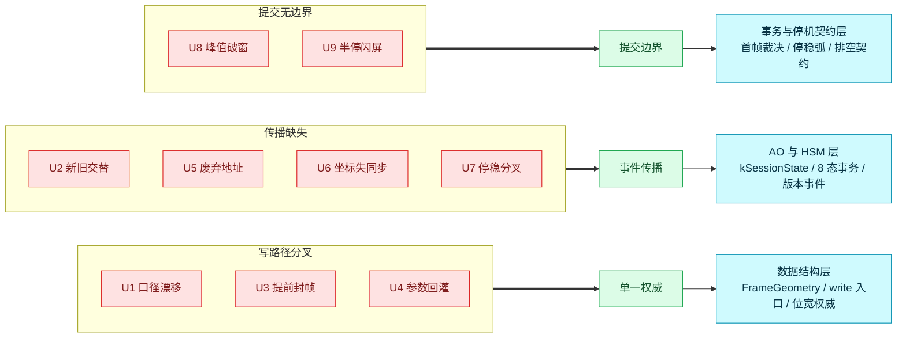

*图 12：九类异常按不一致结构收束为三个机制、分别住在三个架构层。收束不是事后归类——示例先定三个机制，再按机制反向构造九类异常的复现场景（对照实验结构）。*

这就是本文架构方案的最终主张：三平面分离是根约束（第 1-3 章），层次用门控不用嵌套（第 4 章），失效协议先于数据结构（第 5 章），契约编译期化到极限（第 6 章）。四个主张互为支撑——平面分离让失效协议可以按域独立设计，门控式层次让契约可以落在静态表里，而全部静态化反过来使三平面的每条边界都可被编译器与断言双重背书。
