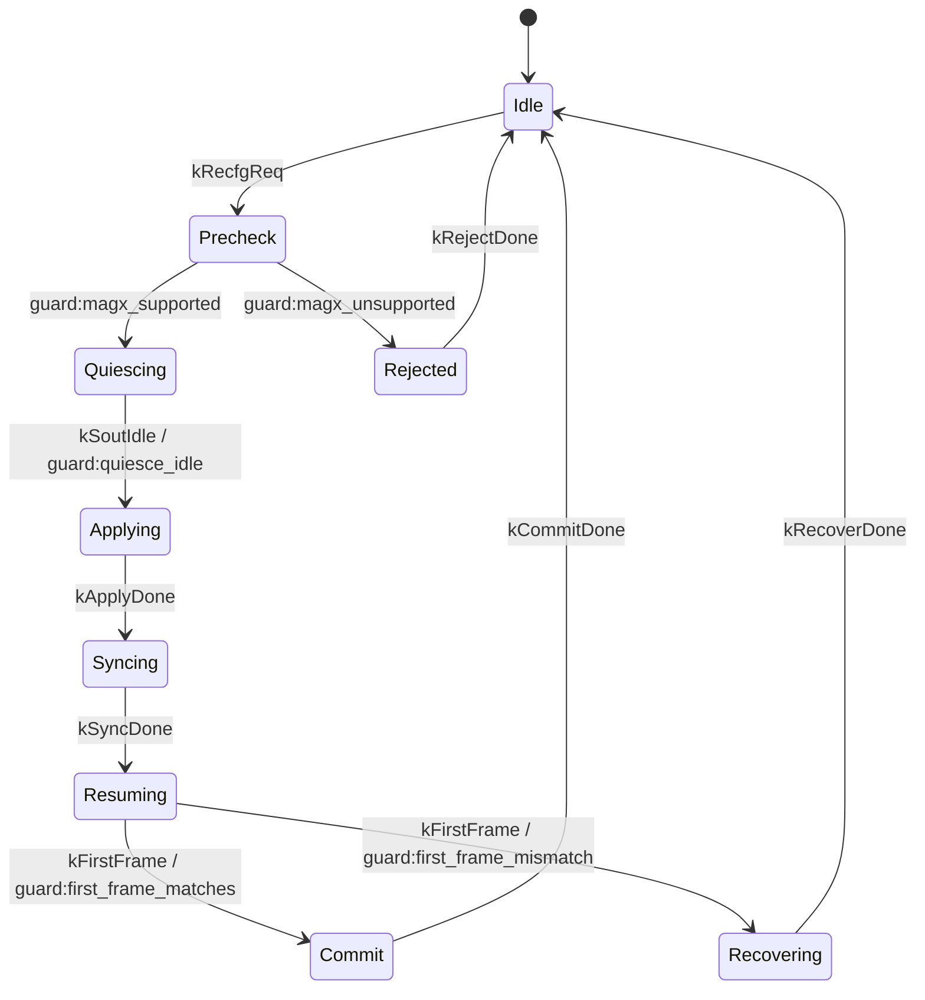
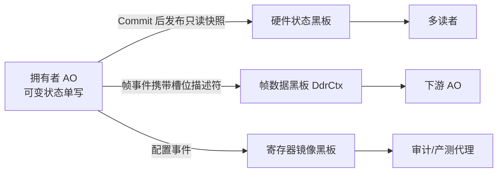

# 《design_consistency_avoidance_zh.md》评审意见

## 1. 评审结论

**结论：文档选题、案例覆盖和对照实验方向成立，但当前版本不宜作为“实现与证据完全一致”的正式设计基线。建议完成一次结构性修订后再评审。**

主要原因有五项：

1. 重配 HSM 的文字、图和实际转移表不一致，且事务窗口在首帧确认前被提前关闭。
2. 文档把 Dispatcher 串行化和 `std::exchange` 的保证描述得过强，混淆了 RTC 原子性、事务隔离和并发原子操作。
3. 部分自检存在恒真断言、未断言修复侧、日志语义相反等问题，`ALL PASS` 不能完整支撑当前结论。
4. AO/worker 数量、写者归属、版本推进和回滚范围与源码不一致。
5. “九类问题都是两份拷贝”覆盖面过窄。更准确的上位概念是“分布式状态契约不一致”，再分为写者不唯一、更新不原子、确认不对等三类。

本文档只提出修改建议，不修改原设计文档和示例源码。

## 2. 评审依据与证据边界

评审对象：

- `docs/design_consistency_avoidance_zh.md`
- `examples/isp_pipeline_demo.cpp`
- `examples/CMakeLists.txt`

已核验当前 `build/examples/isp_pipeline_demo` 的运行输出，包括 U1-U9、花屏场景和 47 条 `check()` 输出，终局为：

```text
RESULT: ALL PASS (fails=0)
```

该结果证明现有构建产物能够运行到成功终局，但不能替代以下证明：

- 当前源码经过一次干净重建后仍通过。
- 每条 `PASS` 的布尔表达式都真实约束了对应故障或修复结果。
- host 模拟结果等价于 RS500 板级行为。
- 文档引用的所有 RS500 复盘结论均可从原始文档追溯。

因此，原文中的“真实测试输出”“ctest 全部通过”“精确复现”应附命令、提交或源码版本、时间和结果摘要；没有这些元数据时，应改为“当前 host 模拟输出”。

## 3. 必须修改的问题

### 3.1 P0：重配 HSM 与源码不一致

原文把重配流程描述为：

```text
Idle -> Precheck -> Quiescing -> Applying -> Syncing -> Resuming -> Commit -> Idle
```

实际 `kRecfgTransitions` 是：

```text
Idle --kRecfgReq/rcEnterPrecheck--> Quiescing
Quiescing --kSoutIdle/rcEnterApply--> Applying
Applying --kRecfgStage/rcEnterSync--> Syncing
Syncing --kRecfgStage/rcGoHome--> Resuming
Resuming --kFirstFrame/rcEnterCommit--> Commit
Commit --kRecfgStage/rcGoHome--> Idle
```

具体差异：

1. `kRcPrecheck` 虽在状态表中声明，但没有任何转移进入，是不可达状态。
2. `kRecfgStates` 的 8 个表项实际是 `Root + 7 个业务状态`，不是原文图示的“8 个业务状态”。
3. `RecfgStage` 的 8 个枚举值与 HSM 状态不是一一对应；`kCommitted`、`kFailed` 没有对应 HSM 状态，运行路径也没有设置这两个值。
4. `rcGoHome` 被用于 `Syncing -> Resuming`，会把 `RUNNING.RECFG_TXN` 提前切回 `RUNNING`，此时尚未收到 `kFirstFrame`，更未完成 Commit。
5. `rcGoHome` 在 `Syncing -> Resuming` 时仍打印 `PrecheckOrCommit -> Idle`，轨迹与实际转移不一致。

建议先选定一种模型，再同步修改源码、状态图和文字：

- 推荐：保留 7 个业务状态，将 Precheck 作为真实状态，所有接受、拒绝路径都进入集中转移表。
- 删除 `RecfgStage` 镜像，或明确其仅为诊断阶段并证明与 HSM 同步；避免两套状态再次形成一致性问题。
- 事务窗口只允许在 Commit 成功或失败恢复完成后关闭。

推荐拓扑：



若坚持“8 态”名称，应明确是否包含 Root、Rejected、Recovering，并让代码表项、枚举、图和日志使用同一计数口径。

### 3.2 P0：RTC、冻结窗口与原子操作的概念混淆

原文多处声称 Dispatcher 单线程使“任何其他执行流都无法在事件处理间隙观察半改状态”。这一结论只对**单次 RTC handler 内部**成立，不自动覆盖由多个自驱事件组成的完整重配事务。

`Applying -> Syncing -> Resuming -> Commit` 跨越多个事件派发点，其他 AO 事件可以在这些 RTC 步骤之间执行。真正阻止业务数据观察中间配置的条件应是：

1. 数据面已收到停流命令。
2. `kSoutIdle` 提供帧边界停稳证据。
3. 冻结窗口内相关读写被状态守卫拒绝或延后。
4. 首帧验证完成前不发布新软件快照。

建议将“结构性不可观察”改为：

> Dispatcher 保证单个 RTC 步骤不可被另一 AO handler 并发执行；跨 RTC 的事务隔离由停稳确认、状态守卫、冻结窗口和最终发布共同保证。

`std::exchange` 也不提供并发原子性。它只是“取旧值并赋新值”的表达工具，不能替代 `std::atomic`、锁或单线程所有权。以下表述需要统一修正：

- “整体交换语义”改为“提交点的所有权转移表达”。
- “原子完成读旧写新”改为“在单线程所有权前提下完成读旧写新”。
- 不应把 `std::exchange` 作为冻结窗口或硬件原子提交的证明。

### 3.3 P0：测试结果存在假阳性和覆盖缺口

#### Scenario A 恒真断言

当前源码：

```cpp
check(regs.st.shadow[2] != regs.st.hardware[2] || true,
      "scenario A: repush backflow path exercised");
```

`|| true` 使断言无条件通过，不能证明参数回灌发生。建议在 Scenario A 当场保存并断言：

```text
旁路后：hardware[2] == 0xBEEF 且 shadow[2] == 0x1002
回灌后：hardware[2] == shadow[2] == 0x1002
调优值确实被覆盖：hw_before_repush != hardware[2]
```

原文“故障确实发生与规避后消除两侧都被锁死”在修复此断言前不能成立。

#### Scenario B 日志与文档不一致

当前实际输出为：

```text
[cache] scenario B: paired bypass resynced (drift=2)
```

`drift_events` 累计了 Scenario A 的两次漂移，不能表达 Scenario B “新增漂移为 0”。建议记录进入 Scenario B 前后的计数差值，日志改为：

```text
[cache] scenario B: paired bypass resynced (new_drift=0)
```

#### Scenario C 拒绝语义相反

当前实际输出为：

```text
[cache] scenario C: sync during freeze refused=0
```

`sync()` 返回 `false` 代表拒绝，但日志直接把返回值打印为 `refused`。原文写成 `refused=1`，与实际日志不符。建议拆分变量：

```cpp
const bool sync_ok = regs.sync();
const bool refused = !sync_ok;
```

并新增 `check(refused, ...)`。当前只检查最终 `syncs == 1`，没有直接证明冻结期调用被拒绝。

#### U8 修复侧未断言

示例打印了“8-buffer window -> 0 drops”，但 `drops_deep` 是局部变量，验证区没有 `check(drops_deep == 0U, ...)`。原文声称“故障与修复两侧都被断言覆盖”不准确。

建议至少增加：

```text
3-buffer + spike：drops_spike > 0
8-buffer + same spike：drops_deep == 0
```

#### 验证矩阵需要证据 ID

建议为每条证据使用稳定 ID，而不是依赖易漂移的日志文字：

| ID | 场景 | 故障侧断言 | 修复侧断言 |
|---|---|---|---|
| `EV-U4-A` | 参数回灌 | 调优硬件值与影子分叉并被回灌覆盖 | Guard 退出后新增漂移为 0 |
| `EV-U8-A` | 峰值破窗 | 3 缓冲下尖峰产生丢帧 | 8 缓冲下同一尖峰为 0 丢帧 |
| `EV-U9-A` | 半停重启 | 未停稳首帧为旧几何 | 停稳后首帧匹配新几何 |

### 3.4 P0：实现清单与源码数量不一致

原文写“16 个 AO 与 4 个非 AO worker”，实际 `main()` 装配为：

- 14 个 AO。
- 7 个 worker 实例：`IrscWorker`、`UsbDmaWorker`、`CmdDmaWorker`、2 个 `IspIrqWorker`、`SoutDmaWorker`、`MipiIrqWorker`。

原文仍把已合并的 PIC/TEMP Video FSM 和打包器按独立 AO 列出，同时遗漏 SOUT 与 MIPI worker。建议以实际 `rt.bind()` 顺序和 worker 实例为唯一清单来源，明确“14 个 AO、6 种 worker、7 个实例”。

### 3.5 P0：回滚、版本推进和写者归属描述过强

#### 回滚范围

失败路径只恢复了：

```text
active_geom = old_geom_snap
active_magx = kX1
```

示例没有建模 AI、DMA、几何、时钟等硬件寄存器的逆序恢复，也没有验证恢复后的真实首帧。因此应把“硬件回滚”改为“软件权威拒绝提交并恢复软件快照”；若要声称完整回滚，需要增加补偿动作及恢复后首帧验证。

#### `layout_version` 推进时机

`layout_version` 在 Syncing 阶段推进，发生在首帧校验和 Commit 之前；故障注入轮即使随后失败，也会从 1 推进到 2。它不是“只在几何真正变更后推进”，而是“每次进入 Syncing 时保守失效”。

两种合理策略：

1. 推荐保留保守失效：文档明确失败尝试也会使旧地址失效，避免回滚过程中错误复用。
2. 若版本只代表已提交布局：把推进移到 Commit，并单独引入 attempt generation 表示在途布局。

#### WRAPE 写者

原文称 WRAPE AO 是 `configured_frame_bytes` 的唯一写者，但实际由 `main()` 直接修改 `g_wrape.configured_frame_bytes`。应二选一：

- 文档承认 demo driver 是配置写者，WRAPE AO 是消费者。
- 更推荐通过配置事件让 WRAPE AO 在自身 RTC 内更新，真正满足 AO 单写路径。

## 4. 建议采用的新分类

### 4.1 上位根因

建议把“同一事实两份拷贝”提升为：

> 多模块对同一业务事实、更新时序或完成条件持有不一致的契约。

“两份拷贝”适合解释 U1、U4、U5、U6、U9 和花屏，但不足以准确解释 U7 的能力差异与 U8 的容量预算。新表述既保留一致性主线，也避免为统一而强行归类。

### 4.2 三类架构根因

| 根因 | 覆盖问题 | 关键机制 |
|---|---|---|
| 写者不唯一 | U1、U6、花屏 | 拥有者 AO 单写路径、共享格式/坐标权威 |
| 更新不原子 | U2、U4、U5、U9 | 事件事务、冻结窗口、版本失效、最终发布 |
| 确认不对等 | U3、U7、U8 | 停稳弧、统一确认语义、显式容量窗口与断言 |

这套分类应替换原文 1.0、图 1、图 14 和 6.3 中互不完全一致的映射。

### 4.3 U1 与 U3 必须去重

两者都表现为 25% 截断，但证据域不同：

| 项目 | U1 口径漂移 | U3 T37 提前封帧 |
|---|---|---|
| 场景 | 通用运行态重配 | T37 UVC/WRAPE 具体链路 |
| X1/X2 字节 | 5,537,280 / 22,149,120 | 655,360 / 2,621,440 |
| 关注点 | 多层各自推导几何 | `streamVldNum`、Zoom 与 WRAPE 封帧边界 |
| 证据 | `[recfg] FAULT/RECOVER` | `[wrape] ERR+EOF at 655360 B` |

原文不应把 655360B 同时作为 U1 与 U3 的直接复现证据。可以说明二者具有相同的 1/4 数学形态，但不能把数学比例相同当作根因完全相同的证明。

### 4.4 U7 与 U8 的结论需要收敛

- U7 的 `QuiescePolicy` 统一了调用接口和完成语义，但在 `kFmtHasIdleIrq == false` 时，事件与轮询机制仍然不同。应改为“隔离能力差异，防止调用方分叉”，而不是“机制分叉不再存在”。
- U8 的主要矛盾是峰值时延与窗口容量不满足约束，不是传统意义上的“两份状态拷贝”。应归入“预算/确认契约不对等”。
- “加深环即可修复”应补充适用边界：只有已知最大尖峰小于新窗口且内存、端到端时延允许时成立；否则还需背压、丢帧策略或降低峰值处理时间。

### 4.5 regcache 表述应避免“直接移植”

示例借鉴了 Linux regcache 的 `cache_only`、`cache_bypass`、`cache_dirty` 语义，但尚未覆盖 Linux regmap/regcache 的完整能力，例如锁、易失寄存器、默认值、I/O 失败、区域同步和 cache type。

建议写成：

> 方案借鉴 Linux regmap/regcache 的三类状态语义，在 host 示例中实现满足当前案例的最小协议。

## 5. 新增设计要求

### 5.1 Guard 作为一等公民

Guard 不应藏在 action 内部，也不应通过修改镜像状态再投递自事件来间接表达拒绝。建议建立集中 Guard 清单：

| Guard | 输入 | 纯判断 | 允许路径 | 拒绝路径 |
|---|---|---|---|---|
| `magx_supported` | 请求倍率、能力表 | 是，优先 `constexpr` | Precheck -> Quiescing | Precheck -> Rejected |
| `quiesce_idle` | 停稳 ack、当前状态 | 是 | Quiescing -> Applying | 保持 Quiescing 并记录拒绝 |
| `first_frame_matches` | 首帧字节、目标几何 | 是 | Resuming -> Commit | Resuming -> Recovering |
| `layout_version_matches` | 记录版本、当前版本 | 是 | 地址缓存命中 | 记录失效并 miss；失效动作放 action |

约束：

1. Guard 只判断，不写上下文、不发事件、不打印业务副作用日志。
2. Guard 使用稳定领域命名；代码若采用 snake_case，轨迹也使用同名标识。
3. 支持编译期判断的能力矩阵优先 `constexpr`。
4. 成功与拒绝路径都显式进入转移表，拒绝不是 action 内的隐藏分支。
5. 轨迹必须带 Guard 名称和值，例如：

```text
Idle --(kRecfgReq, guard:magx_supported=true)--> Quiescing
Idle --(kRecfgReq, guard:magx_supported=false)--> Rejected
Quiescing --(kSoutIdle, guard:quiesce_idle=true)--> Applying
```

`AddrCache::query()` 中“判断版本 + 清空记录”可保留对外接口，但内部应拆成纯 Guard 和失效 action，避免把有副作用函数误称为 Guard。

### 5.2 状态机函数分层

建议在状态机定义前声明统一职责：

| 层次 | 职责 | 禁止事项 | 命名示例 |
|---|---|---|---|
| Guard | 判断事件是否允许触发转移 | 修改状态、发命令、投递事件 | `guard_magx_supported` |
| Entry | 进入状态后发一次硬件命令、启动等待 | 决定目标状态 | `enter_quiescing` |
| Exit | 取消 timer、释放临时占用、清理状态局部资源 | 执行业务提交 | `exit_quiescing` |
| Action | 响应事件、保存证据、更新事务上下文 | 模拟 entry 或隐藏拒绝路径 | `on_first_frame` |

建议统一调整现有命名：

- `rcEnterPrecheck` 实际是 request transition action，改为 `on_recfg_request`。
- `rcEnterApply` 实际处理 idle ack 并执行 apply，拆为 `on_sout_idle` 与 `enter_applying`。
- `rcEnterCommit` 实际处理首帧裁决，改为 `on_first_frame`。
- `rcGoHome` 同时关闭 session 和记录轨迹，按 Commit、Recover、Reject 三条终局 action 拆分。

转移表集中排列，按状态和事件排序；每一行直接可读出“源状态、事件、Guard、目标状态、Action”。函数遵守 `return <= 5`，但不要为了减少 return 把 Guard 与副作用重新混合。

### 5.3 三块显式黑板

建议把当前全局或共享数据按一致性域分成三块黑板，并在文档中逐块标注写者、读者、同步机制和失效条件。

| 黑板 | 数据 | 写者 | 读者 | 同步机制 | 失效条件 |
|---|---|---|---|---|---|
| 硬件状态黑板 | `g_zoom`、`g_sel`、`g_wrape` 的已提交快照 | 对应拥有者 AO | 编排、WRAPE、诊断观察者 | 配置事件 + Commit 后发布快照 | 新重配 attempt、硬件错误、session 结束 |
| 帧数据黑板 | `DdrCtx` 槽位、`FrameStamp` | 当前处理阶段的拥有者 AO | 下游阶段 AO | Dispatcher 串行访问 + frame_id/version 校验 | 槽位复用、帧戳不匹配、overrun |
| 寄存器镜像黑板 | `PeriphRegCache` shadow/hardware/dirty | Regmap 拥有者 | 配置服务、产测代理、审计器 | write-through、guarded bypass、边界 sync | bypass 未对账、设备复位、版本或电源域变化 |

互补关系：



不能合并为一个全局大黑板，原因如下：

1. 三类数据的生命周期不同：配置按事务，帧按帧，寄存器镜像按设备电源周期。
2. 三类数据的失效条件不同：Commit、槽位复用和硬件旁路不能共用一个版本号。
3. 三类数据的并发边界不同：DDR 热路径不应承担寄存器审计或配置快照的锁与扫描成本。
4. 分离后可限制读者权限，避免任何模块借“共享黑板”重新获得可变写权限。

黑板只负责“已发布只读快照供多读者消费”；可变业务状态仍归拥有者 AO 单写。黑板不是绕过 AO 的第二条写路径。

## 6. 原文结构调整建议

建议把 757 行正文压缩并重排为以下结构：

1. **范围与证据等级**：明确 host 模拟、源码断言、RS500 板测三种证据不能互相替代。
2. **问题全景与三类根因**：使用 U1-U9 + 花屏总表，一次定义，不在后文重复改写。
3. **统一架构**：拥有者 AO、事件事务、Guard、停稳/首帧确认、三块黑板。
4. **逐类案例**：每类只保留“故障事实、机制、源码锚点、正反断言、适用边界”。
5. **验证矩阵与剩余风险**：列出稳定证据 ID、构建命令、结果和未覆盖项。

可删除或压缩的内容：

- 图后逐节点复述图中文字的“走读”段落，只保留图中看不出的约束。
- 第 4、5 章与一致性主线关系较弱的通用 C++ 技巧，例如把 placement new、裸指针治理作为核心证明。
- “结构性消除”“不可能”“全部”“精确复现”等绝对词，改为可验证的不变量和适用前提。
- `flash_proxy_demo` 与本文九类问题无直接证据关系，可移至扩展阅读。

## 7. 建议的验收门槛

修订版进入正式设计评审前，应满足：

1. 状态表、`RecfgStage`、Mermaid 图和轨迹日志一一对应，不存在不可达业务状态。
2. Guard 纯判断且命名进入轨迹，所有拒绝路径在转移表可见。
3. 修复恒真断言，补齐 Scenario C 拒绝和 U8 深环修复侧断言。
4. 明确三块黑板的写者、读者、同步与失效条件，所有可变状态仍由拥有者 AO 单写。
5. 提供当前源码的重建命令、目标测试命令、结果摘要和版本标识；host 模拟与 RS500 板测结论分栏呈现。

完成以上五项后，文档才足以支撑“统一架构覆盖 U1-U9 + 花屏”的核心结论。
