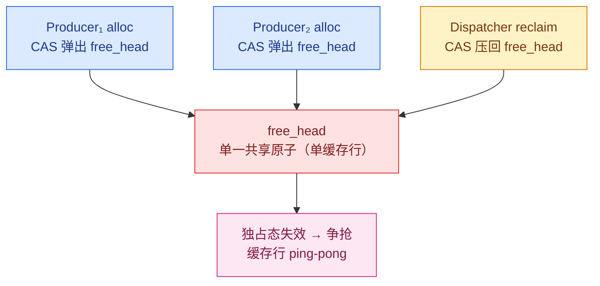
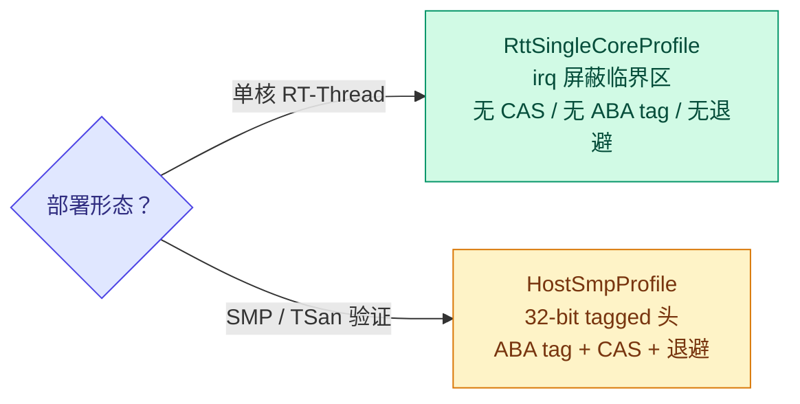

# coact 热路径剖析：无 perf 环境下的 CPU 采样与无锁池的缓存行争用

> 本文解释在无法安装 perf、无 root 权限的 Linux 环境中，如何准确测量 coact 派发热路径的 CPU 占用，并说明两个看似矛盾的结果：单核场景下主要开销来自平台同步而非框架逻辑，多核场景下无锁事件池反而导致 staged 吞吐下降。全部结论均可从 `src/core/bench_hotpath.cpp` 与 `include/coact/{pool,dispatcher}.hpp` 回溯。

## 一、测量目标与采样方法

### 测量目标

微基准的主要风险在于把业务耗时误计为框架耗时。coact 的基准将关注范围收窄如下：

- 状态机为零业务语义的自环：`kTrans` 仅包含一条 Internal 转移，guard 恒真，action 只执行一次 `fetch_add(1)` 计数。整条链 `submit → staging → Dispatcher → Ao::dispatch → HSM → event_gc` 均为框架自身开销，业务耗时趋近于零。
- 两种派发机制拆分为互斥 mode：`staged`（2 个非 direct AO + 2 个 producer）与 `direct`（1 个 direct-eligible AO + 1 个 producer）。隔离并非出于风格偏好，而是因为 direct 与 queued 派发共享执行租约，混在同一 AO 上会触发既有的 lease 竞争，进而污染采样结果。

因此基准回答的问题收敛为：**框架将事件从池中取出、入队、派发、转移、归还入池，这一段自身消耗多少 CPU。**

### 采样器的实现要点

在缺乏 perf（通常意味着无 root 访问 `perf_event_open` 的权限）时，使用手写采样器：`SIGPROF` 间隔定时器与 `backtrace()`。但“能够采集调用栈”与“采集准确”之间存在若干容易被忽略的细节。

**其一，选用 `ITIMER_PROF` 而非 `ITIMER_REAL`。**
`ITIMER_PROF` 仅在进程实际消耗 CPU（用户态与内核态时间）时给定时器计费；进程阻塞于 condvar 或 sleep 时定时器不前进。因此该采样器本质上是 CPU 占用采样，而非墙钟采样。火焰图仅包含实际消耗 CPU 的帧，天然排除等待时间——这正是需要度量的指标。

**其二，handler 只写环形缓冲，不执行任何重操作。**
信号处理器内不得调用 `malloc`、`printf`、`dladdr`、`__cxa_demangle`，这些函数均非 async-signal-safe。因此 `sample_handler` 仅执行两项操作：以 `fetch_add` 取得槽位号，用 `backtrace()` 将最多 48 帧写入预分配的 16384 槽环形缓冲；符号化推迟到进程退出后，再以 `dladdr` 与 `__cxa_demangle` 完成。`backtrace` 在 glibc 的 async-signal-safety 清单中亦属灰色地带，但配合 `SA_RESTART`、预分配缓冲与受控采样频率，在剖析工具中是可接受的；这是手写采样器实际的工程权衡点。

**其三，将采样器自身从样本中剔除。**
`skip_frame` 过滤 `sample_handler`、`backtrace`、`__kernel_rt_sigreturn`、`restore_rt`。若省略此步，每个样本顶端都会出现采样器自身的帧，相当于把可观比例的样本消耗在采样器自身，结论因此失真。

**其四，折叠 root→leaf 后渲染火焰图。**
退出时按 root→leaf 将每个栈以分号拼接为一条路径，相同路径累加计数，交由 `tools/flamegraph_svg.py` 渲染为 SVG。条形宽度等于该帧在所有样本中的占比，属于 CPU 占用比例的统计估计，而非逐周期测量。

16384 槽 @ 1 kHz 约对应 16 秒的连续覆盖，足以覆盖一次 5 秒的基准。`bench_hotpath` target 本身已强制 `-O2 -g -fno-omit-frame-pointer` 并链接 `-rdynamic`：`backtrace` 需要完整帧指针与被保留的动态符号，否则采样结果为大量 `[unknown]`。

```mermaid
flowchart LR
    A["SIGPROF 定时器<br/>1 kHz"]:::t
    B["sample_handler<br/>backtrace()"]:::h
    C["16384 槽环形缓冲<br/>fetch_add + backtrace"]:::b
    D["退出时符号化<br/>dladdr / __cxa_demangle"]:::s
    E["root→leaf 折叠<br/>分号拼接路径"]:::f
    F["flamegraph_svg.py<br/>生成火焰图 SVG"]:::g
    A --> B --> C --> D --> E --> F
    classDef t fill:#dbeafe,stroke:#2563eb,color:#1e3a8a
    classDef h fill:#fef3c7,stroke:#d97706,color:#78350f
    classDef b fill:#d1fae5,stroke:#059669,color:#064e3b
    classDef s fill:#fce7f3,stroke:#db2777,color:#831843
    classDef f fill:#ede9fe,stroke:#7c3aed,color:#4c1d95
    classDef g fill:#fee2e2,stroke:#dc2626,color:#7f1d1d
```



*图 1：无 perf 环境的手写采样管线——从 SIGPROF 定时器到火焰图 SVG 的完整链路。*

### 将基准约束回部署环境

直接运行 `bench_hotpath` 默认落在 host 多核环境，测得的是 SMP 竞争，与单核 Cortex-M 目标偏离。两个参数将其约束回目标环境：

| 参数 | 作用 | 对应目标语义 |
|---|---|---|
| `--cores 1` | `sched_setaffinity` 把全进程钉到 CPU 0，线程继承亲和性 | 单核上 producer 与 Dispatcher 互相抢占 |
| `--tick-hz 100` | 单调时钟按 10 ms 量化 | RT-Thread 100 Hz tick 的时间粒度 |

未指定 `--cores` 时，测得的是线程并行的多核吞吐；只有钉到单核，condvar 唤醒、上下文切换等真实部署成本才会显现。

## 二、两个发现

### 单核：平台开销为主

单核 100 Hz staged（-O2）的火焰图显示两个主要热点：condvar 唤醒+等待约 31%，`clock_gettime` 约 14%。二者合计接近一半，而队列、HSM 线性查表、池分配等框架逻辑并未进入前列。

condvar 部分对应 Dispatcher 与 producer 的唤醒协作，优化落点是“仅在 Dispatcher 空闲时才 signal”，避免每个事件都唤醒空闲的 Dispatcher，实测 signal 调用下降约 28%。

`clock_gettime` 的 14% 是有意引入的代价。Dispatcher 在**每次 dequeue 都刷新 `now_ns`**，而非每个 batch 仅读取一次。原因在于 Low 分区的老化判定需要当前时间：若复用 batch 开始时的陈旧时钟，batch 中途到达的 Low 事件会被误判为“尚未老化”或被提前强制服务。因此它并非未被优化的泄漏，而是“正确性优先于时钟开销”的显式取舍。要省去这 14%，需先修改 Low 老化的语义，而非调整采样器。

更具价值的结论在于：**应先区分平台开销与逻辑开销**。单核场景下框架逻辑开销几乎可忽略，主要代价集中在 OS 同步原语与时钟读取；这部分在 C/C++ 中相同，与语言选型无关。

### 多核：无锁池吞吐倒退

多核环境下火焰图顶部为 `EventPool` 的 `std::mutex`，约 47%。因此将池改为无锁：Treiber 栈加 32 位 packed head（低 16 位索引 / 高 16 位 ABA tag），以 `compare_exchange_weak` 完成弹出与压回。

结果出现分化：

| 模式 | 结果 | 吞吐 |
|---|---|---|
| direct | +13% | 15.4M → 17.4M ev/s |
| staged | -12~15% | 0.90~1.22M vs 1.38M ev/s |

direct 提升符合预期：无竞争时一次 CAS 分配快于一次 mutex。staged 的倒退才是本次剖析最有价值的部分。

## 三、为何倒退：单一共享 head 的缓存行争用

staged 模式中，多个 producer 同时 `alloc`（弹出 free-list 头），唯一 Dispatcher 执行 `reclaim`（压回 free-list 头）。两侧操作的原子变量是**同一个 `free_head`**。



*图 2：staged 模式下多 producer 与 Dispatcher 争用同一个 `free_head`，引发缓存行 ping-pong。*

无锁反而更慢的根因在于失败者的行为。`std::mutex` 的失败者在短暂自适应自旋后通常进入内核 futex 等待（park），让出 CPU，不再持续争用该缓存行；而 Treiber CAS 的默认失败路径是立即重试——每次失败都是一次独占态的读写修改，对同一 `free_head` 缓存行反复 invalidate。多核 staged 场景下，无锁结构将“阻塞”替换为“自旋”，自旋目标又是单一共享缓存行，因此实测反而劣于会 park 的 mutex。

随后引入两个设计杠杆以缓解该问题：

- **有上限的指数退避 `pool_backoff`**：CAS 失败后不在失败点立即重试（这会放大独占态流量），而是退避执行若干次 relaxed load。relaxed load 属共享态，不引发写竞争，待 winner 的写落地、缓存行重新静默后再重试。退避封顶于 `2^3=8` 次，避免在竞争激烈的缓存行上无意义自旋。
- **批量回收 `BatchedReclaimer`**：Dispatcher 每批至多处理 `kBatchSizeMax=8` 个事件，将本应每事件一次的 `free_head` CAS 回收折叠为“每池一条链、一次 splice”（`kReclaimBatchCap=16`），消去单消费者 reclaim 侧的绝大部分 CAS。

但这两个杠杆主要缓解 reclaim 侧，alloc 侧仍有多个 producer 争用同一个 `free_head`。批量回收能降低“压回”次数，无法降低“弹出”竞争，因此 staged 的倒退未因批量回收而完全恢复——多 producer 的 alloc 需走向多头（sharded）或批量分配，才可能逆转。

## 四、结论与方法论边界

### 结论落点

此处存在一个容易被忽略的反转：**实际部署目标是单核 RT-Thread，而本次无锁化是在多核 host 上为消除互斥竞争与 TSan 验证所做。** 单核目标上池的同步后端并非 tagged-CAS，而是 `RttSingleCoreProfile`——在 irq 屏蔽临界区内使用 plain index/head，无 CAS、无 ABA tag、无退避。单核上池锁并非热点，无锁化对部署场景为中性甚至多余。



*图 3：池的同步后端按部署形态二选一；单核目标用无 CAS 的 `RttSingleCoreProfile`。*

因此“锁与无锁孰优”无普遍适用的结论，取决于竞争形态：

| 竞争形态 | 结论 |
|---|---|
| 单核 / 单一 irq-屏蔽临界区 | CAS 退化为普通临界区，无收益也无需 CAS |
| 单 producer + 单 consumer | 无锁加批量回收即可，无 ping-pong |
| 多 producer 争用单 head | 单一共享 head 为瓶颈；需多头/批量分配，否则无锁亦倒退 |

benchmark 环境倾向奖励多核下最优的结构，部署环境只奖励目标上的真实最短路径。一次有效的热路径剖析的作用正在于分离两者；多核下无锁池在 staged 模式产生的缓存行迁移，说明任何单一共享头结构都不存在“无锁必然更快”的普遍结论。

### 方法论边界

- 采样属统计估计：条宽为样本占比，误差随样本数下降，但并非逐周期测量。
- Debug 构建会抬高框架占比，结论须以 -O2 为准（`bench_hotpath` target 已强制）。
- `backtrace` 依赖 `-fno-omit-frame-pointer` 与 `-rdynamic`，并受 -O2 内联影响。
- 火焰图回答“CPU 消耗于何处”，不回答“为何如此”。“为何”需回读代码：例如 `clock_gettime` 的 14% 来自 per-dequeue 的 Low 老化刷新，该说明位于 `dispatcher.hpp` 的注释，而非火焰图中。

## 五、复现

```sh
cmake -B build_bench -S . -DCMAKE_BUILD_TYPE=RelWithDebInfo
cmake --build build_bench --target bench_hotpath -j
# 单核 100 Hz staged：
./build_bench/src/core/bench_hotpath --mode staged --cores 1 --tick-hz 100 \
    --hz 1000 --seconds 5 --sample staged.folded
python3 tools/flamegraph_svg.py staged.folded staged.svg "coact staged 1c/100Hz"
```
