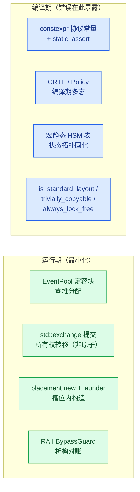
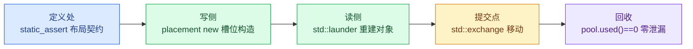

# 把一致性故障前置到编译期：ISP Pipeline 的 C++17 约束与指针治理

> `examples/isp_pipeline_demo.cpp` 是一个相机图像信号处理（ISP）流水线的可运行示例。本文说明该示例达到跨模块一致性所依赖的两类编程纪律：C++17 编译期约束与设计模式（第 3 章），指针与所有权治理（第 4 章）。正文仅引用编码规约（`docs/cpp_coding_conventions_zh.md`）的“四条基调”与少数红线作为总纲，不重复完整规约。

## 一、业务背景：一帧图像从传感器到输出

示例模拟一颗相机 ISP 芯片的帧处理流水线。传感器输入按 30 fps 节拍产生原始帧，像素数据写入 DDR 帧缓冲，随后依次经过五个处理阶段：

| 阶段 | 承担模块 | 职责 |
|---|---|---|
| 低/高增益 | `LowGainAo` / `HighGainAo` | 对同一原始帧分别计算两路增益结果 |
| 高低光融合 | `HlFuseAo` | 按 `frame_id` 配对两路结果后融合 |
| PIC 增强 / TEMP | `EnhanceAo` / `TempChainAo` | 两条下游处理链 |
| 打包与写回 | `VideoPackAo` | 打包并由写回通道写回 DDR |
| 封帧与输出 | `WrapeAo` / `MipiSinkAo` | USB Bulk / MIPI CSI 输出 |


*图 1：一帧图像的数据路径。像素始终留在 DDR，事件只携带帧号与槽位描述符。*

整条流水线由 14 个主动对象（Active Object，各自持有状态机与事件队列）与 7 个模拟 DMA/中断完成的 worker 协作。跨模块状态由三块“黑板”承载并隔离：硬件状态（倍率 / 选择位 / 输出帧长）、帧数据 DDR、寄存器镜像（shadow / hardware / 地址版本）。三者失效规则不同，因而各自独立管理，避免不同生命周期互相覆盖。

这一结构决定了本文的主题：当数据、配置与所有权在十余个模块之间流动时，一致性不能依赖约定，只能依赖编译期约束与所有权纪律。

## 二、为什么一致性必须前置到编译期

这类流水线中，代价最高的缺陷通常不是算法错误，而是一致性错误：一个结构体在生产侧与消费侧的布局不一致；一帧数据被错误配对；一个 DDR 槽位被两个模块同时写入；一次重配在旧几何与新几何之间留下歧义。这类缺陷的共同特征是——它们在常规路径下能够通过，仅在特定时序或特殊输入下才暴露，最终表现为图像异常或间歇性崩溃。

编码规约将处理方向归纳为四条基调（本文只引用这一小部分）：

| 基调 | 含义 |
|---|---|
| 编译期确定、运行期少分配 | 能在编译期定型的不放到运行期 |
| 零拷贝 | 目的地就地构造，所有权移动而非复制 |
| 低分支 | 以 `if constexpr` 与表驱动取代 if/else 链 |
| 边界清晰 | 每个跨模块结构体在定义处声明契约 |

由此得到核心主张：**把一致性假设尽量变成编译期错误**。规约层面，每条规则写成“可判定”形式（评审时回答是/否，不存在模糊表述）；工程层面，以 `constexpr`、`static_assert`、类型萃取、模板与表驱动，把运行期才会暴露的隐患前移到构建期必然失败的位置。

## 三、编译期约束：十三项纪律

纪律清单把示例的全部编译期约束与设计模式收进一张表：

| 约束 | 落点 | 检查方式 |
|---|---|---|
| 协议常量 constexpr | 帧字节数 / 恒等倍率步长 / 流有效计数 | `static_assert` 锁定文档证据值 |
| 布局约束 | `FrameGeometry` / `UvcMeta` / `FrameStamp` | `static_assert(is_standard_layout && is_trivially_copyable)` |
| 移动约束 | `FrameGeometry` 事务快照交换 | `static_assert(is_nothrow_move_constructible)` |
| 无锁假设 | DDR 环索引、运行标志 | `static_assert(atomic<T>::is_always_lock_free)` |
| 无堆热路径 | `EventPool` + `std::array` 定容块 | 全局无堆分配；运行期断言 `pool.used()==0` |
| placement new + std::launder | DDR 槽位 `FrameStamp`、地址缓存记录 | 生命周期在槽位内开始，`std::launder` 合法化访问 |
| CRTP | `GainNodeBase<Policy>` / `FusedNodeBase<Policy>` | 编译期多态，零虚函数开销 |
| 编译期策略 | `Policy::apply`、`QuiescePolicy` | `if constexpr` 路径选择，运行期零分支 |
| 命令模式 | `kIrscCmdSequence` 表 | 多步硬件初始化退化为表驱动 + 事件回执 |
| 宏静态 HSM 表 | `COACT_HSM_STATES` / `COACT_HSM_TRANS` | 状态/转移表编译期生成 |
| std::exchange 提交 | 几何提交、版本推进、槽位戳交换 | 读旧与写新一体、旧副本不留 |
| RAII | `BypassGuard` | 旁路配对由析构保证 |
| 接口标注 | 全接口 `[[nodiscard]]` / `noexcept` | 返回值不可忽略、动作函数不抛 |

表中每一项都对应一种运行期缺陷的编译期前置。以“布局约束”为例：跨 AO 边界的事件载荷一旦被当作字节流传递，就必须在定义处声明 `is_standard_layout && is_trivially_copyable`；违约即编译失败，而非等接收方读到错位字段后才暴露。“无锁假设”同理：`is_always_lock_free` 断言使 `std::atomic` 在目标平台回退到 libatomic（即隐藏的锁与堆依赖）时于构建期失败。



*图 2（蓝=编译期，绿=运行期）：工程纪律的分工——一致性假设尽量在编译期成为类型错误，运行期只保留无法编译化的少量动作。*

### 3.1 CRTP：编译期多态

低增益与高增益两路链共用 `GainNodeBase<Policy>` 骨架，变换策略经 CRTP 在编译期解析；公共帧路径（原始帧 → DDR → 策略变换 → DDR → 完成事件）只编写一次：

```cpp
template <typename Policy>
struct GainNodeBase {
    // Common frame path: DN -> DDR -> policy transform -> DDR -> done event.
    // Policy transform is resolved at compile time (if constexpr).
};
using LowGainNode  = GainNodeBase<LowGainPolicy>;
using HighGainNode = GainNodeBase<HighGainPolicy>;
```

CRTP 的收益是复用骨架并拒绝虚表：同一生命周期以模板参数分发策略，运行期不存在虚函数查找。它的红线同时约束使用范围——钩子面超过 7 个即表明骨架在过早推测未来需求，基类不得持有派生专属状态。

### 3.2 宏静态 HSM 表

```cpp
COACT_HSM_STATES(kIrscStates, IrscCtx, "Root", "Active");
COACT_HSM_TRANS(kIrscTransitions, IrscCtx, Sig::kIrscCmd, onIrscCmd);
```

重配 AO 是最完整的应用：`kRecfgStates`（Root + 7 个业务状态，8 表项）与 `kRecfgTransitions`（11 条弧——7 条业务弧 + 4 条吸收旧 `kRecfgStage` 的 stale 弧）均为 `inline const` 数组。转移动作与入口动作分离，硬件命令仅在入口动作发出；这一约束用于规避“在转移动作中自提交事件而与其拓扑竞争”的隐蔽竞态。

## 四、指针与所有权治理

边界清晰的另一半是指针治理。嵌入式 C++ 无法完全消除裸指针——硬件地址与 DMA 缓冲本质上就是内存位置。示例的做法是把裸指针压缩到三类不可替代的语义位，其余所有权表达全部现代化。

| 场景 | 示例 | 必须使用指针的原因 |
|---|---|---|
| 可空句柄 | `pool->alloc_typed()` 返回 `nullptr` 表示池耗尽 | 可空性是背压协议的一部分，引用无法表达 |
| 硬件/DMA 地址 | `FrameStamp*` 指向 DDR 槽位 | 物理内存位置，无引用语义可用 |
| 非拥有观察 | `ctx.pool` / `ctx.rt` 指向装配期绑定的单例 | 上下文默认构造后在装配期后绑定，指针可重置 |

其余场景使用引用、移动语义与静态策略：

```cpp
// 只读借用（DMA 语义）：const 指针，为文档化的硬件地址场景。
[[nodiscard]] uint16_t write(DdrId id, uint32_t frame_id, const uint8_t* src);

// 旧几何被移出，不留悬垂副本：std::exchange 实现移动提交。
active_geom = std::exchange(target_geom, FrameGeometry{});

// 缓存槽内原地构造：无临时对象、无拷贝，与事件池同一条纪律。
::new (static_cast<void*>(&rec)) AddrRecord{layout_version, addr, true};
```

治理规则四条：(1) 参数——只读小对象按值、大对象 `const&`、可空资源句柄才使用指针并在命名上暴露；(2) 返回——`[[nodiscard]]` 强制处理，可空结果返回指针并立即判空，这是唯一允许返回裸指针的位置；(3) 成员——AO 上下文中的 `PoolT*` / `Rt*` 是非拥有观察指针，生命周期由 `main()` 的栈序保证，与裸拥有的区别在注释与命名上显式声明；(4) 禁止指针算术——DDR 槽位访问经 `std::launder` 合法化，唯一的偏移运算（`slot_mem + kStampBytes`）封装在 `DdrCtx` 内部，外部只见 `read`/`write` 接口。


*图 3（黄=裸指针合法域，绿=现代所有权）：指针治理边界。裸指针只保留三个不可替代的语义位。*

## 五、纪律的红线与适用边界

纪律带来三项可验证的收益：一致性违约成为编译错误而非现场崩溃；所有权在类型层面单义；热路径零堆、零临时、零虚函数。

然而纪律本身存在红线，越过红线即“为用而用”：每个特性必须能回答“不用它会怎样”；出现第三处结构相似才允许抽出基类（两处时容忍重复）；CRTP 钩子面不得失控；`std::exchange` 仅用于“读旧 + 写新”一体的所有权交接，且是单线程前提下的表达、不提供线程安全；宏必须保持“表即数据”（只拼表项、不嵌入控制流）。

作为全文的收束，一条事件块从定义到回收的每一跳都有一项约束在前置把关：



*图 4：零拷贝通道上的边界约束。事件块从定义到回收的每一跳都有一项编译期或运行期断言在前置把关。*

---

*事实依据：`docs/example_ISP_pipeline_design_architecture_zh.md`（业务流程、模块职责、AO/worker/三块黑板）、`docs/example_ISP_pipeline_cpp_discipline_zh.md`（十三项约束清单、CRTP / 宏 HSM 片段、指针治理）、`docs/cpp_coding_conventions_zh.md` 第 1.3 节四条基调与第 5.9 节、第 6 章的红线（少量引用）；落点取自 `examples/isp_pipeline_demo.cpp`。*
