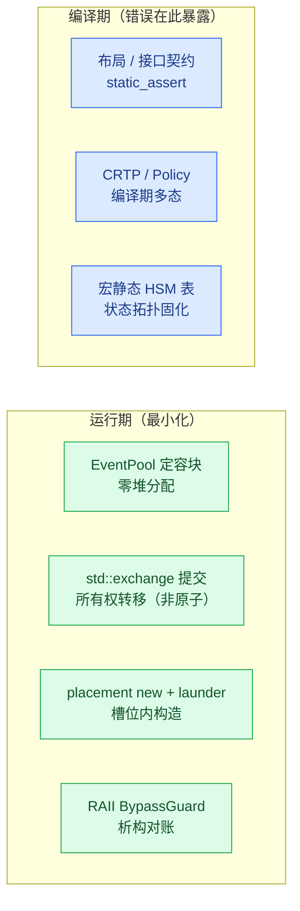
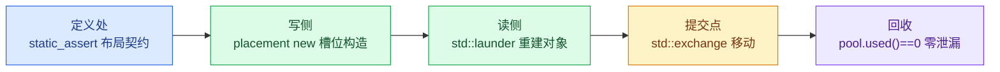

# 把一致性故障前置到编译期：ISP Pipeline 的 C++17 约束与指针治理

> `examples/isp_pipeline_demo.cpp` 是一个相机图像信号处理（ISP）流水线的可运行示例。本文说明该示例达到跨模块一致性所依赖的两类编程约束：C++17 编译期约束与设计模式（第 3 章），指针与所有权治理（第 4 章）。正文仅引用编码规约（`docs/cpp_coding_conventions_zh.md`）的“四条基调”与少数红线作为总纲，不重复完整规约。

## 一、业务背景：一帧图像从传感器到输出

示例模拟一颗相机 ISP 芯片的帧处理流水线。传感器输入按 30 fps 节拍产生原始帧，像素数据写入 DDR 帧缓冲，随后依次经过五个处理阶段：

| 阶段 | 承担模块 | 职责 |
|---|---|---|
| 低/高增益 | `LowGainAo` / `HighGainAo` | 对同一原始帧分别计算两路增益结果 |
| 高低光融合 | `HlFuseAo` | 按 `frame_id` 配对两路结果后融合 |
| PIC 增强 / TEMP | `EnhanceAo` / `TempChainAo` | 两条下游处理链 |
| 打包与写回 | `VideoPackAo` | 打包并由写回通道写回 DDR |
| 封帧与输出 | `WrapeAo` / `MipiSinkAo` | USB Bulk / MIPI CSI 输出 |


*图 1：一帧图像的数据路径。像素始终留在 DDR，事件只携带帧号与槽位描述符。*

整条流水线由 14 个主动对象（Active Object，各自持有状态机与事件队列）与 7 个模拟 DMA/中断完成的 worker 协作。跨模块状态由三块“黑板”承载并隔离：硬件状态（倍率 / 选择位 / 输出帧长）、帧数据 DDR、寄存器镜像（shadow / hardware / 地址版本）。三者失效规则不同，因而各自独立管理，避免不同生命周期互相覆盖。

这一结构决定了本文的主题：当数据、配置与所有权在十余个模块之间流动时，一致性不能依赖约定，只能依赖编译期约束与所有权治理。

## 二、为何一致性必须前置到编译期

这类流水线中，代价最高的缺陷通常不是算法错误，而是一致性错误：一个结构体在生产侧与消费侧的布局不一致；一帧数据被错误配对；一个 DDR 槽位被两个模块同时写入；一次重配在旧几何与新几何之间留下歧义。这类缺陷的共同特征是——它们在常规路径下能够通过，仅在特定时序或特殊输入下才暴露，最终表现为图像异常或间歇性崩溃。

编码规约将处理方向归纳为四条基调（本文只引用这一小部分）：

| 基调 | 含义 |
|---|---|
| 编译期确定、运行期少分配 | 能在编译期定型的不放到运行期 |
| 零拷贝 | 目的地就地构造，所有权移动而非复制 |
| 低分支 | 以 `if constexpr` 与表驱动取代 if/else 链 |
| 边界清晰 | 每个跨模块结构体在定义处声明契约 |

由此得到核心主张：**把一致性假设尽量变成编译期错误**。规约层面，每条规则写成“可判定”形式（评审时回答是/否，不存在模糊表述）；工程层面，以 `constexpr`、`static_assert`、类型萃取、模板与表驱动，把运行期才会暴露的隐患前移到构建期必然失败的位置。

## 三、一致性约束的三类机制

把第二章的目标落到代码，示例的一致性约束可归为三类：布局与接口契约、编译期多态与表驱动、所有权与生命周期。它们分别回答三个问题——跨模块传递什么、行为如何表达、内存由谁负责。

### 3.1 布局与接口契约：让跨模块字节流有合同

多个 AO 之间传递的事件载荷本质是字节流。一旦 `FrameGeometry` 在封帧侧与接收侧的布局不一致，或一次重配在旧几何与新几何之间留下歧义，帧长就会错位，表现为提前 EOF 或首帧尺寸错误。示例在结构体定义处用类型萃取把契约固定下来：

```cpp
static_assert(std::is_standard_layout_v<FrameGeometry>);
static_assert(std::is_trivially_copyable_v<FrameGeometry>);
static_assert(std::is_nothrow_move_constructible_v<FrameGeometry>);
```

`is_standard_layout` 保证内存布局可预测；`is_trivially_copyable` 保证结构体可按位表示、跨边界传输；`is_nothrow_move_constructible` 保证重配提交或回滚路径不抛出。三者任一违约都在构建期失败，而不是等接收方读到错位字段后延迟暴露。

同一类契约还包括三项：(1) 无锁假设——跨线程标志断言 `std::atomic<T>::is_always_lock_free`，否则 `std::atomic` 在部分目标会回退到 libatomic，即一条隐藏的锁与堆依赖；(2) 协议常量——帧字节数、恒等倍率步长、流有效计数以 `constexpr` 定值，并以 `static_assert` 对齐文档证据值，避免代码与文档各持一套数；(3) 接口标注——`[[nodiscard]]` 保证返回值不可忽略，`noexcept` 保证动作函数不抛。

### 3.2 编译期多态与表驱动：把行为与拓扑变成数据

帧流水线的公共路径只有一条，但两条增益链与两条处理链的变换各不相同。差异不在运行期以虚函数或分支区分，而在编译期解析：

```cpp
template <typename Policy>
struct GainNodeBase {
    // 公共帧路径：原始帧 → DDR → 策略变换 → DDR → 完成事件。
    // 策略变换在编译期按 Policy 解析（if constexpr）。
};
using LowGainNode  = GainNodeBase<LowGainPolicy>;
using HighGainNode = GainNodeBase<HighGainPolicy>;
```

CRTP 使 `LowGainNode` 与 `HighGainNode` 共用同一骨架却无虚表开销；`Policy::apply` 以无状态策略表达单点可替换算法，`if constexpr` 不实例化未选分支。

状态拓扑同样固化为数据。十余个 AO 的状态表与转移表由 `COACT_HSM_STATES` / `COACT_HSM_TRANS` 在编译期生成 `constexpr` 数组，运行期零装配。以重配 AO 为例：`kRecfgStates` 为 Root 加 7 个业务状态，`kRecfgTransitions` 为 11 条弧（含 4 条吸收旧阶段的 stale 弧）。转移动作与入口动作分离，硬件命令只在入口动作发出，从而规避“在转移动作中自提交事件而与其拓扑竞争”的隐蔽竞态。多步硬件初始化同样退化为 `kIrscCmdSequence` 命令表，顺序即约定，编排器只统计回执并向上传递结果。

### 3.3 所有权与生命周期：让内存责任单义

DDR 槽位、事件池块与地址缓存槽都是复用内存。写入帧戳用 placement new 在目的地就地构造，读取用 `std::launder` 重建“指针—对象”关系，全程零拷贝且不触发未定义行为：

```cpp
::new (static_cast<void*>(slot_mem)) FrameStamp{...};               // 写：槽内构造
*std::launder(reinterpret_cast<const FrameStamp*>(slot));           // 读：重建对象
```

跨窗口的所有权交接以 `std::exchange` 表达“读旧 + 写新”一体——旧值被移出、不留副本。重配提交 `active_geom = std::exchange(target_geom, FrameGeometry{})` 即其一例；须注意它是单线程前提下的表达，并不提供线程安全。事件块来自定容 `EventPool`（`std::array` 存储），热路径零堆分配。成对操作由 RAII 承保：`BypassGuard` 进入即置位、析构即 resync，任何提前 return 都不会漏掉对账。



*图 2（蓝=编译期，绿=运行期）：一致性约束的分工——可静态判定的部分前移到编译期，运行期只保留无法编译化的少量动作。*

## 四、指针与所有权治理

边界清晰的另一半是指针治理。嵌入式 C++ 无法完全消除裸指针——硬件地址与 DMA 缓冲本质上就是内存位置。示例的做法是把裸指针压缩到三类不可替代的语义位，其余所有权表达全部现代化。

| 场景 | 示例 | 必须使用指针的原因 |
|---|---|---|
| 可空句柄 | `pool->alloc_typed()` 返回 `nullptr` 表示池耗尽 | 可空性是背压协议的一部分，引用无法表达 |
| 硬件/DMA 地址 | `FrameStamp*` 指向 DDR 槽位 | 物理内存位置，无引用语义可用 |
| 非拥有观察 | `ctx.pool` / `ctx.rt` 指向装配期绑定的单例 | 上下文默认构造后在装配期后绑定，指针可重置 |

其余场景使用引用、移动语义与静态策略：

```cpp
// 只读借用（DMA 语义）：const 指针，为文档化的硬件地址场景。
[[nodiscard]] uint16_t write(DdrId id, uint32_t frame_id, const uint8_t* src);

// 旧几何被移出，不留悬垂副本：std::exchange 实现移动提交。
active_geom = std::exchange(target_geom, FrameGeometry{});

// 缓存槽内原地构造：无临时对象、无拷贝，与事件池同一项约束。
::new (static_cast<void*>(&rec)) AddrRecord{layout_version, addr, true};
```

治理规则四条：(1) 参数——只读小对象按值、大对象 `const&`、可空资源句柄才使用指针并在命名上暴露；(2) 返回——`[[nodiscard]]` 强制处理，可空结果返回指针并立即判空，这是唯一允许返回裸指针的位置；(3) 成员——AO 上下文中的 `PoolT*` / `Rt*` 是非拥有观察指针，生命周期由 `main()` 的栈序保证，与裸拥有的区别在注释与命名上显式声明；(4) 禁止指针算术——DDR 槽位访问经 `std::launder` 合法化，唯一的偏移运算（`slot_mem + kStampBytes`）封装在 `DdrCtx` 内部，外部只见 `read`/`write` 接口。


*图 3（黄=裸指针合法域，绿=现代所有权）：指针治理边界。裸指针只保留三个不可替代的语义位。*

## 五、约束的红线与适用边界

约束带来三项可验证的收益：一致性违约成为编译错误而非现场崩溃；所有权在类型层面单义；热路径零堆、零临时、零虚函数。

然而约束本身存在红线，越过红线即“为用而用”：每个特性必须能回答“不用它会怎样”；出现第三处结构相似才允许抽出基类（两处时容忍重复）；CRTP 钩子面不得失控；`std::exchange` 仅用于“读旧 + 写新”一体的所有权交接，且是单线程前提下的表达、不提供线程安全；宏必须保持“表即数据”（只拼表项、不嵌入控制流）。

最后，一条事件块从定义到回收的每一跳，都有一项约束在前置把关：



*图 4：零拷贝通道上的边界约束。事件块从定义到回收的每一跳都有一项编译期或运行期断言在前置把关。*
