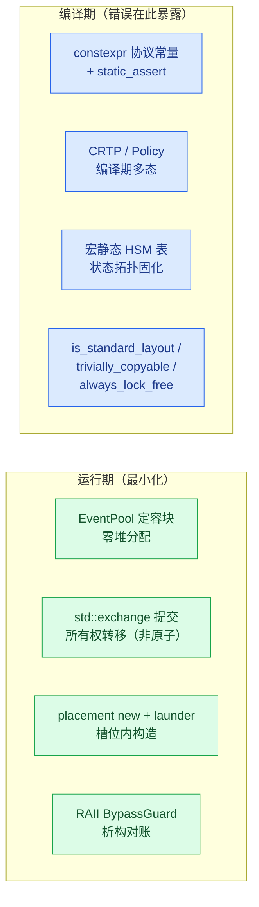
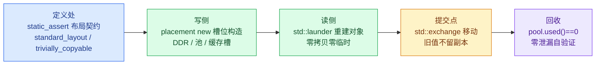

# 把运行期错误变成编译期错误：ISP Pipeline 的 C++17 约束与指针治理

> 一致性故障的根治不是“运行期多检查”，而是把假设前置到类型层面，让违约在构建期失败。本文以 `examples/isp_pipeline_demo.cpp` 的编程纪律文档（`docs/example_ISP_pipeline_cpp_discipline_zh.md`）为主，说明两类纪律——C++17 编译期约束与设计模式、指针与所有权治理——如何实现这一点。全文仅引用编码规约（`docs/cpp_coding_conventions_zh.md`）四条基调与少数红线作为总纲，不在博客内重复完整规约。

## 一、为什么把纪律写成约束

嵌入式软件中代价最高的一类错误不是逻辑错误，而是一致性错误：一个结构体在一个模块里是 12 字节、在另一个模块里是 16 字节；一个标志跨线程后不再是原子的；一次所有权转移之后旧副本残留。这些错误的共同点是能够在运行期偶然通过，最终以数据损坏、花屏、偶发挂死的形式暴露。

编码规约用四条基调给出处理方向，本文只取这部分作为总纲：

| 基调 | 含义 |
|---|---|
| 编译期确定、运行期少分配 | 能在编译期定型的不放到运行期 |
| 零拷贝 | 目的地就地构造，所有权移动而非复制 |
| 低分支 | 以 `if constexpr` 与表驱动取代 if/else 链 |
| 边界清晰 | 每个跨模块结构体在定义处声明契约 |

核心主张是：**把一致性假设尽量变成编译期错误**。规约层面把每条规则写成可判定形式（评审时对每条回答是/否）；工程层面则用 `constexpr`、`static_assert`、类型萃取、模板与表驱动，把运行期才会暴露的隐患挪到构建期必然失败的位置。

## 二、十三项编译期约束

纪律清单把示例工程的全部编译期约束与设计模式收进一张表。

| 约束 | 落点 | 检查方式 |
|---|---|---|
| 协议常量 constexpr | 帧字节数 / 恒等 Zoom 步长 / streamVldNum | `static_assert` 锁定文档证据值 |
| 布局约束 | `FrameGeometry` / `UvcMeta` / `FrameStamp` | `static_assert(is_standard_layout && is_trivially_copyable)` |
| 移动约束 | `FrameGeometry` 事务快照交换 | `static_assert(is_nothrow_move_constructible)` |
| 无锁假设 | DDR 环索引、运行标志 | `static_assert(atomic<T>::is_always_lock_free)` |
| 无堆热路径 | `EventPool` + `std::array` 定容块 | 全局无堆分配；运行期断言 `pool.used()==0` |
| placement new + std::launder | DDR 槽位 `FrameStamp`、地址缓存记录 | 生命周期在槽位内存内开始，`std::launder` 合法化访问 |
| CRTP | `GainNodeBase<Policy>` / `FusedNodeBase<Policy>` | 编译期多态，零虚函数开销 |
| 编译期策略 | `Policy::apply`、`QuiescePolicy` | `if constexpr` 路径选择，运行期零分支 |
| 命令模式 | `kIrscCmdSequence` 表 | 多步硬件初始化退化为表驱动 + 事件回执 |
| 宏静态 HSM 表 | `COACT_HSM_STATES` / `COACT_HSM_TRANS` | 状态/转移表全部编译期生成 |
| std::exchange 提交 | 几何提交、版本推进、槽位戳交换 | 读旧与写新一步完成、旧副本不留 |
| RAII | `BypassGuard` | 旁路配对由析构保证 |
| 接口标注 | 全接口 `[[nodiscard]]` / `noexcept` | 返回值不可忽略，动作函数不抛 |

表中每一项都是“一个运行期故障类别”的前置表达。布局约束那行针对“跨 AO 边界结构体被当成字节流”这一危险动作；无锁假设那行针对 `std::atomic` 回退到 libatomic 的隐藏锁/堆依赖，断言让这种回退在构建期失败，而非在 100 MHz 目标上引入一个不可见的锁。

图 1 把这份纪律按编译期 / 运行期二分。



*图 1（蓝=编译期，绿=运行期）：工程纪律的分工——一致性假设尽量在编译期变成类型错误，运行期只留无法编译化的少量动作。*

## 三、两个代表性机制

### 3.1 CRTP：编译期多态的骨架复用

高低增益链共用同一套 `GainNodeBase<Policy>` 骨架，变换策略经 CRTP 在编译期解析；公共帧路径（DN → DDR → 策略变换 → DDR → 完成事件）只写一遍：

```cpp
template <typename Policy>
struct GainNodeBase {
    // Common frame path: DN -> DDR -> policy transform -> DDR -> done event.
    // Policy transform is compile-time dispatch (if constexpr).
};
using LowGainNode  = GainNodeBase<LowGainPolicy>;
using HighGainNode = GainNodeBase<HighGainPolicy>;
```

CRTP 的价值在于复用骨架、拒绝 vtable：同一生命周期用模板参数分发策略，运行期没有虚函数查找。规约的红线同时约束它——钩子面超过 7 个说明骨架在臆测未来，基类不得持有派生专属状态。它也是“三条相似才抽基类”原则的落点：不是所有复用都需要抽象，出现第三处结构相似才允许抽出骨架。

### 3.2 宏静态 HSM 表：状态拓扑编译期固化

```cpp
COACT_HSM_STATES(kIrscStates, IrscCtx, "Root", "Active");
COACT_HSM_TRANS(kIrscTransitions, IrscCtx, Sig::kIrscCmd, onIrscCmd);
```

重配 AO 是最完整的应用：`kRecfgStates`（Root + 7 个业务状态，8 表项）与 `kRecfgTransitions`（11 条弧——7 条业务弧 + 4 条吸收旧 `kRecfgStage` 的 stale 弧）全部为 `inline const` 数组。转移动作与入口动作分离，硬件命令只在入口动作发出——这一条专治“transition action 自提交事件与拓扑竞争”的隐蔽竞态。

## 四、指针与所有权治理

“边界清晰”的另一半是指针治理。嵌入式 C++ 无法完全消灭裸指针（硬件地址、DMA 缓冲本质上就是内存位置），但示例把裸指针压缩到三类合法场景，其余全部用引用、移动语义与静态策略表达。

### 4.1 裸指针的三类合法保留

| 场景 | 示例 | 为什么必须是指针 |
|---|---|---|
| 可空句柄 | `pool->alloc_typed()` 返回 `nullptr` 表示池耗尽 | 可空性是背压协议的一部分，引用无法表达 |
| 硬件/DMA 地址 | `FrameStamp*` 指向 DDR 槽位 | 物理内存位置，无引用语义可用 |
| 非拥有观察 | `ctx.pool` / `ctx.rt` 指向装配期绑定的单例 | AO 上下文默认构造 + 后绑定，指针可重置 |

### 4.2 其余所有权的现代化表达

```cpp
// 只读借用（DMA 语义）：const 指针，为文档化的硬件地址场景。
[[nodiscard]] uint16_t write(DdrId id, uint32_t frame_id, const uint8_t* src);

// 旧几何被移出，不留悬垂副本：std::exchange 实现移动提交。
active_geom = std::exchange(target_geom, FrameGeometry{});

// 缓存槽内原地构造：无临时、无拷贝，与事件池同一纪律。
::new (static_cast<void*>(&rec)) AddrRecord{layout_version, addr, true};
```

四条治理规则：(1) 参数——只读小对象按值、大对象 `const&`、可空资源句柄才用指针并在命名上暴露；(2) 返回——`[[nodiscard]]` 强制调用方处理，可空结果返回指针并立即判空，这是唯一允许“裸”返回的位置；(3) 成员——AO 上下文里的 `PoolT*` / `Rt*` 是非拥有观察指针，生命周期由 `main()` 的栈序保证，与裸拥有的区别在注释与命名上显式声明；(4) 禁止指针算术——DDR 槽位访问经 `std::launder` 合法化，唯一的偏移运算（`slot_mem + kStampBytes`）封装在 `DdrCtx` 内部，外部只见 `read`/`write` 接口。

图 2 画出这条边界。


*图 2（黄=裸指针合法域，绿=现代所有权）：指针治理边界。裸指针只保留三个不可替代的语义位，其余所有权表达全部现代化。*

## 五、收益与红线

纪律换来三项收益：一致性违约变成编译错误而非现场崩溃；所有权在类型层面单义，谁拥有、谁只观察不再靠注释猜测；热路径零堆、零临时、零虚函数。

纪律本身有红线，否则就是“为用而用”：每个特性必须能回答“不用它会怎样”；三处相似才抽基类（两处时容忍重复）；CRTP 钩子面不得失控；`std::exchange` 只用于“读旧 + 写新”一体的所有权交接，且它是单线程前提下的表达、不提供线程安全；宏只能“表即数据”（拼表项、不嵌控制流）。

图 3 用一条事件块的生命周期收束全文——每个边界处都有一项约束在前置把关。



*图 3：零拷贝通道上的边界约束。事件块从定义到回收的每一跳，都有一项编译期或运行期断言在前置把关。*

---

*事实依据：`docs/example_ISP_pipeline_cpp_discipline_zh.md`（十三项约束清单、CRTP / 宏 HSM 片段、指针治理与图 1/图 2）；`docs/cpp_coding_conventions_zh.md` 第 1.3 节四条基调、第 5.9 节与第 6 章的红线（少量引用）；落点取自 `examples/isp_pipeline_demo.cpp`。*
