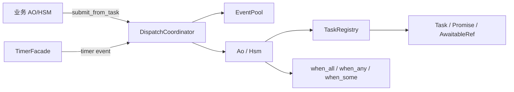

# coact::coro 使用说明（C++17 / 嵌入式 Linux）

计划原命名空间是 `coact::async`。落地时范围收窄为「单 pthread + 固定槽位任务 + 可选 ucontext 协作层」，公共入口改为 `coact::coro`。不要再创建 `include/coact/async/`。

## 1. 定位

`coact::coro` 把异步完成变成 AO/HSM 事件：任务是固定槽位，完成时向 `TargetId` 投递 `CompletionBlock`。顺序逻辑写在状态表里，不在 action 里用手写变量模拟隐式协程。



## 2. 头文件

公共入口：`#include "coact/coro/coro.hpp"`。

| 头文件 | 职责 |
|---|---|
| `config.hpp` / `error.hpp` / `task_id.hpp` | 容量、错误码、`TaskId` |
| `detail/fixed_storage.hpp` / `detail/task_slot.hpp` | 对齐字节存储与槽位 |
| `task_registry.hpp` / `task.hpp` / `awaitable.hpp` | 注册表、句柄、完成事件解码 |
| `combinators.hpp` | 固定容量 `when_all` / `when_any` / `when_some` |
| `scheduler.hpp` | `TimerFacade`，测试用 `ManualTickSource` + `poll()` |
| `posix.hpp` | Linux 有栈协程执行器（opt-in，不进 `coro.hpp`） |

硬约束：C++17、无异常、无 `<coroutine>`、无运行期堆、结果类型必须平凡可拷贝/可析构。

## 3. 最小用法

```cpp
using PoolT = coact::EventPool<32U, 64U>;
using Rt = coact::Runtime<coact::DefaultConfig, coact::pal::Posix>;
using Reg = coact::coro::TaskRegistry<uint32_t, PoolT, Rt::CoordinatorType, 8U>;

Reg reg(pool, rt.coordinator());
auto created = reg.create(coact::TargetId(1U), kDone, qos);
auto pair = std::move(created.value());
(void)pair.promise.complete(42U);   // 向 AO 投递完成事件
auto value = reg.take_result(pair.task.id());
(void)pair.task.release();          // used() -> 0
```

暂停点 = HSM 弧：`Idle --kStart--> Wait --kDone--> Done`。`kDone` 由 `decode_completion(event)` 读出状态。拒绝弧显式写在转移表里并计数。

定时：生产用 `TimerFacade<..., SteadyTickSource>` 的 `start()`；单线程/测试用 `ManualTickSource`，`advance()` 后 `poll()`，禁止固定 sleep 赌时序。

## 4. 从旧 CppAsync 迁移

| 旧调用 | coact::coro |
|---|---|
| `ut::Task` / Promise 回调 | `Task` + `Promise`，完成走事件 |
| 宏暂停点 / `<coroutine>` | HSM 状态或转移弧 |
| `when_all` 动态容器 | 固定容量 `TaskGroup`，位图 `uint32_t` |
| 异常 / `exception_ptr` | `Expected<T, TaskError>` |
| 运行期堆任务 | 调用方提供的 `std::array`/静态存储 + 固定 `Capacity` |

## 5. 构建与门禁

```bash
cmake -S . -B build && cmake --build build -j12
ctest --test-dir build -R 'coro|coact_coro' --output-on-failure
```

相关测试：`test_coro_registry`、`test_coro_combinators`、`test_coro_posix`、`test_coro_awaitable`、`test_coro_scheduler`、`test_coro_integration`。示例：`examples/coact_coro_demo`、`examples/coact_coro_posix`。退出前断言 `pool.used() == 0U`。

源码门禁（仅扫 coro 落点，避免误伤 isp_pipeline 演示代码）：

```bash
rg -n '\but::|exception_ptr|#include <coroutine>' include/coact/coro src/core/test_coro_*.cpp examples/coact_coro_*.cpp
```
