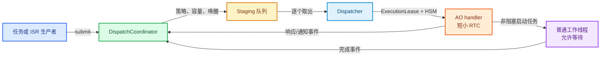

# coact 框架优化设计

> **文档定位**：本文档描述 coact 框架自身的优化，不针对某一个业务模块。业务中的 NAND、DMA、USB 等设备只作为验证场景。优化不改变 coact 的静态池、HSM、TargetId 和 PAL 基本模型。

## 1. 优化目标

优化目标是明确三条边界：

- AO handler 负责短小、可测量的状态转换。
- Dispatcher 负责事件路由和 AO 执行权管理。
- 普通工作线程负责不可避免的阻塞操作，再通过事件返回结果。

## 2. 现有机制与限制

coact 的排队事件由 Dispatcher 逐个取出，再调用目标 AO 的 HSM。

`ExecutionLease` 使用原子 CAS 管理 `Idle`、`RunningDispatcher` 和 `RunningDirect`。该租约保证同一 AO 同时只有一个执行者，并检测非法重入。

任务上下文可以通过 `submit_from_task()` 走直派路径，跳过队列。直派适合短小 handler，但可能在调用方线程中同步执行目标 AO。

`kRtcBudgetNs` 只用于记录和统计超时；coact 不能从外部中断正在执行的 C++ handler。因此，RTC 是 coact 的执行协议和应用约束，不是框架可以完全强制的时间片。

**已修复的限制**（本轮实现，见 §4 状态标注）：

- Dispatcher 线程上的 handler 提交事件给另一个 lease 空闲的 AO 时，曾在同一线程内联执行嵌套 RTC（串行化被绕过、栈深无界）。
- handler 永久阻塞时 Dispatcher 卡死在派发调用内，熔断永不触发，外部无从发现。

## 3. 推荐拓扑

AO handler 启动任务后立即返回，工作线程可以调用阻塞 API 或执行 `rt_thread_mdelay()`。

工作线程不注册为 AO，不持有 AO 执行租约，也不直接修改 AO 上下文。

## 4. 框架优化项

### 4.1 增加仅入队提交【已实现】

新增 `submit_queued_from_task()`，复用目标查找、事件所有权、队列容量和唤醒逻辑。

该接口跳过 `dispatch_direct()`，保证 AO 到 AO 的协作始终通过事件队列完成。

保留现有 `submit_from_task()`，供明确声明短小且允许直派的低延迟场景使用。

当调用发生在 Dispatcher 上下文时，框架自动选择仅入队路径，避免嵌套派发。

**实现状态**：`submit_internal` 以 `force_staging` 参数统一实现；直派条件加入 `!PalT::in_dispatcher_thread()`，Dispatcher 线程上的提交一律走 staging（嵌套直派防护）。测试 `coordinator_dispatcher_context_forces_staging` 等 4 个用例覆盖。

### 4.2 明确 AO RTC 契约【已实现】

在 `Ao` 和 `Traits` 的接口文档中明确：handler 不得等待信号量、事件、设备完成或固定延时。

框架继续测量 handler 耗时，并将超时交给 `Monitor` 和 `Breaker` 统计。

对持续超时的 AO，可以撤销直派、限制其事件或进入隔离状态。

永久阻塞不能由同一个 Dispatcher 自己恢复，应由外部 watchdog 或独立线程检测。

**实现状态**：L1（撤销 direct）/L2（隔离慢 AO）已在 Breaker 落地；外部检测经 Dispatcher 心跳实现（见下）。Dispatcher 批循环每迭代调用 `pal_.watchdog_progress()`，PAL 提供 `dispatcher_alive_within(window_ms)` 查询，外部 watchdog 线程据此发现永久阻塞。挂死注入测试 `dispatcher_hang_is_externally_detectable` 以消融法验证。窗宽契约见 `pal.hpp`：`window_ms >= kBatchSizeMax × max(RTC budget) + kBatchTimeoutMs + margin`。

### 4.3 统一普通工作线程交接【示例即活规范】

coact 不新增动态 Worker 工厂，只规定普通工作线程与 AO 的交接协议。

工作线程使用静态单槽或固定容量浅环；槽位已占用时返回 `Busy` 或 `RejectedFull`。

请求数据必须在提交前复制到固定缓冲区，不能保存调用方临时指针。

完成事件至少携带操作序号和结果码，AO 只接受匹配当前状态的完成事件。

工作线程完成后使用 `submit_from_task()` 或 `try_submit_from_isr()` 返回 coact 事件。

**参照实现**（demo 即活规范，不提供框架级 Worker 抽象）：`examples/isp_pipeline/isp_chain.hpp` 的 IspIrqWorker 交接——`request_irq`（申请侧，isp_chain.hpp:526-549）把 `IoMeta` 业务描述符存入固定容量 parking ring（:477-490）；完成中断 `complete_irq`（:573-604）按 `frame_id` 匹配 parked 条目，只接受匹配当前请求的完成事件，陈旧完成计数丢弃（stale）；FIFO 溢出时清 parked 集（:618-629）。7 个 worker 均按此模式用 `coordinator().submit_from_task()` 回投完成事件。

**应用层事件暂存/丢弃策略**：状态未就绪时的应用层事件处理有两种已验证模式——吸收弧丢弃（demo `RecfgOrchAo` 的 4 条 stale `kRecfgStage` Internal 空弧：guard 只放行当前事务最近一次自驱，陈旧事件被无操作吸收）或应用侧暂存描述符（上述 parking ring 模式）。coact 不提供框架级 defer/recall（决议见 §6）。

### 4.4 强化事件生命周期【已实现】

所有跨 AO 数据继续使用 `EventBlockLayout`、`alloc_typed()` 和 `event_gc()`。

事件提交后，生产者不得继续访问事件内存。

大数据使用固定 buffer pool 和确认归还，不暴露 AO 私有可变缓存。

通知事件应区分"必须送达"和"允许丢弃"两类，并在监控中分别计数。

**实现状态**：生命周期三方契约（pool → staging → Dispatcher final release）已落地，stop drain 逐事件释放恰好一次（`event pool fully reclaimed` 断言）。送达分类经 `EventQos{critical, mergeable}` + 三态丢弃原因（`DroppedOverload/RateLimit/Policy`）实现：critical 事件豁免 L2 隔离丢弃（demo 的 boot/stop 命令依赖此语义）；`mergeable` 为 v1 预留，合并未实现。

## 5. 实施顺序与验收

第一阶段只增加仅入队提交接口和 Dispatcher 上下文判断，不改变现有默认直派行为。【已完成】

第二阶段在示例和测试中统一使用固定槽位工作线程，覆盖忙拒绝、超时和完成事件序号匹配。【已完成：demo 7 worker 全按此模式，ctest 覆盖】

第三阶段增加外部 Dispatcher 心跳监控，验证永久阻塞能够被发现而不是静默卡死。【已完成：dispatcher_alive_within + 挂死注入测试】

第四阶段检查所有 AO 间通知、响应和定时事件的事件所有权与回收路径。【已完成：event pool fully reclaimed 断言】

验收必须满足：

- 一个 AO 同时最多一个执行者，重入触发断言或显式拒绝。【达成】
- AO handler 超时可被记录，直派路径可被撤销。【达成：Breaker L1/L2】
- 工作线程阻塞不会阻塞 Dispatcher。【达成】
- AO 间协作可以强制走队列，不发生嵌套派发。【达成：in_dispatcher_thread 护栏 + submit_queued_from_task】
- 队列满、池耗尽、Worker 忙和超时都有可观测结果。【达成：RejectedFull + Monitor/Breaker 计数】
- 停止 Runtime 后所有动态事件最终回收到 `used()==0`。【达成】

## 6. QP/C++ 参考决议

评估 QP/C++ 8.1.5（机制对比参考，GPL/商业双许可，绝不复制实现）后的采纳结论：

| 机制 | 决议 | 理由 |
|---|---|---|
| defer/recall（应用层延迟重放） | 不采纳 | demo 吸收弧语义是"丢弃"非"延迟"；parking ring 暂存 IoMeta 业务描述符而非 Event，框架化覆盖不了真实需求；defer 会在 pool/staging/Dispatcher 三方契约外引入第四方事件归属，须重写 stop drain 与生命周期文档——换表达不消复杂度 |
| postLIFO（队头投递） | 不做 | defer 不采纳则无承载场景；staging 加 head 插槽会破坏 batch_used 计数与 ReclaimBatcher 批内不变式 |
| publish/subscribe 订阅表 | 不做 | 与 demo 显式 TargetId 编排冲突，引入第二套事件路由 |
| margin posting（余量保证投递） | 不做 | coact 已有 `RejectedFull` + `event_gc` 等价物 |
| 单线程事件循环（QV 式 get_/dispatch） | 已等效 | Dispatcher 批循环即同构实现，附带三分区优先级与老化 |
