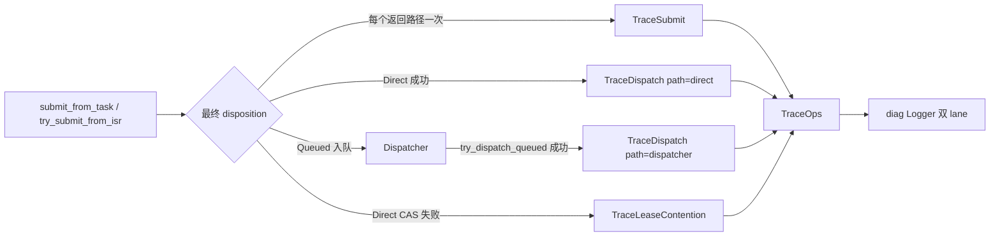

# coact 软追踪（Trace）方案

## 结论先行

T0~T2 **已实现并合入主线**（2026-09-04）：

1. core 与 diag 之间的回调契约 `coact::TraceOps`（include/coact/monitor.hpp）已落地；core 不 include `coact/diag/log.hpp`，埋点经 `Monitor::trace_submit/trace_dispatch/trace_lease_contention` 转发，未 bind 时 no-op。
2. `COACT_TRACE` 编译期开关已落地（monitor.hpp 顶部，默认 0）：关闭时 `COACT_TRACE_POINT` 展开为空，采样、参数打包与回调调用全部编译消除。
3. 三类记录已埋点：submit（7 条返回路径、`from_isr` 标识直达 sink）、dispatch（direct path=0 / dispatcher path=1，含 timeout）、lease 竞争失败（kind 0/1 + 实测耗时）。Queued 成功路径在 `enqueue()` 前缓存 `signal`，规避事件所有权转移后的生命周期竞态。
4. ISP demo 已绑定（examples/isp_pipeline/common.hpp 的 `DiagTrace`，EventId 保留区 `0x0100`~`0x0102`），demo 输出可见 `e=256/257`；`rt.monitor().bind_trace()` 在 Runtime 构造后、首次 submit 前调用。
5. T3（二进制导出封装 + 离线解码）与 QSpy 兼容**另行立项**，当前仅 stdout/raw-hex 消费。

## 1. 已核实的现状

| 能力 | 代码事实 | 对本方案的影响 |
|---|---|---|
| 记录格式 | `coact::diag::LogRecord` 为 24 字节：`counter`、`event_id`、`source_id`、4 个 `uint32_t` 参数（`include/coact/diag/log.hpp`） | 最多携带 4 个参数；不能把完整 64 位时间戳塞入记录 |
| 记录入口 | `Logger::record()` 与 `record_from_isr()`；RT-Thread 适配器提供 `record_from_task()`/`record_from_isr()` | 任务和 ISR 必须分别走对应入口 |
| 队列 | Logger 自有 critical/normal 两个静态 `DiagRing`；Error 进入 critical，其余等级进入 normal；Debug/Info 还有水位门控 | Trace 可能因水位或队列满而丢失，不能宣称无损 |
| 时间 | diag 只保存 `LogClockOps::read_counter()` 返回的 32 位原始计数；`frequency_hz` 只是换算元数据 | writer 不会自动生成纳秒，也不会自动扩展回绕 epoch |
| PAL 时钟 | `Pal::monotonic_ns()` 可提供扩展后的 64 位纳秒值；RT-Thread PAL 会在 PAL 层扩展窄计数器回绕 | 该值用于运行时耗时测量，但当前 diag 入口只读取 32 位 counter，epoch 不会进入 `LogRecord` |
| 消费端 | `LogRtThread` 以静态 writer 线程渲染；默认 `RawHexPolicy` 输出 `[counter] e=... s=... a0=...`，其中 `s` 是 `source_id` | demo 输出是 raw-hex，不应验收为固定的 `[trace]` 文本前缀 |
| 事件目录 | `LogCatalog` 只是可注入的数据结构；ISP demo 自己定义 `LogEvt`（`kEvtHsmTrace=12` 等） | 没有全仓库共享的 EventId 注册表，不能直接声称“在 diag catalog 中新增” |
| 提交接口 | coordinator 只有目标 `TargetId`，没有来源 AO 参数；`Event` 提供 `signal` | submit 的来源只能记为未知/调用方上下文，不能凭空记录 `src TargetId` |
| 聚合监控 | `Monitor` 记录 disposition、dispatch、lease contention 和耗时累计值 | Trace 是补充的单事件记录，不替代 Monitor 计数器 |
| HSM 追踪 | demo `HsmTrace` 同时 `printf` 和写 demo 自己的 `kEvtHsmTrace` | 暂不把 demo 专属 AO/state 编码移入 core |

## 2. 设计约束

### 2.1 依赖方向

`include/coact/diag/log.hpp` 明确规定 event/pool/staging/dispatcher 不得依赖 diag。因而不能在 `coordinator.hpp` 或 `dispatcher.hpp` 中直接调用 `g_log.record_from_task()`。

采用 core-neutral 的 `TraceOps`（函数指针表或等价的静态策略）作为边界：

```text
coact core  --TraceOps-->  application adapter  --record()/record_from_isr()-->  coact::diag
```

回调必须满足 `noexcept`、不分配、不阻塞、不格式化；ISR 回调必须只调用 ISR-safe 的记录入口。未绑定回调时，core 行为与当前版本完全一致。

### 2.2 开关语义

仓库当前只有 `CMDFW_LOG_MIN_LEVEL` 日志等级门控，没有 `COACT_TRACE`。第一阶段新增 `COACT_TRACE` 时应明确：

- `COACT_TRACE=0`（默认）不生成采样、参数打包和回调调用指令；
- `COACT_TRACE=1` 只打开 Trace 埋点，不改变业务日志等级门控；
- Trace 回调未绑定时仍是 no-op，不得因为诊断功能改变生命周期或错误处理。

实现可用预处理门控或模板策略，但验收应以编译产物/符号和热路径基准为准，不能只依据源代码中的 `if constexpr` 描述。

## 3. 事件模型

### 3.1 事件目录

EventId 是 `uint16_t`，而 demo 已占用 1~16。框架 Trace 应使用单独保留区（例如 `0x0100` 起），并在一个明确的产品 catalog 中登记名称、等级和参数类型；不得复用 demo 的 `LogEvt` 数字。最终数字分配属于实现阶段的目录变更，不在本文档硬编码。

建议的三类记录如下：

| 记录 | `source_id` | `arg0` | `arg1` | `arg2` | `arg3` |
|---|---|---|---|---|---|
| Submit | 调用方 ID；core API 当前无来源参数时为 `0`（unknown） | 目标 `TargetId.raw()` | `Event.signal` | `SubmitDisposition` | `SubmitResult.reason` |
| Dispatch | 目标 `TargetId.raw()` | elapsed ns 低 32 位 | elapsed ns 高 32 位 | path：direct/dispatcher | timeout：0/1 |
| LeaseContention | 目标 `TargetId.raw()` | failure kind | elapsed ns 低 32 位 | elapsed ns 高 32 位 | 保留为 0 |

`source_id=0` 必须保留为 unknown，不能误解为某个 AO。若产品确实需要来源 AO，应在 submit API 增加显式来源字段并单独评审其 ISR/调用方改动，不应从线程名或指针推断。

### 3.2 埋点语义



- **Submit**：`submit_from_task`、`submit_queued_from_task`、`try_submit_from_isr` 的每个最终返回路径恰好一次，包括 unknown target、staging admission 失败、policy/overload 丢弃、direct、queued 和 queue full。记录前必须先保存 `Event.signal`，因为失败路径可能立即 `event_gc()`。
- **Dispatch**：仅在 handler 实际执行成功后记录一次。Dispatcher 因 AO lease 被占用而返回 `false` 时不记录 dispatch；最终 stop drain 只释放事件、不记录 dispatch。
- **LeaseContention**：仅记录 direct 路径未取得 AO lease 的情况。`state()!=Idle` 的快速失败没有竞争耗时，可将 elapsed 记为 0 并用 failure kind 区分；CAS 失败路径记录实际测得的耗时。
- **Monitor**：保留现有计数器调用。Trace 不得替换 `record_disposition()`、`record_dispatched()` 或 `record_lease_contention()`，也不得改变它们的计数语义。

## 4. 时间戳与顺序保证

### 4.1 时间单位

`LogRecord.counter` 是 `Logger::record_impl()` 读取的 32 位 tick/counter 原值；读取发生在 lane admission 之前，因此被丢弃的记录也可能已经读取过 counter。离线工具可用同一构建的 `frequency_hz` 换算：

```text
delta_ns = delta_counter * 1_000_000_000 / frequency_hz
```

RT-Thread PAL 的 `monotonic_ns()` 可以在 PAL 层维护 epoch，但 diag 的 `LogClockOps` 只接收 32 位 `read_counter()` 结果，Logger 本身没有 `counter_bits`、epoch 或回绕计数，也没有 `LogStats` 字段可以识别回绕。因此“writer 侧用 stats 自动重建高 32 位”不是当前能力，必须由导出格式额外携带时钟元数据，或由上层在采集期间扩展计数。

### 4.2 顺序保证

- 同一 lane 内，记录按 Logger 接受顺序 FIFO；
- critical 与 normal 两个 lane 独立排队，writer 按“最多 4 条 critical 后 1 条 normal”消费，跨 lane 可能重排；
- 多生产者/ISR 并发时，counter 反映采样先后，不等于业务因果；
- 32 位 counter 回绕后，未携带 epoch 的记录不能单独恢复长时间绝对时间。

因此第一阶段只能承诺“带原始 tick 的近似时间轴”，不能承诺全局严格因果序。若后续需要严格全序，应新增独立的单调序列号或带 epoch 的导出封装，而不是修改 `LogRecord` 的 24 字节契约。

## 5. 队列、丢弃与资源成本

Trace 与业务 diag 共享两条现有 lane，不新增队列、线程、动态内存或后端。Trace 等级建议使用 Info；异常信息可使用 Warn，但 Warn 仍属于 normal lane，只有 Error 才进入 critical lane。

必须接受以下行为并在导出中可见：

- normal lane 的 Debug/Info 水位门控会在“未满”时提前丢弃；
- 任一 lane 满时，记录在入队处丢弃；已入队记录不会被 writer 二次丢弃；
- Trace 丢弃计入现有 `dropped_at_enqueue_*`，不能伪装成完整采集；
- 如需 Trace 无损或独占预算，应另行设计保留 lane/容量配额，不得在本方案中暗中改变业务日志容量。

## 6. 实施分期

| 阶段 | 内容 | 依赖 | 产出 |
|---|---|---|---|
| T0 | 定义 EventId 保留区、catalog 所有权、`source_id=0` 约定 | 设计评审 | 稳定的目录和编码表 |
| T1 | 增加 core-neutral `TraceOps`，接入 Runtime/coordinator/dispatcher，加入三类埋点 | T0 | `COACT_TRACE=0/1` 两种构建均可用 |
| T2 | 在 ISP demo 或 RT-Thread 适配层绑定 TraceOps 到 diag，并提供 raw-hex 解码说明 | T1 | stdout 可区分 Trace 事件 |
| T3 | 增加导出封装（时钟频率、counter_bits、epoch/序列号）和离线解码工具 | T1 | 可回放数据文件；不要求 QSpy 兼容 |

## 7. 验收标准

1. **编译门**：默认 `COACT_TRACE=0` 的 core 不 include diag、不产生 Trace 回调调用；`COACT_TRACE=1` 才编译埋点。两种配置均通过现有 CMake、RT-Thread stub 和 RTT compile gate。
2. **submit 覆盖**：单元测试覆盖每一种 `SubmitDisposition`，每个 API 调用最多产生一条 `TraceSubmit`，并验证 unknown target/失败回收路径不会访问已回收事件。
3. **dispatch/lease 覆盖**：测试 direct 成功、queued 成功、Dispatcher lease 冲突和 stop drain；验证 dispatch 不重复、lease 失败分类和耗时拆分正确。
4. **队列语义**：验证 Trace 与业务记录共享 lane，水位/满队列丢弃计数仍满足现有 Logger 的 accepted/drained/dropped 约束。
5. **时间解释**：测试固定频率下的 tick 转换和 32 位回绕说明；验收输出应是 raw counter 或明确换算后的值，不得声称 diag 已保存 64 位纳秒时间戳。
6. **demo 回归**：Trace 绑定且 writer 启动后，ISP demo 输出包含可由 catalog 解码的 Trace EventId；未启动 writer 时不得把 stdout 前缀作为功能判据。现有 demo 的 `HsmTrace` 行为保持不变。

## 8. 非目标与待决事项

- 不复制 QP QS 的二进制协议、QSpy 工具链或运行时过滤器；
- 不把 ISP demo 的 AO/state 编码、`HsmTrace` 或 `g_log` 全局对象移入 framework core；
- 不在 Trace 回调中读取 payload、打印字符串、分配内存或阻塞等待；
- 不在第一阶段承诺文件导出、跨 lane 全序或无损采集。

仍需在 T0 评审确认：

1. Trace catalog 由 framework 维护还是由产品组合；
2. 是否接受 `source_id=0`，还是修改 submit API 显式传入来源；
3. Trace 使用 Info/normal 的容量预算，还是为特定等级增加独立保留容量；
4. 是否为后续导出增加 epoch/序列号封装。
