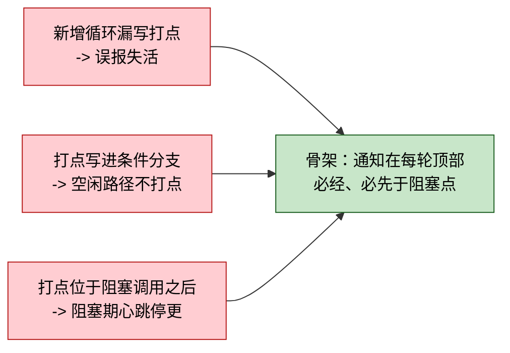

# isp_pipeline 心跳机制 Design

> 日期：2026-09-14
> 范围：`examples/isp_pipeline`，不改 `include/coact/` 与业务模块的 AO 代码
> 参考：newosp 的编译期 AOP 闭包心跳（`BeatLoop` 骨架 + `ThreadWatchdog`）

## 结论先行

在 isp_pipeline 例子里为 7 个非 AO worker 线程添加存活心跳：新增一个约 110 行的
`heartbeat.hpp`（打点原语 + 两个 AOP 循环骨架 + 定容槽表），把"每轮必须打点"和
"每轮必须扫描"两条横切不变式分别收进 `BeatLoop` / `ScanLoop` 骨架，循环体无法
跳过通知。扫描由 main.cpp 既有的等待循环驱动，超时回调上报。不改 coact 源码。

判定深度只到"每槽上次打点时间 + 超时"，不引入失败容忍、软件窗口判定、全局状态
聚合。范围外事项见第 7 节。

## 一、边界：为什么需要例子自己持有槽表

coact 现有的心跳相关钩子盘点：

| coact 现有 | 能承载 | 缺口 |
|---|---|---|
| `Monitor::heartbeat()` | `GlobalCounters::watchdog_heartbeats` | 单个全局计数，无 per-实体槽 |
| `Monitor::ao(TargetId)` → `AoCounters` | per-AO 时长/超时/拒绝/pending | 无心跳字段；worker 不是 AO，无处安放 |
| `Breaker::on_watchdog()` / `broadcast_watchdog()` | → `Safe` | 全 AO 广播，无按实体粒度 |
| `pal::watchdog_progress(marker)` | 喂狗钩子位 | 三后端均为空实现 |

结论是硬缺口：**worker 侧没有槽可挂**。因此例子必须自己持有一个最小槽表，其余
尽量复用 coact。本设计只做槽表和打点骨架，不碰降级与喂狗（见第 7 节）。

## 二、组件：`examples/isp_pipeline/heartbeat.hpp`

依赖方向：`coact → common → heartbeat → sensor_irsc → 其余业务模块 → main`。
放在 `common.hpp` 之外的理由：它不是共享词汇，且 `common.hpp` 已有约 950 行。

```cpp
namespace hb {

using NowFn = uint64_t (*)();          // 微秒

void SetClock(NowFn fn) noexcept;      // main 里设一次

// ---- 打点原语 ----
struct Beat {
    std::atomic<uint64_t> last_us{0};
    void     Hit() noexcept;           // relaxed store，热路径
    uint64_t LastUs() const noexcept;
};

// ---- AOP 骨架 ×2：每个横切不变式一个 ----
// 通知固定在"谓词成立之后、循环体之前"这一唯一连接点；循环体无法跳过通知。
// Pred/Body 为模板参数而非 std::function，实例化后全内联，无间接调用、
// 无堆分配。Body 返回 void 时由谓词终止，返回 bool 时可体内主动终止
// （原 break -> return false），由 if constexpr 在编译期二选一。

// 骨架①：打点。连接点 = 受监控线程的循环。
template <typename Pred, typename Body>
void BeatLoop(Beat* b, Pred&& pred, Body&& body) noexcept;

// 骨架②：扫描。连接点 = 主线程的等待循环。
template <typename Pred, typename Body>
void ScanLoop(Pred&& pred, Body&& body) noexcept;

// ---- 定容槽表 ----
struct SlotCfg {
    const char* name;
    uint32_t    timeout_us;
};

class Slots {
public:
    static constexpr uint8_t kCapacity = 16U;

    Beat*    Register(const SlotCfg& cfg) noexcept;
    void     Unregister(const Beat* b) noexcept;
    uint32_t Check() noexcept;         // 扫描超时并回调；返回超时槽数
    void     SetOnTimeout(void (*fn)(const char* name, void* ctx),
                          void* ctx) noexcept;
    template <typename Fn> void ForEachSlot(Fn&& fn) const noexcept;
};

inline Slots* g_slots{nullptr};        // 沿用 example 的 g_pal / g_session 指针约定

}  // namespace hb
```

并发契约（写入头文件注释）：

- **写方**只做 `atomic<uint64_t>` 的 relaxed store，无锁。
- **读方** `Check()` 由 main 线程单线程调用，槽表本身不加锁。
- 槽为静态生命周期，不回收复用，因此**不做 generation/ABA 防护**。
- `Register()` 在槽满时返回 `nullptr`；调用方（`WorkerBase::start()`）必须接受
  `beat_ == nullptr` 并让打点路径安全跳过，不阻塞启动。容量 16 对 7 个 worker
  有充足余量。

### 2.1 为什么用骨架而不是在每个循环里手写调用

两条不变式在实现里都是散布的：**"每轮必须打点"** 分散在 7 个 worker 循环里，
**"每轮必须扫描"** 分散在 main.cpp 的 8 个等待循环里。散布的不变式靠约定维持，
调用方有多种方式违反，骨架只有一种方式遵守。具体失效形态：



三类失效的共同根因是**维持责任在调用方**。骨架化之后，遗漏打点的唯一途径退化为
"没有使用骨架"，检查方式从逐行审查循环体简化为一条 grep。

AOP 概念在编译期的落法：

| AOP 概念 | 运行期 AOP | 本设计 |
|---|---|---|
| 连接点 | 方法调用前后 | 循环每轮迭代顶部 |
| 切点 | 表达式匹配类/方法名 | 选择调用 `BeatLoop` / `ScanLoop` 而非裸循环 |
| 通知 | 反射/字节码插桩 | 骨架内的 `b->Hit()` / `Check()` |
| 织入 | 运行期代理 | 模板实例化，编译期展开 |

两条通知分属两个连接点族（worker 线程循环 / 主线程等待循环），因此是两个骨架而
不是一个，扩大单个骨架去适配两种宿主属于过度抽象。

**代价**（有意接受）：循环体从函数体内的 `for` 语句变为函数实参，长体在缩进层级
上可读性下降；`break` 需显式改写为 `return false`。缓解手段是骨架本体保持简短
（各约 12 行）并与 `Beat` 定义同置一处。`continue` 在本例的 8 个等待循环中不
存在（已核对），因此无需改写。

## 三、落点：三种循环形态

7 个 worker 线程不是同一种循环，分别处理。

### 3.1 等待型 × 6（`WorkerBase::run()` 覆盖 5 个 + `UsbDmaWorker::run()`）

内层等待循环本来就是 BeatLoop 形态（`pred` + `body`，无提前退出）：

```cpp
// 改前（sensor_irsc.hpp:425 / :242 同形）
pal->mutex_lock(mtx);
while (running.load() && 0U == count) {
    pal->cond_wait(cond, mtx, 0U);          // 0 = 永远等
}

// 改后
pal->mutex_lock(mtx);
hb::BeatLoop(beat_,
             [this] { return running.load() && 0U == count; },
             [this] { pal->cond_wait(cond, mtx, kBeatWaitMs); });
```

- 等待改为**有界**（`kBeatWaitMs`，见第 5 节）。迭代顺序为 `pred → Hit → cond_wait`，
  因此每次等待前打点，心跳间隔上界 = `kBeatWaitMs`。空闲与忙碌都打点。
- 外层 `for(;;)` 不改。
- `stop()` 里的 `cond_wait(idle_cv, mtx, 0U)` **保持无限等**，那是停机汇合点，
  槽此时已注销，不应参与心跳判定。
- `WorkerBase::start()` 在 `thread_create` **之前**注册槽（避免首轮误判），
  `stop()` 在 `thread_join` **之后**注销。`UsbDmaWorker` 同样处理。

### 3.2 产帧型 × 1（`IrscWorker::run()`，`sensor_irsc.hpp:90`）

有界产帧循环，体内真睡一个帧周期。同样套 `BeatLoop` 骨架，不在体内手写打点，
否则就是 2.1 里描述的第三个失效形态（打点位置由调用方决定）：

```cpp
uint32_t f = 0U;
hb::BeatLoop(
    beat_,
    [&] { return (f < kFrameCount) && running.load(); },
    [&] {
        g_pal->sleep_us(period_us + (kLat.irsc_setup_us / 2U));
        /* ... emit 两路 kFrameIrscOut，同原循环体 ... */
        ++f;                                   // 原 for 增量移入体尾
    });
```

迭代顺序 `pred -> Hit -> sleep + emit`：打点先于那次真睡，因此单帧睡眠最多延迟
一轮心跳，不会让心跳在睡眠期间停更。

超时阈值**按该实例自己的 fps 推导**（`start()` 收到 `fps`），不能用统一常量：
3fps 时帧周期已达 333ms。

## 四、驱动与上报（`main.cpp`）

装配（一次性，在 worker 启动前）：

```cpp
hb::SetClock(&hb_now_us);                 // -> g_pal->monotonic_ns() / 1000
hb::g_slots = &g_hb_slots;
g_hb_slots.SetOnTimeout([](const char* name, void*) {
    ++g_hb_timeouts;
    std::printf("[hb] TIMEOUT: %s\n", name);
}, nullptr);
```

驱动：main.cpp 现有的 8 处有界自旋等待（`for (w = 0; w < N; ++w) { ...;
g_pal->sleep_us(X); }`，行号 586 / 634 / 657 / 686 / 751 / 939 / 1028 / 1045）
就是天然的扫描点。**这 8 处统一改套 `ScanLoop` 骨架**，扫描由骨架拥有，不落在
循环体内：

```cpp
// 改前
for (uint32_t w = 0U; w < 3000U; ++w) {
    bool drained = true;
    for (coact::AoBase* a : aos) { if (0U != a->pending().load()) { drained = false; } }
    if (drained && ...) { break; }
    g_pal->sleep_us(5000U);
}

// 改后
uint32_t w = 0U;
hb::ScanLoop(
    [&] { return w < 3000U; },
    [&]() -> bool {
        bool drained = true;
        for (coact::AoBase* a : aos) { if (0U != a->pending().load()) { drained = false; } }
        if (drained && ...) { return false; }        // 原 break
        g_pal->sleep_us(5000U);
        ++w;                                         // 原 for 增量移到体尾
        return true;
    });
```

改写规则固定三条，保证语义等价：

1. `break;` -> `return false;`（8 处共 6 个 `break`；634 与 751 两处无 break，
   落到界尾自然结束）
2. `++w` 从 `for` 增量移到体尾，位置与原语义一致（`break` 时不增）
3. **函数级 `return` 不能直接换成 `return false`**。`wait_txn_closed` 的循环体
   在成功时 `return`（退出 lambda）并跳过其后的失败计数器；机械改写成
   `return false` 会让计数器在成功路径上也执行。该处改用 `closed` 标志，循环
   结束后按标志决定是否走 fallback。`t37_drain` 同样用 `return` 但循环后无代码，
   直接改写即等价。

已核对这 8 个循环中**没有 `continue`**，因此不需要额外的 `return true` 改写。

8 处循环各自的计数器用裸作用域包住（`{ uint32_t w = 0U; ... }`），因为它们在
main 的同一层作用域内，否则会重复声明同名变量。

这是本设计触及主流程的唯一改动，diff 为 8 处循环的结构改写（非逐行插入）。

## 五、阈值

| 槽 | 打点间隔 | 超时阈值 | 依据 |
|---|---|---|---|
| 等待型 worker ×6 | ≤ `kBeatWaitMs` | 1000ms | 50× 余量，吸收调度抖动 |
| `IrscWorker` | `period_us` | `3 × period_us` | 按实例 fps 推导（3fps 时 1000ms） |

`kBeatWaitMs` 建议 20ms：远小于超时阈值（保证判定有效），又足够大以不扰动
worker 时序：该例子里 worker 的 `sleep_us(50) × 160 事务` 是封帧时序断言的
真实时间依赖，20ms 量级的空转唤醒不影响它。6 个等待型 worker 全空闲时合计
约 300 次/秒唤醒，可忽略。

有界等待的语义影响：`cond_wait` 超时返回后 `pred` 重新求值，真无活则再次进入
等待。`submit()` 的 `cond_signal` 与 `stop()` 的 `cond_broadcast` 行为不变，
不引入丢唤醒。

### 5.1 单位约定（硬编码的实际风险）

实现期发现的真 bug：`cond_wait` 收**毫秒**（`pal_posix.hpp:150`，`0 = 永远等`），
而 `SlotCfg::timeout_us` 收**微秒**。把 1000（本意 1000ms）直接当微秒传入，实际
超时变成 1ms，而打点间隔 20ms，于是**每个 worker 每轮都假报**。

处理方式是单位进常量名，换算只在边界发生一次：

```cpp
constexpr uint32_t kNsPerUs = 1000U;
constexpr uint32_t kUsPerMs = 1000U;

constexpr uint32_t kBeatWaitMs = 20U;                             // ms
constexpr uint32_t kBeatTimeoutWaitMargin = 50U;                  // 倍数，无单位
constexpr uint32_t kWorkerBeatTimeoutMs = kBeatTimeoutWaitMargin * kBeatWaitMs;
constexpr uint32_t kWorkerBeatTimeoutUs = kWorkerBeatTimeoutMs * kUsPerMs;  // us

constexpr uint32_t kIrscBeatPeriodsPerTimeout = 3U;               // 倍数，无单位
```

`IrscWorker` 的 `kIrscBeatPeriodsPerTimeout * period_us` 直接是微秒，不再有
`/1000` 这种标度转换散落在调用点。

worker 线程数同样具名（`kWorkerThreadCount`），并用
`static_assert(hb::Slots::kCapacity >= kWorkerThreadCount)` 把槽表容量与它钉住，
避免断言里出现跟随接线的裸字面量。

`Slots::kCapacity` 保持为组件级常量而**不**模板化：模板容量会让 `g_slots` 的指针
类型依赖具体实例化，worker 侧要够到它就得上类型擦除接口，属于过度设计。

### 5.2 代价实测

唯一的行为改动是"无限期等待 -> 有界等待"，因此唯一代价是空闲期的周期唤醒：
6 个等待型 worker 全空闲时 6 × (1000/20) = 300 次/秒（忙碌时不进入该等待循环，
300/s 是上界）。每次唤醒只是抢 mutex、求值谓词、重新等待，量级为微秒。

实测两版（`kBeatWaitMs` 取 20ms 与 60000ms，后者近似原无限等待）在同一场景下
各跑 3 次：

| 版本 | wall | user+sys | CPU |
|---|---|---|---|
| 20ms | 1.28–1.32s | 0.07–0.10s | 6% |
| 60000ms | 1.29–1.33s | 0.06–0.08s | 5–6% |

**差异落在噪声内，测不出来。** 取证方式：把 `examples/isp_pipeline` 复制到
`/tmp` 后改副本常量，重新编译对比，不改动交付源码。

代价旋钮只有 `kBeatWaitMs` 一个：调大到 100ms 则空闲唤醒降到 60 次/秒，超时按
`kBeatTimeoutWaitMargin` 等比升到 5s，比例关系保持不变。

## 六、验证

### 6.1 骨架单测（照搬 newosp 的 4 个维度）

| 用例 | 断言 |
|---|---|
| 正常路径 | 5 次迭代，`LastUs()` 由 0 变为非 0 |
| `pred` 为 false | body 不执行，且**不提前打点**（`LastUs()` 保持 0） |
| 心跳指针为 null | 安全执行，body 不受影响 |
| bool body 提前终止 | body 返回 false 时循环终止 |

第二条锁定时序语义：线程停止后最后一轮不上报，超时判定才准。

### 6.2 场景断言（并入 main.cpp:1180 的 `check` 体系）

沿用既有出口（main.cpp:1386 的 `RESULT: ALL PASS (fails=N)`）：

| 场景 | 断言 |
|---|---|
| 稳态 | 全程 `g_hb_timeouts == 0`；`ForEachSlot` 各槽 `LastUs()` 持续刷新 |
| 槽注册数 | 在 7 个 worker 全部启动后的固定检查点，注册槽数 == 7 |

## 七、明确不做（范围外）

| 项 | 说明 |
|---|---|
| 失败容忍（`tolerance`） | 单次超时即上报。误报面靠阈值余量控制，不引入连续失败计数 |
| 软件窗口判定（min/max margins） | 不检测"跑太快/节拍乱" |
| 参考周期与 `EXPIRED` | 无显式"监督者自己超窗"状态；安全性质仍靠"喂狗只由 Check 驱动"保证，但缺可诊断标签 |
| 全局状态聚合 | 无 `GlobalStatus`，无三级裁决链 |
| 降级接线 | 不调 `rt.breaker().broadcast_watchdog()` |
| 喂狗接线 | 不调 `pal::watchdog_progress()`；板级接 `Svc_Wdt_Feed()` 的位置与本机制无关 |
| AO 侧期望节拍 | 链路级/分支槽未纳入本次范围 |
| 重配事务 deadline | `ActiveDeadline` 槽未纳入本次范围 |
| 故障注入 | 未新增 `inject_worker_stall` 一类注入；本次只验证"不误报 + 槽在刷新" |
| 框架改动 | `include/coact/` 一行不改 |

其中"参考周期与 EXPIRED"是最需要后续关注的一条。本设计只做检测与上报、不接
喂狗（见上表），因此**监督者自身超窗没有任何兜底**：若 `Check()` 因 main.cpp
某段长时间阻塞而停跑，超时既不会被上报，也没有任何机制发现监督者停了。

这一点在板级接线后会自行改善：一旦按"只有 `Check()` 无超时才调 `Svc_Wdt_Feed()`"
的方式接线，`Check()` 停跑即不再喂狗，硬件看门狗会兜住。也就是说这条边界属于
**接线缺口而非设计缺口**，补的位置在板级，不在本次改动清单内。

## 八、改动清单

| 文件 | 改动 |
|---|---|
| `examples/isp_pipeline/heartbeat.hpp` | 新增，约 200 行（两个骨架、打点原语、槽表、并发契约注释） |
| `examples/isp_pipeline/test_heartbeat.cpp` | 新增，骨架与槽表的独立自测（12 个用例 / 27 条断言，退出码即判决） |
| `examples/isp_pipeline/sensor_irsc.hpp` | 单位具名常量；`WorkerBase` 加 `beat_` 与注册/注销，内层等待换 `BeatLoop` 并有界化；`UsbDmaWorker` 同形改动；`IrscWorker::run()` 改套 `BeatLoop` |
| `examples/isp_pipeline/main.cpp` | 心跳装配与回调；8 处等待循环改套 `ScanLoop`（含 `break`→`return false`、函数级 `return` 用标志、`++w` 移位）；2 项 `check()` 断言 |
| `examples/isp_pipeline/README.md` | 文件清单与拓扑图补一行说明 |

### 8.1 构建与验证

`examples/isp_pipeline` 没有 CMake 注册（`examples/CMakeLists.txt` 里没有它），
且整个目录在 `.gitignore:27` 内，属于"不上发布"的本地材料。因此本次交付**不会
进 git**，构建也走手工命令：

```sh
# 骨架自测（约 1s 编译）
g++ -std=c++17 -O0 -g -Wall -Wextra -I . -I include -I examples -pthread \
    examples/isp_pipeline/test_heartbeat.cpp -o /tmp/test_hb && /tmp/test_hb

# 完整例子（约 16s 编译，运行约 1.3s）
g++ -std=c++17 -O1 -g -DCOACT_RTT_STUB -I . -I include -I examples -pthread \
    examples/isp_pipeline/main.cpp examples/isp_pipeline/isp_chain.cpp \
    examples/isp_pipeline/output_itf.cpp examples/isp_pipeline/recfg_session.cpp \
    examples/isp_pipeline/sensor_irsc.cpp examples/isp_pipeline/video_stream.cpp \
    src/core/pal_posix.cpp src/diag/log_rtthread.cpp -o /tmp/isp_demo && /tmp/isp_demo
```

`-DCOACT_RTT_STUB` 是必需的：`common.hpp` 间接引入 `coact/diag/log_rtthread.hpp`，
该头在非 stub 路径下要 `<rtthread.h>`。

### 8.2 交付状态

| 验证项 | 结果 |
|---|---|
| 骨架自测 | `ALL PASS (passed=27 failed=0)`，`-Wall -Wextra` 无告警 |
| 完整例子 | `RESULT: ALL PASS (fails=0)`，含心跳两项断言 |
| 心跳误报 | 全程 0 次 `[hb] TIMEOUT` |
| 回归 | 原有 66 项断言全部仍通过 |
