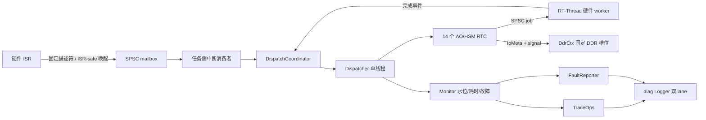

# ISP Pipeline 示例优化方案（RT-Thread MCU 方向）

## 结论先行

`coact/examples/isp_pipeline` 已经具备较完整的 AO、worker、DDR 黑板、停车环和故障仿真模型。下一阶段不应继续增加业务状态，而应围绕 **RT-Thread 单核、静态资源、ISR 安全和可观测性闭环** 做收敛。

优先级如下：

1. 修复 Trace 的 ISR 和事件所有权边界，避免示例把不安全模式固化为参考实现。
2. 为 RT-Thread 选择单核 Profile：`RttSingleCoreProfile`、IRQ 临界区和静态线程资源。
3. 用 `SpscRing` 替换普通 worker 的 mutex/cond 队列，保留忙拒绝和 stop drain 语义。
4. 将水位、故障、Trace 和资源预算接入同一套验收指标。
5. 保持 AO 只做 RTC 决策、worker 执行可阻塞硬件模拟、事件承载跨线程通知的现有边界。

## 1. 当前基线

| 区域 | 当前实现 | 主要问题 |
|---|---|---|
| AO | 14 个 AO，统一由 `Runtime`/Dispatcher 驱动 | 数量不是当前瓶颈，不应为优化而合并状态机 |
| 硬件 worker | 7 个 worker；完成型 worker 使用 `CompletionWorkerBase`，IRSC 使用 `PeriodicProducerBase`，USB 使用 `SoftIrqCompletionWorker` 能力层 | 公共生命周期/回投机制已统一，硬件协议仍保持独立 |
| 事件池 | `common.hpp` 中 `PoolT` 硬编码 `HostSmpProfile` | RT-Thread 单核仍走 SMP 风格 CAS/批量回收，需按平台选择 Profile |
| 队列 | 普通完成型 worker 使用 `WorkerBase` 的 `SpscRing` + PAL semaphore；USB 保留专用单槽交接 | 普通 worker 已利用 SPSC；USB 的 SoftIrq/DMA 语义不强行合并 |
| 中断完成 | RT-Thread 构建关闭 SoftIrq，worker 直接提交完成事件 | 语义简单，但 ISR/任务入口必须明确，不能把 task API 当 ISR API |
| 诊断 | `DiagTrace`、`FaultReporter`、`HsmTrace` 已有基础 | Trace 的 ISR 入口、queued 事件生命周期和 direct dispatch 仍需收敛 |
| 水位 | `Monitor::sample_watermark()` 已实现边沿告警 | 已接入生产采样点：Dispatcher 每批 `begin_batch()` 后单点采样三分区（dispatcher.hpp），唯一写者 |
| 数据面 | `DdrCtx` 固定槽位，AO 传递 `IoMeta`，worker 使用 parking ring | 方向正确，应继续禁止像素数据进入事件和跨 AO 可变共享 |
| host/coro | `ISP_DEMO_CORO` 用一个 pump + stackful coroutine 模拟单核公平性 | 仅作为 host 验证后端，不能作为 MCU 运行时依赖 |

## 2. RT-Thread MCU 约束

目标配置必须满足：

- 单核：`RT_CPUS_NR == 1`，不启用 `RT_USING_SMP`；
- `-std=c++17 -fno-exceptions -fno-rtti`；
- 不使用 `malloc`、`new`、TLS、`std::thread` 或动态线程创建；
- Dispatcher、worker、日志 writer、同步对象和队列全部由调用方提供静态存储；
- ISR 只做有界原子操作、固定槽位写入和 ISR-safe 唤醒；
- AO handler 不阻塞，不直接读写其他 AO 的可变状态；
- 所有队列容量、事件池容量和线程栈大小在编译期或板级资源表中确定。

## 3. 目标拓扑



关键边界：

- ISR 不直接执行 AO，不调用阻塞 API，不负责字符串格式化；
- worker 可以等待硬件，但不能写 AO 内部字段，只能提交完成事件；
- Dispatcher 是所有 AO RTC 的唯一执行者；
- `DdrCtx` 只传递固定描述符，事件中不携带像素数组；
- Fault/Trace sink 必须区分 task 和 ISR 调用上下文。

## 4. 分阶段实施计划

### P0：先收敛正确性契约【已完成，见 2baa919 / 6dd2bc0】

这是所有性能优化的前置门禁。五项均已实现并有 TDD 覆盖：

1. **Trace ISR 入口分离**【已完成】：`TraceOps::on_submit` 携带 `from_isr`；demo `DiagTrace::on_submit` 据此分流 `record_from_isr()`/`record_from_task()`（common.hpp）。
2. **缓存事件 signal**【已完成】：`staged_signal` 在 `staging_.enqueue()` 之前缓存（coordinator.hpp），发布后不再读 `e->signal`。
3. **补齐 direct dispatch Trace**【已完成】：direct 成功同时产生 `TraceSubmit(Direct)` 与 `TraceDispatch(path=0)`。
4. **补齐 Monitor 耗时累计**【已完成】：direct/dispatcher 的 elapsed 分别进 `add_direct_duration()`/`add_dispatcher_duration()`。
5. **完善公共 POD 默认值**【已完成】：`Monitor` 的 `trace_{}`/`fault_{}` 成员默认初始化为 nullptr。

验收：动态事件、ISR submit、direct、queued、lease contention、stop drain 均已通过 ctest（53/53）与 RT-Thread stub 编译门；ASan/TSan 与真板验证见 P5。

### P1：建立 RT-Thread 单核 Profile【已完成，4376ef4】

`PoolT`、`Runtime`、`Dispatcher` 已通过 `DemoProfile` 统一选择平台 Profile：

```cpp
#ifdef ISP_DEMO_USE_RTT
using DemoProfile = coact::RttSingleCoreProfile;
#else
using DemoProfile = coact::HostSmpProfile;
#endif
```

RT-Thread 选择 `RttSingleCoreProfile`，host/coro 选择 `HostSmpProfile`。

RT-Thread 路径还应：

- 使用 `make_critical_section(pal)` 的 IRQ 临界区；
- 使用 `RtThread::Profile` 对应的 immediate reclaim 策略；
- 保留 `RtThreadResources` 的静态 Dispatcher TCB、worker TCB、栈和 semaphore；
- 将 worker slot 数量设为“实际并发数 + 1 个 headroom”，不为 host/coro 配置预留 MCU 资源；
- 通过栈水位测量后再降低当前 16 KiB Dispatcher 栈和 4 KiB worker 栈（RT-Thread 资源表 `RtThreadResources<16384, 8, 8, 4096>` 的值；host 路径 Dispatcher 栈为 `DefaultConfig::kDispatcherStackBytes=4096`），禁止盲目缩减。

Profile 一致性是硬约束：Pool、Staging、Dispatcher 不能出现“队列是单核、回收器是 SMP、临界区又是 spinlock”的混搭。

### P2：统一普通 worker 的 SPSC 交接【已完成，dad821a；分层扩展已完成】

`WorkerBase<Derived, Job, Depth, PalT>` 的实际角色是“Dispatcher 单生产者、worker 单消费者”。当前已完成基础交接，并按语义增加三个 CRTP 层：

1. 用 `coact::SpscRing<Job, Depth>` 保存 job；当前完成型 worker 通过 `CompletionWorkerBase` 复用同一交接能力。
2. 用静态 semaphore 或 PAL 的轻量唤醒原语替代 cond variable；提交成功后唤醒 worker，worker 空闲时阻塞等待。该能力已由 `WorkerBase` 提供。
3. `submit()` 保留非阻塞满队列拒绝和 `rejected` 计数，不改为阻塞投递。
4. `stop()` 先关闭提交、唤醒 worker、排空已接受 job，再 join；每个已接受 job 仍必须产生完成事件。
5. 先使用 `try_pop()` 验证行为，再评估 `pop_batch()`；当前完成型 worker 已通过 `CompletionWorkerBase` 统一回投，批量取 job 仍需单独证明不会改变硬件延迟、完成顺序和 stop drain 语义。

迁移前置核验已完成：`IspIrqWorker`、`SoutDmaWorker`、`MipiIrqWorker` 和 `CmdDmaWorker` 的 job 提交均来自 Dispatcher 单线程；SoftIrq/ISR 只回投完成事件，不触碰 job ring。

不建议把 `UsbDmaWorker`、`IrscWorker` 强行塞进 `CompletionWorkerBase`：它们分别承担周期产帧和 SoftIrq/错误 EOF 语义，当前通过 `PeriodicProducerBase` 与 `SoftIrqCompletionWorker` 分别复用公共能力。

### P3：生产级可观测性接入

#### 3.1 水位采样【已实现，见 6dd2bc0】

`sample_watermark()` 不从 ISR submit 路径调用。由 Dispatcher 在每批 `begin_batch()` 后集中采样 High/Normal/Low 三个分区：

- 只有 Dispatcher 更新 `prev_watermark_pct[]`，避免 load/store 边沿竞争（已实现）；
- 80% 上穿报告 `FaultPriority::kHigh`；下穿报告 `FaultPriority::kMedium`（已实现）；
- 稳态区间不重复上报（已实现，集成测试覆盖）；
- 采样点同时记录队列容量、当前占用和 Trace 丢弃计数【待办】。

RT-Thread 若需要 ISR 即时故障，只允许使用单独的 ISR-safe fault sink，不复用会阻塞的任务 sink。

#### 3.2 Trace 与 Fault 绑定

demo 启动顺序应固定为：

```text
构造 PAL/静态资源
  -> 初始化 diag/fault sink
  -> bind TraceOps/FaultReporter
  -> 初始化 Runtime
  -> 启动 Dispatcher/worker
  -> 提交首个事件
```

Trace、Fault 和业务日志继续共享 diag，但必须分别统计 accepted、dropped、fault reports 和 sink failures，不能用 stdout 行数代替可靠性证明。

### P4：数据面与场景负载优化

保持现有 `DdrCtx + IoMeta + parking ring` 设计，只做以下收敛：

- 继续让 `IoMeta` 只携带 frame id、DDR slot、路径和结果，不携带像素数据；
- 将 `std::array` 大型临时缓冲的栈占用列入 Dispatcher 栈预算；必要时改为固定上下文中的双缓冲，但不得引入堆；
- `parking ring` 的深度、三缓冲深度和 worker job 深度统一写入板级配置，避免多个魔数分别漂移；
- 对“正常路径零 reject”和“异常注入允许 reject”分开计数，避免测试为了全绿而吞掉真实背压；
- 保留 FIFO overflow、stale completion、quiesce race 三类故障的可观测输出。

不建议在示例中加入完整 `AsyncBus`、通用 `WorkerPool` 或额外消息总线；它们会重复 coact 已有的 Staging/Dispatcher/Breaker 语义。

### P5：host 与 RT-Thread 双后端验证

| 验证层 | host/POSIX | RT-Thread MCU |
|---|---|---|
| 构建 | 默认 pthread、`ISP_DEMO_CORO` | `ISP_DEMO_USE_RTT`、单核 Profile |
| 队列 | SPSC 顺序/压测/TSan | IRQ 临界区、ISR submit、满队列 |
| 线程 | 允许 pthread 诊断 | 只允许静态 TCB/栈/信号量 |
| 日志 | raw-hex sink | RT-Thread writer + `record_from_isr()` |
| 故障 | callback 捕获测试 | ISR-safe/task-safe 双 sink |
| 生命周期 | ASan/TSan、pool.used==0 | stop drain、pool.used==0、无悬空资源 |

## 5. 资源预算与验收指标

板级配置表至少记录：

| 资源 | 当前关注点 | 验收要求 |
|---|---|---|
| AO/上下文槽 | 14 AO + worker/生产者上下文 | ContextSlots 有明确余量，满表时显式失败 |
| Worker TCB/栈 | 7 worker，当前统一栈大小 | 记录最大栈水位，按 worker 类型定额 |
| Dispatcher 栈 | HSM + 临时数组 + Trace 回调 | 无栈溢出；Trace 不引入不可控大帧 |
| EventPool | 128 个固定事件块 | 正常运行 `used()==0`，峰值与预算可解释 |
| Worker SPSC | 深度 2/3/4 | 满队列只拒绝并计数，不阻塞 Dispatcher |
| Diag lane | normal/critical 独立容量 | accepted/drained/dropped 守恒成立 |
| Fault/Trace | callback 只传定长字段 | ISR 不分配、不阻塞、不格式化 |

最终功能验收继续保留：`RESULT: ALL PASS`、worker 执行/拒绝计数、7 个 worker 退出、事件池归零、AO pending 归零；新增：Trace dispatch 数量、Fault 边沿数量、watermark 采样数量、各 lane 丢弃统计和栈水位。

## 6. 不采纳的优化

- 不把所有 AO 合并成一个大状态机；这会降低故障定位能力并扩大 RTC 栈。
- 不把阻塞硬件模拟移入 Dispatcher；worker 的阻塞隔离是示例的核心价值。
- 不引入动态 Worker 工厂、动态事件池或运行时线程创建。
- 不用 `std::printf` 行数证明 Trace 完整性；日志必须以结构化记录和丢弃统计为准。
- 不在 MCU 路径启用 stackful coroutine、host SoftIrq signalfd 或 POSIX 专属 API。
- 不复制 newosp 的完整 `AsyncBus`、`FaultCollector`、`SystemMonitor` 或 `async_log`；只提取已经验证的无状态算法和注入边界。

## 7. 推荐提交顺序

```text
P0 Trace/事件生命周期修复【已完成 2baa919】
  -> P1 RT-Thread Profile 与静态资源表【已完成 4376ef4】
  -> P2 WorkerBase SPSC 化【已完成 dad821a】
  -> P3 水位/Fault/Trace 生产接入【已完成：水位 6dd2bc0、启动顺序与守恒断言 db25075】
  -> P4 栈与 DDR 临时缓冲预算【已完成 cad9d8a（预算表）】
  -> P5 host + RT-Thread 双后端验证【host 侧完成；板级项列为待办】
  -> 更新 examples/isp_pipeline/README.md 与测试报告【README 验证矩阵已更新】
```

其中 P0、P1 是上板前硬门禁；P2 是主要 CPU/同步开销优化；P3/P4 用于把示例从“能跑”提升为“可证明、可复盘、可移植”。
