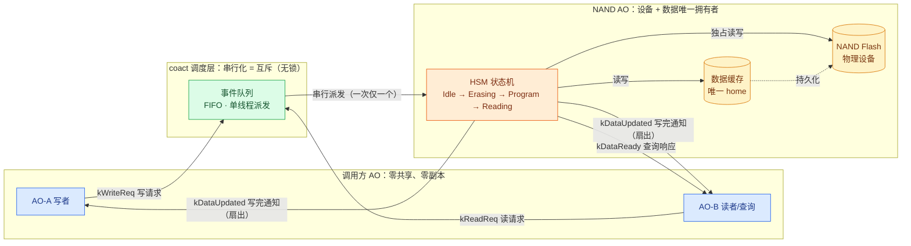
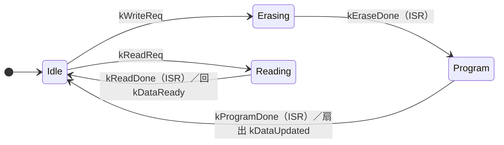

# NAND 共享访问设计：拥有者 AO 串行化（方案 Y）

## 1. 结论

两个 AO 需要读写同一 NAND Flash、写完互相通知、并支持数据查询时，**不采用黑板（共享内存 + 互斥锁）**，而采用**拥有者 AO 串行化**：NAND 设备与数据归一个专属 AO 独占，其余 AO 通过事件请求读写、查询和接收通知。

- 互斥由**单执行上下文 + 事件队列串行化**保证，无锁、无阻塞、ISR 安全。
- 写完通知由**引用计数扇出**事件实现。
- 数据查询由**请求-响应**事件实现，数据唯一 home 在拥有者 AO 内部，调用方零副本。

## 2. 背景与问题

一个典型嵌入式场景：AO-A 产生配置，写入 NAND；AO-B 读取配置、响应用户查询。两者都需要访问 NAND，且 AO-A 写完必须及时通知 AO-B 重新加载。

朴素直觉是引入黑板：把 NAND 内容缓存到一块共享内存，两个 AO 加锁读写。该直觉看似直接，但存在三个不可回避的代价：

1. **锁在 ISR 不可用**。NAND 完成中断要更新状态时无法持锁读数据，破坏框架的 `try_submit_from_isr` 无锁路径。
2. **锁锁不住 NAND 的物理 busy**。擦写是毫秒级物理过程，锁只能保证某一刻一个调用者，锁不住"芯片正在擦除、此刻不能读"。
3. **黑板不提供通知**。黑板模式仍需控制器监控变化并调度，通知逻辑照样要手写。

## 3. 方案对比

| 维度 | 方案 X：黑板 + 互斥锁 | 方案 Y：拥有者 AO 串行化（采用） |
|---|---|---|
| 共享前提 | 多个 AO 直接读写同一块数据 | 数据只有一个主人，其余 AO 排队请求 |
| 互斥手段 | mutex 临界区 | 单执行上下文 + 事件队列串行 |
| 阻塞 | 调用方在锁上阻塞或自旋 | 无阻塞，请求变事件排队 |
| ISR | 锁在 ISR 不可用 | `try_submit_from_isr` 无锁 |
| 通知 | 需额外控制器 | 引用计数扇出事件 |
| 风险 | 死锁、优先级反转 | 无 |
| 数据 home | 共享内存，人人可改 | 拥有者 AO 私有上下文 |

## 4. 总体架构



读图三问：

- **互斥在哪**：绿色队列 `Q`。AO-A 的写请求与 AO-B 的读请求都进这条 FIFO，单线程一次派发一个，NAND AO 走完一个状态机才轮到下一个，因此永远没有并发访问 NAND。
- **通知在哪**：橙色 HSM 在 `Program → Idle` 时扇出 `kDataUpdated`，同时送达 A 与 B。
- **数据在哪**：黄色 `DATA` 是唯一 home，位于 NAND AO 内部，不在黑板。调用方全程零副本，要数据发 `kReadReq`、收 `kDataReady`。

## 5. NAND AO 状态机



单线程派发下，任一时刻只走一条状态路径。`kEraseDone`、`kProgramDone`、`kReadDone` 由 NAND 完成中断经 `try_submit_from_isr` 提交，串行化随之延伸到 ISR 上下文。

## 6. 事件定义

事件头为 4 字节定长 `Event{signal, pool_id, ref_ctr}`，payload 通过首成员组合承载，池块大小取承载结构体大小。

```cpp
namespace nand {

enum Signal : uint16_t {
    kSigWriteReq     = 1U,  // external: request write
    kSigReadReq      = 2U,  // external: request read (query)
    kSigEraseDone    = 3U,  // internal: NAND erase finished (from ISR)
    kSigProgramDone  = 4U,  // internal: NAND program finished (from ISR)
    kSigReadDone     = 5U,  // internal: NAND read finished (from ISR)
    kSigDataUpdated  = 6U,  // external: write committed (fanned out)
    kSigDataReady    = 7U,  // external: query response
};

// coact::Event has no payload field; base is the first member so
// &ev.base == the Event* the pool returns.
struct WriteReqEvent {
    coact::Event base;
    coact::TargetId reply_to;   // who to notify after commit
    uint32_t addr;
    const uint8_t* src;         // caller-owned source buffer
    uint16_t len;
};

struct ReadReqEvent {
    coact::Event base;
    coact::TargetId reply_to;   // who receives kDataReady
    uint32_t addr;
    uint16_t len;
};

// Small-data query response: data inlined, zero sharing.
struct DataReadyEvent {
    coact::Event base;
    uint32_t addr;
    uint16_t len;
    uint8_t data[];             // inlined snapshot
};

}  // namespace nand
```

`kDataUpdated` 用无 payload 的裸 `Event` 即可，扇出时仅凭信号识别。

### 7. 拥有者 AO 实现骨架

```cpp
// One pool carries every NAND event; block size covers the largest layout.
using NandPool = coact::EventPool<sizeof(DataReadyEvent) + NAND_CACHE_SIZE,
                                  kNandPoolCap>;

struct NandCtx {
    // Data home: only touched on the coact Dispatcher thread.
    uint8_t cache[NAND_CACHE_SIZE];

    // Exclusive device handle: only this AO touches NAND.
    NandDevice* dev;

    // Submit entry for fan-out and responses.
    RuntimeT* rt;

    // External static pool, for alloc on fan-out and responses.
    NandPool* pool;

    // Subscribers to notify on commit.
    coact::TargetId subscribers[4];
    uint8_t subscriber_count;

    // Pending read request, cached when kReadReq is handled.
    coact::TargetId pending_reply_to;
    uint32_t pending_addr;
    uint16_t pending_len;
};

struct NandTraits {
    static coact::LogicalPrio logical_prio() { return 20U; }
    static coact::PriorityClass priority_class() { return coact::PriorityClass::Normal; }
    static bool direct_eligible() { return false; }   // NAND erase blocks; never direct
    static bool isr_direct_safe() { return false; }
    static constexpr uint64_t kRtcBudgetNs = 2000000ULL;
};

using NandHsm = coact::Hsm<NandCtx>;
using NandAo  = coact::Ao<NandCtx, NandHsm, NandTraits>;

inline const coact::StateDef<NandCtx> kStates[] = {
    { -1, nullptr, nullptr, "root" },      // 0
    {  0, nullptr, nullptr, "Idle" },      // 1
    {  0, nullptr, nullptr, "Erasing" },   // 2
    {  0, nullptr, nullptr, "Program" },   // 3
    {  0, nullptr, nullptr, "Reading" },   // 4
};

inline const coact::TransitionDef<NandCtx> kTransitions[] = {
    { 1, kSigWriteReq,    2, coact::TransitionKind::External, nullptr, on_write_req },
    { 2, kSigEraseDone,   3, coact::TransitionKind::External, nullptr, on_erase_done },
    { 3, kSigProgramDone, 1, coact::TransitionKind::External, nullptr, on_program_done },
    { 1, kSigReadReq,     4, coact::TransitionKind::External, nullptr, on_read_req },
    { 4, kSigReadDone,    1, coact::TransitionKind::External, nullptr, on_read_done },
};
```

关键动作：写完成扇出通知，读完成回响应。

```cpp
inline void on_program_done(NandCtx& ctx, const coact::Event& evt)
{
    (void)evt;
    // Fan out kDataUpdated to every subscriber. One alloc + one ref per target.
    for (uint8_t i = 0U; i < ctx.subscriber_count; ++i) {
        coact::Event* e = ctx.pool->alloc(nand::kSigDataUpdated);
        if (nullptr == e) {
            continue;                       // pool exhausted; drop this notify
        }
        ctx.rt->coordinator().submit_from_task(ctx.subscribers[i], e, kQos);
    }
}

inline void on_read_done(NandCtx& ctx, const coact::Event& evt)
{
    (void)evt;
    // Allocate a response with the snapshot and reply to the requester.
    DataReadyEvent* resp = static_cast<DataReadyEvent*>(
        ctx.pool->alloc(nand::kSigDataReady));
    if (nullptr == resp) {
        return;
    }
    resp->addr = ctx.pending_addr;
    resp->len  = ctx.pending_len;
    /* memcpy(resp->data, ctx.cache, resp->len); */
    ctx.rt->coordinator().submit_from_task(ctx.pending_reply_to, &resp->base, kQos);
}
```

通知采用每个订阅者独立 `alloc` 的事件，生命周期互不干扰。若需多个 AO 同时持有同一份只读数据（真正的多播共享），改用单次 `alloc` + `event_ref_inc` + 多次 `submit_from_task`，每个消费者处理完 `event_gc`，最后一个 gc 到 0 归还池。

### 8. 装配

```cpp
using RuntimeT = coact::Runtime<coact::DefaultConfig, coact::pal::RtThread,
                                coact::pal::RtThread::Profile>;

static RuntimeT g_rt(g_pal);
static nand::NandAo g_nand_ao(...);

// Phase 1: bind NAND AO at a stable target id, then set subscribers + rt.
g_rt.bind_at(nand::kNandTargetId, g_nand_ao);
g_nand_ao.context().rt = &g_rt;
g_nand_ao.context().subscribers[0] = nand::kWriterTargetId;   // AO-A
g_nand_ao.context().subscribers[1] = nand::kReaderTargetId;   // AO-B

g_rt.initialize();
g_rt.start();
```

写方 AO-A 发起请求，NAND 完成中断经 `try_submit_from_isr` 推进状态机，全程无锁。

### 9. 边界与约束

- **查询响应零共享是核心**。小数据（配置、状态）用 `DataReadyEvent` 内联快照；大数据块若内联代价过高，改用"响应事件携带 `const` 指针 + 读完成确认事件归还"或双缓冲快照，但设备访问的独占 AO 无论如何不可省。
- **订阅者列表是编译期静态数组**，与 coact 反动态分配、反工厂的约束一致。
- **背压**。扇出时若池耗尽，通知被丢弃而非阻塞，由监控水位兜底，符合框架过载降级语义。
- **直接路径关闭**。NAND 擦写是阻塞物理操作，`direct_eligible=false` 禁止 producer 线程代跑状态机，避免阻塞调用方。
