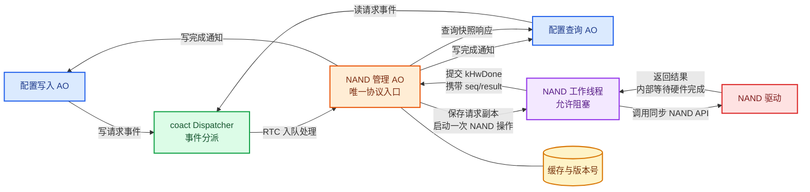
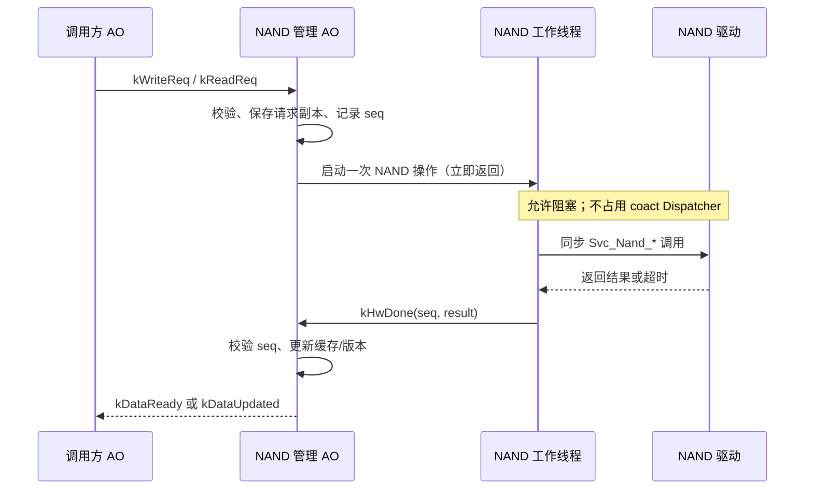

# NAND 共享访问设计：管理主动对象与工作线程

## 1.概述

采用 **NAND 管理主动对象（NAND AO）+ NAND 工作线程**：

- NAND AO 负责请求顺序、在途状态、缓存版本和通知关系。
- NAND 工作线程负责执行可能阻塞的 `Svc_Nand_*` / `Nand_Io_*`。
- 工作线程完成后发送完成事件，NAND AO 只执行短小的 RTC 处理。
- 只有所有调用方都经过 NAND AO，才能宣称访问被统一串行化。

| 场景 | 方案 |
|---|---|
| 单一调用方，接受同步读写 | 不新增 NAND AO；使用现有适配层 + 专用工作线程 |
| 多个 AO 共享同一物理 NAND | 使用 NAND AO + 工作线程 |
| 驱动提供真正的启动/中断完成接口 | NAND AO 直接驱动异步接口，但禁止等待 |

## 2. 约束
RTC（run-to-completion）在 coact 中表示：一个事件 handler 在返回 Dispatcher 前，完成一次有界的逻辑状态转换。它不要求硬件操作立即结束；handler 可以完成参数校验、保存请求副本、启动操作，然后返回，硬件结果再通过后续事件处理。

coact 对 RTC 提供三层保障：

1. Dispatcher 逐个取出事件并调用 AO 的 HSM，单个 handler 返回后才继续派发其他事件。
2. `ExecutionLease` 通过原子 CAS 在 `Idle`、`RunningDispatcher` 和 `RunningDirect` 之间转移，保证同一 AO 同时只有一个执行者；并发竞争的事件留在队列中重试，重入则触发断言。
3. coact 记录每次 RTC 耗时，超过 `kRtcBudgetNs` 时触发超时监控和熔断处理；它只负责发现超时，不能中断一个已经阻塞的 handler。

因此，RTC 是 coact 的执行协议，不是内核强制的时间片。coact 的所有 AO 共用 Dispatcher，一个 AO handler 如果等待信号量、事件或硬件完成，就会长期占用执行租约并拖住全部 AO；如果完成事件也要经过该 Dispatcher，还可能形成等待闭环。

当前 RS500 驱动确实存在同步等待：

- `Drv_Nand_IrqWaitDmaWbDone()` 内部调用 `rt_event_recv()`。
- 块擦除路径等待时间可达 `DEV_NAND_BLK_ERASE_OP_TIMEOUT_MS`。
- `Nand_Io_MutexTake()` 使用 `rt_mutex_take()`，可能永久等待。

所以：

1. `submit_from_task()` 的入队不阻塞，不等于 handler 内的 NAND I/O 不阻塞。
2. NAND AO handler 不得调用同步 `Svc_Nand_*`、`rt_event_recv()`、`rt_sem_take()` 或 `rt_thread_mdelay()`。
3. `direct_eligible=false` 只能关闭 producer 直派，不能修复 Dispatcher 内的阻塞。
4. `submit_from_task()` 对允许直派的目标可能同步执行目标 AO；需要异步通知语义时，通知目标应关闭 `direct_eligible`，或使用仅入队的封装。

在 coact 中，AO worker 与普通 worker 不是两个框架类型，而是两种接入方式。AO worker 使用 `Ao<Context, Hsm, Traits>`，通过 `Runtime::bind()` 注册 `TargetId`，事件由 Dispatcher 或允许的直派路径执行；`ExecutionLease`、`pending` 计数、HSM 状态转换和 `event_gc()` 都由 coact 管理。它适合参数校验、状态机推进和结果通知，但 handler 必须保持 RTC，不能等待硬件。普通 worker 不继承 `AoBase`、不占用 AO 租约，也不注册到 Runtime；它就是独立的 RT-Thread 线程，通过固定队列或缓冲区接收任务，可以阻塞等待 NAND、DMA 或超时，完成后调用 coact 提交 `kHwDone`。因此，本方案让 NAND AO 管理协议状态，让普通 worker 执行物理 I/O；如果把同步 NAND 调用放进 AO worker，仍会阻塞 coact Dispatcher。

## 3. 系统拓扑与操作时序





NAND AO 同一时间只允许一个在途操作。忙时可以立即返回 `kBusy`，或放入固定容量请求队列；不能覆盖唯一的 `pending_*` 字段。

这里的“保存请求副本”是指 NAND AO 收到读写事件后，将地址、长度、序号及写入数据保存到固定缓冲区，避免依赖调用方的临时内存。“一个在途操作”是指同一 NAND 同时只执行一个硬件操作；操作完成并收到 `kHwDone` 后，才能处理下一个请求，从而避免缓冲区和设备状态被并发覆盖。

`kHwDone` 是 coact 内部定义的硬件完成事件信号，不是 NAND 驱动原生 API。它由 NAND 工作线程或中断完成路径提交给 NAND AO，事件至少携带 `seq` 和 `result`：NAND AO 先用 `seq` 匹配当前任务，再根据 `result` 更新缓存和版本、发送 `kDataReady` / `kDataUpdated`，或返回 I/O 错误。

为避免“半更新”，请求数据先写入 pending 或 DMA 缓冲区，不直接修改对外可见的 cache。`kHwDone` 是一次操作的提交判定点：只有 `seq`、返回值、范围和校验均通过，才在一个短 RTC 中完成“写入 cache、递增版本、切换到 Idle、发送通知”；失败则丢弃 pending，旧数据和旧版本保持不变。查询始终读取已提交版本。工作线程必须在写完 DMA 缓冲区后再提交 `kHwDone`，并通过队列或同步原语建立可见性。

## 4. coact 事件与数据生命周期

事件必须使用 coact 的标准布局，不使用派生 `Event`、柔性数组或 `Event*` 强制转换：

```cpp
struct IoMeta {
    coact::TargetId reply_to{};
    uint32_t addr{0U};
    uint16_t len{0U};
    uint16_t flags{0U};
    uint32_t seq{0U};
    int32_t result{0};
};

struct IoPayload {
    std::array<uint8_t, kNandIoMaxBytes> bytes{};
};

constexpr size_t kNandPayloadAlign = 64U;
using NandEvent = coact::EventBlockLayout<
    IoMeta, sizeof(IoPayload), kNandPayloadAlign>;
using NandPool = coact::EventPool<
    static_cast<uint16_t>(sizeof(NandEvent)), kNandPoolCapacity,
    coact::HostSmpProfile, kNandPayloadAlign>;
```

- 请求事件必须拥有 payload；不能保存调用方临时 buffer 的 `const` 指针。
- NAND AO 接收请求时，将数据复制到固定 DMA buffer 或事件 payload。
- 查询响应是快照复制，不是零副本；大数据使用固定 buffer pool 和确认归还。
- 完成事件携带 `seq`，过期事件只记录并释放，不能改变当前任务状态。
- 事件提交后，生产者不得再次访问该事件；释放遵循 `event_gc()` 生命周期。

写完成通知不能静默丢弃：一致性必需的通知使用 `critical=true` 并记录投递失败；同时维护 `data_version`，使查询成为最终一致性的兜底手段。

## 5. 验收重点
Dispatcher 在擦除/写入期间仍能处理其他 AO；每个请求最多产生一个完成响应；超时后不会永久停留在 Busy；事件池最终回收至 `used()==0`；通知丢失时可通过版本查询恢复。
