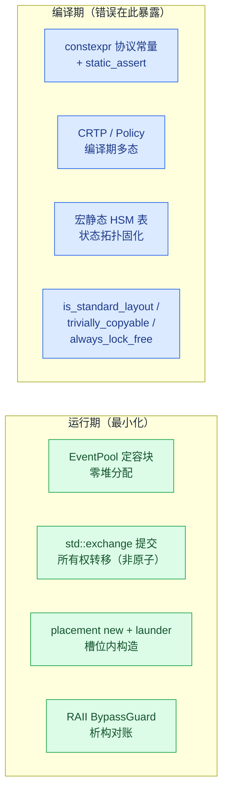

# ISP Pipeline C++17 编程约束与指针治理

**关联文档**：架构设计见 `example_ISP_pipeline_design_architecture_zh.md`；故障处理见 `example_ISP_pipeline_design_consistency_avoidance_zh.md`；功能验收见 `example_ISP_pipeline_functional_test_report_zh.md`。

**阅读指引**：本文承接一致性文档第 3 章的故障分析，给出示例所依赖的两类编程纪律——C++17 编译期约束与设计模式（第 1 章）、指针与所有权治理（第 2 章）。断言与验证结果不在此重复，见一致性文档"验证结果"章。

## 1. C++17 约束与设计模式

示例使用 C++17 编译期检查、固定容量存储和明确的模块边界。

### 1.1 纪律清单

| 约束 | 落点 | 检查方式 |
|---|---|---|
| 协议常量 constexpr | 帧字节数 / 恒等 Zoom 步长 / streamVldNum | `static_assert` 锁定文档证据值 |
| 布局约束 | `FrameGeometry` / `UvcMeta` / `FrameStamp` | `static_assert(is_standard_layout && is_trivially_copyable)`——跨 AO 边界的事件载荷可安全位表示 |
| 移动约束 | `FrameGeometry` 事务快照交换 | `static_assert(is_nothrow_move_constructible)`——回滚/提交路径不抛 |
| 无锁假设 | DDR 环索引、运行标志 | `static_assert(atomic<T>::is_always_lock_free)`——目标平台无隐式锁 |
| 无堆热路径 | `EventPool` + `std::array` 定容块 | 全局无堆事件分配；运行期断言 `pool.used()==0`（零泄漏）；构建级 `-fno-exceptions -fno-rtti` |
| placement new + std::launder | DDR 槽位 `FrameStamp`、地址缓存记录 | 对象生命周期在槽位内存内开始，`std::launder` 合法化访问（C++17 对象模型） |
| CRTP | `GainNodeBase<Policy>` / `FusedNodeBase<Policy>` | 编译期多态，零虚函数开销；高低增益链、增强/TPD 链共用一套节点骨架 |
| 编译期策略 | `Policy::apply`（节点变换）、`QuiescePolicy`（停稳门面） | `if constexpr` 路径选择，运行期零分支 |
| 命令模式 | `kIrscCmdSequence` 表 | 多步硬件初始化退化为表驱动 + 事件回执，编排器只数 ack |
| 宏静态 HSM 表 | `COACT_HSM_STATES` / `COACT_HSM_TRANS` | 十余个 AO 的状态/转移表全部编译期生成，无运行期构建 |
| std::exchange 提交 | 几何提交、版本推进、槽位戳交换 | 提交点的所有权转移表达：单线程所有权前提下读旧值与写新值一步完成、旧副本不留——不是并发原子操作，不提供线程安全 |
| RAII | `BypassGuard` | 旁路配对由析构保证，任何退出路径不漏 resync |
| 接口标注 | 全接口 `[[nodiscard]]` / `noexcept` | 返回值不可忽略；动作函数不抛 |

### 1.2 两个代表性片段

CRTP 节点骨架——高低增益链共用 `GainNodeBase<Policy>`，变换策略经 CRTP 在编译期解析，公共帧路径（DN → DDR → 策略变换 → DDR → 完成事件）只写一遍：

```cpp
template <typename Policy>
struct GainNodeBase {
    // Common frame path: DN -> DDR -> policy transform -> DDR -> done event.
    // Returns false when the pool is exhausted (event dropped).
    // Policy transform (compile-time dispatch; if constexpr keeps the
    // ...)
};
using LowGainNode  = GainNodeBase<LowGainPolicy>;
using HighGainNode = GainNodeBase<HighGainPolicy>;
```

宏静态 HSM 表——每个 AO 的状态与转移在编译期固化为 `constexpr` 数组，Dispatcher 按表驱动：

```cpp
COACT_HSM_STATES(kIrscStates, IrscCtx, "Root", "Active");
COACT_HSM_TRANS(kIrscTransitions, IrscCtx, Sig::kIrscCmd, onIrscCmd);
```

重配 AO 是最完整的应用：`kRecfgStates`（Root + 7 业务状态，8 表项）+ `kRecfgTransitions`（11 弧——7 条业务弧 + 4 条 stale `kRecfgStage` 吸收弧）全部为 `inline const` 数组，转移动作与入口动作分离（硬件命令只在入口动作发出，见一致性文档 3.2）。



*图 1（蓝=编译期，绿=运行期）：工程纪律的分工——一致性假设尽量在编译期变成类型错误，运行期只留不可编译化的少量动作。*

## 2. 指针与所有权

"边界清晰"的另一半是指针治理。嵌入式 C++ 无法完全消灭指针（硬件地址、DMA 缓冲本质就是内存位置），但示例把裸指针压缩到三类合法场景，其余全部用引用、移动语义与静态策略表达。

### 2.1 裸指针的三类合法保留

| 场景 | 示例 | 为什么必须是指针 |
|---|---|---|
| 可空句柄 | `pool->alloc_typed()` 返回 `nullptr` 表示池耗尽 | 可空性是协议的一部分（背压信号），引用无法表达 |
| 硬件/DMA 地址 | `FrameStamp*` 指向 DDR 槽位 | 物理内存位置，无引用语义可用 |
| 非拥有观察 | `ctx.pool` / `ctx.rt` 指向装配期绑定的单例 | AO 上下文默认构造 + 后绑定，指针可重置；coact 框架 `AoBase` 的非拥有契约 |

除此之外的所有传参、返回、成员访问一律使用引用（`const T&` 入参、`T&` 出参）或值/移动语义。

### 2.2 引用与移动的具体应用

```cpp
// DdrCtx::write: src is the caller's stack buffer, read-only borrow
// (DMA semantics) -> const pointer, the documented hardware-address case.
[[nodiscard]] uint16_t write(DdrId id, uint32_t frame_id, const uint8_t* src);

// RecfgAoCtx commit: the old geometry is MOVED OUT, no dangling copy is
// left behind -> std::exchange implements the move-commit.
active_geom = std::exchange(target_geom, FrameGeometry{});

// AddrCache::store: placement-new constructs IN PLACE inside the cache
// slot — no temporary, no copy; same discipline the event pool uses.
::new (static_cast<void*>(&rec)) AddrRecord{layout_version, addr, true};

// QuiescePolicy: stateless compile-time policy, all-static functions —
// no pointer, no reference, pure type-level dispatch.
```

### 2.3 治理规则

1. **参数传递**：只读小对象按值（`TargetId` / `SrMagx`），大对象 `const&`，可空资源句柄才用指针并在命名上暴露（`pool` / `xxx_target` 这类"绑定槽"）。
2. **返回值**：`[[nodiscard]]` 强制调用方处理；可空结果返回指针（池耗尽）并立即判空——这是唯一允许"裸"的返回。
3. **成员所有权**：AO 上下文里的 `PoolT*` / `Rt*` 是**非拥有观察指针**，生命周期由 `main()` 的栈序保证；与裸拥有的区别在注释与命名上显式声明，不让读者猜。
4. **禁止指针算术**：DDR 槽位访问经 `std::launder` 合法化，唯一的偏移运算（`slot_mem + kStampBytes`）封装在 `DdrCtx` 内部，外部只见 `read`/`write` 接口。


*图 2（黄=裸指针合法域，绿=现代所有权）：指针治理边界。裸指针只保留三个不可替代的语义位，其余所有权表达全部现代化。*
