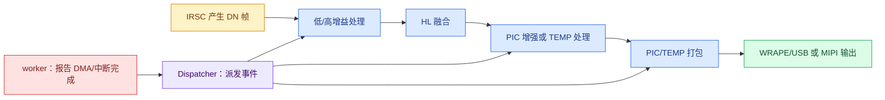
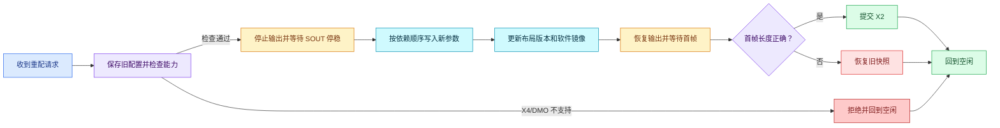
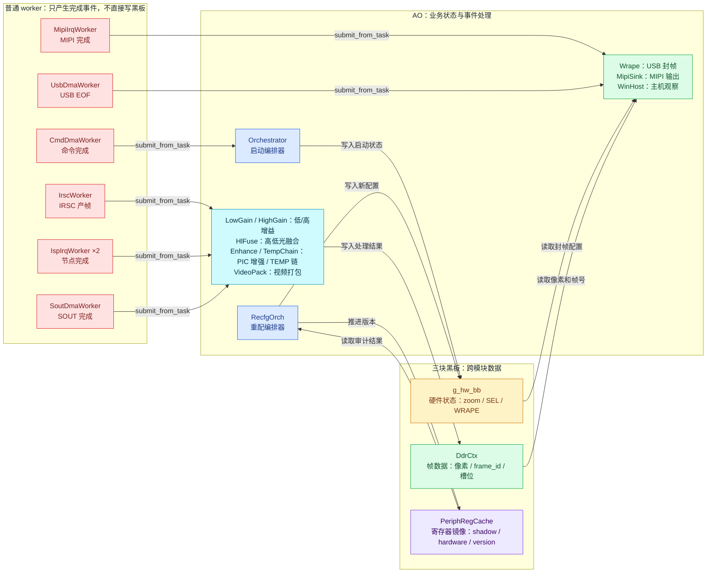
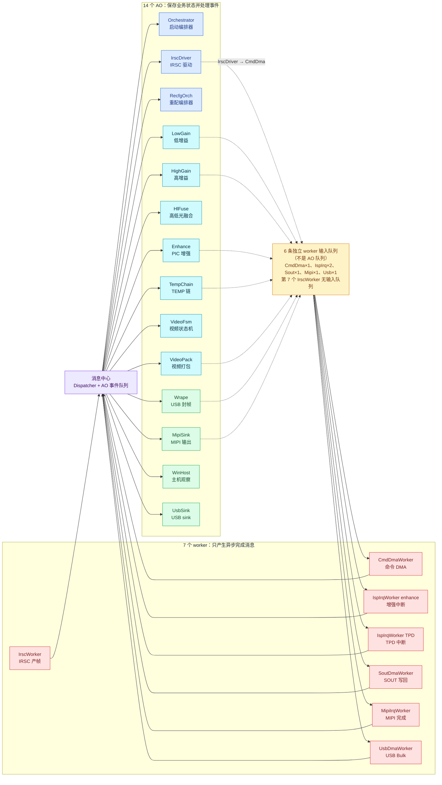

# coact ISP Pipeline 示例架构

> 本文仅说明业务流程、模块职责和状态变化；验证结果见 `example_ISP_pipeline_functional_test_report_zh.md`，逐阶段输出见 `isp_pipeline_demo_run_log_fresh.txt`。
> 故障处理见 `example_ISP_pipeline_design_consistency_avoidance_zh.md`，代码问题见 `example_ISP_pipeline_review_record_code_architecture.md`。

## 阅读顺序

1. 第 1 章：了解一帧数据的产生、处理、输出和停机顺序。
2. 第 2 章：了解 X1→X2 重配、三块黑板和九类业务问题。
3. 第 3 章：了解 AO、worker 和会话状态的职责边界。

图中颜色统一表示：黄色=输入/等待，蓝色=处理/正常状态，青色=数据或应用步骤，紫色=消息中心/检查，绿色=输出或成功，红色=错误、拒绝或回滚。

---

## 1. 业务流程

### 1.1 一帧数据的路径

实线表示帧数据路径，紫色节点表示完成事件的派发路径。像素数据留在 DDR，事件只携带帧号和槽位。

### 1.2 Preview Start 启动顺序

| 阶段 | 业务动作 | 结束条件 |
|---|---|---|
| Phase1 | 预加载启动数据 | bypass 场景计数为 0 |
| Phase3 | 加载预览初始化数据 | 初始化入口完成 |
| Phase4 | 应用模式、尺寸和输出参数 | 会话进入 `INIT` |
| IRSC | 执行 init/start/ctrl/output_enable | 4 条完成回执返回 |
| ISP | 初始化 8 个节点 | 8 个 ready 回执返回 |
| Video | 初始化并启动 PIC/TEMP | 会话进入 `RUNNING` |

KBC 输出使能先于 IRSC 输出使能；视频流只有在两者完成后才启动。

### 1.3 运行时帧处理

IRSC 以 33333 微秒节拍产生 30 帧。低增益和高增益链处理同一个 `frame_id`，`HlFuseAo` 配对后分别送往 PIC 和 TEMP。PIC 经 WRAPE 封帧后由 USB Bulk 发送，TEMP 经 MIPI CSI TX 发送。

在 `ISP_DEMO_CORO` 下，7 个 worker 的执行逻辑由一个 pump 线程轮流推进；日志末尾的 `worker pthreads: 0` 表示没有为 worker 单独创建 pthread。

### 1.4 停机顺序

停机顺序与启动顺序相反。只有 AO 队列和 worker 队列排空后，才关闭 Runtime。

---

## 2. 配置切换与故障处理

### 2.1 X1→X2 重配流程

| 步骤 | 判断标准 | 失败处理 |
|---|---|---|
| 能力检查 | 倍率和流模式在支持矩阵内 | 不写硬件，直接拒绝 |
| 输出停稳 | 收到 `kSoutIdle` | 不进入参数应用 |
| 参数应用 | AI→DMA→几何→时钟顺序完成 | 保留旧快照 |
| 版本同步 | `layout_version` 递增 | 旧地址记录失效 |
| 首帧确认 | 实际帧长等于目标几何 | 回滚旧配置 |

### 2.2 三块黑板的业务分工

| 黑板 | 保存内容 | 写入方 | 读取方 | 失效判断 |
|---|---|---|---|---|
| 硬件状态 | zoom、SEL、WRAPE 帧长、会话状态 | 编排器/重配流程 | 封帧逻辑、guard | 配置阶段和会话状态 |
| 帧数据 DDR | 各处理阶段像素、帧号、槽位状态 | 对应处理阶段 AO | 下游 AO、WRAPE、MIPI | 帧号和槽位所有权 |
| 寄存器镜像 | shadow、hardware、地址版本 | 唯一 `write()` 入口 | `audit()`、地址查询 | 镜像值和版本号 |

像素不经过事件复制；跨模块只传帧号和槽位。三块黑板分别管理配置、数据和寄存器镜像，避免不同失效规则互相覆盖。

*图 3：AO 与三块黑板的读写关系。编排器/重配 AO 写入配置，数据 AO 写入 DDR，输出 AO 主要读取；寄存器镜像通过版本号和审计结果支持重配判断。*

### 2.3 九类问题的业务表现

| 编号 | 现象 | 处理方式 |
|---|---|---|
| U1 | video 和 SOUT 各自计算帧长 | 统一使用 `FrameGeometry` 和 `apply_magx()` |
| U2 | 新旧几何同时存在 | 停止输出，首帧确认后提交 |
| U3 | X2 数据按 X1 长度提前 EOF | Identity Zoom 固定下游几何 |
| U4 | 旧 shadow 覆盖产测直写值 | `BypassGuard` 退出时刷新 shadow |
| U5 | DDR 重排后命中旧地址 | `layout_version` 不匹配即失效 |
| U6 | 镜像后检测框未同步 | 坐标统一经过 `transform()` |
| U7 | 不同硬件使用不同停稳方式 | `QuiescePolicy` 统一接口 |
| U8 | 延迟尖峰超过三缓冲窗口 | 帧戳识别 overrun，比较八缓冲结果 |
| U9 | 未停稳就重启导致旧几何首帧 | 只允许 `kSoutIdle` 后进入 Applying |

---

## 3. 运行角色与状态

### 3.1 AO、worker 与消息中心的关系

*图 4：AO action 将 job 写入 WQ，WQ 再连接到 6 个接收任务的 worker；IrscWorker 不连接 WQ，因为它自主产帧。所有 worker 完成后再将事件送入消息中心，进入 14 个 AO 的事件队列。*

队列数量关系：14 个 AO 各有自己的 AO 事件队列；7 个 worker 中只有 6 个接收 job，因此只有 6 条 worker 输入队列，彼此独立，绝不共用。

| AO | 负责的业务动作 |
|---|---|
| `OrchestratorAo` | 启动编排，收集完成回执 |
| `IrscDriverAo` | 执行 IRSC 四步命令 |
| `RecfgOrchAo` | 管理 X1→X2 重配、提交和回滚 |
| `LowGainAo` / `HighGainAo` | 处理两路增益数据 |
| `HlFuseAo` | 按 `frame_id` 配对并融合 |
| `EnhanceAo` / `TempChainAo` | 处理 PIC/TEMP 两条链 |
| `VideoFsmAo` | 管理两路视频启停和 deinit |
| `VideoPackAo` | 打包并发起 SOUT 写回 |
| `WrapeAo` | 判断帧长并生成 EOF/ERR+EOF |
| `MipiSinkAo` | 管理 MIPI 发送完成 |
| `WinHostAo` | 记录主机帧数、截断和间隙 |
| `UsbSinkAo` | 保留 USB sink 注册位，T37 中 PIC 由 WRAPE 输出 |

AO 只在自己的事件处理步骤中修改状态，跨 AO 动作通过事件传递。

### 3.2 worker 的业务职责

| worker | 模拟行为 | 完成事件 |
|---|---|---|
| `IrscWorker` | 按帧节拍产生 DN 数据 | `kFrameIrscOut` |
| `CmdDmaWorker` | 异步执行 vdcmd 命令 | `kIrscDmaDone` |
| `IspIrqWorker` ×2 | enhance/TPD 完成中断 | `kIspNodeDone` |
| `SoutDmaWorker` | SOUT 写回 DDR | `kSoutDone` |
| `MipiIrqWorker` | MIPI TX 完成中断 | `kMipiTxDone` |
| `UsbDmaWorker` | WRAPE Bulk 发送 | `kFrameEof` |

worker 不保存业务状态、不直接修改 AO 上下文。6 个有输入任务的 worker 实例分别管理自己的 mutex/cond 队列或单槽；`IrscWorker` 自主按帧节拍运行，不接收 AO job。完成后统一使用 `submit_from_task()` 产生 coact 事件，最终进入目标 AO 的事件队列。

### 3.3 运行模式边界

pthread 模式为每个 worker 创建独立线程，用于验证原有行为；coro 模式将 worker 执行逻辑放入一个 pump 线程，用于验证单线程公平调度。两种模式共用业务 AO、事件和数据结构。

### 3.4 消息中心的两类队列

业务路径中有两种不同队列，名称和用途不能混用：

| 队列 | 数量/拥有者 | 放入内容 | 取出方 |
|---|---|---|---|
| AO 事件队列 | 14 条，每个 AO 一条 | `kFrameIrscOut`、`kIspNodeDone`、`kSoutDone`、`kFrameEof` 等业务事件 | Dispatcher 派发给对应 AO |
| worker 输入队列 | 6 条，分别属于 6 个有输入任务的 worker | `NodeIrqJob`、`SoutJob`、USB job、IRSC 命令等任务 | 对应 worker 执行 |

`IrscWorker` 是第 7 个 worker，按传感器节拍自主产帧，没有输入 job 队列。它产生的 `kFrameIrscOut` 通过 `submit_from_task()` 进入 AO 事件路径。

worker 输入的完整路径是：

*图 5：job 队列负责“交给哪个 worker 执行”，AO 事件队列负责“完成后通知哪个 AO”；两者由 `submit()` 和 `submit_from_task()` 分开。*

### 3.5 业务对象与 RS500 模块

| RS500 功能区域 | 示例业务对象 | 主要责任 |
|---|---|---|
| Preview Start 编排 | `OrchestratorAo` | 推进 Phase1/3/4，收集完成回执 |
| IRSC 输入 | `IrscDriverAo`、`IrscWorker` | 发送四步命令、按帧节拍产生 DN |
| ISP 双增益与融合 | `LowGainAo`、`HighGainAo`、`HlFuseAo` | 两路处理、按帧号配对融合 |
| PIC/TEMP 处理 | `EnhanceAo`、`TempChainAo` | 分别完成 PIC 和 TEMP 变换 |
| 视频管理 | `VideoFsmAo`、`VideoPackAo` | 两路启停、打包和 SOUT 写回 |
| 输出与观察 | `WrapeAo`、`MipiSinkAo`、`WinHostAo` | 封帧、MIPI 发送、主机结果记录 |
| 运行态重配 | `RecfgOrchAo` | 能力检查、停稳、提交或回滚 |

该表描述业务责任，不表示每个 RS500 模块都对应一个真实 pthread。coro 模式下上述 worker 执行逻辑由同一个 pump 承载，AO 数量和事件关系不变。

#### 3.5.1 模块之间传递什么

| 上游 | 传递内容 | 下游 | 下游动作 |
|---|---|---|---|
| `IrscWorker` | DN 帧的 `frame_id` 和 DDR 槽位 | `LowGainAo`、`HighGainAo` | 读取 DN，分别计算两路结果 |
| `LowGainAo` | 低增益完成事件 | `HlFuseAo` | 等待同一 `frame_id` 的高增益结果 |
| `HighGainAo` | 高增益完成事件 | `HlFuseAo` | 与低增益结果配对后融合 |
| `HlFuseAo` | 融合完成事件和 DDR 槽位 | `EnhanceAo`、`TempChainAo` | 分别执行 PIC、TEMP 处理 |
| `EnhanceAo` | PIC 节点完成任务 | `IspIrqWorker enhance` | 模拟硬件中断延迟并回送完成事件 |
| `TempChainAo` | TEMP 节点完成任务 | `IspIrqWorker TPD` | 模拟硬件中断延迟并回送完成事件 |
| `VideoPackAo` | SOUT 写回任务 | `SoutDmaWorker` | 将打包结果写回 DDR |
| `WrapeAo` | USB 帧长和 Bulk 任务 | `UsbDmaWorker` | 发送数据并回送 EOF |
| `MipiSinkAo` | MIPI TX 任务 | `MipiIrqWorker` | 回送 TX 完成事件 |

事件载荷只描述“哪一帧、哪一个 DDR 区域、哪一个槽位、哪一种结果”，不携带整帧像素。这样可以在不复制像素的前提下，让每个 AO 只处理自己负责的阶段。

#### 3.5.2 启动、运行、停机的责任分配

| 时段 | 编排器 AO | 数据 AO | worker |
|---|---|---|---|
| 启动 | 下发命令并等待回执 | 建立各自状态 | 执行命令或等待任务 |
| 运行 | 处理控制事件和重配请求 | 处理帧并发送下一阶段事件 | 产生帧、模拟 DMA/中断完成 |
| 停机 | 发送 stop/deinit 并等待结束 | 清空在途帧和状态 | 完成剩余 job 后退出 |

这种分工保证“谁决定业务状态”和“谁模拟硬件耗时”不会混在同一个函数中。普通 worker 可以使用内核 mutex/cond 等同步原语等待 job，但业务结果必须通过 coact 事件返回 AO。

### 3.6 关键业务不变量

| 不变量 | 正常要求 | 违反时的表现 | 日志/断言证据 |
|---|---|---|---|
| 帧号配对 | 低增益、高增益、融合使用同一 `frame_id` | 融合拿到不同帧的数据 | `HlFuse` 计数和字节校验 |
| DDR 槽位有效 | 读取前帧戳和槽位状态必须匹配 | overrun，不能静默读取旧帧 | `frame_overrun=0` |
| 配置来源唯一 | WRAPE、Video、DDR 使用同一帧长 | 提前 EOF 或首帧尺寸错误 | T37 `ERR+EOF` 断言 |
| 重配停稳 | 收到 `kSoutIdle` 后才能应用参数 | 新旧几何同时存在 | 重配流程中的停稳步骤 |
| 首帧确认 | 实际帧长等于目标几何 | X2 不提交，恢复旧快照 | `RECOVER` 或 `COMMIT` 日志 |
| 地址版本 | 布局变化后旧 `layout_version` 不可查询 | 旧地址被错误复用 | stale address `MISS` |
| worker 背压 | 忙时拒绝 job，不阻塞 Dispatcher | 拒绝计数增加，业务继续运行 | `rejected=0` 正常基线 |
| 错误隔离 | FIFO/MIPI/USB 错误只增加计数 | HSM 误切状态或 EOF 中断 | 错误注入断言 |
| 停机排空 | AO 事件和 worker job 全部处理完 | 完成事件丢失或资源泄漏 | `pool.used=0`、最终 STOPPED |

读日志时先按上述不变量定位，再查看具体事件码；不要把单条 HSM 迁移当作完整业务结果，业务结果必须同时满足计数器、帧数据和资源终态三个条件。
