# coact ISP Pipeline 一致性问题与处理

> 本文说明 `examples/isp_pipeline/` 中各一致性问题的复现方式、处理方式和验证证据。示例为消息发生级模拟，不代表板级实现。
>
> **证据范围**：本文引用的输出来自 host POSIX 模拟（`build/examples/isp_pipeline_demo`），不代表 RS500 板级行为。当前构建和测试结果以实际命令输出为准；历史版本的评审结论保留在附录。

---

## 1. 范围与数据流

RS500 各复盘文档反复出现同一类结构性病灶：**多模块对同一业务事实、更新时序或完成条件持有不一致的契约**。最典型的具象是"同一事实存了两份（或多份），更新一份时另一份没跟上"——软件影子对硬件寄存器（U4）、旧几何对新几何（U2/U3/U5）、显示路径对业务坐标（U6）、重启指令对停稳确认（U9）。但这条"两份拷贝"主线不覆盖全部：U7 是能力差异被硬编码进调用路径（写者与机制均只有一份，只是分叉），U8 是峰值时延突破缓冲窗口容量（不存在被复制的记录，是预算契约与实际峰值不对等），U6 的变换多点实现则更接近"更新不原子"。因此本文以上位概念——**分布式状态契约不一致**——为根因框架，三分法如下：

| 根因 | 覆盖 | 典型机制 | 架构对策 |
|---|---|---|---|
| 写者不唯一 | U1、U6、花屏（具象为两份拷贝）；U3、U4 | 同一字段两个写入口（U4 旁路）、同一公式两处实现（U1）、同一变换多点实现（U6） | 单一权威 + AO 单写路径 |
| 更新不原子 | U2、U5、U9（具象为两份拷贝） | 变更无冻结窗口整体化（U2）、旧记录无失效判据（U5）、提交无硬件证明（U9） | 事件事务 + 版本失效 + 提交边界 |
| 确认不对等 | U7、U8；U3/U9 的确认侧 | 能力差异硬编码（U7）、峰值时延突破窗口容量（U8）、封帧配置滞后于数据确认（U3） | 统一确认门面 + 显式容量窗口 |

| 编号 | 异常 | 来源文档 | 不一致的两端 | 示例规避 |
|---|---|---|---|---|
| U1 | 口径漂移 | 原子重配 §2.3 模式一 | video 层倍率计算 vs SOUT 层原始值 | 单一权威 `FrameGeometry` |
| U2 | 新旧交替 | 原子重配 §2.3 模式二 | 已改模块新几何 vs 未改模块旧几何 | 重配事务冻结窗口（HSM + 会话守卫，当前 guard 仅覆盖 IRSC 通道） |
| U3 | X2 提前封帧 | T37 UVC 文档 | WRAPE 封帧几何 vs 实际流几何 | Identity Zoom 固定下游 1280x1024 |
| U4 | 参数回灌 | 缓存一致性 §2.1 | 软件影子缓存 vs 产测直写的寄存器 | regmap 三标志协议 + RAII `BypassGuard` |
| U5 | 废弃地址 | 缓存一致性 §2.2 | DDR 布局重算 vs 旧地址记录 | `layout_version` 查即作废 |
| U6 | 坐标失同步 | 缓存一致性 §2.3 | 画面镜像 vs 检测框未变换 | 单一坐标变换权威 `transform()` |
| U7 | 停稳机制分叉 | deinit 不一致文档（Change16517） | SOUT 中断事件 3 ioctl vs FMT888 轮询 26 ioctl | `QuiescePolicy<HasIdleIrq>` 编译期门面 |
| U8 | 峰值破窗丢帧 | 花屏丢帧闪屏文档 §三 | 消费者峰值时延 vs 容忍窗容量 | 显式窗口模型 + DDR 环 overrun 守卫 |
| U9 | 半停重启闪屏 | 花屏丢帧闪屏文档 §四 | 重启指令 vs SOUT 未到 idle | HSM 停稳弧（`kSoutIdle` 唯一触发） |

架构答案只有一条，收束为三个机制：

1. **单一权威**（single authority）：每个会被两处引用的事实只允许一个写者、一个计算公式。
2. **事件传播**（event propagation）：状态变更只能经显式的事件/信号通知下游，禁止"下游下次读时顺便发现"。
3. **提交边界**（commit boundary）：跨模块提交只在一个被声明的边界发生，且必须以硬件证据（首帧字节校验、停稳 ack）为前提，失败走快照回滚。

coact 的主动对象（Active Object, AO）模型把前两类对策变成**结构属性**而非编码纪律：每个 AO 只在自己的单线程 RTC 步骤里接触自己的状态，Dispatcher 串行化派发保证单个 RTC 步骤不可被另一 AO handler 并发执行。**注意保证边界**：单 AO 内的 RTC 步骤串行，不等于跨多个事件的完整事务对全系统原子——重配事务 `Quiescing → … → Commit` 跨越多个事件派发点，其他 AO 的事件可以在这些 RTC 步骤之间执行；跨事件的事务隔离由停流命令、`kSoutIdle` 帧边界停稳证据、`RUNNING.RECFG_TXN` 会话窗口内 IRSC 命令通道门控（`irsc_session_open` guard；流塑形冻结为架构预留，未实现）、以及首帧验证后才发布软件快照共同保证（详见 3.2）。

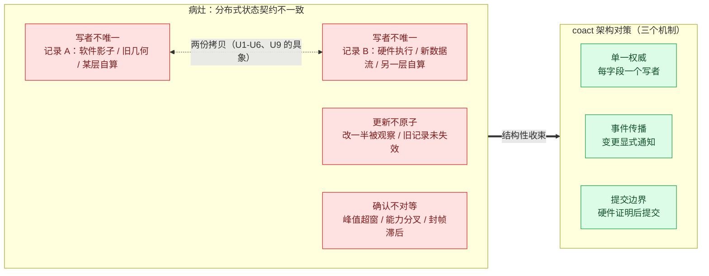

*图 1：九类异常收敛为一个结构答案——"分布式状态契约不一致"（写者不唯一/更新不原子/确认不对等三分法）在事件驱动的单一权威模型里被逐类收束；"两份拷贝"是其中最常见但不完整的具象。*

图 1 走读：左侧红色 `PROBLEM` 泳道中 `A1`/`A2` 之间的虚线弧即"同一事实两份记录"的具象——软件影子对硬件寄存器（U4）、旧几何对新几何（U2/U3/U5）、两层各自计算（U1/U6）；`A3` 是"两份拷贝"覆盖不到的第一类扩展——变更未被整体化（U2/U5 的时序侧面）；`A4` 是第二类扩展——U7 的能力分叉与 U8 的容量预算对等，根本不存在被复制的记录。右侧绿色 `ANSWER` 泳道三个节点与 6.2 节图 14 的三向收束一一对应：`单一权威` 收束写路径分叉（U1/U3/U4），`事件传播` 收束传播缺失（U2/U5/U6/U7），`提交边界` 收束提交无边界与确认不对等（U3/U8/U9）。

### 1.1 示例数据流

`isp_pipeline_demo.cpp` 用一个文件建模 RS500 Preview Start 的完整链路，文件头注释给出与真实代码的逐行映射：`applications/camera_app.c` 对应 main() + PreviewCmd 表 + Phase 编排器，`applications/app.c` 的 `auto_preview_start` 对应 boot 编排流程，`module/camera/stream_config.c` 对应 StreamConfigService（Phase1/3/4 数据装载管线），`module/rte/rte_config.h` 的 preview_cmd 对应 `PreviewCmdInfo` + `kProductModes`/`kCaliModes` 模式表，`sensor_input_lsv_source` + `drv_irsc` 对应 IrscDriver AO，`drv_isp`/`drv_isp_stream`/`hal_isp_top` 的 KBC/BPVHBC/RMVC/TNR/HBCDPC/DDBP/VBC 八节点对应 IspPipelineAO 及各节点 AO，`video_lsv_stream_manager` 的前向 init/反向 deinit 对应 VideoStreamFSM（IDLE/READY/RUNNING/ERROR），`isp_stream_dma` 三帧环对应 StreamDmaBuffer，`video_com_*` 对应 PicVideo/TempVideo 打包 AO，USB WRAPE / MIPI CSI TX 对应 WRAPE AO / MipiSink AO。全链路为：

IRSC 探测器 → 高/低增益 ISP 双链 → HL 融合 → 增强（PIC）/TPD（TEMP）双链 → PIC/TEMP Video 打包 → WRAPE（USB 出流）/ MIPI 输出。在此之上叠加四组一致性实验：运行态原子重配（RecfgOrchestrator AO）、regmap 缓存协议（PeriphRegCache）、deinit 停稳机制对比（QuiescePolicy）、三类画面异常（花屏/丢帧/闪屏）。

#### 1.1.1 AO 与 RS500 模块的映射

示例装配了 **14 个 AO** 与 **7 个 worker 实例（6 种类型）**，其中 `CmdDmaWorker`/`IspIrqWorker`/`SoutDmaWorker`/`MipiIrqWorker` 四类派生自 `WorkerBase<Derived, Job, Depth>` CRTP 骨架（环深按通道语义选择：命令通道 4、帧侧通道 2-3），`IrscWorker` 自带帧节拍循环、`UsbDmaWorker` 自带单槽 mutex+cond（刻意的停机契约对照组，见架构文档 §3.1）。AO 全部经 Dispatcher 单线程派发协作；worker 是 pthread，只模拟"消息的发生"（异步往返、模拟中断回调），不持有业务状态——它们把事件投回 coact 事件面，业务逻辑全部留在 AO 的 RTC 步骤里。以下清单以 `main()` 中 `rt.bind()` 的实际装配顺序为唯一来源：

| coact 实体 | 类型 | RS500 模块/线程角色 | 文档锚点 |
|---|---|---|---|
| `OrchestratorAo` | AO | `camera_app.c` 应用层编排 | 复盘踩坑 Preview Start 流程 |
| `IrscDriverAo` | AO | `drv_irsc` 驱动 + 4 步命令序列 | 复盘踩坑 KBC→IRSC 顺序 |
| `LowGainAo` / `HighGainAo` | AO | `drv_isp` 双增益链节点 | 原子重配 §2.3 依赖序 |
| `HlFuseAo` | AO | `drv_isp` 高低光融合 | — |
| `EnhanceAo` / `TempChainAo` | AO | `drv_isp_stream` PIC/TEMP 双链 | 原子重配 §2.3 模式二 |
| `VideoFsmAo`（PIC+TEMP 合并） | AO | `video_lsv_stream_manager` 双镜像 FSM（前向 init/反向 deinit） | deinit 不一致文档 |
| `VideoPackAo`（PIC+TEMP 合并） | AO | `video_com_*` 打包 + SOUT 写回 | 原子重配 §2.3 模式一 |
| `UsbSinkAo` | AO | USB UVC 输出（合并后 idle） | 合并后 usb AO idle |
| `MipiSinkAo` | AO | MIPI CSI TX 输出 | T37 §6 四点观察 |
| `RecfgOrchAo` | AO | AI 超分 X1→X2 运行态重配（HSM） | 原子重配 §4.5 / §5.2 |
| `WrapeAo` | AO | USB WRAPE 封帧（T37 7.6.5） | T37 §6 板测要求 |
| `WinHostAo` | AO | Windows UVC 主机观察者 | T37 §6 四点观察 |
| `IrscWorker` | worker | IRSC 帧中断（按帧节拍产帧） | — |
| `UsbDmaWorker` | worker | WRAPE Bulk/UVC 出流 DMA（T37 7.6.5） | T37 §6 |
| `CmdDmaWorker` | worker | vdcmd `rt_device_control` 命令通道 | — |
| `IspIrqWorker` ×2 | worker | enhance/TPD 节点完成中断（ISP hw IRQ 0/1） | — |
| `SoutDmaWorker` | worker | SOUT→DDR 二级 DMA 写回 | — |
| `MipiIrqWorker` | worker | MIPI CSI TX 完成中断 | — |
| `DdrCtx`（非 AO 单例） | 数据面 | `isp_stream_dma`/`stream_out_dma` DDR 环 | 花屏丢帧闪屏 §三 |

PIC/TEMP Video FSM 与打包器已各自合并为单 AO（`VideoFsmAo`/`VideoPackAo`，`VideoCtx` 注释明言"merged video FSM context (two mirrors)"，PIC/TEMP 各持一个 `VideoPathMirror`）；T37 合并后 PIC 数据面归 WRAPE，`UsbSinkAo` 保持 idle。与早期版本相比，SOUT（`SoutDmaWorker`）与 MIPI（`MipiIrqWorker`）两个 worker 不再遗漏在清单外。

**最终形态补充（重构定型后的三个新机制）**：其一，**乘积状态表**——`VideoFsmAo` 为 3x3 = 9 态（PIC 相位 I/R/G × TEMP 相位 I/R/T，31 弧含 6 条 reject）、`VideoPackAo` 为 2x2 = 4 态（`kPackBA`/`PS`/`TS`/`BS`）、`EnhanceAo`/`TempChainAo` 为 2 态（Active/IrqPending）、`MipiSinkAo` 为 2 态（ACTIVE/TX_PENDING）——单叶 HSM 表达双流，"两路同时停在写回窗口"是表里数得出的显式状态。其二，**parking ring（深度 4）**——AO 递交异步通道后帧描述符停入停靠环，完成事件按 `frame_id` 匹配释放（`std::exchange(*hit, IoMeta{})` 一步取走），中断完成与帧提交的交错不再需要锁或单飞假设；不匹配的完成计入 stale 计数。其三，**提交拒绝走自提交完成**——通道环满时 AO 给自己投合成完成事件经正常弧回家（计数、不内联处理），与"硬件命令只在 entry 动作发出"是同一契约的两个侧面。三个机制的架构展开见姊妹文档 §3.3/§4.5。

worker 与 AO 的边界是本示例的一条硬纪律：`UsbDmaWorker` 注释明言"WrapeAo（生产者，Dispatcher 线程）→ UsbDmaWorker（执行者，自有线程）→ WinHostAo（观察者，回到 Dispatcher 线程），唯一耦合是事件平面"。worker 从不直接改 AO 状态，一切以 `submit_from_task` 事件回归——这正是第 2 章"事件事务"在跨线程边界上的延伸。

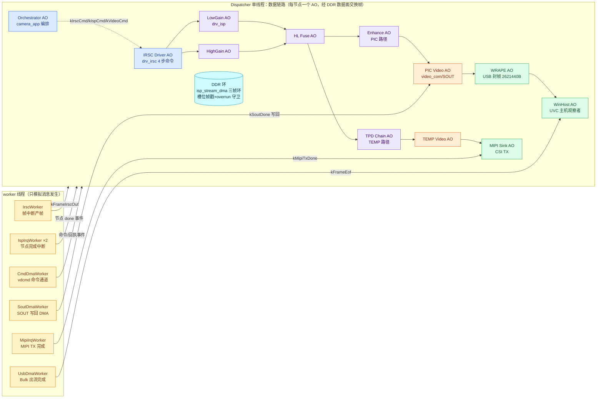

*图 2：AO/worker 与 RS500 模块的双平面映射。黄色 worker 只负责"消息的发生"（模拟硬件中断与 DMA 完成的异步往返），全部业务状态在 Dispatcher 单线程上的 14 个 AO 内。*

图 2 走读：黄色泳道是七类异步源——`IrscWorker` 按 `period_us` 帧节拍产 `kFrameIrscOut` 事件（对应 IRSC 帧中断；DN 像素写入 `DdrId::kDdrDn` DDR 区，事件载荷只带槽位描述符 `ddr_slot`/`ddr_id`，像素不过事件通道，对应 RS500 `video_isp_stream_rx_ind` 的纪律）；`UsbDmaWorker` 接收 WRAPE AO 经 `submit()` 递交的 Job（调用发生在 Dispatcher 线程、永不阻塞），按 `kBulkXsfBytes=16384` 事务粒度搬运后从自有线程投递 `kFrameEof` 给 `WinHostAo`——这一"完成中断回调"往返正是 T37 7.6.5 Bulk 事务链的建模；`IspIrqWorker`（enhance/TPD 两个实例）模拟 ispSW 节点完成中断，`CmdDmaWorker` 模拟 vdcmd `rt_device_control` 命令通道的异步往返，`SoutDmaWorker` 模拟 SOUT→DDR 二级写回，`MipiIrqWorker` 模拟 MIPI TX 完成中断——全部 worker 只产生事件、不碰状态。绿色泳道是输出侧：PIC 流经 WRAPE AO 封帧（合并 T37 场景后 PIC 数据面归属 WRAPE，`UsbSinkAo` 保持 idle，运行输出明言 "usb_sink: idle (T37 moved the PIC data plane to WRAPE)"），TEMP 流经 MipiSink AO。橙色 `PIC Video AO` 即 `video_com_*`/SOUT 对应物——U1 口径漂移的故障层；编排器虚线弧 `kIrscCmd`/`kIspCmd`/`kVideoCmd` 是 Phase4 参数应用命令，`kIrscCmdSequence` 命令表在 IRSC Driver AO 内按序执行并逐步回执 `kIrscReady`。DDR 圆柱贯穿全链：每个节点 AO 在自己的 RTC 步骤读写 DDR 槽位，`FrameStamp` 帧戳与 overrun 守卫见 3.8 节。

---

## 2. 事件与状态管理

传统固件里，"更新配置"是一串函数调用：`set_zoom()` 改一处、`set_sout_frame()` 改另一处、`set_dma_len()` 改第三处。调用序列的中间态就是新旧交替窗口（U2）；任何一处漏改就是口径漂移（U1）；任何一处被旁路调用就是缓存分叉（U4）。防御手段只能靠编码纪律与 code review，而纪律没有编译器背书。

coact 把同一件事变成**一次事件事务**：业务层提交一个携带完整目标配置的事件；拥有该设备的 AO 在单线程 RTC 步骤里按依赖序应用全部变更，然后在一个声明的提交边界（首帧字节校验通过）之后才更新软件权威状态。**三个层次的概念必须区分**：

1. **单次 RTC 步骤的原子性**：Dispatcher 保证单个 AO 的单次 handler 执行不可被另一 AO handler 并发执行——同一状态的两个访问不会交错。这是结构属性，不需要锁。
2. **跨事件的事务隔离**：重配事务 `Quiescing → Applying → Syncing → Resuming → Commit` 跨越多个事件派发点，其他 AO 事件可以在这些 RTC 步骤之间执行。阻止业务数据观察到中间配置的不是串行化本身，而是四道附加防线：数据面已收到停流命令（`rcQuiescingEntry` 发 `SOUT_STOP`，当前实现为内联模拟）；`kSoutIdle` 提供帧边界停稳证据；`g_session` 处于 `RUNNING.RECFG_TXN` 窗口内（会话门控的当前实现仅覆盖 IRSC 命令通道——`irsc_session_open` guard 在 RECFG_TXN 期间拒绝 IRSC 命令；video/pack/enhance/tpd 无冻结 guard，全流冻结为架构预留，未实现）；首帧验证完成前不发布新软件快照。
3. **并发原子操作**：`std::exchange` **不是**原子操作，不提供任何线程安全保证。它解决的是"取旧值与赋新值在单线程所有权前提下一步完成"的代码表达问题（提交点不留旧副本），不能替代 `std::atomic`、锁或单线程所有权。跨线程共享的状态（如 `g_session`）用的是 `std::atomic` 并以 `is_always_lock_free` 锁定。

简言之：Dispatcher 保证单个 RTC 步骤不可被另一 AO handler 并发执行；跨 RTC 的事务隔离由停稳确认、状态守卫（IRSC 侧示范的门控模式，全流冻结待扩展）、提交边界和最终发布共同保证。中间态对其他 AO 不可见不是因为硬件有原子交换点（原子重配文档 §4.4 已明确平台没有），而是因为**可见窗口被上述防线压缩到每次发布之后、下次发布之前**。

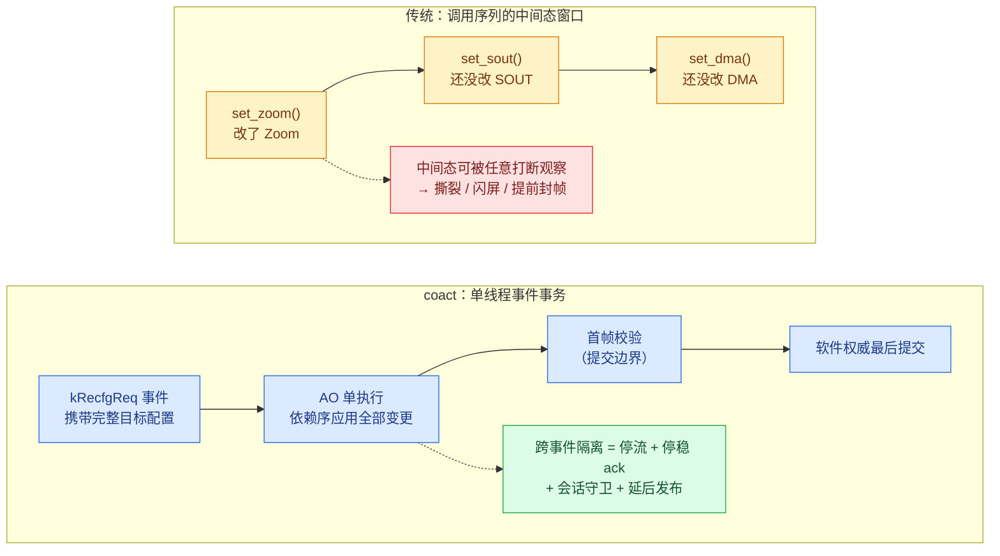

*图 3：调用序列 vs 事件事务。单 RTC 步骤的原子性来自执行模型串行化；跨事件的隔离来自停稳/守卫/延后发布四道防线，不来自串行化本身。*

图 3 走读：上排 `OLD` 泳道的三个黄色节点是 U2 故障的最小形态——三个 setter 各改一处，红色节点指出任意中断或其他线程都可观察到只改一半的状态；这正是《嵌入式显示链路原子重配设计》§4.4"平台没有硬件原子交换点"前提下的裸奔形态。下排 `NEW` 泳道的四个蓝色节点对应 3.2 节 `RecfgOrchestrator` 的真实弧：`kRecfgReq` 事件（携带目标倍率）进入 Idle→Quiescing 弧，`rcEnterApply` 在单个 RTC 步骤内按依赖序（AI→DMA→几何→时钟）应用全部变更——**这一步**的原子性由 Dispatcher 串行化保证；`kFirstFrame` 首帧校验即提交边界，`std::exchange` 完成所有权转移表达（提交点不留旧副本，单线程前提下的读旧写新）。绿色节点明确列出跨事件隔离的真实来源——串行化只覆盖单步，不覆盖整条事务。

### 2.1 三条可检查的纪律

示例代码把上述模型落成三条可机械验证的纪律：

1. **写路径唯一**：设备的每个配置字段只有一个 AO action 可以写。重配事务里改几何的是 `rcEnterApply` 一个函数；改 `layout_version` 的是 `rcEnterSync` 一个函数。代码审查可以机械验证"每字段一个写者"。
2. **读路径单一权威**：所有下游消费者从同一结构取值。`FrameGeometry::bytes_per_frame()` 是唯一帧长公式，`apply_magx()` 是唯一倍率推算入口，无人自行重算。
3. **提交边界声明式**：软件状态在硬件证明（首帧字节等于权威几何）之前绝不提交；失败走 `old_geom_snap` 快照恢复，不留下"软件说成功、硬件是旧值"的中间态。这正是缓存一致性文档 §3.7 指出的多数自研代码缺失的环节。注意回滚范围的诚实边界：示例的恢复是**软件权威拒绝提交并恢复软件快照**（`active_geom`/`active_magx`），未建模 AI、DMA、时钟等硬件寄存器的逆序补偿动作，也未验证恢复后的真实首帧——完整硬件回滚超出 host 模拟范围。

### 2.2 事件与命令的统一词汇

链路上所有跨模块交互都是类型化事件，`enum class Sig` 单一词汇表覆盖数据面推进、控制面同步与重配事务三类语义：

| 事件 | 发出方 → 接收方 | 语义 |
|---|---|---|
| `kFrameIrscOut` | IrscWorker → 高/低增益 AO | 探测器出帧（DN 数据入 DDR，载荷只带槽位描述符） |
| `kLowGainDone` / `kHighGainDone` | 增益链 AO → HL 融合 AO | 链尾完成，融合前件到齐 |
| `kHlFused` | HL 融合 AO → PIC/TEMP 双链 | 融合完成，扇出两路 |
| `kEnhanceDone` / `kTempChainDone` | 链尾 AO → 打包 AO | 双链处理完成 |
| `kPicPacked` / `kTempPacked` | 打包 AO → WRAPE / MIPI sink | 打包完成，帧就绪 |
| `kFrameEof` | UsbDmaWorker → WinHostAo | 帧传输终局（完整或 ERR+EOF） |
| `kSoutIdle` / `kFmtIdle` | 停稳块 → RecfgOrchestrator | 帧边界停稳 ack（事件路径） |
| `kFirstFrame` | 首帧 → RecfgOrchestrator | 提交边界的硬件证明 |
| `kRecfgReq` / `kRecfgStage` / `kRecfgDone` | 应用 ↔ RecfgOrchestrator | 重配请求 / 阶段自驱 / 终局上报 |
| `kIrscCmd` / `kIrscReady` | 编排器 ↔ IrscDriver AO | 4 步命令表逐步执行与回执 |

事件即数据平面的推进信号，也即控制平面的同步原语——两个平面共享一套词汇，不存在"事件说改完了、数据还在跑旧配置"的缝隙。IRSC 探测器的多步初始化用命令表驱动（`kIrscCmdSequence`），每步经事件回执，编排器只数 ack——这是 U2 冻结窗口的最小形态。数据面像素从不进入事件载荷：`Payload` 只携带 DDR 槽位描述符（`ddr_slot`/`ddr_id`）与路由标签，与 RS500 `video_isp_stream_rx_ind` 不经事件通道搬像素的纪律一致。

---

## 3. 一致性问题与处理方式

本章是文档主体，九类异常各一节，均含故障机理、架构对策、示例落点与测试证据。

### 3.1 U1 口径漂移：单一权威 FrameGeometry

**故障事实**（出自《嵌入式显示链路原子重配设计》§2.3 模式一）：同一份配置下发到两层，video 层自己乘了倍率、SOUT 层直接读原始值，两层各自算出不同的帧字节数，实际输出按错误一端截断。现象是出图尺寸与预期不符且无错误日志；根因一句话——**帧长公式被实现了两次**。

**示例复现**：`FrameGeometry{width, height, bytes_per_pixel}` 与 `apply_magx(in, m)`（`isp_pipeline_demo.cpp`，X2 分支翻倍宽高），文件注释明言"one formula, every layer reads the same value"。复现路径有两条：其一，`apply_magx()` 的 X2 分支——这就是 video 层"自己乘倍率"的那个公式，示例把它收编为唯一实现；其二，3.2 节重配事务的 `inject_stale_sout` 标志让 SOUT 按旧 X1 几何封帧（5537280B）而流已是 X2（22149120B），两层口径分叉的截断现象被直接制造出来。

**规避数据流**：权威结构 `active_geom` 由 `RecfgOrchestrator` 独占——`rcEnterPrecheck`（Idle→Quiescing 弧动作）快照 `old_geom_snap`、推算 `target_geom = apply_magx(active_geom, m)`；Applying 阶段 `rcEnterApply` 注释明言"SINGLE-AUTHORITY rule: every layer reads target_geom"，寄存器写入只引用 `target_geom`；Commit 阶段 `std::exchange` 最后落笔。下游消费者（DDR 环容量、打包器、WRAPE 封帧、Sink 校验）全部读同一结构，`active_geom` 的写者只有事务终局一处。

**自检验证**：断言 `reconfig: committed frame matches authority geometry`（`observed_frame_bytes == active_geom.bytes_per_frame()`）把硬件观测帧长与权威公式输出对齐——任何一层私自重算都会在此暴露。另有 T37 侧 `T37: downstream geometry constant across X1<->X2 rounds`（`g_wrape.configured_frame_bytes == kOutFrameBytes`）从输出端再次锁定口径唯一。

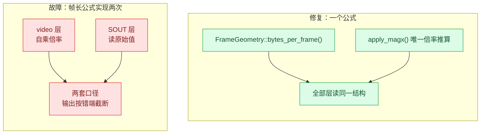

*图 4：口径漂移的本质是公式复制；单一权威把公式收敛为一个函数。*

图 4 走读：左侧 `V1`/`V2` 两个红色节点分别对应真实故障里各自实现公式的两层（video 层乘倍率、SOUT 层读原始值），汇聚到 `C1` 即"输出按错误一端截断"的现象——对应 T37 抓包的 655360B 截断帧。右侧两个绿色节点是示例里的具体函数标识：`FrameGeometry::bytes_per_frame()`（`constexpr`，全链路唯一帧长计算点）与 `apply_magx()`（唯一倍率推算入口），`A3` 收敛节点对应 Applying 阶段"every layer reads target_geom"的写入纪律。

### 3.2 U2 新旧交替：重配事务冻结窗口（HSM）

**故障事实**（出自《嵌入式显示链路原子重配设计》§2.3 模式二与《复盘踩坑总结》）：停流后逐模块串行改参，改到一半时部分模块已是新几何、部分仍是旧几何。现象是若此时数据面重启，输出按混杂几何封帧；根因一句话——**没有一个被声明的冻结窗口把变更整体化**。这是超分 X1→X2 原子重配场景（`RecfgOrchestrator` HSM、magx 能力矩阵）在两份文档中的着落：冻结窗口/整体交换语义对应《嵌入式显示链路原子重配设计》§4.5，阶段枚举与最小调整对应其 §5.2 的五条设计决策。

**示例复现**：`inject_stale_sout` 标志（`RecfgAoCtx` 成员，请求事件 `cmd_arg` 的 0x100 位注入）——Applying 阶段 SOUT 按旧 X1 几何封帧而 AI 已产 X2 流，新旧交替窗口被显式制造，输出 5537280B 截断帧（22149120B 的 25%）。另有 X4 拒绝路径：`SrMagx::kX4` 在请求词汇表里存在，但能力矩阵 `magx_supported()` 处处拒绝——对应文档"脏 NVM 的 X4 过了 sanitize 却在运行期重配失败"的发现。

**规避数据流**：`RecfgOrchAo`（优先级 61，`kRecfgStates` 为 Root + 7 个业务状态共 8 表项，`kRecfgTransitions` 11 弧——7 条业务弧 + 4 条 stale `kRecfgStage` 吸收弧，全部 `inline const` 编译期表）。与源码逐弧核实的实际拓扑为（业务弧）：

```text
Idle --kRecfgReq/rcEnterPrecheck--> Quiescing（预检失败时 action 内拒绝并自驱回 Idle）
Quiescing --kSoutIdle/rcEnterApply--> Applying（at_quiesce 守卫）
Applying --kRecfgStage/rcEnterSync--> Syncing
Syncing --kRecfgStage/rcGoHome--> Resuming
Resuming --kFirstFrame/rcEnterCommit--> Commit（at_resume 守卫）
Commit --kRecfgStage/rcGoHome--> Idle
Quiescing --kRecfgStage/rcGoHome--> Idle（拒绝终局弧）
```

三点诚实的结构说明（经最终源码逐条核实）：

1. **Precheck 在状态表中声明但没有任何转移进入，是不可达状态**——预检实际发生在 `Idle → Quiescing` 弧的转移动作 `rcEnterPrecheck` 内部（只读校验 + 快照），被拒绝的请求在 action 内置位拒绝路径并经 `kRecfgStage` 自驱从 Quiescing 终局弧回到 Idle。重构后的改进：终局弧按镜像姿态 guard（`at_reject_home`/`at_commit_home` 只放行当前事务自身的自驱事件），陈旧 `kRecfgStage`（前一笔事务遗留）落到四条 Internal 吸收弧，不再能误杀活事务——这正是压力跑暴露过的交错。剩余架构债：拒绝路径仍是 action 内隐藏分支而非转移表可见弧，且 `rcGoHome` 仍被复用于三条终局（轨迹统一打印 "PrecheckOrCommit -> Idle"，与实际转移不一致）；评审建议的终局 action 按 Commit/Recover/Reject 拆分尚未落地。
2. **`RecfgStage` 镜像枚举与 HSM 状态不是一一对应**：镜像有 `kCommitted`/`kFailed` 两个终局值，HSM 没有对应状态（Commit 成功/失败在 `rcEnterCommit` 内直接置 `stage = kIdle`）；`kPrecheck` 值从未被设置（预检发生在弧动作里）。镜像的真实角色是**诊断摘要枚举**（供 `recfg_stage_name()` 与恢复代码 switch 使用），不是第二套状态机——但两套词汇并存本身仍是一致性风险。
3. **`layout_version` 在 Syncing 阶段推进**（见 3.5），先于首帧校验和 Commit——失败尝试也会使旧地址记录失效。这是**有意的保守失效策略**：回滚过程中复用旧布局地址比多一次 cache miss 危险得多。

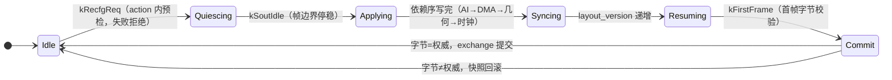

*图 5：重配事务 HSM（与 `kRecfgTransitions` 逐弧核实）。两个回到 Idle 的终局——提交与回滚——都以首帧字节校验为裁决，软件权威最后落笔。Precheck 不是可达状态，预检在 Idle→Quiescing 弧动作内完成。*

图 5 走读：`Idle → Quiescing` 弧对应 `kRecfgTransitions[0]`（`kRecfgReq` 触发，动作 `rcEnterPrecheck`，`magx_supported()` 拒绝 X4 时零硬件动作、经自驱弧回 Idle）；`Quiescing → Applying` 只认 `kSoutIdle`（`at_quiesce` 守卫）——这条弧是 3.9 节 U9 停稳约束的载体；`Resuming → Commit` 只认 `kFirstFrame`（`at_resume` 守卫），提交边界不可绕过；`Applying → Syncing → Resuming` 两段自驱弧（`kRecfgStage`）把同步与恢复各自独立成一个 RTC 步骤。`rcQuiescingEntry`/`rcResumeEntry` 是仅有的两个入口动作（硬件命令只在入口动作发出，转移动作在状态切换之前运行、从那里自提交 ack 会与拓扑竞走）。`RUNNING.RECFG_TXN` 会话窗口随 `kRecfgReq` 受理打开（主线程）、由事务终局动作经 `rcGoHome` 自驱关闭，窗口内会话门控的当前实现仅覆盖 IRSC 命令通道（`irsc_session_open` guard：INIT/RUNNING 白名单，RECFG_TXN 期间拒绝 IRSC 命令）；video/pack/enhance/tpd 无冻结 guard——demo 时序上重配发生在稳态流之后，若需真正的流塑形冻结需扩展 guard 白名单（架构预留，未实现）。

**事务窗口的终局自驱关闭**（已落地）：三条事务终局路径——Precheck REJECT、Commit RECOVER 回滚、clean COMMIT——每条终局 action 置 `ctx.stage = kIdle` 并自提交 `kRecfgStage`，汇流至 `rcGoHome` 转移动作执行，其中在 HsmTrace 前经 `session_advance(kRunning, "recfg txn terminal (self)")` 原子归位；窗口的打开随 `kRecfgReq` 受理（主线程）。三个 pass 各关一次窗（仅窗口打开时 exchange），无双关。线程安全：`session_advance` 是 atomic exchange + printf + diag log，Dispatcher 线程直接调用安全，不涉及事件池/coordinator submit；运行输出可见 3 次 `recfg txn terminal (self)` 轨迹。历史注记：评审指出时窗口由 demo driver 在 main 关闭（打开后轮询终局条件再 `session_advance(kRunning, "recfg txn closed")`，该标签已随修复废弃），此遗留债于 2026-09-03 重构修复，main 侧两处手工 `session_advance` 已删、改为轮询 `g_session == kRunning` 确认。

**测试证据**：demo 注入了文档原始故障（SOUT 按旧 X1 几何封帧，`inject_stale_sout` 标志），事务终局走回滚弧（当前 host 模拟输出）：

```text
[recfg] FAULT: SOUT frames 5537280 B (stale X1) but stream is 22149120 B (X2) -> truncated
[recfg] RECOVER: frame 5537280 B != authority 22149120 B -> rollback to old snapshot
[recfg] COMMIT: active=x2 3840x2884 (22149120 B), observed frame = 22149120 B (authority match)
```

截断比例 5537280/22149120 = 25%，与 T37 抓包的 655360/2621440 = 1/4 在数学形态上相同（两类故障同为"封帧几何滞后于数据流几何"，但证据域不同，见 3.3 与附录 6.4 裁决第 5 条）。自检断言 `reconfig: exactly one commit`（`recfgs_committed == 1`）、`reconfig: X4 precheck reject + X2 fault rollback`（`recfgs_failed == 2`，X4 拒绝与 X2 回滚各计一次）、`reconfig: layout_version advanced`（终值 3）全部 PASS——故障确实发生与规避后消除两侧都被计数器锁死。

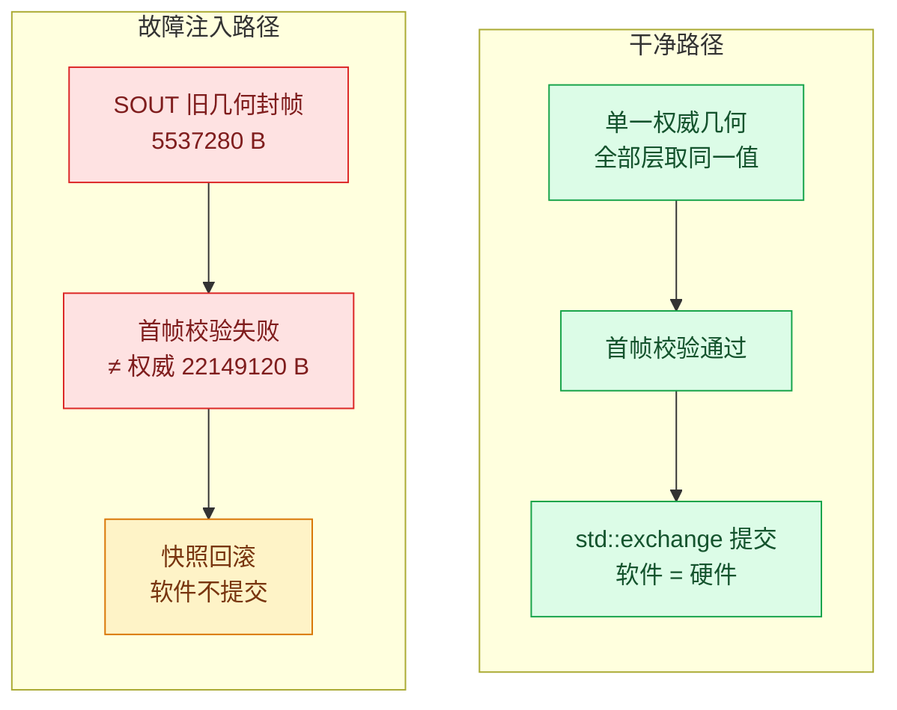

*图 6：同一事务的两条终局。错误配置被硬件证据否决，正确配置才被软件承认。*

图 6 走读：上排 `F1` 即 `rcEnterApply` 的故障注入分支（`observed_frame_bytes = old_geom_snap.bytes_per_frame()`），`F2` 是 `rcEnterCommit` 的字节比对失败点，`F3` 是回滚赋值 `ctx.active_geom = ctx.old_geom_snap`——软件权威从未承认被硬件否决的配置。下排 `G1` 是无注入时全部层读 `target_geom` 的干净路径，`G3` 的 `std::exchange(target_geom, FrameGeometry{})` 在提交后连旧副本都不留。两条泳道的分叉点只有一个：注入标志的有无，其余拓扑完全一致——这正是"规避有效"的对照实验结构。

### 3.3 U3 X2 提前封帧：Identity Zoom 固定下游几何

**故障事实**（出自 T37 UVC 文档）：X2 输入时设备在 655360B——恰好是 X1 帧字节数——处发 `ERR+EOF`，帧被截断为 25%。现象是 Windows 主机收到的 payload 恰为完整帧的四分之一、帧计数不缺；根因一句话——**WRAPE 的封帧几何配置滞后于实际流几何**：封帧几何还停在 X1 口径，数据流已是 X2，2560 字节事务粒度在 X1 边界处提前闭合了帧。

**示例复现**：T37 UVC 阶段的 Phase 2——测试驱动器把 `g_wrape.configured_frame_bytes = kX1FrameBytes`（655360）并置 `g_wrape.stale_x1_framing = true`，随后经 `t37_send_frame()` 向 WRAPE AO 投 `kPicPacked` 事件；`onPicPackedWrape` 的封帧裁决发现实际帧 2621440B 大于配置值 655360B，按 X1 边界发 `ERR+EOF`，`UsbDmaWorker` 搬运截断 payload、`WinHostAo` 记为 truncated——字节边界与 T37 抓包逐位一致。`kX1FrameBytes`/`kOutFrameBytes`/`kStreamVldNum` 三个协议常量由 `static_assert` 锁定文档证据值。

**规避数据流**：Identity Zoom——不修 RTL，而是让下游几何在两种模式下恒定。Zoom 块 `g_zoom` 始终激活：X1 输入时 2 倍放大（`kZoomStep2x=128`）、X2 输入时恒等直通（`kZoomStepIdentity=256`，即恒等步长），USB 对外永远 1280x1024。`configured_frame_bytes` 的写者是 **demo 测试驱动器**（阶段切换时在 `main()` 直接设定），`WrapeAo` 是该配置的消费者与封帧几何的唯一应用者；WinHost AO 只读帧终局。这是 AO 单写路径纪律的已知豁免——测试驱动器作为"产测工具"绕过事件面直写配置（与 U4 产测旁路同构），文档如实承认这一点；下游几何从未变化，"配置滞后于数据"这个时序问题被转化为"不存在配置变化"的结构问题。

**测试证据**来自 `isp_pipeline_demo` 的 host 模拟运行；具体测试数量和结果以当前构建输出为准：

```text
baseline: X1 开流出图                     → 30 完整帧
phase 2: X2 直出（无规避，T37 故障）      → 3 帧 655360B ERR+EOF（25% 截断，复现 T37 抓包值）
phase 3: X2 + Identity Zoom              → 2 完整帧
phase 4: X1↔X2 交替 ×10 轮               → 10 轮各 1 帧（payload=2621440B）
wrape:   framed=45 complete=42 err_eof=3 byte_mismatch=0
winhost: frames=45 truncated=3 min=655360 max=2621440 gaps=0
pool.used=0（事件池零泄漏）
RESULT: ALL PASS (fails=0)
```

**自检验证**：`err_eof==3 / truncated==3` 且 `min_payload==655360B`（断言 `T37: truncated payload is the stale X1 length`）复现 T37 抓包的截断值（U3 的证据域是 T37 链路的 655360/2621440 字节边界，与 U1 运行态重配的 5537280/22149120 是不同场景，仅数学形态相同，见附录 6.4 裁决第 5 条）；`complete==42 / frames==45 / gaps==0`（断言 `T37: Windows host received every frame EOF` 与 `T37: no frame gaps on the host`）覆盖全部 45 帧含故障帧——提前封帧不等于丢帧，这是 T37 文档"禁止误解"第一条的语义区分，在测试里成立；`max_payload==2621440B`、`zoom 恒 active`（`g_zoom.active`）与 WRAPE 配置恒 2621440（`T37: downstream geometry constant across X1<->X2 rounds`）共同验证 Identity Zoom 让下游几何结构恒定。

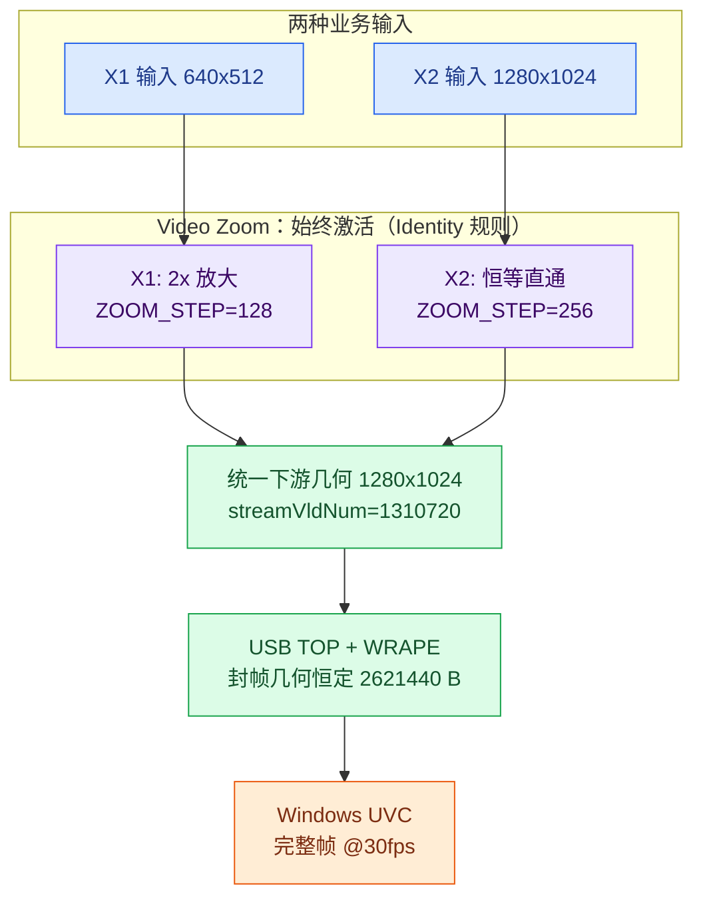

*图 7：Identity Zoom 让"不一致"无从发生——下游几何在模式切换前后是同一个值。*

图 7 走读：`MODES` 泳道两个蓝色节点对应 Phase 4 的十轮 X1↔X2 切换源；`ZOOM` 泳道两个紫色节点即 `g_zoom.step` 在 `kZoomStep2x`/`kZoomStepIdentity` 间交替的取值——Phase 4 循环里 `g_zoom.step = (0 == round % 2) ? kZoomStep2x : kZoomStepIdentity`，但 `g_zoom.active` 恒为真；`FIXED` 节点的 `streamVldNum=1310720` 是 Stream SEL 每源有效像素计数（`static_assert` 锁定）；`WRAPE` 节点的 2621440B 是 `g_wrape.configured_frame_bytes` 在 Phase 3 之后不再改变的值，自检断言直接核对该字段。右侧橙色 `PC` 即 `WinHostAo` 的观察位——`min/max_payload` 两个统计量分别来自 Phase 2 截断帧与 Phase 3/4 完整帧。

### 3.4 U4 参数回灌：regmap 三标志协议 + RAII BypassGuard

**故障事实**（出自缓存一致性文档 §2.1）：产测工具绕过驱动直接写寄存器（直写 0xBEEF），驱动影子缓存不知情，两份记录分叉；数天后一次例行全量参数下发把**过期的影子值**回灌进硬件（0xBEEF 被覆写回 0x1002），调好的参数被静默冲掉。现象是调好的产测参数无故失效；根因一句话——**写入口被旁路，且旁路没有配对的对账动作**。

**示例复现**：Scenario A 的裸旁路——测试驱动器直接置 `cache_bypass = true`（不建 guard）、`write(2, 0xBEEF)`、退出时不清标志也不 resync，随后 `audit()` 打出分叉 `cache=0x1002 hw=0xbeef`，再调 `full_repush()` 把过期影子回灌硬件。

**规避数据流**：`PeriphRegCache` 以三个布尔标志（`cache_only` / `cache_bypass` / `cache_dirty`）定义完整缓存协议，`write()` 是唯一写入口：默认写穿（硬件与影子同一函数内更新，硬件成功才更新影子）；`cache_bypass` 只写硬件（产测），必须配对——`BypassGuard` 构造置标志、析构复位并 `resync_from_hw()`，任何退出路径（含提前 return）都不可能漏掉对账；`cache_only` 冻结窗口内参数只进影子并置 `cache_dirty`，帧边界经 `sync()` 收敛点整体提交，`sync()` 在仍处于 cache_only 时返回失败（对应 regmap 的 `-EINVAL` 前置条件："未真正写入的状态拒绝提交"）。运行期另有漂移审计器 `audit()`：周期性比对影子与硬件，只报警不修复。写者唯一性可机械审查：影子只有 `write()`/`resync_from_hw()`/`sync()` 三个写点，全部在协议内。

**测试证据**（四场景，scenario A-D，当前 host 模拟输出）：

```text
[audit] after bare bypass: reg 2 drift cache=0x1002 hw=0xbeef
[audit] after bare bypass: reg 5 drift cache=0x1005 hw=0xcafe
[cache] scenario A: full repush overwrote tuned hw 0xbeef -> 0x1002 (silent param backflow)
[cache] scenario B: paired bypass resynced (total drift=2, new drift=0)
[cache] scenario C: sync during freeze refused=1 (precondition assert)
[cache] scenario C: sync at boundary ok=1 (frame-atomic commit)
```

**自检验证（断言强度局限已于重构修复）**：早期版本的三条断言问题（恒真断言、日志语义相反、修复侧未断言）已在最终形态中全部修复，当前断言组为：

- **Scenario A**：`scenario A: bare bypass forked the tuned hw value`（`hw_before_repush == 0xBEEF`）先锁存回灌前的硬件值，`scenario A: repush backflow overwrote tuned hw`（`hw_after_repush == 0x1002 && != hw_before_repush`）证明回灌确实把调优值冲掉——故障侧被断言锁死，不再依赖输出行。
- **Scenario B**：日志改为同时打印 `total drift` 与 `new drift`（前后 `drift_events` 差值）；断言 `scenario B env: bare-bypass drift was observed (cumulative)` 锁定环境前件、`scenario B fix: paired bypass introduces zero new drift`（差值为 0）证明配对 guard 零新增漂移，与逐寄存器比对断言 `scenario B: paired bypass left zero drift` 语义一致。
- **Scenario C**：变量语义修正为 `sync_refused = !sync_succeeded`（`sync()` 返回 false 即拒绝），断言 `scenario C: sync during freeze is refused` 直接证明冻结期提交被拒，`exactly one sync commit` 与 `dirty set fully flushed` 锁定边界提交。

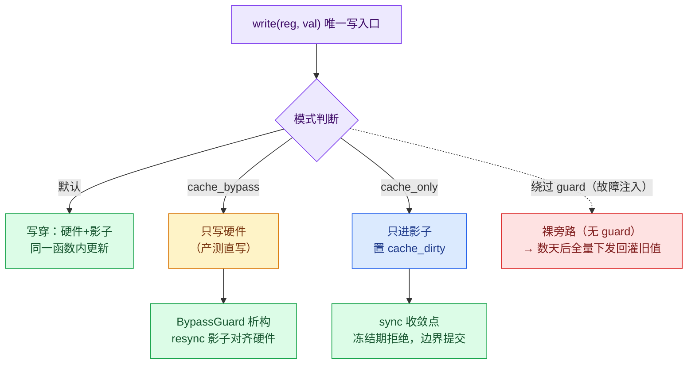

*图 8：regmap 风格三模式协议。红色虚线是故障注入路径——正是 §2.1 的产测回灌场景，被漂移审计器当场抓出。*

图 8 走读：紫色 `W`/`M` 是 `PeriphRegCache::write()` 的入口与三向分支（三向分支的完整结构）；黄色 `BP` 分支的出弧指向 `BG`——`BypassGuard` 析构函数（`cache_bypass = false; resync_from_hw();`），配对性由 RAII 生命周期保证；蓝色 `CO` 分支冻结窗口内只改影子（`cache_dirty`/`dirty_regs` 置位），绿色 `SYNC` 是 `sync()` 的前置条件断言（`if (cache_only) return false;`）与边界提交；红色 `BAD` 节点只有从 `M` 的虚线弧可达——即绕过 guard 的裸旁路（Scenario A 的注入路径），它的下游不是任何修复节点，而是 `audit()` 的当场报警。

### 3.5 U5 废弃地址：layout_version 查即作废

**故障事实**（出自缓存一致性文档 §2.2）：DDR 布局因几何变更重算后，驱动缓存的旧地址记录未作废；后续查询错误命中旧记录，读到别的模块的数据。现象是出图错乱且**没有任何报错**，属最难排查的静默故障；根因一句话——**旧记录没有失效判据，命中与否只看记录是否存在**。

**示例复现**：装配期 `g_addr_cache.store(0xA0000000)` 写入一条 v1 时代的地址记录；重配事务 Pass 2（故障注入轮）走完 `rcEnterSync` 后，测试驱动器对同一缓存发起 `query()`——若没有版本护栏，这条记录仍会"命中"并把陈旧地址交给调用方。

**规避数据流**：版本号护栏。每条地址缓存记录（`AddrRecord`）携带创建时的 `layout_version`；`rcEnterSync` 用 `std::exchange` 推进版本号并同步 `g_addr_cache.layout_version`；`AddrCache::query` 只在 `rec.valid && rec.version == layout_version` 时命中，版本不匹配即 miss 且就地清空记录（`rec = AddrRecord{}`）——**旧记录在第一次被查询时就死掉**，不存在"命中旧值"的路径。注意版本推进的语义是**每次进入 Syncing 时保守失效**，不是"只在几何真正变更后推进"——故障注入轮即使随后 Commit 失败，版本也已从 1 推进到 2。这是有意选择的保守策略：失败尝试同样使旧地址记录失效，避免回滚过程中错误复用旧布局地址；代价是版本号不等价于"已提交布局"的计数。`AddrCache::query()` 内"判断版本 + 清空记录"目前仍是带副作用的单一函数，评审建议将其内部拆成纯 Guard（判断版本匹配）与失效 action（清空记录）两步，经最终源码核实尚未落地。`std::exchange` 在此完成的是单线程所有权前提下的"读旧写新一步表达"，非并发原子操作。

**测试证据**：

```text
[recfg] sync: layout_version 1 -> 2 (stale address records die on first query)
[cache] stale address query after reconfig: MISS (forced reload)
```

**自检验证**：断言 `stale address record invalidated`（`query()` 返回 false）与 `reconfig: layout_version advanced`（终值 3）PASS。与故障路径的对比是本质性的：错误命中是静默数据污染，版本护栏把它变成一次可观测的 miss。

### 3.6 U6 坐标失同步：单一坐标变换权威

**故障事实**（出自缓存一致性文档 §2.3）：用户开启画面镜像后，显示路径做了镜像变换，而业务侧（检测框、瞄准线）的坐标没有跟着变换。现象是"画面镜像了，框没动"；根因一句话——**坐标变换被多个使用点各自实现**，几何事实变化时只有显示路径被更新。

**示例复现**：Scenario D——`DisplayMirror{true, 640}` 开启水平镜像后，故障侧把检测框 `DetRect{100,50,200,150}` 原样传递（`const DetRect stale = box;`，"没人变换它"），输出行直接打印 stale 等于原坐标的事实。

**规避数据流**：坐标变换只有一个入口。点与矩形的变换全部经 `transform()` 单一权威函数；矩形变换后角点交换并重新归一化（保证 `x0 <= x1`）。显示路径与业务坐标共享同一变换——示例中修复侧 `fixed = transform(box, mirror)`，几何事实变化时不可能只更新一半。

**测试证据**（scenario D）：

```text
[cache] scenario D: mirror box raw=[100,50..200,150] stale(same)=[100,50..200,150] fixed=[439,539]
```

**自检验证**：640 宽水平镜像下 `[100,200]` 必须映射到 `[439,539]`（`639 - 200 = 439`，`639 - 100 = 539`），断言 `scenario D: mirror transform maps [100,200]->[439,539]` PASS。故障侧（stale 等于原坐标）与修复侧（fixed）在同一行输出里直接对比。

### 3.7 U7 停稳机制分叉：QuiescePolicy 编译期统一门面

**故障事实**（出自《video_pic_stream_deinit_inconsistency.md》（deinit 停稳不一致文档，Change16517））：同一个 PIC deinit 流程里，SOUT 停稳走中断事件——3 个 ioctl、微秒精度、零 CPU 等待；Format888 停稳走轮询——26 个 ioctl、毫秒粒度。现象是同一语义两种时延特征与两种失败模式；根因一句话——**FMT888 寄存器组未暴露 IDLE 中断源，机制分叉是能力差异被硬编码进了调用路径**。分叉本身不是 bug，但长期演化必然漂移。

**示例复现**：`VideoFsmPicAo` 的 `kVDeinit` 分支即 Change16517 模拟——`onVideoCmd` 在 PIC 流 deinit 时依次调用 `SoutQuiesce::quiesce(kSoutStopLatencyUs, ...)`（事件路径，3 ioctl）与 `FmtQuiesceNow::quiesce(kFmtStopLatencyUs, ...)`（轮询路径），同一进程内两条路径同时执行并打印 `INCONSISTENT mechanisms` 对比行。

**规避数据流**：统一门面 + 编译期能力门。模板门面 `QuiescePolicy<HasIdleIrq>` 内 `if constexpr` 二选一实例化：`HasIdleIrq=true` 走 `EventQuiesce::wait`（ISR 在硬件 idle 时刻唤醒等待者，us 精度）；`false` 走 `PollQuiesce::wait`（每 tick 一个 STATUS_GET ioctl + `rt_thread_delay(1)` 上下文切换，精度受 `kPollTickUs=1000` 限制）。能力开关 `kFmtHasIdleIrq` 是唯一的平台差异点——中断源未来补上（文档的中期修复方向）时改一个常量即全局切换，`if constexpr` 保证未选中的路径连代码都不实例化。**准确表述**：该门面统一的是调用接口与完成语义，隔离的是能力差异、防止调用方分叉；在 `kFmtHasIdleIrq == false` 时事件与轮询两种底层机制仍然不同（ioctls 数量、精度、失败模式）——"机制分叉"没有被消除，只是被收敛到一处参数化点。

```cpp
struct QuiescePolicy {
    [[nodiscard]] static uint32_t quiesce(uint32_t hw_latency_us, ...);
};
using SoutQuiesce   = QuiescePolicy<true>;              // SOUT_INT.IDLE exists
using FmtQuiesceNow = QuiescePolicy<kFmtHasIdleIrq>;    // today: poll
using FmtQuiesceFix = QuiescePolicy<true>;              // after the mid-term fix
```

**测试证据**：

```text
[video/PIC] deinit quiesce: SOUT event-driven (3 ioctls) | FMT888 poll (26 ioctls) -> INCONSISTENT mechanisms
[video/PIC] deinit quiesce (unified fix): FMT888 event-driven (3 ioctls) -> consistent
```

**自检验证**：断言 `SOUT quiesce: 3 ioctls (event)`（`sout_ioctls == 3`，恒定不随时延增长）与 `FMT888 quiesce: poll costs more ioctls than event path`（`fmt_ioctls > sout_ioctls`，轮询开销随 `kFmtStopLatencyUs=25000µs` 排水时延线性放大到 26 个）PASS——两条路径在同一进程内被同时执行与对比，量化了分叉的代价。

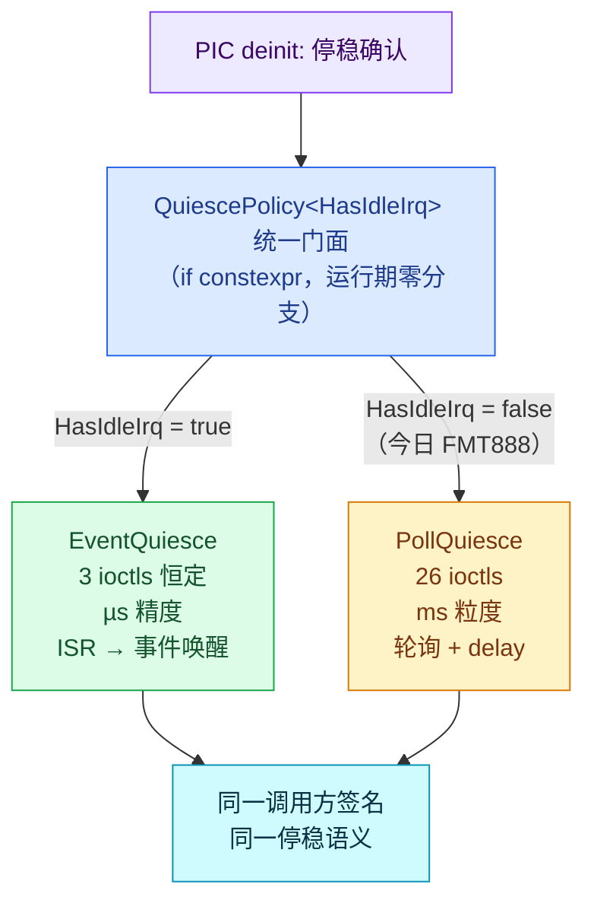

*图 9：统一停稳门面。能力差异被编译期参数吸收并隔离到一处——调用方不再分叉，但事件/轮询两种底层机制在 `kFmtHasIdleIrq=false` 时仍然不同。*

图 9 走读：紫色 `DEINIT` 是 `VideoFsmPicAo` 的 `kVDeinit` 分支入口（Change16517 模拟点，`VideoCtx` 中 `sout_ioctls`/`fmt_ioctls` 等记账字段注释即"the Change16517 simulation"）；蓝色 `UNIFIED` 即 `QuiescePolicy<HasIdleIrq>::quiesce()` 的 `if constexpr` 分派；绿色 `EV` 是 `EventQuiesce::wait`（ioctls += 3，返回硬件真实时延），黄色 `POLL` 是 `PollQuiesce::wait`（ioctls += 1 + polls，polls 由 `kFmtStopLatencyUs` 与 `kPollTickUs` 上取整得出 25，合计 26）；青色 `SAME` 是两条路径共享的调用方签名——`quiesce(hw_latency_us, ioctls)` 的形状完全一致，切换 `kFmtHasIdleIrq` 时调用方代码零改动。

### 3.8 U8 峰值破窗丢帧：显式窗口模型 + DDR 环 overrun 守卫

**故障事实**（出自花屏丢帧闪屏文档 §三）：**可容忍最大处理时延 = 缓冲深度 × 帧间隔**。现象是帧计数跳变、画面内容跳变但无报错；根因一句话——**丢帧的根因不是平均时延而是峰值突破该窗**：软件转换长尾（250ms 尖峰）、串行取流时延相加、被动传输未及时取走，三路殊途同归——帧在环形缓冲里被生产者追上覆写，消费者读到的是更新的帧，中间的帧"丢失"。

**示例复现**：分析层 `RateDemo` 的 `drops_with()`——逐次累计滞后量、超窗即计丢帧；注入序列 `{30000, 250000, 30000, 31000, ...}` 中单个 250ms 尖峰让 3 缓冲窗（99999µs）丢 4 帧。运行层 `DdrCtx` 的 overrun 守卫在真实帧流上探测同一窗口模型：每个 DDR 槽位经 placement-new 写入 `FrameStamp`（含 frame_id），读侧经 `std::launder` 取回戳并校验——槽位被新帧复用即判 overrun（`mipi` sink 的 `frame_overrun` 计数）。

**规避数据流**：修复不是"提高平均性能"而是**加深环**（容量问题）：`buffer_depth` 3→8 后同一尖峰零丢帧。适用边界：加深环只在**已知最大尖峰小于新窗口**且内存与端到端时延预算允许时成立；若峰值不可知或超出可容纳窗口，还需背压、丢帧策略或降低峰值处理时间。`DdrCtx` 是全部 DDR 区的唯一属主（`Single DDR owner` 注释），读写都在 Dispatcher 线程串行化，生产者/消费者时间耦合只经槽位帧戳表达——窗口被显式化后，静默覆写变成诚实的 overrun 丢帧计数。

**测试证据**（当前 host 模拟输出）：

```text
[anomaly] dropped: window=99999 us (3buf x 33ms); steady=0 drops, 250ms-spike=4 drops (peak, not average)
[anomaly] dropped (fix): 8-buffer window=266664 us -> 0 drops
```

**自检验证（修复侧已断言）**：断言 `dropped: steady latency never drops`（`drops_normal == 0`）、`dropped: latency spike breaks the window`（`drops_spike > 0`）与 `dropped (fix): deep window never drops`（`drops_deep == 0`，重构中补上）全部 PASS——故障发生侧与修复消除侧双侧都被断言锁死，无灰色地带。开发过程中，DDR 环的 overrun 守卫曾在产帧节拍 bug 中真实触发（27 帧被识别为槽位复用），先于人工分析定位了速率失配——这正是窗口模型作为运行期不变量的价值。

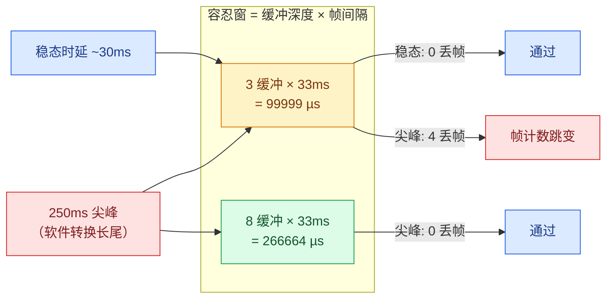

*图 10：峰值破窗模型。同一个尖峰，不同缓冲深度两种命运——丢帧是容量问题，不是平均性能问题。*

图 10 走读：红色 `SPIKE` 节点即 `drops_with()` 注入序列中的 250000µs 项；黄色 `W3` 与绿色 `W8` 对应 `RateDemo::tolerance_us() = buffer_depth * frame_interval_us` 在 3 与 8 两种深度下的窗宽；`W3` 的出弧"尖峰: 4 丢帧"即断言 `drops_spike > 0` 的证据侧，`W8` 的出弧"尖峰: 0 丢帧"即加深环后的修复侧。运行层对应物是 `DdrCtx::write`/`read` 的 `FrameStamp` 帧戳校验（`kTripleBufSize=3` 三帧环，`kDdrSlots=8` 槽位深度）——分析层模型与运行层守卫在常量上互为印证。

### 3.9 U9 半停重启闪屏：HSM 停稳弧

**故障事实**（出自花屏丢帧闪屏文档 §四）：闪屏四根因（按可能性排序）——首帧口径不一致、SOUT 未完整 init、乒乓缓冲不同步、倍率切了模型没切。现象是重启后前几帧携带旧配置输出（闪屏）随后自行恢复；根因一句话——**重启指令与停稳确认之间没有因果链**：SOUT 处于半停状态被直接拉起，时钟与指针未重新对齐。

**示例复现**：`FlickerDemo` 对照实验——`first_frame_bytes_raced()` 在 `sout_idle_confirmed == false` 时直接返回旧几何帧长（655360B，X1 口径），即"STOP 后立即 START"的竞走路径；`confirm_idle()` 置位停稳标志后再取首帧，即为停稳弧路径。

**规避数据流**：停稳弧是 HSM 拓扑的一部分。重配事务里 `Quiescing → Applying` 的转移**只能**由 `kSoutIdle`（帧边界停稳 ack，`at_quiesce` 守卫）触发——跳过停稳在拓扑上不可达 Applying；同理 `Resuming → Commit` 只能由 `kFirstFrame` 触发，提交边界不可绕过。"未停稳即重启"不是被约定禁止，而是**状态机里不存在这条弧**。时序为：`rcQuiescingEntry` 入口动作发 SOUT_STOP（当前实现为 `rc_self_submit` 内联模拟，非真实硬件回执）→ `kSoutIdle` 帧边界 ack → 弧守卫放行进入 Applying——停稳确认是重启指令的因果前件。

**测试证据**（FlickerDemo 对照实验）：

```text
[anomaly] flicker: restart without idle ack -> first frame 655360 B (OLD geometry) vs expected 2621440 B -> flash
[anomaly] flicker (fixed): quiesced restart -> first frame 2621440 B (new geometry, aligned)
```

**自检验证**：断言 `flicker: un-quiesced restart carries old geometry`（`raced_bytes != target_bytes`）与 `flicker: quiesced restart aligns the first frame`（`clean_bytes == target_bytes`）PASS。数字与 T37 的字节边界再次吻合——闪屏与提前封帧是同一类"配置滞后于数据"在不同环节的表现（一个在重启边界，一个在封帧边界）。

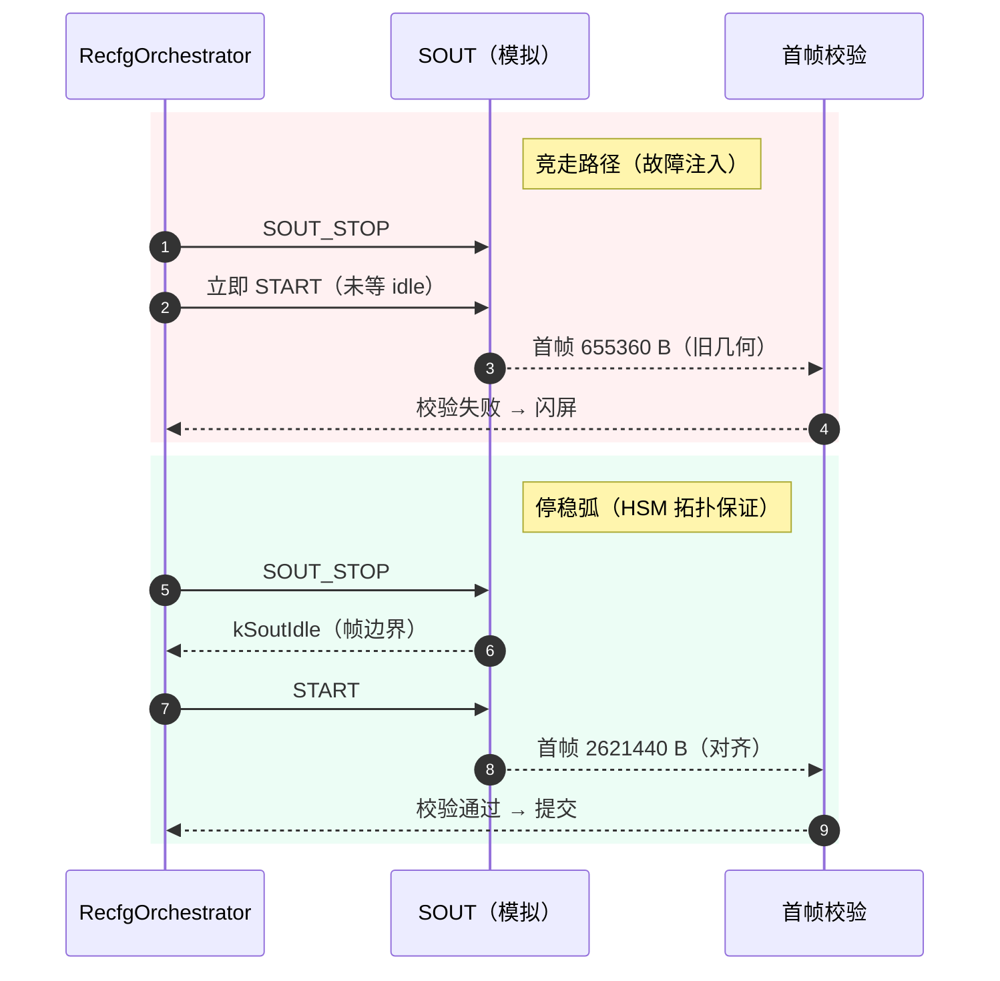

*图 11：竞走 vs 停稳弧。HSM 拓扑让"未停稳即重启"成为不可达状态，而非靠调用顺序约定。*

图 11 走读：红色泳道是 `FlickerDemo` 的竞走路径——STOP 与 START 两条消息之间没有 `kSoutIdle` 回执，首帧即 655360B 旧几何；绿色泳道是 3.2 节 `kRecfgTransitions` 的真实弧序——`rcQuiescingEntry` 发 STOP 后（模拟：自提交 `kSoutIdle`），`Quiescing → Applying` 弧（`kSoutIdle` 触发、`at_quiesce` 守卫）放行，`rcResumeEntry` 发 START，`Resuming → Commit` 弧（`kFirstFrame` 触发）完成裁决。泳道底色红/绿即源码注释里的 `rect rgb` 块，分别对应故障注入与修复两侧的 `check()` 断言。

### 3.10 花屏（位宽错配）：共享假设的单点验证

**故障事实**（出自花屏丢帧闪屏文档，三类画面异常之一）：8bit 像素数据被按 16bit 寄存器字搬运，两像素合并为一。现象是灰度两两错乱的肉眼可辨花屏；根因一句话——**生产者与消费者对位宽这一共享事实的假设不一致**（`WidthDemo` 把它建模为 `dma_bits_per_word` 一个字段的双侧假设）。

**示例复现**：`WidthDemo::transfer_mismatched(16)`——生产者按 8bit 写、消费者按 16bit 字读，32/32 像素对损坏、半帧像素从未到达。规避侧 `transfer_authority()` 让双方同读共享位宽权威，零损坏。

**规避数据流**：位宽是数据面元数据，属于单一权威原则在"共享假设"上的应用：`dma_bits_per_word` 一个字段、生产者与消费者两个读者、零个私自假设点。链路级还有第二道防线：Sink AO/WRAPE 的 `verify_pic_bytes` 对每一帧复算整条变换链（DN 种子 → 增益 → 融合 → 增强/TPD）逐字节校验——位宽错配这类"共享假设被打破"的故障在数据面字节级立即暴露，无需肉眼识别。

**测试证据**：

```text
[anomaly] garbled: 8-bit data x 16-bit DMA -> 32/32 pixel pairs corrupted (two-pixels-merged)
[anomaly] garbled (fixed): shared width authority -> 0 corrupted
```

**自检验证**：断言 `garbled: width mismatch corrupts pixels`（`garbled_pairs > 0`）与 `garbled: shared width authority is lossless`（`garbled_fixed == 0`）PASS。数据面全程经 DDR 环的字节保真校验（断言 `PIC data plane byte-exact` / `TEMP data plane byte-exact`，即 `wrape.byte_mismatch == 0 && mipi.byte_mismatch == 0`）把这一类故障纳入每一次运行的常规检查。

---

## 4. C++17 约束与设计模式

示例除架构对策外，全程执行"编译期确定、运行期少分配、边界清晰"的 C++17 工程纪律，每条都有 `static_assert` 或构建配置背书，而非靠注释与约定。

### 4.1 纪律清单

| 纪律 | 落点 | 背书 |
|---|---|---|
| 协议常量 constexpr | 帧字节数 / 恒等 Zoom 步长 / streamVldNum | `static_assert` 锁定文档证据值 |
| 布局约束 | `FrameGeometry` / `UvcMeta` / `FrameStamp` | `static_assert(is_standard_layout && is_trivially_copyable)`——跨 AO 边界的事件载荷可安全位表示 |
| 移动约束 | `FrameGeometry` 事务快照交换 | `static_assert(is_nothrow_move_constructible)`——回滚/提交路径不抛 |
| 无锁假设 | DDR 环索引、运行标志 | `static_assert(atomic<T>::is_always_lock_free)`——目标平台无隐式锁 |
| 无堆热路径 | `EventPool` + `std::array` 定容块 | 全局无堆事件分配；运行期断言 `pool.used()==0`（零泄漏）；构建级 `-fno-exceptions -fno-rtti` |
| placement new + std::launder | DDR 槽位 `FrameStamp`、地址缓存记录 | 对象生命周期在槽位内存内开始，`std::launder` 合法化访问（C++17 对象模型） |
| CRTP | `GainNodeBase<Policy>` / `FusedNodeBase<Policy>` | 编译期多态，零虚函数开销；高低增益链、增强/TPD 链共用一套节点骨架 |
| 编译期策略 | `Policy::apply`（节点变换）、`QuiescePolicy`（停稳门面） | `if constexpr` 路径选择，运行期零分支 |
| 命令模式 | `kIrscCmdSequence` 表 | 多步硬件初始化退化为表驱动 + 事件回执，编排器只数 ack |
| 宏静态 HSM 表 | `COACT_HSM_STATES` / `COACT_HSM_TRANS` | 十余个 AO 的状态/转移表全部编译期生成，无运行期构建 |
| std::exchange 提交 | 几何提交、版本推进、槽位戳交换 | 提交点的所有权转移表达：单线程所有权前提下读旧值与写新值一步完成、旧副本不留——不是并发原子操作，不提供线程安全 |
| RAII | `BypassGuard` | 旁路配对由析构保证，任何退出路径不漏 resync |
| 接口标注 | 全接口 `[[nodiscard]]` / `noexcept` | 返回值不可忽略；动作函数不抛 |

### 4.2 两个代表性片段

CRTP 节点骨架——高低增益链共用 `GainNodeBase<Policy>`，变换策略经 CRTP 在编译期解析，公共帧路径（DN → DDR → 策略变换 → DDR → 完成事件）只写一遍：

```cpp
template <typename Policy>
struct GainNodeBase {
    // Common frame path: DN -> DDR -> policy transform -> DDR -> done event.
    // Returns false when the pool is exhausted (event dropped).
    // Policy transform (compile-time dispatch; if constexpr keeps the
    // ...)
};
using LowGainNode  = GainNodeBase<LowGainPolicy>;
using HighGainNode = GainNodeBase<HighGainPolicy>;
```

宏静态 HSM 表——每个 AO 的状态与转移在编译期固化为 `constexpr` 数组，Dispatcher 按表驱动：

```cpp
COACT_HSM_STATES(kIrscStates, IrscCtx, "Root", "Active");
COACT_HSM_TRANS(kIrscTransitions, IrscCtx, Sig::kIrscCmd, onIrscCmd);
```

重配 AO 是最完整的应用：`kRecfgStates`（Root + 7 业务状态，8 表项）+ `kRecfgTransitions`（11 弧——7 条业务弧 + 4 条 stale `kRecfgStage` 吸收弧）全部为 `inline const` 数组，转移动作与入口动作分离（硬件命令只在入口动作发出，见 3.2）。

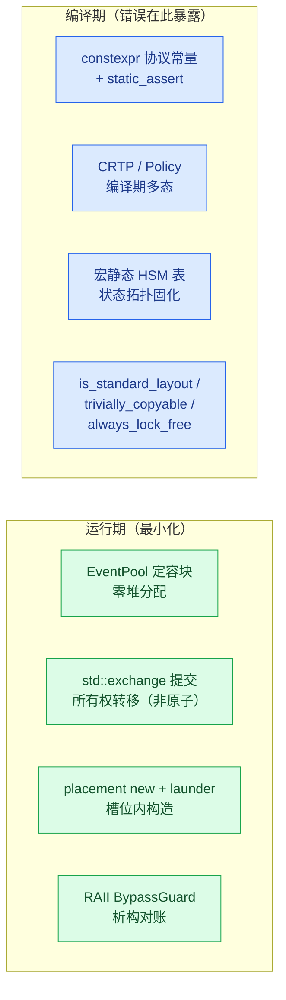

*图 12：工程纪律的分工——一致性假设尽量在编译期变成类型错误，运行期只留不可编译化的少量动作。*

图 12 走读：蓝色 `COMPILE` 泳道四个节点对应 4.1 纪律清单的编译期列——`C1` 是 `static_assert(kX1FrameBytes == 655360U)` 等证据值锁定，`C2` 是 `GainNodeBase<Policy>` CRTP 骨架，`C3` 是 `COACT_HSM_STATES`/`COACT_HSM_TRANS` 宏静态表（重配 AO 的 8 表项 11 弧全部 `inline const`），`C4` 是 `is_standard_layout`/`is_trivially_copyable`/`is_always_lock_free` 三组类型约束。绿色 `RUNTIME` 泳道是四个不可编译化的运行期动作：`R1` 事件池（`pool.used()==0` 零泄漏断言）、`R2` `std::exchange` 提交、`R3` placement new + `std::launder` 的 DDR 槽位生命周期、`R4` `BypassGuard` 析构对账。两泳道间的隐形契约：编译期节点每消灭一类假设，运行期就少一个需要运行时检查的不变量。

---

## 5. 指针与所有权

"边界清晰"的另一半是指针治理。嵌入式 C++ 无法完全消灭指针（硬件地址、DMA 缓冲本质就是内存位置），但示例把裸指针压缩到三类合法场景，其余全部用引用、移动语义与静态策略表达。

### 5.1 裸指针的三类合法保留

| 场景 | 示例 | 为什么必须是指针 |
|---|---|---|
| 可空句柄 | `pool->alloc_typed()` 返回 `nullptr` 表示池耗尽 | 可空性是协议的一部分（背压信号），引用无法表达 |
| 硬件/DMA 地址 | `FrameStamp*` 指向 DDR 槽位 | 物理内存位置，无引用语义可用 |
| 非拥有观察 | `ctx.pool` / `ctx.rt` 指向装配期绑定的单例 | AO 上下文默认构造 + 后绑定，指针可重置；coact 框架 `AoBase` 的非拥有契约 |

除此之外的所有传参、返回、成员访问一律使用引用（`const T&` 入参、`T&` 出参）或值/移动语义。

### 5.2 引用与移动的具体应用

```cpp
// DdrCtx::write: src is the caller's stack buffer, read-only borrow
// (DMA semantics) -> const pointer, the documented hardware-address case.
[[nodiscard]] uint16_t write(DdrId id, uint32_t frame_id, const uint8_t* src);

// RecfgAoCtx commit: the old geometry is MOVED OUT, no dangling copy is
// left behind -> std::exchange implements the move-commit.
active_geom = std::exchange(target_geom, FrameGeometry{});

// AddrCache::store: placement-new constructs IN PLACE inside the cache
// slot — no temporary, no copy; same discipline the event pool uses.
::new (static_cast<void*>(&rec)) AddrRecord{layout_version, addr, true};

// QuiescePolicy: stateless compile-time policy, all-static functions —
// no pointer, no reference, pure type-level dispatch.
```

### 5.3 治理规则

1. **参数传递**：只读小对象按值（`TargetId` / `SrMagx`），大对象 `const&`，可空资源句柄才用指针并在命名上暴露（`pool` / `xxx_target` 这类"绑定槽"）。
2. **返回值**：`[[nodiscard]]` 强制调用方处理；可空结果返回指针（池耗尽）并立即判空——这是唯一允许"裸"的返回。
3. **成员所有权**：AO 上下文里的 `PoolT*` / `Rt*` 是**非拥有观察指针**，生命周期由 `main()` 的栈序保证；与裸拥有的区别在注释与命名上显式声明，不让读者猜。
4. **禁止指针算术**：DDR 槽位访问经 `std::launder` 合法化，唯一的偏移运算（`slot_mem + kStampBytes`）封装在 `DdrCtx` 内部，外部只见 `read`/`write` 接口。


*图 13：指针治理边界。裸指针只保留三个不可替代的语义位，其余所有权表达全部现代化。*

图 13 走读：黄色 `RAW` 泳道三个节点即 5.1 表格的三个合法场景——`N1` 对应 `pool->alloc_typed()` 池耗尽返回 `nullptr`（背压协议的一部分），`N2` 对应 `FrameStamp*` 指向 DDR 槽位内存（物理位置，无引用语义），`N3` 对应 `ctx.pool`/`ctx.rt` 装配期绑定的非拥有观察指针（coact 框架 `AoBase` 的契约）。绿色 `MODERN` 泳道四个节点即 5.2 的代码片段——`M2` 是 `std::exchange(target_geom, FrameGeometry{})` 移动提交，`M3` 是 `AddrCache::store` 的 placement-new 原地构造，`M4` 是 `QuiescePolicy` 全静态策略函数。治理规则（5.3）给两泳道划界：偏移运算唯一封装在 `DdrCtx` 内部，外部只见 `read`/`write` 接口。

---

## 6. 验证结果

### 6.1 验证矩阵

| 示例 | 覆盖异常 | 验证的不变量 | 对应 RS500 文档 | 自检断言 | ctest |
|---|---|---|---|---|---|
| `isp_pipeline_demo`（数据面/编排面） | 全链路基线 | 每帧字节保真（变换链逐字节复算）、路由标签正确、帧数不缺、事件池零泄漏 | 复盘踩坑 Preview Start 流程 | `PIC/TEMP data plane byte-exact`、`route tags correct`、`event pool fully reclaimed` 等 | 通过 |
| `isp_pipeline_demo`（U1） | 口径漂移 | 提交帧长 == 权威公式输出 | 原子重配 §2.3 模式一 | `reconfig: committed frame matches authority geometry` | 通过 |
| `isp_pipeline_demo`（U2） | 新旧交替 | 恰好一次提交、X4 拒绝 + X2 回滚、版本推进 | 原子重配 §4.5 / §5.2 | `reconfig: exactly one commit` / `X4 precheck reject + X2 fault rollback` / `layout_version advanced` | 通过 |
| `isp_pipeline_demo`（U3，T37 阶段） | 提前封帧 | 四点观察（配置/计数/payload/帧序）+ 10 轮切换稳定性 | T37 UVC 文档 §6 板测要求 | `err_eof==3`、`complete==42`、`truncated==3 / frames==45 / gaps==0`、`min/max payload`、`zoom 恒 active`、`WRAPE 配置恒定` 等 | 通过 |
| `isp_pipeline_demo`（U4/U5/U6） | 参数回灌 / 废弃地址 / 坐标失同步 | 旁路配对零漂移、冻结窗前置拒绝、脏集全提交、旧地址查即作废、镜像映射正确 | 缓存一致性 §2.1 / §2.2 / §2.3 | scenario B/C/D 组断言、`stale address record invalidated` | 通过 |
| `isp_pipeline_demo`（U7） | 停稳机制分叉 | 事件路径 3 ioctl 恒定 vs 轮询路径更贵 | video_pic_stream_deinit_inconsistency（Change16517） | `SOUT quiesce: 3 ioctls (event)`、`FMT888: poll costs more ioctls` | 通过 |
| `isp_pipeline_demo`（U8/U9/花屏） | 峰值破窗 / 半停闪屏 / 位宽错配 | 故障发生侧 + 修复消除侧双侧对照 | 花屏丢帧闪屏文档 §三 / §四 | `dropped`、`flicker`、`garbled` 三组各两条断言 | 通过 |
| `flash_proxy_demo` | 资源独占串行化、请求/响应、扇出 | 单一权威的拥有者模式基础（与本文九类问题无直接证据关系，作为扩展阅读） | — | 输出验证 | ctest 通过 |
host 模拟验证元数据（2026-09-03，联合测试 agent 报告 + 本地复跑核实）：重建命令 `cmake --build build`，目标测试 `ctest --test-dir build -R isp_pipeline_demo`（结果 `Passed 1.92 sec`、退出码 0）；全量 `ctest --test-dir build` 37/37 通过（flash_proxy_demo 已注册 ctest）；示例二进制连续 5 次运行全部 `RESULT: ALL PASS (fails=0)`、单次 ~1.9 s 稳定；全量构建零警告零错误。断言共 52 条 `check()`（运行输出逐条核数），全部经同一 `check()` 通道计数并汇总，故矩阵按不变量而非断言条数呈现。示例退出码携带自检结论，ctest 以退出码门禁——断言失败即测试失败，不存在"输出看起来对"的灰色地带。host 模拟与 RS500 板测是两种证据，不能互相替代。

自检断言按平面分组：数据面（收帧数、字节保真、路由标签、事件池零泄漏）、编排面（IRSC 4 步回执、ISP 8 节点 init ack、合并视频 FSM 回 IDLE）、重配面（恰好一次提交、X4 拒绝 + X2 回滚、提交帧匹配权威、版本推进）、停稳面（事件 3 ioctl vs 轮询更多）、缓存面（scenario A-D 四组）、异常面（花屏/丢帧/闪屏各故障与修复双侧）、T37 面（err_eof/complete/truncated/frames/gaps、min/max payload、zoom 恒 active、WRAPE 配置恒定）。

### 6.2 九类异常的处理归纳

九类异常按"分布式状态契约不一致"三分法（写者不唯一 / 更新不原子 / 确认不对等）收束为三个机制——这是本文的核心论点，与第 1 章三分法一一对应：

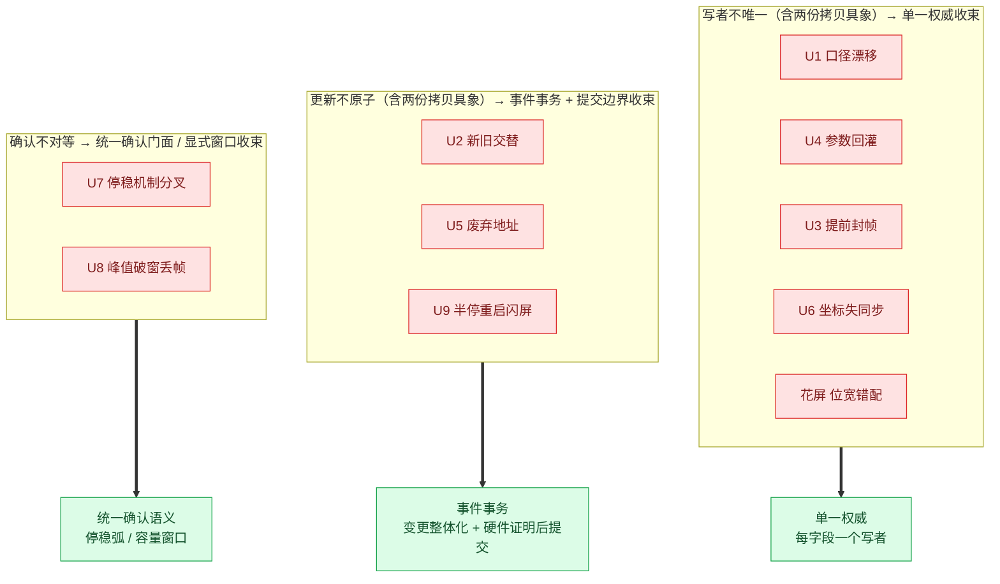

*图 14：九类异常按"分布式状态契约不一致"三分法收束为三个机制。收束不是事后归类，而是示例设计的出发点。*

图 14 走读：三个红色泳道即第 1 章三分法的收束侧——`BYWRITEPATH`（写者不唯一：U1 公式两处实现、U4 旁路写入口、U3 封帧几何滞后、U6 变换多点实现、花屏位宽假设不一致）全部收敛到 `A1` 单一权威；`BYPROPAGATION`（更新不原子：U2 无冻结窗、U5 旧记录无失效判据、U9 无停稳因果链）收敛到 `A2` 事件事务（事件传播 + 提交边界在此合并，因两者共同承担"变更整体化"职责）；`BYCONFIRM`（确认不对等：U7 能力差异硬编码、U8 峰值时延突破窗口容量）收敛到 `A3` 统一确认语义与显式容量窗口——这一类不存在被复制的记录，"两份拷贝"框架无法解释。每个红色节点到绿色机制的粗箭头都能在 6.3 结论第 2 条找到对应表述——收束是设计出发点而非事后归类的证据是：示例先定三个机制，再按机制反向构造九类异常的复现场景。

### 6.3 结论

1. **九类异常同源**：全部是"多模块对同一业务事实、更新时序或完成条件契约不一致"的结构性后果，其中六类具象为"同一事实两份记录、更新失同步"（U1/U2/U4/U5/U9 及花屏），U3/U7/U8 则是写者滞后、能力分叉与容量对等等其他契约不一致形态。花屏位宽错配（3.10）、闪屏首帧口径（3.9）、提前封帧（3.3）在数学形态上互相吻合（25% 截断）——形态相同是同一结构病灶的旁证，但 U1 与 U3 的证据域不同（运行态重配 vs T37 链路），不能等同根因。
2. **事件驱动是结构解药**：单一权威（每字段一个写者）、事件事务（整体化 + 提交边界）、统一确认语义（停稳弧/容量窗口）三个机制分别收束三类契约不一致，且都是结构属性——Dispatcher 保证单 RTC 步骤不可被并发执行，跨事件隔离由停稳/守卫（IRSC 侧示范的门控模式，全流冻结待扩展）/提交边界/延后发布共同保证；违反单一写者的代码在审查中可机械识别，而非依赖运行期运气。
3. **故障必须先复现再规避**：示例注入了全部文档原始故障（X2 截断、裸旁路回灌、竞走重启、位宽错配、时延尖峰），断言"故障确实发生"与"规避后消除"两侧——规避方案的有效性由对比实验证明，不由宣称证明。早期版本的两处修复侧断言缺口（Scenario A 恒真、U8 修复侧未断言）已在重构中补上，当前 52 条断言对故障/修复双侧全部锁死（见 3.4/3.8）。
4. **验证是流程级而非单元级**：自检覆盖从数据面字节保真到事务终局（提交/回滚）的全链路不变量；isp_pipeline_demo T37 阶段的四点观察（配置/计数/payload/帧序）与 10 轮切换稳定性对应 T37 文档 §6 的板测要求。所有结论来自 host POSIX 模拟，RS500 板级验证尚未覆盖。
5. **诚实的边界**：硬件无原子提交点（原子重配文档 §4.4 的平台现实）时，软件事务只能把不一致窗口压缩到不可观察，而非归零。示例的提交边界设计——软件权威最后落笔、失败快照回滚——正是这一工程现实的直接表达：宁可回滚一次，绝不提交一个被硬件否决的配置。示例的"回滚"指软件快照恢复，不含硬件寄存器逆序补偿。

### 6.4 附录：评审回应与裁决表

本附录已合并历史评审结论。当前实现以源码和最新构建结果为准，旧文件名、旧测试数量和旧结论不再作为验收依据。

本节记录对《design_consistency_avoidance_review_zh.md》五项结论的逐条裁决（初裁 2026-09，对照当日源码与构建产物运行输出；**终裁 2026-09-03**，按重构完成后的最终源码逐条复核，标注修复状态）。评审文档作为历史输入保留不改；裁决为"部分成立"的条目已在正文相应位置修正，"仍成立但属代码问题"的条目中，转交的代码问题清单多数已在重构中修复（逐项核实标注如下），少数（终局 action 拆分、guard/失效拆分）仍未落地，事务自驱关窗已于 2026-09-03 修复落地。

| # | 评审条目 | 裁决 | 证据 | 处理 |
|---|---|---|---|---|
| 1 | 重配 HSM 文字/图/转移表不一致；事务窗口提前关闭 | **部分成立**（文档侧已修；代码侧部分修复） | `kRecfgTransitions` 现为 11 弧（7 业务 + 4 stale 吸收）：Idle→Quiescing/kRecfgReq、Quiescing→Applying/kSoutIdle、Applying→Syncing、Syncing→Resuming、Resuming→Commit/kFirstFrame、Commit→Idle、Quiescing→Idle（终局），另 4 条 Internal 吸收弧；终局弧新增 `at_reject_home`/`at_commit_home` 姿态 guard，陈旧自驱事件不再误杀活事务（**已于重构修复**——这正是压力跑暴露的交错）。`kRcPrecheck` 仍不可达、`RecfgStage::kCommitted/kFailed` 仍无 HSM 状态、`rcGoHome` 仍打印 "PrecheckOrCommit -> Idle" 且复用于三条终局（**仍未修复**，见 3.2 结构债第 1 条）；事务窗口已由终局动作自驱关闭（`rcGoHome` 汇流三终局路径，2026-09-03 修复——**已修复**，见 3.2 事务窗口终局自驱） | 3.2 节重写为与源码逐弧一致并区分"已修复/未修复" |
| 2 | Dispatcher 串行化与 `std::exchange` 保证过强，混淆 RTC 原子性/事务隔离/并发原子 | **仍成立**（原文表述如此） | 原文"任何其他执行流都无法在事件处理的间隙观察到半改状态"未限定单 RTC 步骤；`std::exchange` 非原子（C++ 标准无并发保证） | 第 2 章重写为三层概念区分 + 保证边界声明；4.1/图 12/图 13 相应措辞修正（文档侧修复） |
| 3 | 恒真断言、日志语义相反、修复侧未断言 | **初裁成立，已于重构全部修复**（终裁源码逐条核实） | Scenario A：`|| true` 恒真断言已删除，替换为 `hw_before_repush == 0xBEEF` + `hw_after_repush == 0x1002 && != before` 两条实断言；Scenario B：日志改为 `(total drift=2, new drift=0)` 并新增差值断言 `paired bypass introduces zero new drift`；Scenario C：`sync_refused = !sync_succeeded` 语义修正（运行输出 `refused=1`）、新增断言 `sync during freeze is refused`；U8：新增断言 `dropped (fix): deep window never drops`。当前 52 条断言全部双侧锁死 | 文档 3.4/3.8 已按最终断言重写，不再标注断言局限 |
| 4 | "16 个 AO 与 4 个非 AO worker"数量不符 | **仍成立**（原文如此；评审引用的"14 AO/7 worker"与当前源码一致） | `rt.bind()` 共 14 个 AO；worker 实例 7 个：IrscWorker、UsbDmaWorker（两者非 WorkerBase，自带线程骨架）、CmdDmaWorker、IspIrqWorker×2、SoutDmaWorker、MipiIrqWorker（四类共 5 实例派生 `WorkerBase`）；PIC/TEMP FSM 与打包器已合并 | 1.1.1 清单以 `rt.bind()` 为唯一来源重写，含 SOUT/MIPI worker；worker 骨架归属（哪些派生 WorkerBase、各自环深）已在 1.1.1 更正 |
| 5 | "九类都是两份拷贝"覆盖过窄；U1/U3 证据混用 | **仍成立** | U7（能力差异）、U8（容量预算）不存在两份记录；U1 证据域为 5537280/22149120B（运行态重配），U3 为 655360/2621440B（T37 链路），仅数学形态同为 25% | 第 1 章与 6.2 升级为"分布式状态契约不一致"三分法；两份拷贝降为具象案例；3.2/3.3 证据域表述分离（文档侧修复） |

另两条次要评审建议的处理：WRAPE 写者归属（3.3 已改为"demo 驱动器写、WRAPE 消费"并指出与 U4 旁路同构）；regcache 表述（本文未使用"直接移植"表述，`PeriphRegCache` 3.4 节已限定为"regmap 风格最小协议"）。Guard 一等公民化、状态机函数分层重命名、三块显式黑板属于代码重构方向：其中三块黑板已在架构文档 §5.1 以"三块黑板对照表"落地（文档侧），终局 action 按姿态拆分与 `AddrCache::query` guard/失效拆分经最终源码核实**尚未落地**（正文 3.2/3.5 已按当前命名如实描述并标注差距）；重构中新增的终局弧姿态 guard（`at_reject_home`/`at_commit_home`）与 stale 吸收弧已部分兑现"成功与拒绝路径都显式进入转移表"的要求（拒绝路径的入口仍是 action 内分支，但终局走声明弧且陈旧事件被吸收）。
