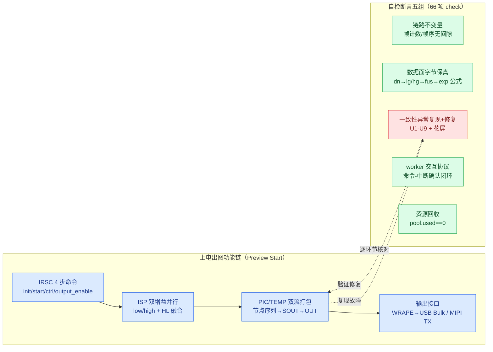

# isp_pipeline_demo 功能测试报告

**结论**：66 项功能自检断言全 PASS（exit 0）。功能验证方法为"自检断言内嵌"，逐项核对 RS500 业务场景的架构级复现与修复（示例定位：架构模型与故障注入演示，非业务复刻）。

**关联文档**：架构说明见 `example_ISP_pipeline_design_architecture_zh.md`；一致性故障与处理见 `example_ISP_pipeline_design_consistency_avoidance_zh.md`；代码评审见 `example_ISP_pipeline_review_record_code_architecture.md`；逐阶段运行证据见 `isp_pipeline_demo_run_log_fresh.txt`。

**推荐阅读顺序**：先看第 1 章功能链路，再看第 2 章断言分组，最后按第 4 章命令复现；运行时输出和中文阶段说明集中在 `isp_pipeline_demo_run_log_fresh.txt`。

## 1. 测试范围



被测功能链（蓝）逐环节映射到断言组（绿=不变量核对，红=故障复现与修复验证）。

## 2. 测试方法

### 2.1 程序自检

示例程序在 main() 末尾执行自检，逐项核对运行终态和不变量；任一失败打印 `[FAIL]` 并以非零退出码结束。断言分五组：

1. **链路不变量**：各 AO 帧计数（IRSC 30 帧 → 双增益链 → HL 融合 → enhance/tpd → PIC/TEMP 打包 → WRAPE 封帧 45 帧 → WinHost 收帧 45），帧序连续无间隙（gaps==0）。
2. **数据面字节保真**：确定性字节公式贯穿全链（dn/lg/hg/fus/exp 逐级变换），WRAPE 校验 byte_mismatch==0；DDR 槽位帧戳（placement new FrameStamp）读侧 frame_id 守卫。
3. **一致性异常复现与规避**：U1-U9 + 花屏逐类"先复现故障、再验证修复"（如 Scenario A 参数回灌断言 hw 0xBEEF→0x1002 被旧参数覆盖、B 修复侧 new drift==0、C 冻结期 sync 拒绝 refused==1、T37 提前封帧 payload==655360 精确复现）。
4. **worker 交互协议**：7 实例 executed/rejected 计数、CmdDmaWorker executed == IRSC step_count == 4（命令-中断确认闭环）、事件池终态 used==0（零泄漏，hwm 记录峰值）。
5. **资源回收**：pool.used==0、AO 在途等待计数归零（停机排空不丢完成事件）。

### 2.2 日志交叉验证

29 处 `record_from_task` 结构化日志与 printf 输出数值一致（如 transactions=6840 ↔ 日志 a0=0x1ab8），轨迹可逐事件审计。

### 2.3 日志范围

日志分四层，各层频次与用途不同；最新 coro 运行输出 727 行，逐项结果见 `isp_pipeline_demo_run_log_fresh.txt`：

| 层级 | 内容 | 频次（单次运行） |
|---|---|---|
| 结构化（record_from_task，事件码枚举） | HSM 状态轨迹 kEvtHsmTrace | 233 条，审计级全量 |
| 关键事件 | session/recfg/worker 统计/帧完成 | ~30 条 |
| 生命周期与里程碑 | worker started/draining/exited（7 实例全覆盖）+ 每 10 帧里程碑（HlFuseAo 融合完成、VideoPack PIC/TEMP 完成点） | 27 条 |
| 拒绝 WARN | submit 被拒（busy）逐次告警 | 正常 0 条，出现即丢帧前兆 |

**风暴防护原则**：全量审计只放在 HSM 轨迹（状态视角信息最紧凑）；帧数据类只做汇聚点节流（每 10 帧一条）；拒绝告警逐次输出但正常运行为零。三层频次上限合计约 300 条量级，不会淹没输出。

**验证意义**：日志和计数器用于复核断言结果；事务窗口、worker 完成和事件池回收均有对应的运行记录。

## 3. 测试边界

host 模拟不等价 RS500 板级行为（flash_proxy_demo 已注册 ctest）。

## 4. 复现命令

```bash
cd build && make -j12
./examples/isp_pipeline_demo            # 期待 RESULT: ALL PASS, exit 0
```

## 5. 与 RS500 功能对应关系

对齐分析基于示例源码、运行日志和 RS500 模块名称逐项核实（映射范围限核心模块与 vdcmd，按既定边界不追求线程全覆盖）。

### 5.1 已对齐功能

**对齐分级说明**（采纳外部评审）：示例定位是架构模型与故障注入演示，各 RS500 业务域的模拟深度不同——名称映射（结构对应）普遍较高；控制时序与数据/参数为消息发生级代理。分级：完整（含故障边界复现）/ 语义对齐（交互模式等价）/ 结构对齐（拓扑一致）。

| RS500 功能（出处） | 示例落点 | 对齐度 | 已知简化 |
|---|---|---|---|
| Preview Start 四阶段（Phase1/3/4 + KBC→IRSC 顺序） | orch 编排 + 会话 HSM BOOT→INIT | 完整 | Phase1/3 为 placeholder（RS500 有真实预加载/CRC/失败处理） |
| IRSC 4 步命令序列 init/start/ctrl/output_enable（drv_irsc） | kIrscCmdSequence 命令表 + IrscDriverAo | 完整 | 命令通道模型，无寄存器位定义 |
| ISP 主链高/低增益并行 + HL 融合 | LowGainAo/HighGainAo 双链 + HlFuseAo fan-in | 语义对齐 | 增益为数学变换（×3/4、×5/4）；节点 init 为伪完成事件（RS500 按 init_mask 真实初始化+逆序回滚） |
| PIC/TEMP 双流视频打包（节点序列 CUT_ZOOM→…→SOUT→OUT） | VideoFsmAo 乘积状态表 + VideoPackAo | 完整 | 生命周期模型，节点内部算法为字节公式 |
| 一级 DMA 三帧循环（isp_stream_dma address0/1/2） | SoutDmaWorker depth3 | 结构对齐 | RS500 用真实三帧描述符（address0/1/2/length），示例为槽位+帧戳模型 |
| 中断事件向上（ISR→rx_indicate→rt_event） | worker 完成事件回 AO（提交→等待态→中断确认） | 语义对齐 | 中断语义建模，无真实 ISR 上下文 |
| vdcmd rt_device_control 命令通道 | CmdDmaWorker（executed==step_count==4 断言） | 完整 | 无 CCI/UART/SPI 物理传输 |
| MIPI CSI TX stream error/idle 中断回流 | MipiIrqWorker + MipiSinkAo TX_PENDING 态 | 语义对齐 | 无 CSI-2 包/D-PHY |
| T37 UVC X2 提前封帧（655360B ERR+EOF）与 Identity Zoom 规避 | WRAPE 字节级精确复现 + 10 轮切换稳定 | 完整 | 最接近真实故障（字节边界精确） |
| 超分 X1→X2 原子重配（重配事务窗口） | RecfgOrchAo 8 态 + 事务冻结 | 完整 | 架构实验模型，重配内容为几何参数 |
| deinit 停稳机制差异（Change16517） | QuiescePolicy 编译期选择事件或轮询路径 | 完整 | ioctl 计数为建模值 |
| regmap 三标志缓存协议（Linux regcache 同构） | PeriphRegCache + BypassGuard | 完整 | 寄存器地址空间为玩具集 |
| 三类画面异常（花屏/丢帧/闪屏）复现与修复 | anomaly 场景组断言 | 完整 | 像素为 8x8 玩具帧 |

### 5.2 同步与一致性问题对照

demo 的定位是复现 RS500 文档中的同步与一致性问题，并记录处理结果和测试断言。

| RS500 反馈的问题 | 解决机制（架构层） | 验证 |
|---|---|---|
| 超分口径漂移（X2 出图剩 1/4） | 单一 FrameGeometry 权威 + 事务冻结窗口 | FAULT 复现 + rollback 断言 |
| 新旧帧交替 / 提前封帧（T37 655360B ERR+EOF） | 重配 8 态 HSM 冻结 + Identity Zoom 固定下游几何 | 字节级复现 + 10 轮切换稳定断言 |
| 参数回灌（旧参数回写寄存器） | regmap 三标志协议 + RAII BypassGuard（Linux regcache 同构） | 0xBEEF→0x1002 覆盖复现 + 零新漂移断言 |
| 废弃地址（DMA 用旧布局） | layout_version 查即作废 | stale query MISS 断言 |
| 坐标失同步 | 单一坐标变换权威 | [100,200]→[439,539] 映射断言 |
| deinit 停稳机制差异（Change16517） | QuiescePolicy 编译期选择路径 | ioctl 计数对比断言 |
| 峰值破窗丢帧 | 显式窗口模型 + DDR 环 overrun 守卫 | spike 4 drops 复现 + 深窗口 0 drops 断言 |
| 半停重启闪屏 | HSM 停稳弧 | 旧几何 flash 复现 + 对齐断言 |
| 花屏（位宽错配） | 共享假设单点验证 | 32/32 损坏复现 + 0 损坏断言 |
| 并发同步（worker 交互） | AO 单写路径 + worker 单槽忙则拒绝 + parking ring 按 id 匹配 + 命令-中断确认闭环 | executed==4、byte_mismatch==0、pool.used==0 |

实现依靠三项约束：单一写入者、事件事务边界和明确的完成确认。测试结果只说明当前 host 模拟通过，不代表板级行为。

### 5.3 已知偏差

- 事务窗口关闭已由终局动作自驱（rcGoHome 汇流三终局路径，2026-09-03 修复；此前为 main driver 按终局条件驱动的遗留债）
- 硬件为行为模拟（消息发生级），不含真实寄存器位定义与 SPI/CCI 物理传输
- host 模拟不等价板级行为（时序数字为建模值）

结论：核心业务链路与一致性场景对齐度高，历史遗留的"终局自驱"结构性偏差已修复（见 4.3 第一条注记）。
