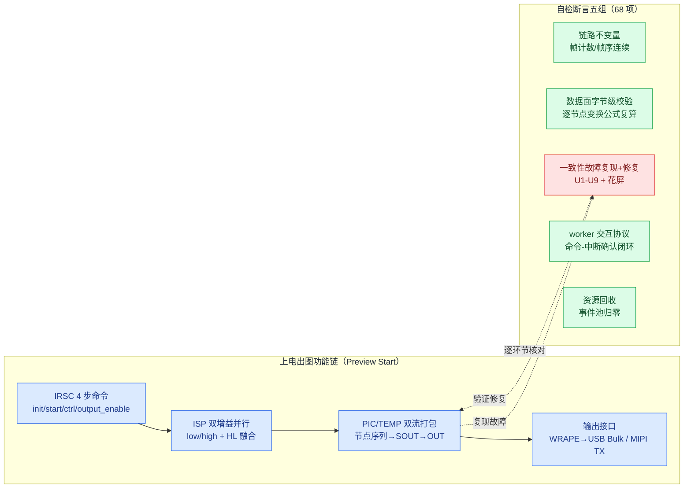

# isp_pipeline_demo 功能测试报告

**结论**：68 项功能自检断言全部通过（exit 0）。测试方法为"程序自检"：示例在运行结束时逐项核对结果与不变量，覆盖 RS500 业务场景的架构级复现与故障修复（示例定位：架构模型与故障注入演示，非业务复刻）。

**关联文档**：架构说明见 `example_ISP_pipeline_design_architecture_zh.md`；一致性故障与处理见 `example_ISP_pipeline_design_consistency_avoidance_zh.md`；代码评审见 `example_ISP_pipeline_review_record_code_architecture.md`；逐阶段运行输出见 `isp_pipeline_demo_run_log_fresh.txt`。

**推荐阅读顺序**：第 1 章测试范围 → 第 2 章断言分组 → 第 4 章复现命令；运行输出与各阶段说明集中在 fresh 日志文件。

## 1. 测试范围



上电出图功能链（蓝）逐环节对应到断言组（绿 = 不变量核对，红 = 故障复现与修复验证）。

## 2. 测试方法

### 2.1 程序自检（主方法）

示例程序在 main() 末尾执行自检，逐项核对运行终态和不变量；任一项失败即打印 `[FAIL]` 并以非零退出码结束。断言分五组：

1. **链路不变量**：各环节帧计数一致（IRSC 产帧 30 → 双增益链 → HL 融合 → 增强/温度链 → PIC/TEMP 打包 → WRAPE 封帧 45 → 主机观察者收帧 45），帧序连续无缺失（gaps==0）。
2. **数据面字节级校验**：像素数据按确定性公式逐节点变换（输入帧 → 低/高增益 → 融合 → 增强），WRAPE 入口重新读取 DDR 并复算比对，要求 byte_mismatch==0；DDR 槽位帧戳在读侧校验 frame_id，防止读到被覆盖的旧槽位。
3. **一致性故障复现与规避**：U1-U9 与花屏逐类"先复现故障、再验证修复"。例如：参数回灌场景断言产测写入的 0xBEEF 被旧影子值 0x1002 覆盖（故障侧），修复侧断言旁路退出后影子与硬件一致（drift==0）；T37 提前封帧场景断言截断帧字节数恰为 655360（与真实抓包一致）。
4. **worker 交互协议**：7 个 worker 实例的 executed/rejected 计数核对；命令通道 executed==4（命令与中断回执一一对应）；USB 完成路径经软中断转发后零丢失（delivered==framed）。
5. **资源回收**：事件池终态 used==0（所有事件块归还，记录峰值水位）；AO 在途等待计数归零（停机排空阶段不丢失完成事件）。

### 2.2 日志交叉验证

结构化日志（事件码 + 参数）与可读输出（printf）的数值一致，例如事务计数 6840 对应日志参数 a0=0x1ab8；任一断言失败均可从结构化轨迹回溯定位。

### 2.3 日志范围

日志分四层，各层频次与用途不同；最新运行输出 727 行，逐阶段说明见 fresh 日志文件：

| 层级 | 内容 | 频次（单次运行） |
|---|---|---|
| 结构化日志（事件码 + 参数） | HSM 状态迁移轨迹 | 233 条，全量记录 |
| 关键事件 | 会话推进 / 重配阶段 / worker 统计 / 帧完成 | 约 30 条 |
| 生命周期与里程碑 | worker 启动/排空/退出（7 实例）+ 每 10 帧一条处理进度 | 27 条 |
| 拒绝告警 | 提交被拒（忙）逐次输出 | 正常运行为 0 条；出现即预示丢帧 |

**输出量控制**：全量记录只放在 HSM 轨迹（状态视角信息最紧凑）；帧处理进度每 10 帧输出一条；拒绝告警逐次输出但正常运行为零。单次运行总输出约 300 条，可完整审计。

**验证意义**：日志与计数器可复核断言结果——事务窗口关闭、worker 完成、事件池回收均有对应运行记录。

## 3. 测试边界

host 模拟不等价 RS500 板级行为（时序数字为建模值）；flash_proxy_demo 已单独注册 ctest。

## 4. 复现命令

```bash
cd build && make -j12
./examples/isp_pipeline_demo            # 期待 RESULT: ALL PASS, exit 0
```

## 5. 与 RS500 功能对应关系

对齐分析基于示例源码、运行日志和 RS500 模块名称逐项核实（映射范围限核心模块与 vdcmd 命令通道，不追求线程全覆盖）。

### 5.1 已对齐功能

**对齐分级说明**：示例定位是架构模型与故障注入演示，各业务域模拟深度不同。分级：完整（含故障边界复现）/ 语义对齐（交互模式等价）/ 结构对齐（拓扑一致）。

| RS500 功能（出处） | 示例落点 | 对齐度 | 已知简化 |
|---|---|---|---|
| Preview Start 四阶段（Phase1/3/4 + KBC→IRSC 顺序） | 编排器 + 会话状态机 BOOT→INIT | 完整 | Phase1/3 为占位（RS500 有真实预加载/CRC/失败处理） |
| IRSC 4 步命令序列 init/start/ctrl/output_enable | 命令表 + IrscDriver AO | 完整 | 命令通道建模，无寄存器位定义 |
| ISP 主链高/低增益并行 + HL 融合 | 双增益 AO + 融合 AO | 语义对齐 | 增益为数学变换；节点初始化为简化完成事件（RS500 按掩码真实初始化并可逆序回滚） |
| PIC/TEMP 双流视频打包 | VideoFsm 乘积状态表 + VideoPack AO | 完整 | 生命周期模型，节点内部算法为字节公式 |
| 一级 DMA 三帧循环 | SoutDma worker（环深 3） | 结构对齐 | RS500 用真实三帧描述符，示例为槽位+帧戳模型 |
| 中断事件向上（ISR→rx_indicate→事件） | worker 完成事件回 AO（提交→等待态→中断确认） | 语义对齐 | 中断语义建模，无真实 ISR 上下文 |
| vdcmd 命令通道 | CmdDma worker（executed==4 断言） | 完整 | 无 CCI/UART/SPI 物理传输 |
| MIPI CSI TX stream error/idle 中断 | MipiIrq worker + MipiSink AO | 语义对齐 | 无 CSI-2 包/D-PHY |
| T37 UVC X2 提前封帧（655360B ERR+EOF）与 Identity Zoom 规避 | WRAPE 字节级精确复现 + 10 轮切换稳定 | 完整 | 最接近真实故障（字节边界精确） |
| 超分 X1→X2 原子重配（事务窗口） | RecfgOrch 8 态 + 冻结窗口 | 完整 | 架构实验模型，重配内容为几何参数 |
| deinit 停稳机制差异（Change16517） | QuiescePolicy 编译期选择事件或轮询路径 | 完整 | ioctl 计数为建模值 |
| regmap 三标志缓存协议 | PeriphRegCache + RAII BypassGuard | 完整 | 寄存器地址空间为最小示例集 |
| 三类画面异常（花屏/丢帧/闪屏）复现与修复 | 异常场景组断言 | 完整 | 像素为 8x8 小尺寸帧 |

### 5.2 同步与一致性问题对照

示例复现 RS500 文档记录的同步与一致性问题，并记录处理机制和测试断言。

| RS500 记录的问题 | 处理机制（架构层） | 验证 |
|---|---|---|
| 超分计算口径不一致（X2 出图剩 1/4） | 单一 FrameGeometry 权威 + 事务冻结窗口 | 故障复现 + 回滚断言 |
| 新旧帧交替 / 提前封帧（T37 655360B ERR+EOF） | 重配 8 态冻结 + Identity Zoom 固定下游几何 | 字节级复现 + 10 轮切换稳定断言 |
| 参数回灌（旧参数回写寄存器） | 三标志缓存协议 + RAII 配对旁路 | 0xBEEF 被旧值覆盖复现 + 修复后零漂移断言 |
| 废弃地址（DMA 用旧布局） | layout_version 版本失效（查询时作废） | 过期查询不命中断言 |
| 坐标失同步 | 单一坐标变换入口 | [100,200]→[439,539] 映射断言 |
| deinit 停稳机制差异（Change16517） | QuiescePolicy 编译期统一路径 | ioctl 计数对比断言 |
| 峰值时延突破缓冲窗口丢帧 | 显式窗口模型 + DDR 环溢出守卫 | 尖峰丢 4 帧复现 + 深缓冲零丢帧断言 |
| 未停稳即重启闪屏 | HSM 停稳弧（未停稳为不可达状态） | 旧几何输出复现 + 停稳后对齐断言 |
| 花屏（数据位宽错配） | 共享位宽假设单点验证 | 32 对像素损坏复现 + 修复后零损坏断言 |
| 并发同步（worker 交互） | AO 单写路径 + worker 忙则拒绝 + 按 id 匹配的暂存环 + 命令-中断确认闭环 | executed==4、byte_mismatch==0、pool.used==0 |

处理机制归结为三项约束：**单一写入者**（每个字段一个写入口）、**事件事务边界**（变更整体化提交）、**明确的完成确认**（硬件证据后才提交）。测试结果只说明当前 host 模拟通过，不代表板级行为。

### 5.3 已知偏差

- 事务窗口关闭已由终局动作自动驱动（2026-09-03 修复；此前由主线程轮询终局条件驱动）
- 硬件为行为模拟（消息发生级），不含真实寄存器位定义与 SPI/CCI 物理传输
- host 模拟不等价板级行为（时序数字为建模值）

结论：核心业务链路与一致性场景对齐度高，历史遗留的事务窗口驱动方式偏差已修复（见一致性文档 3.2）。
