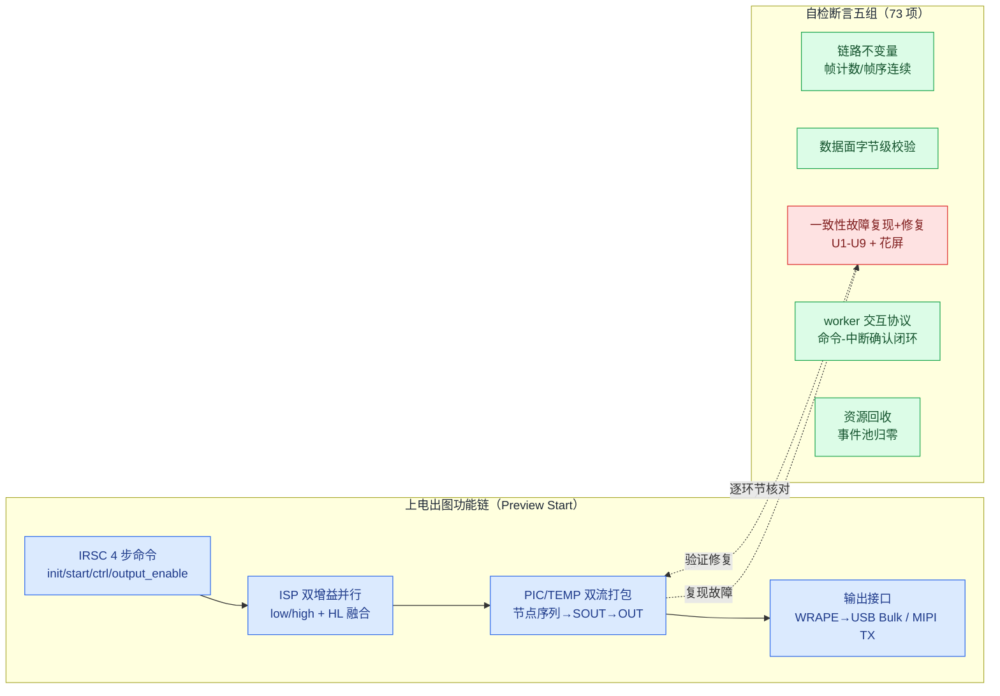

# isp_pipeline_demo 功能测试报告

**关联文档**：架构说明见 `example_ISP_pipeline_design_architecture_zh.md`；故障处理见 `example_ISP_pipeline_design_consistency_avoidance_zh.md`；逐阶段运行输出见 `isp_pipeline_demo_run_log_fresh.txt`。

**本次验收更新**：2026-09-05，基于提交 `03cc959` 及随后 `Runtime` 析构停机修复；以下结果均为当前工作区重新执行，不沿用旧日志的测试结论。

## 1. 测试范围



功能链（蓝）逐环节对应断言组（绿 = 不变量，红 = 故障复现与修复）。

## 2. 测试方法

### 2.1 程序自检

main() 末尾逐项核对运行终态与不变量，任一失败打印 `[FAIL]` 并以非零退出码结束。断言分五组：

1. **链路不变量**：各环节帧计数一致（IRSC 产帧 30 → 增益/融合/增强/打包 → WRAPE 封帧 45 → 主机观察者收帧 45），帧序无缺失。
2. **数据面字节级校验**：像素按确定性公式逐节点变换，WRAPE 入口重新读取 DDR 复算比对（byte_mismatch==0）；读侧校验槽位帧戳防止读到被覆盖的旧槽位。
3. **一致性故障复现与规避**：U1-U9 与花屏逐类"先复现、再验证修复"。如参数回灌断言产测值 0xBEEF 被旧影子值 0x1002 覆盖（故障侧）、修复后零漂移；T37 提前封帧断言截断字节数恰为 655360（与真实抓包一致）。
4. **worker 交互协议**：7 实例 executed/rejected 计数核对；命令通道 executed==4（命令与中断回执一一对应）；USB 完成路径经软中断转发零丢失。**AOP 切面活性**：5 个完成型 worker 的 execution_duration 非零、IRSC 逐帧计数等于帧总数（策略链不仅编译通过且真实运行）。
5. **资源回收**：事件池终态 used==0；AO 在途等待计数归零（停机排空不丢完成事件）；diag 双 lane 守恒（drained==accepted）。

### 2.2 日志交叉验证

结构化日志（事件码+参数）与 printf 输出数值一致（如事务计数 6840 对应日志 a0=0x1ab8），断言失败可从结构化轨迹回溯。

### 2.3 日志范围

本次 host coro 运行输出 2138 行，分四层：

| 层级 | 内容 | 频次 |
|---|---|---|
| 结构化日志 | HSM 状态迁移轨迹 | 233 条，全量 |
| 关键事件 | 会话/重配/worker 统计/帧完成 | 约 30 条 |
| 生命周期与里程碑 | worker 启动/排空/退出 + 每 10 帧进度 | 27 条 |
| 拒绝告警 | 提交被拒逐次输出 | 正常为 0；出现即预示丢帧 |

全量记录只放在 HSM 轨迹（信息最紧凑）；帧进度每 10 帧一条；单次运行总量约 300 条，可完整审计。

### 2.4 当前验证结果

| 验证项 | 命令/证据 | 结果 |
|---|---|---|
| coact 全量测试 | `cmake --build build -j12 && ctest --test-dir build --output-on-failure` | **54/54 通过** |
| host ISP 示例 | `./build/examples/isp_pipeline_demo` | **73 项通过，`RESULT: ALL PASS (fails=0)`，exit 0** |
| RT-Thread PAL 编译门 | `ctest --test-dir build -R isp_pipeline_demo_rtt` | **编译、链接通过** |
| RT-Thread stub 直接运行 | `timeout 30s ./build/examples/isp_pipeline_demo_rtt` | 1 项 T37 帧间隙断言失败；stub 的毫秒级 `mdelay` 只作编译门，不作为板级功能结论 |
| Renode ARM smoke | STM32F407 + RT-Thread 5.2.2 基础组件脚本 | **`RENODE PASS spsc=8/8 fault=1 watermark=2`，exit 0** |
| timer 稳定性 | `test_timer` 独立运行 100 次 | **100/100 通过** |

此前偶发的 `test_timer` 段错误根因为 `Runtime` 缺少析构停机，线程在拥有者离开作用域后仍可能运行；现已由 `Runtime::~Runtime()` 统一调用 `stop()` 修复。Renode smoke 验证的是 coact 基础组件，不等价于完整 `isp_pipeline` ARM 镜像。

### 2.5 资源消耗

资源均为编译期定容和静态存储，不使用 demo 业务路径的动态分配；AO、`Runtime`、DDR 上下文和 worker 实例已迁移出 `main()` 任务栈。

| 资源 | 配置/实测 | 说明 |
|---|---:|---|
| EventPool | 128 blocks × 128 B，存储 16,448 B | `.bss` 静态数组，含 64 B 对齐余量 |
| Staging | High/Normal/Low = 32/64/128 | `DefaultConfig` 固定容量 |
| DDR 模型 | 3-buffer，8 slots，7 个区域 | 8×8 小帧；不代表真实 DDR 带宽 |
| Worker 环 | nominal 2/2/2/4/4，物理容量按 2 的幂取整 | 满环采用拒绝，不阻塞 Dispatcher |
| RT-Thread PAL | Dispatcher 栈 buffer 16 KiB（当前实际配置 4 KiB）；8 producer slots；8 worker slots × 4 KiB | `RtThreadResources` 实测 `50,856 B`，第 8 个 worker slot 为 headroom |
| Diag | normal/critical = 32/8；writer stack 4 KiB | `LogRtThread<>` 实测对象 `5,480 B`（不含 RT 内核控制块） |
| host coro | 16 coroutine slots × 256 KiB = 4 MiB | 主要占用 host `.bss`；当前 demo `.bss` 约 4.05 MiB，峰值 RSS 约 7.0 MiB |
| Demo 工作集 | AO/Runtime/DDR/worker 对象约 15.7 KiB | 函数内静态对象，位于 `.bss`；仍需板级实测栈水位 |

本次 host 运行还观测到 `pool.used=0`；diag normal lane `accepted=1679, drained=1679, dropped=28`，critical lane `accepted=0, drained=0, dropped=0`，均满足守恒。资源表是 demo 的预算基线，移植到 MCU 时应按真实帧大小、栈水位和 `RT_CPUS_NR=1` 板级测量重新核定。

## 3. 测试边界

host 模拟不等价板级行为（时序为建模值）；flash_proxy_demo 已单独注册 ctest。RT-Thread stub 的直接运行仅用于辅助观察，不替代真实 BSP/中断/时钟验证。

## 4. 复现命令

```bash
cd build && make -j12
./examples/isp_pipeline_demo            # 期待 RESULT: ALL PASS, exit 0
```

## 5. 与 RS500 功能对应关系

映射范围限核心模块与 vdcmd 命令通道，逐项基于源码与运行日志核实。对齐分级：完整（含故障边界复现）/ 语义对齐（交互模式等价）/ 结构对齐（拓扑一致）。

| RS500 功能 | 示例落点 | 对齐度 | 已知简化 |
|---|---|---|---|
| Preview Start 四阶段 | 编排器 + 会话状态机 | 完整 | Phase1/3 为占位 |
| IRSC 4 步命令序列 | 命令表 + IrscDriver AO | 完整 | 无寄存器位定义 |
| ISP 高/低增益并行 + HL 融合 | 双增益 AO + 融合 AO | 语义对齐 | 增益为数学变换；节点初始化简化 |
| PIC/TEMP 双流打包 | VideoFsm 乘积状态表 + VideoPack AO | 完整 | 节点算法为字节公式 |
| 一级 DMA 三帧循环 | SoutDma worker（环深 3） | 结构对齐 | 槽位+帧戳模型 |
| 中断事件向上 | worker 完成事件回 AO | 语义对齐 | 无真实 ISR 上下文 |
| vdcmd 命令通道 | CmdDma worker | 完整 | 无物理传输 |
| MIPI CSI TX 中断 | MipiIrq worker + MipiSink AO | 语义对齐 | 无 CSI-2/D-PHY |
| T37 提前封帧与 Identity Zoom 规避 | WRAPE 字节级复现 + 10 轮稳定 | 完整 | 最接近真实故障 |
| 超分 X1→X2 原子重配 | RecfgOrch 8 态 + 冻结窗口 | 完整 | 重配内容为几何参数 |
| deinit 停稳机制差异 | QuiescePolicy 编译期选择 | 完整 | ioctl 计数为建模值 |
| regmap 三标志缓存协议 | PeriphRegCache + RAII 旁路 | 完整 | 地址空间为最小示例集 |
| 三类画面异常 | 异常场景组断言 | 完整 | 像素为 8x8 小尺寸帧 |

### 5.2 同步与一致性问题对照

| RS500 记录的问题 | 处理机制 | 验证 |
|---|---|---|
| 计算口径不一致（X2 出图剩 1/4） | 单一 FrameGeometry 权威 + 冻结窗口 | 复现 + 回滚断言 |
| 新旧帧交替 / 提前封帧（T37） | 8 态冻结 + Identity Zoom | 字节级复现 + 10 轮稳定断言 |
| 参数回灌 | 三标志协议 + RAII 配对旁路 | 覆盖复现 + 零漂移断言 |
| 废弃地址 | layout_version 查询时作废 | 过期查询不命中断言 |
| 坐标失同步 | 单一坐标变换入口 | [100,200]→[439,539] 断言 |
| deinit 停稳分叉 | QuiescePolicy 统一路径 | ioctl 计数对比断言 |
| 峰值时延突破缓冲窗口 | 显式窗口模型 + 溢出守卫 | 尖峰丢帧复现 + 深缓冲零丢帧 |
| 未停稳即重启闪屏 | HSM 停稳弧 | 旧几何复现 + 对齐断言 |
| 花屏（位宽错配） | 位宽假设单点验证 | 损坏复现 + 零损坏断言 |
| 并发同步（worker 交互） | 单写路径 + 忙则拒绝 + 命令-中断闭环 | `executed==4、pool.used==0` |

机制归结为三项约束：**单一写入者**、**事件事务边界**、**明确的完成确认**。结果只说明 host 模拟通过，不代表板级行为。

### 5.3 已知偏差

- 事务窗口关闭已由终局动作自动驱动（此前由主线程轮询驱动，现已修复）
- 硬件为行为模拟，不含寄存器位定义与物理传输；时序为建模值
