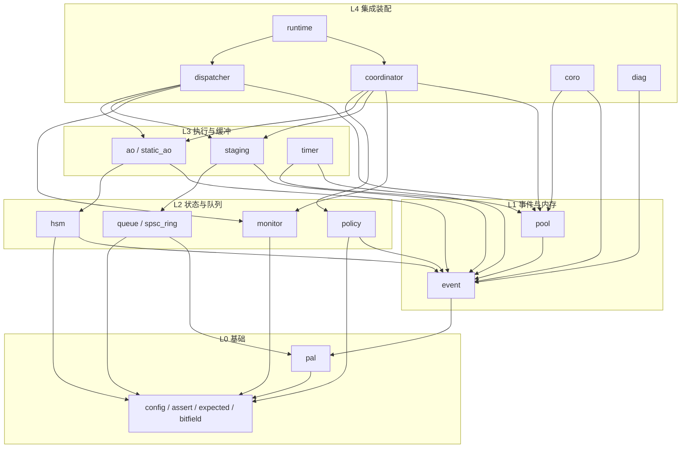

# coact 实现契约（Interface Contract）v0.5.0

本文档是 coact 的接口契约，描述模块边界、公开签名、语义、不变量与所有权规则。版本号与顶层构建一致（`CMakeLists.txt` 中 `project(coact VERSION 0.5.0)`）。文中所有路径均为**仓库相对路径**；示例与测试命令在任意检出上均可执行。

读者可先读 `README.md` 与 `docs/cpp17_coact_usage_zh.md` 建立使用视图，再回到本文核对契约细节。本文中的签名以当前 `include/coact/` 下的实现为准；凡与本机代码不一致之处，以代码为准。

## 0. 纪律与代码来源

- 项目许可证：**MIT**。新增文件必须带 `// SPDX-License-Identifier: MIT` 头注释。
- 语言：**C++17**。构建强制关闭异常与 RTTI（见 §2 的严格编译选项），代码不得依赖异常与 RTTI。
- 第三方复用与许可：本仓库复用了若干第三方 MIT 许可的组件与设计思路（事件池的定步长空闲链表、引用计数事件、单执行权活动对象与批处理派发循环等）。这些组件的版权归属与来源文件标注在各源文件头部；再分发时必须保留原 MIT 版权文本并保持来源标注，供合规回溯。派生实现须按 coact API 重新表达，项目整体仍以 MIT 发布。
- 编码风格：Allman 大括号、4 空格缩进、120 列上限、无 `goto`、核心运行时路径无动态分配；错误用返回值或 `Expected` 表达，不抛异常。
- 头文件统一 `#pragma once`，公共头放 `include/coact/`。
- 禁止全局可变单例，唯一例外是**受控的全局事件池注册表**（`event.hpp` 的 `detail::g_pool_registry`）：仅初始化期写入，之后只读。
- 平台差异一律通过 PAL 类型参数在**编译期**解析，禁止运行期分支选择平台行为。

## 1. 仓库结构

### 1.1 公共头文件（`include/coact/`，按职责分组）

- **基础与词汇（L0）**
  - `config.hpp`：`LogicalPrio` / `PriorityClass` / `ContextKind` / `ExecutionContext` / `EventQos` / `TargetId` / `Signal` / `SubmitDisposition` / `SubmitResult` / `QueueResult` / `PoolError` / `InitError` / `DefaultConfig`。
  - `assert.hpp`：`COACT_ASSERT`、`COACT_UNLIKELY`、`coact::fatal_assert`。
  - `expected.hpp`：move-only 的 `Expected<V, E>` 与 `Expected<void, E>`。
  - `bitfield.hpp`：`BitFieldView<Reg, Offset, Width>`，编译期位域读写视图。
- **事件与内存（L1）**
  - `event.hpp`：`Event`、`PoolRecord`、`kMaxEventPools`、`pool_record` / `register_pool` / `unregister_pool`、`event_ref_inc` / `event_gc`。
  - `pool.hpp`：`EventPool`、同步 profile（`RttSingleCoreProfile` / `HostSmpProfile`）、回收策略（`ImmediateReclaimer` / `ReclaimBatcher` / `BatchedReclaimer`）。
- **状态与队列原语（L2）**
  - `hsm.hpp`：`TransitionKind`、`StateDef`、`TransitionDef`、`Hsm`。
  - `queue.hpp`：`BoundedMpscQueue`（SMP）、`SingleCoreCriticalRing`（单核临界区）。
  - `spsc_ring.hpp`：`SpscRing`（单生产者单消费者无锁环形缓冲）。
  - `policy.hpp`：`PolicyResult` / `PolicyReason` / `PolicyOps` / `TokenBucketRateLimiter` / `MergeCell`。
  - `monitor.hpp`：`BreakerLevel` / `Breaker` / `BreakerBank` / `RejectReason` / `AoCounters` / `GlobalCounters` / `Monitor`。
- **执行与缓冲（L3）**
  - `ao.hpp`：`AoRunState` / `ExecutionLease` / `PendingCounter` / `AoBase` / `AoRegistry` / `Ao`。
  - `static_ao.hpp`：`StaticAoEntry` / `make_static_ao_entry`（板级静态 AO 表的非拥有入口）。
  - `staging.hpp`：`Partition` / `StagingSlot` / `BatchSelector` / `Staging`。
  - `timer.hpp`：`TimerTaskId` / `TimerError` / `SteadyTickSource` / `ManualTickSource` / `TimerScheduler`。
- **集成装配（L4）**
  - `dispatcher.hpp`：`Dispatcher`（单线程批处理循环）。
  - `coordinator.hpp`：`DispatchCoordinator`（统一提交入口）。
  - `runtime.hpp`：`Runtime`（三阶段初始化与生命周期）。
- **平台抽象（PAL）**
  - `pal.hpp`：`CriticalSection` / `CriticalSectionGuard` / `pal::CriticalToken` / `pal::ClockOps` / `pal::ThreadEntry` / `make_critical_section` / `SpinCriticalSection` / `make_spin_critical_section`，以及 PAL 方法级契约注释。
  - `pal_posix.hpp`：`pal::Posix`（pthread / condvar / 单调时钟，SMP 语义）。
  - `pal_rtthread.hpp`：`pal::RtThread`（静态资源 RT-Thread PAL，单核语义）。
- **协程子系统（`coro/`）**
  - `coro/coro.hpp`、`coro/task.hpp`（`Task` / `Promise` / `AwaitableRef` / `TaskRegistry`）、`coro/scheduler.hpp`（`TimerFacade`）、`coro/combinators.hpp`、`coro/awaitable.hpp`、`coro/task_id.hpp`、`coro/error.hpp`、`coro/config.hpp`、`coro/version.hpp`、`coro/posix.hpp`（`Coroutine` / `StackfulExecutor`）、`coro/detail/fixed_storage.hpp`、`coro/detail/task_slot.hpp`。
- **诊断**
  - `diag/log.hpp`：`LogLevel` / `LogLane` / `LogRecord` / `DiagRing` / `LogDescriptor` / `LogCatalog` / `LogSinkOps` / `LogClockOps` / `LogStats` / `Logger`。
  - `diag/log_rtthread.hpp`：RT-Thread 后端适配。

### 1.2 源与测试（`src/`、`test/`、`examples/`、`tools/`）

- `src/<module>/`：每个模块一个目录，模块自身的头文件放 `include/coact/`，目录内是模块测试与 `CMakeLists.txt`。现有模块目录：`event`、`hsm`、`queue`、`ao`、`staging`、`policy`、`monitor`、`core`、`diag`。
- `src/core/`：装配与集成所在，含 `pal_posix.cpp`、`pal_rtthread.cpp`、`coordinator` / `integration` / `stress` / `static_lifetime` / `bitfield` / `config` / `expected` / `timer` / `softirq` / `pal_sync` / `rtt_pal` 等测试，以及协程测试（`test_coro_*.cpp`）与热点基准（`bench_hotpath.cpp`）。
- `test/`：`test_harness.hpp` 测试框架；RT-Thread 主机桩（`rtthread_stub.h`、`rtthread_gate_smp/`、`rtthread_gate_multicore/`）；`tsan_classify.sh` / `asan_classify.sh` / `elf_audit.sh` 卫生脚本。
- `examples/`：主机示例（`isp_pipeline/`、`serial_ota/`、协程 demo、`flash_proxy_demo`、`hsm_protocol_demo`、`node_manager_demo` 等），见 `examples/README.md`。
- `tools/`：开发辅助脚本（`flamegraph_svg.py`）。

### 1.3 模块依赖

箭头方向为“依赖”。下图为模块级主要依赖，依据各头文件的 `#include` 关系；`examples/README.md` 的分层表与本图一致。



依赖规则：模块只 `#include` 自身与图中列出的下游模块头文件。回调函数指针类型**不带** `noexcept` 限定（`CriticalSection`、`PoolRecord::reclaim`、`StateDef` / `TransitionDef` 的函数指针均如此）——C++17 下 `noexcept` 不是函数指针类型的一部分，写出会造成类型不匹配。

## 2. 构建与测试

顶层为 header-only 的 `coact_core` INTERFACE 库；测试经 CTest 注册。仓库相对的最小流程：

```sh
cmake -B build -S .
cmake --build build
ctest --test-dir build --output-on-failure
```

- 单个目标（如协调器契约测试）：`cmake --build build --target test_coordinator && ctest --test-dir build -R test_coordinator --output-on-failure`。
- 严格编译选项：MSVC 为 `/W4 /GR- /EHs-c-`；其它编译器为 `-Wall -Wextra -Wpedantic -fno-exceptions -fno-rtti`。这些是 INTERFACE 用法要求，传导给链接 `coact_core` 的消费者。
- `COACT_PORTABLE_ONLY=ON`（默认 OFF）是 Windows CI 的显式裁剪开关：只注册可跨主机构建的目标，被跳过的测试在 configure 阶段列出。它不是平台宏，不改变运行期行为。
- 测试用 `#include "test/test_harness.hpp"`，文件末尾用 `COACT_TEST_MAIN()`；`CMakeLists.txt` 中的 `coact_add_test(<target> <src>...)` 负责链接 `coact_core` 与测试框架，并为每个测试设 120 秒墙钟上限（用于捕获真挂起，而非性能门槛）。
- 并发与内存卫生脚本：`test/tsan_classify.sh`、`test/asan_classify.sh`；符号级零堆断言见 `test/elf_audit.sh`。
- 示例为 POSIX PAL 可执行文件，随顶层构建一并生成，部分示例自带 `add_test` 自校验。

## 3. 模块接口契约

契约以当前实现为准。以下“失败返回”一栏描述的是**运行时返回值**，不改变编译期约束（`static_assert`）。

### 3.1 event / pool（事件与事件池，L1）

```cpp
struct Event {
    uint16_t signal;
    uint8_t  pool_id;   // 0 = 静态事件；否则为 1 基全局注册表索引
    uint8_t  ref_ctr;   // alloc 后为 1；每额外投递 +1；归 0 回池
};

static constexpr uint8_t kMaxEventPools = 16U;

struct PoolRecord {
    alignas(64) std::atomic<uint32_t> free_head;  // [31:16] ABA tag, [15:0] 空闲索引
    uintptr_t base;                               // 块区对齐基址
    uint16_t  block_size;                         // 对齐后的块步长
    uint16_t  capacity;
    alignas(64) std::atomic<uint16_t> used;
    std::atomic<uint16_t> high_watermark;
    void (*reclaim)(Event* e);                    // 归还块（无 noexcept 限定）
    void* owner;                                  // 所属 EventPool*（其 CriticalSection）
    CriticalSection cs;
};

PoolRecord* pool_record(uint8_t pool_id) noexcept;      // 0 或未知 id 返回 nullptr
uint8_t     register_pool(PoolRecord* rec) noexcept;    // 幂等；满则返回 0
void        unregister_pool(PoolRecord* rec) noexcept;  // 幂等；注销前须已回收全部事件

void event_ref_inc(Event* e) noexcept;  // 仅池事件；静态事件为 no-op
void event_gc(Event* e) noexcept;       // 递减；归 0 且 pool_id!=0 时经 pool_record 回池

template <uint16_t BlockSize, uint16_t Capacity,
          class Profile = HostSmpProfile,
          size_t BlockAlign = alignof(std::max_align_t)>
class EventPool {
public:
    ~EventPool() noexcept;                 // 析构调用 shutdown()
    void shutdown() noexcept;              // 从全局注册表注销
    bool init(void* storage, size_t bytes,
              CriticalSection cs = detail::noop_cs()) noexcept;
    Event* alloc(uint16_t signal) noexcept;                       // 满返回 nullptr
    Event* alloc_with_margin(uint16_t signal, uint16_t margin) noexcept;
    template <typename Layout, typename Payload, size_t PayloadAlign>
    Layout* alloc_typed(uint16_t signal) noexcept;
    template <typename Layout, typename Payload, size_t PayloadAlign>
    Layout* alloc_typed_with_margin(uint16_t signal, uint16_t margin) noexcept;
    uint16_t used() const noexcept;
    uint16_t capacity() const noexcept;
    uint16_t high_watermark() const noexcept;
};

class ImmediateReclaimer { void begin(); void release(Event*); void flush(); };
template <uint16_t MaxPending = detail::kDefaultReclaimBatcherPools>
class ReclaimBatcher;                 // release() 按池挂链，块数达 kReclaimBatchCap 或 flush 时一次 CAS 归并
template <uint16_t MaxPending> using BatchedReclaimer = ReclaimBatcher<MaxPending>;
```

语义与不变量：

- `pool_id` 为 1 基注册表索引，`kMaxEventPools` 为 16；`pool_record(0)` 与越界 id 返回 `nullptr`。
- `EventPool::init` 从外部存储构建定步长空闲链表、绑定临界区并注册；重复初始化、空存储、空临界区 hook、可用空间不足一个块时返回 `false` 并保持不可分配。`shutdown()` 与析构幂等，需在所有携带该 `pool_id` 的事件回收后调用，否则 `event_gc` 会读到失效记录。
- 编译期约束（`static_assert`）：`Capacity > 0` 且 `< 0xFFFF`（16 位索引哨兵）；`BlockSize >= sizeof(Event)`；`BlockAlign` 非零、为 2 的幂、不小于 `alignof(Event)`，且对齐后步长可被 `uint16_t` 表示。`HostSmpProfile` 额外要求 32 位 CAS 无锁。
- 空闲链表头是单个打包 32 位字（索引 + ABA tag），每次成功 alloc/reclaim 递增 tag 以拒绝过期弹出；`HostSmpProfile` 用 acquire/release CAS，`RttSingleCoreProfile` 在单个 irq 掩码临界区内做普通索引操作，无 CAS / tag / 退避。
- `alloc_typed` 要求（编译期 `event_layout_complies_v`）：`Layout` 标准布局、首成员为精确的 `coact::Event`（offset 0）、`sizeof(Layout) <= BlockSize`、`sizeof(Payload)` 容于 payload 区、`alignof(Payload) <= PayloadAlign` 且 payload 偏移对齐、`Layout` 与 `Payload` 可无异常默认构造且可平凡复制/析构。池无析构回调，回收时不运行应用类型析构函数。
- 引用计数生命周期：`alloc` 返回 `ref_ctr==1` 的池事件；首次 submit 转移该 allocation reference（不额外 inc）；多播或自留须先 `event_ref_inc`；消费者 `dispatch` 后 `event_gc`；最后一个引用归 0 时经 `pool_id` 回原池。静态事件（`pool_id==0`）永不被回收。生产者投递后不得再访问事件，除非已 `event_ref_inc` 自留。
- 回收策略由 profile 选择：`RttSingleCoreProfile::kUseBatchedReclaim == false`（`ImmediateReclaimer`），`HostSmpProfile` 为 `true`（`ReclaimBatcher`）。`ReclaimBatcher` 仅限单一回收线程使用；链上每块的 `next` 写入与头 CAS 必须在同一临界区，SMP 下须注入 `make_spin_critical_section`（POSIX 的 `irq_save` 是 no-op，无法序列化 next 字段竞争）；批次数超过容量时降级为即时单块回收，不 assert。

### 3.2 hsm（层次状态机，L2）

```cpp
enum class TransitionKind : uint8_t { External, Internal, Self };

template <typename Context>
struct StateDef {
    int8_t parent;                 // 0 = 根；-1 = 无父
    void (*entry)(Context&);       // 可为 null
    void (*exit)(Context&);        // 可为 null
    const char* name = nullptr;    // 仅调试标签
    int8_t initial_child = -1;     // 直接初始子态；-1 = 叶
};

template <typename Context>
struct TransitionDef {
    int8_t source;                 // 0 = 根；不支持 wildcard
    uint16_t signal;
    int8_t target;                 // External 使用
    TransitionKind kind;
    bool (*guard)(const Context&, const Event&);   // null = 放行
    void (*action)(Context&, const Event&);        // null = 无操作
};

template <typename Context>
class Hsm {
public:
    Hsm(const StateDef<Context>* states, uint16_t num_states,
        const TransitionDef<Context>* transitions, uint16_t num_transitions,
        int8_t initial_state, uint8_t max_depth) noexcept;
    void init(Context& ctx, const Event& evt) noexcept;      // 自根沿父链进入 initial_state
    bool dispatch(Context& ctx, const Event& evt) noexcept;  // handled?
    int8_t current_state() const noexcept;                   // -1 = 未初始化
    const char* current_state_name() const noexcept;         // 无标签时返回 nullptr
};
```

派发语义：自当前叶按 `(state, signal)` 查找转换，未命中沿 `parent` 上溯，最多 `max_depth` 跳；`guard` 失败则继续匹配同 source/signal 的下一条。`Internal` 只执行 action。`Self` 自实际叶退出到 source（含 source）、执行 action、重入 source 并沿 `initial_child` 下降。`External` 求 source 与 target 的 LCA，若 LCA 恰为 source 或 target，则以 LCA 的父为边界（保证复合 source 到后代的转换不退化为 local），退出到 LCA（不含）、执行 action、进入 target 并沿 `initial_child` 下降。构造期 `validate_topology` 断言 `num_states <= 128`、父链无环、`initial_child` 与 parent 一致。

### 3.3 queue / spsc_ring（队列后端，L2）

`CriticalSection` 由 `pal.hpp` 定义：`{ void* ctx; Token (*save)(void*); void (*restore)(void*, Token); }`，`Token == uintptr_t`。与旧契约不同，hook 现携带 `ctx`。

```cpp
template <typename T, uint16_t Capacity>
class BoundedMpscQueue {                       // SMP 多生产者单消费者
public:
    BoundedMpscQueue() noexcept;
    explicit BoundedMpscQueue(CriticalSection) noexcept;   // 参数被忽略（保持接口一致）
    bool try_push(const T&) noexcept;
    bool try_push(T&&) noexcept;
    bool try_pop(T& out) noexcept;
    bool front(T& out) const noexcept;         // 只看最早 Ready，不消费；消费者侧专用
    uint16_t size() const noexcept;            // 计入 Writing 与 Ready
    bool has_ready() const noexcept;
    static constexpr uint16_t capacity() noexcept;
};

template <typename T, uint16_t Capacity>
class SingleCoreCriticalRing {                 // 单核 irq 掩码临界区
public:
    explicit SingleCoreCriticalRing(CriticalSection cs) noexcept;
    bool try_push(const T&) noexcept;
    bool try_push(T&&) noexcept;
    [[nodiscard]] QueueResult try_push_observed(const T&) noexcept;
    [[nodiscard]] QueueResult try_push_observed(T&&) noexcept;
    bool try_pop(T& out) noexcept;
    bool front(T& out) const noexcept;
    uint16_t size() const noexcept;
    bool has_ready() const noexcept;
    uint16_t size_locked() const noexcept;     // 调用方须已持同一 CriticalSection
};

template <typename T, uint16_t Capacity> class SpscRing;   // 单生产者单消费者
```

- `BoundedMpscQueue` 用 fixed-cell ready-set：producer 以 CAS 独占一个 Free cell，构造后 `release` 发布为 Ready；consumer 扫描固定 cell 集选当前可见 publication ticket 最小者。Writing 只占自身 cell，不阻塞其他 Ready 项。单线程 push 保 FIFO；并发 push 不承诺 per-producer FIFO。要求无锁 64 位原子；满时 `try_push` 返回 `false`，无 Ready 时 `try_pop` 返回 `false`。析构要求生产/消费者静默，并销毁仍存活的非平凡 payload。
- `SingleCoreCriticalRing`：push/pop/观测全程在同一临界区，临界区内不调用任何用户回调。`try_push_observed` 融合“容量检查 + 移动 + 压入后水位”，失败不消耗入参。`size_locked()` 要求调用方已持有构造时注入的同一临界区，用于复合状态迁移时避免不可重入的嵌套 irq 掩码。
- `front()` 与 `try_pop()` 同属消费者侧操作，禁止并发调用。

### 3.4 monitor / breaker（监控与熔断，L2）

```cpp
enum class BreakerLevel : uint8_t { Normal, BrokenL1, BrokenL2, Safe, Recovering };

template <typename Config = DefaultConfig>
class Breaker {
public:
    Breaker() noexcept;
    explicit Breaker(const Config& cfg) noexcept;
    // 事件输入
    void on_direct_timeout() noexcept;          // 连续 3 次 -> L1
    void on_dispatcher_rtc_timeout() noexcept;  // 连续 3 次 -> L2（隔离慢 AO）
    void on_watermark_violation() noexcept;     // 持续 >80% -> L2
    void on_watermark(uint8_t percent) noexcept;// 采样当前整体水位 0..100
    void on_overflow() noexcept;                // -> L2
    void on_key_reserve_exhausted() noexcept;   // -> Safe
    void on_watchdog() noexcept;                // -> Safe
    void on_dispatch_cycle() noexcept;          // 每派发周期（冷却计数）
    void on_probe_success() noexcept;
    void on_probe_failure() noexcept;           // Recovering -> L2
    void on_external_safe_restore() noexcept;   // Safe -> Recovering
    void on_rtc_ok() noexcept;                  // 合格调用：清零连续超时，不跳过冷却
    // 查询
    BreakerLevel level() const noexcept;
    bool direct_allowed(TargetId ao) const noexcept;
    bool healthy_window_passed() const noexcept;
    bool drop_non_critical() const noexcept;    // L2 / Safe
    bool safe_events_only() const noexcept;     // Safe
    // 阈值常量：kDirectTimeoutThreshold/kRtcTimeoutThreshold=3，kWatermarkViolationPct=80，
    //           kLowWatermarkPct=50，kHighWatermarkPersist/kLowWatermarkPersist/kHealthyWindowsRequired=3
};

template <typename Config = DefaultConfig>
class BreakerBank {
public:
    static constexpr uint8_t kCapacity = Config::kMaxAo;
    void on_direct_timeout(TargetId) noexcept;
    void on_dispatcher_rtc_timeout(TargetId) noexcept;
    void on_overflow(TargetId) noexcept;
    void on_dispatch_cycle(TargetId) noexcept;
    void on_probe_success(TargetId) noexcept;
    void on_probe_failure(TargetId) noexcept;
    void on_rtc_ok(TargetId) noexcept;
    BreakerLevel level(TargetId) const noexcept;
    bool direct_allowed(TargetId) const noexcept;
    bool drop_non_critical(TargetId) const noexcept;
    bool safe_events_only(TargetId) const noexcept;
    void broadcast_watermark_violation() noexcept;
    void broadcast_watermark(uint8_t percent) noexcept;
    void broadcast_key_reserve_exhausted() noexcept;
    void broadcast_watchdog() noexcept;
    void broadcast_dispatch_cycle() noexcept;
    void broadcast_external_safe_restore() noexcept;
};
```

- 每 AO 部署一个 `Breaker`；`target_breaker()` 适配器让 `Coordinator` / `Dispatcher` 既能接受单个 `Breaker`（默认模板参数），也能接受 `BreakerBank`（`Runtime` 显式传入）。
- 降级链：L1（撤销该 AO direct）-> L2（隔离慢 AO）-> Safe（关键容量或 watchdog 耗尽）；L1/L2 在冷却完成且水位持续低于 50% 后进入 Recovering；Safe 需外部恢复。回到 Normal 还需连续合格健康窗口与成功探针，单次成功派发不够。
- `BreakerBank` 对 `kInvalidTarget` 或超出 `Config::kMaxAo` 的目标采用 fail-safe：写操作忽略，`level()` 返回 `Safe`，`direct_allowed()` 返回 `false`，`drop_non_critical()` / `safe_events_only()` 返回 `true`，不越界访问内部数组。

`Monitor<Config>` 为固定计数器集合：per-AO `AoCounters`（direct/dispatcher 时长、超时、C1–C7 拒绝、lease 竞争、pending 及峰值）与 `GlobalCounters`（分区水位、overflow、disposition 计数、watchdog 心跳、平台故障、pending 峰值）。热路径只写 relaxed 计数，不格式化、不阻塞；SMP 可每 CPU 一份，上层汇总。

### 3.5 policy（准入策略与合并单元，L2）

```cpp
struct PolicyResult { bool accept; bool try_merge; uint16_t reason; };
enum PolicyReason : uint16_t { kReasonOk = 0, kReasonFiltered, kReasonRateLimit, kReasonCriticalBlocked };

struct PolicyOps {
    PolicyResult (*evaluate)(void* context, TargetId target,
                             const Event& event, const EventQos& qos, uint64_t now);
    bool (*merge)(void* context, Event& queued, const Event& incoming);
};

class TokenBucketRateLimiter { void init(const RateLimitRule&, uint64_t now);
                               bool acquire(uint64_t now); uint64_t tokens() const; };

enum class MergeCellState : uint8_t { Empty, Publishing, Published, Merging, Consuming };
class MergeCell {
    void init(TargetId, uint16_t signal);
    bool try_publish(Event* e);                  // Empty -> Publishing -> Published
    bool try_acquire_merge(Event*& queued);      // Published -> Merging
    void release_merge();                        // Merging -> Published
    bool take_owning(Event*& out);               // Published -> Consuming
    void release_empty();                        // Consuming -> Empty（event_gc 之后）
};
```

- 策略是 caller-owned context + 单个 const 函数表，无闭包、无动态表。
- `MergeCell` 持有**一个已投递、引用计数的事件**，状态迁移全为 `std::atomic` CAS，失败立即返回 `false` 不自旋。生产者先 `try_publish` 放入新事件，或对已发布事件 `try_acquire_merge` 后改写 payload 并 `release_merge`；消费者 `take_owning` 取得 owning handle，`event_gc` 一次后 `release_empty`。
- **当前 coordinator 未接入 merge**：`submit_internal` 在 M4 后无视 `pr.try_merge`，直接落入 staging（代码注释明确“v1 未实现 per-signal MergeCell 注册表”）。因此 `SubmitDisposition::Merged` 至今不由提交路径产生；`MergeCell` 与 `PolicyOps::merge` 为已就绪、可按板级接入的组件。此为对照当前代码的更正。

### 3.6 ao / static_ao（活动对象，L3）

```cpp
enum class AoRunState : uint8_t { Idle, RunningDirect, RunningDispatcher };

class ExecutionLease {                          // 线性化点 = Idle -> desired 的 CAS
    bool try_acquire(AoRunState desired) noexcept;   // desired==Idle 恒 false
    void release(AoRunState expected) noexcept;      // 状态不符为硬故障
    AoRunState state() const noexcept;
};
class PendingCounter { uint16_t load() const noexcept;   // acquire
                       void increment() noexcept;        // release，须先于队列发布
                       void decrement() noexcept; };     // 空计数下溢为硬故障

class AoBase {
public:
    explicit AoBase(uint64_t rtc_budget_ns) noexcept;
    virtual void dispatch(const Event& event) noexcept = 0;            // RunningDispatcher；重入硬故障
    virtual bool try_dispatch_queued(const Event& event) noexcept = 0; // lease 忙返回 false，事件不动
    virtual bool dispatch_direct(const Event& event) noexcept = 0;     // RunningDirect；输掉竞争返回 false
    virtual LogicalPrio logical_prio() const noexcept = 0;
    virtual PriorityClass priority_class() const noexcept = 0;
    virtual bool direct_eligible() const noexcept = 0;
    virtual bool isr_direct_safe() const noexcept = 0;
    virtual ExecutionLease& lease() noexcept = 0;
    virtual PendingCounter& pending() noexcept = 0;
    uint64_t rtc_budget_ns() const noexcept;
protected:
    ~AoBase() noexcept = default;   // 非拥有基类：禁止经基类 delete
};

template <typename Context, typename HsmT, typename Traits>
class Ao : public AoBase {
    Ao(const StateDef<Context>* states, uint16_t num_states,
       const TransitionDef<Context>* transitions, uint16_t num_transitions,
       int8_t initial_state, uint8_t max_depth) noexcept;
    void init(const Event& init_evt) noexcept;
    Context& context() noexcept;
    int8_t hsm_current_state() const noexcept;
    const char* hsm_current_state_name() const noexcept;
};

template <typename Config = DefaultConfig>
class AoRegistry {
    static constexpr uint8_t kCapacity = Config::kMaxAo;   // TargetId 1 基直接索引
    AoBase* lookup(TargetId) const noexcept;               // 无效/越界/未绑定返回 nullptr
    bool bind(AoBase* ao, LogicalPrio prio) noexcept;      // 最小空槽；优先级唯一
    bool bind_at(TargetId, AoBase& ao, LogicalPrio prio) noexcept;  // 板级 constexpr 表
    TargetId target_of(const AoBase* ao) const noexcept;   // 反查
};

struct StaticAoEntry {                          // 非拥有入口，捕获无关函数指针
    using DispatchFn = void (*)(void*, const Event&) noexcept;
    void* object; DispatchFn dispatch; LogicalPrio logical_prio;
    PriorityClass priority_class; bool direct_eligible; bool isr_direct_safe;
    bool valid() const noexcept;
    void dispatch_event(const Event&) const noexcept;
};
template <typename AoT, typename Traits>
constexpr StaticAoEntry make_static_ao_entry(AoT& ao) noexcept;
```

- AO 一律静态或自动存储期；`AoRegistry` 与 `Runtime` 只保存**非拥有** `AoBase*`，永不 `delete`。`AoBase` 析构受保护且非虚，使经基类删除成为编译期契约违例，并避免符号表引入 deleting destructor。
- `dispatch()` 是保留非法重入硬断言的单执行权入口；`try_dispatch_queued()` 与 `dispatch_direct()` 用同一 `Idle -> Running*` CAS，差别只在记录的状态（供 C5 区分 direct / dispatcher 路径）。`dispatch_direct()` 输掉竞争返回 `false`，事件未被触碰。
- `Traits` 静态提供 `logical_prio()` / `priority_class()` / `direct_eligible()` / `isr_direct_safe()` / `kRtcBudgetNs`；`Ao` 只存 `Context + Hsm + lease + pending`，不分配。
- `isr_direct_safe()` 暴露于基类与 Traits，但**当前 coordinator 不消费它**（ISR 路径 `from_isr==true` 直接跳过 direct），仅为板级策略保留。

### 3.7 staging（三区暂存，L3）

```cpp
enum class Partition : uint8_t { High = 0, Normal = 1, Low = 2 };
Partition partition_from_class(PriorityClass) noexcept;

struct StagingSlot { TargetId target; Event* event; uint64_t enqueue_ns; };

class BatchSelector {
    bool select(Partition& out, uint16_t high, uint16_t normal, uint16_t low,
                bool low_aged, uint16_t batch_used, uint16_t batch_max) const noexcept;
};

template <typename Config, template <typename, uint16_t> class QueueBackend>
class Staging {
    using HighQueue   = QueueBackend<StagingSlot, Config::kHighCapacity>;
    using NormalQueue = QueueBackend<StagingSlot, Config::kNormalCapacity>;
    using LowQueue    = QueueBackend<StagingSlot, Config::kLowCapacity>;
    explicit Staging(CriticalSection cs) noexcept;      // 仅单核后端使用；Mpsc 忽略
    bool enqueue(TargetId, Event* e, PriorityClass cls, uint64_t now_ns) noexcept;
    bool dequeue_one(StagingSlot& out, uint64_t now_ns) noexcept;
    bool dequeue_one(StagingSlot& out) noexcept;        // 兼容 shim：用缓存 now
    void begin_batch() noexcept;
    uint8_t batch_used() const noexcept;
    void tick(uint64_t now_ns) noexcept;
    void arm_dispatcher_wait() noexcept;
    bool request_dispatcher_wake() noexcept;
    bool acquire_submission() noexcept;
    bool release_submission() noexcept;
    void close_admission() noexcept;
    bool submissions_idle() const noexcept;
    bool any_buffered() const noexcept;
    bool any_ready() const noexcept;
    uint8_t watermark(Partition) const noexcept;        // 0..100
    uint16_t size(Partition) const noexcept;
};
```

- 三个分区容量为**独立的编译期类型**（默认 High 32 / Normal 64 / Low 128，来自 `Config`），不使用同一容量冒充。AO 的固定 `PriorityClass` 是分区选择的唯一依据。
- `enqueue` 只存储在 coordinator 处已转移所有权的 `Event*` 引用，**不改变引用计数**；分区满返回 `false`，由 coordinator 决定 `event_gc`。`dequeue_one` 把该引用所有权交给消费者，dispatcher 必须在派发后 `event_gc`。
- 批序：Low 头事件等待超过 `Config::kLowMaxWaitMs` 时强制先服务（唯一显式例外），否则 High -> Normal -> Low；`batch_used >= kBatchSizeMax` 时返回 `false`。Low 老化用无符号回绕安全比较，且当 `now < enqueue_ns`（批中途到达）时判为未老化，避免下溢误老化。
- 唤醒用合并 latch：dispatcher 睡前 `arm_dispatcher_wait()`（acq_rel 清位）后复查 `any_ready()`；生产者先发布再 `request_dispatcher_wake()`，仅 false→true 的首个生产者持有 PAL 唤醒信号，关闭丢失唤醒窗口。
- 提交准入用 `admission_` 计数 + 关闭位：`close_admission()` 后 `acquire_submission()` 拒绝新提交，已获准的生产者保留 lease 至 direct 派发或入队完成；`release_submission()` 在关闭后返回真表示这是最后一个已接受的提交，可唤醒停机排空。
- `watermark()` 返回 0–100 使用率，dispatcher 据此映射 50/80/95 档位（<50 正常批次，50–80 扩大批次，80–95 立即唤醒，>95 硬限流）。
- 容量预约（本分支）：`Config` 可声明 `kHighCriticalReserve` 与 `kNormalReservedCapacity`，在所属分区内为关键 / 预约通道保留若干单元；`StagingAdmission::{Ordinary, ReservedNormal}` 区分普通提交与预约通道提交；未开启该通道的 Config 对预约通道提交直接拒绝而非静默降级。声明为零时零成本关闭，热路径不退化。

### 3.8 coordinator / dispatcher / runtime（集成装配，L4）

```cpp
template <typename StagingT, typename PalT,
          typename BreakerRouterT = Breaker<typename StagingT::ConfigType>>
class DispatchCoordinator {
public:
    DispatchCoordinator(StagingT&, RegistryT&, MonitorT&, BreakerRouterT&, PalT&,
                        const PolicyOps* = nullptr, void* policy_ctx = nullptr) noexcept;
    SubmitResult submit_from_task(TargetId, Event* e, const EventQos&) noexcept;
    SubmitResult try_submit_from_isr(TargetId, Event* e, const EventQos&) noexcept;
};

template <typename StagingT, typename PalT,
          typename Profile = coact::HostSmpProfile,
          typename BreakerRouterT = Breaker<typename StagingT::ConfigType>>
class Dispatcher {
    static bool in_dispatcher_thread() noexcept;
    void run() noexcept;
    void request_stop() noexcept;
};

template <typename Config, typename PalT, typename Profile = coact::HostSmpProfile>
class Runtime {
public:
    using StagingType = Staging<Config, PalT::template QueueBackend>;
    explicit Runtime(PalT& pal) noexcept;
    bool bind(AoBase* ao) noexcept;                     // Phase 1：优先级取 ao->logical_prio()
    bool bind_at(TargetId target, AoBase& ao) noexcept; // Phase 1：板级 constexpr 表
    bool initialize() noexcept;                         // Phase 2：提交注册表（幂等）
    bool start() noexcept;                              // Phase 3：启动 Dispatcher 线程
    void stop() noexcept;
    CoordinatorType& coordinator() noexcept;
    Monitor<Config>& monitor() noexcept;
    BreakerBank<Config>& breakers() noexcept;
    BreakerBank<Config>& breaker() noexcept;
};
```

- **提交是唯一入口**，禁止绕过 coordinator 直接操作 staging。管线：C1 目标已绑定 -> 获取 submission lease（失败即 `RejectedState`）-> M6 过载闸（`BrokenL2` 及以上且非 critical 时 `DroppedOverload`）-> M4 策略评估（`DroppedPolicy` / `DroppedRateLimit`）-> M1 direct（仅 Task 路径且 `direct_eligible` 且 `direct_allowed` 且 lease 为 Idle）-> staging（满则 `RejectedFull` 并 `on_overflow`）-> `Queued`。
- **事件引用所有权**：`submit_from_task` / `try_submit_from_isr` 接管传入引用。staged：allocation reference 转交 staging，dispatcher 派发后 `event_gc`；direct：派发后立即消费；drop / merge：立即消费。调用方在提交返回后**不得**再访问事件。
- direct 路径由 `Ao::dispatch_direct()` 内部持有 `RunningDirect` lease；派发完成后若 `pending>0`，经 `request_dispatcher_wake()` 决定是否 `signal_dispatcher_from_task`，与 dispatcher 的 arm-then-CAS 重试共同关闭“释放先于等待”窗口。
- `Dispatcher` 单线程批循环：`begin_batch` -> 逐条 `dequeue_one(now)` -> `try_dispatch_slot` -> 批次结束 `reclaim.flush()`。queued 派发只用 `Ao::try_dispatch_queued()`；lease 忙时保留**一个** deferred slot，不减 pending、不释放事件，随后 `arm -> CAS 重试 -> PAL wait`。全部队列为空且无 deferred 时进入真正的阻塞等待 `wait_dispatcher(0)`（PAL 约定 0 == 永久），其余路径用有界的 `kBatchTimeoutMs` 等待。停机先 `close_admission()`，再在 `drain_queued_on_stop()` 中无派发地排空剩余事件，保证每事件恰好一次 pending 递减与一次引用释放。回收器由 `Profile` 选择：`HostSmpProfile` -> `ReclaimBatcher`（每批池容量 `min(kBatchSizeMax, kMaxEventPools)`），`RttSingleCoreProfile` -> `ImmediateReclaimer`。
- `Runtime` 三阶段：Phase 1 `bind` / `bind_at`（注册 AO，须在 `initialize` 前）；Phase 2 `initialize`（提交注册表，幂等）；Phase 3 `start`（启动 Dispatcher 线程，`started_` 仅在 PAL 报告成功后才置位，失败返回 `false`）。`stop()` 请求停止并 join。**不存在 `run_dispatcher()` 公开方法**——Dispatcher 线程由 `start()` 经 PAL 启动（此为对旧契约的更正）。`Runtime` 显式使用 per-AO `BreakerBank<Config>`；coordinator / dispatcher 的默认 `BreakerRouterT` 仍是单个 `Breaker<Config>`，需要 per-AO 隔离时显式传入 Bank。
- `PalT::template QueueBackend` 决定 staging 后端：`pal::Posix` -> `BoundedMpscQueue`（SMP），`pal::RtThread` -> `SingleCoreCriticalRing`（单核）。`Profile` 决定池与回收策略；RT-Thread 板传 `pal::RtThread::Profile`（即 `RttSingleCoreProfile`），默认 `HostSmpProfile` 保持 batched 回收。

### 3.9 PAL（平台抽象，L0/平台层）

- `CriticalSection`：`save` 掩中断/加锁并返回不透明 token，`restore` 复原；`make_critical_section(pal)` 从任意提供 `irq_save()` / `irq_restore()` 的 PAL 构造（RT-Thread 映射 `rt_hw_interrupt_disable/enable`，POSIX 为 no-op）。SMP 上共享池的批回收须改用 `make_spin_critical_section`，见 §3.1。
- `pal::ThreadEntry = void (*)(void* context)`；PAL 方法名（非虚、编译期解析）包括：`irq_save` / `irq_restore`、`current_context`、`monotonic_ns`、`clock_resolution_ns`、`wait_dispatcher`、`signal_dispatcher_from_task` / `signal_dispatcher_from_isr`、`start_dispatcher`、`join_dispatcher`、`watchdog_progress`、`set_dispatcher_stack_bytes`、`set_clock_ops`。
- `pal::ClockOps`：`read_counter` 静态函数表 + `frequency_hz` + `counter_bits`，用于纳秒换算；RT tick 仍是阻塞等待与长超时的来源。
- `pal::Posix`：`start_dispatcher` 返回 `void`；`QueueBackend = BoundedMpscQueue`；提供 pthread worker、condvar、`clock_gettime(CLOCK_MONOTONIC)` 及 SemOps/MutexOps/CondOps/ThreadOps/SoftIrqOps 家族。
- `pal::RtThread`：静态 PAL，`QueueBackend = SingleCoreCriticalRing`，`Profile = RttSingleCoreProfile`。调用方提供 `RtThreadResources<StackBytes, ContextSlots, WorkerSlots>`（静态 TCB / stack / semaphore / ContextSlot 表），构造只保存引用，内核 API 全在 `initialize()`（任务上下文）调用；`initialize()` 与 `start_dispatcher()` 返回 `pal::InitError`（成功 == 枚举 0），二次启动或停机后再启动返回 `kAlreadyStarted`。要求单核（`SMP` 下 `#error`）。
- `kWaitForever == 0xFFFFFFFF` 是 xxxOps take/wait 的显式永久等待常量；dispatcher 的 `wait_dispatcher(0)` 沿用“0 == 永久”的旧约定，两者语义不同、不可混用。

### 3.10 timer / coro / diag / bitfield（扩展组件）

- **timer**：`TimerScheduler<PoolT, CoordinatorT, MaxTasks = 16, TickSourceT = SteadyTickSource>`，非拷贝非移动。`schedule_periodic(target, signal, period_ms, qos)` / `schedule_once(target, signal, delay_ms, qos)` 返回 `Expected<TimerTaskId, TimerError>`；`cancel(id)` 返回 `Expected<void, TimerError>`；`start()` / `stop()` 管理内部线程。到期经 `coordinator.submit_from_task(target, e, qos)` 投递，coordinator 在每条路径消费引用，timer **自身不调用 `event_gc`**。`ManualTickSource` 供主机测试推进时钟。
- **coro**：独立的栈式协程子系统，自有版本命名空间 `coact::coro`（`kVersionMajor/Minor/Patch`，当前 0.1.0）与 ABI 守卫（`TaskId` 为 2 字节）。`Task<T, RegistryT>` / `Promise` / `AwaitableRef` / `TaskRegistry` 提供任务槽与代际防别名；`Coroutine` / `StackfulExecutor`（`coro/posix.hpp`）提供栈式执行；`TimerFacade`（`coro/scheduler.hpp`）封装 `TimerScheduler`；`AsyncConfig` 给出默认任务槽容量、组容量与完成事件块布局。完成结果不放在事件里，消费者经注册表读取任务槽。该子系统以 POSIX 后端为主，RT-Thread 端口的完整性**未在本机验证**。
- **diag**：`Logger<NormalCapacity, ...>` 记录定长 `LogRecord` 到 `DiagRing` 通道，配合 `LogCatalog` / `LogSinkOps` 渲染；`log_rtthread.hpp` 提供 RT-Thread 后端。热路径只入环，不格式化、不阻塞。
- **bitfield**：`BitFieldView<Reg, Offset, Width>` 提供编译期偏移/宽度的寄存器位段读写，零运行期开销。

### 3.11 expected / assert（基础契约，L0）

- `Expected<V, E>` 为 move-only、`[[nodiscard]]`，用 `success(...)` / `error(...)` 构造，`value()` / `error()` 违反前置条件时触发断言；`Expected<void, E>` 只有 `success()` / `error(E)`。
- `COACT_ASSERT(cond)` 在失败时调用 `coact::fatal_assert(file, line)`；`COACT_UNLIKELY` 提示冷路径。运行期错误尽量用返回值表达，断言只用于捕获协议违例（如重入、计数下溢、经基类删除）。

## 4. 验收标准

1. `cmake -B build -S .` 配置无错误，严格选项（`-fno-exceptions -fno-rtti` 或 MSVC 等价项）生效。
2. `ctest --test-dir build --output-on-failure` 全部通过；`COACT_PORTABLE_ONLY` 下被跳过的目标须在日志中逐项列出，跳过不得计为通过。
3. 每个不变量至少有一个负例测试。现有负例可直接引用：`src/event/pool_*_neg.cpp`（生命周期、超尺寸 payload、块对齐、默认构造）、`src/ao/ao_base_delete_neg.cpp`（经基类删除）、`src/core/test_static_lifetime.cpp`、`src/core/test_coro_gate.sh` 等。
4. 核心运行路径无动态分配证据：`test/elf_audit.sh`（符号级零堆）、`test/asan_classify.sh`、`test/tsan_classify.sh` 保持清洁。
5. 报告须列出：实现文件、测试清单、与本文契约的偏差、未决问题。与本机代码不符处一律以代码为准并更新本文。
